# 198：访问命令与复制 📂

在本节课中，我们将学习如何访问Kubernetes容器、查看其日志、在容器内执行命令，以及如何在本地机器和容器之间复制文件。

上一节我们介绍了Kubernetes的基本概念，本节中我们来看看如何与运行中的容器进行交互。

## 访问容器系统 🌐

为了从本地机器访问容器内的系统，我们需要启用端口转发。这会创建一个安全的隧道，连接我们的本地主机和Kubernetes节点。

以下是实现端口转发的命令：

```bash
kubectl port-forward <pod-name> 8000:8000
```

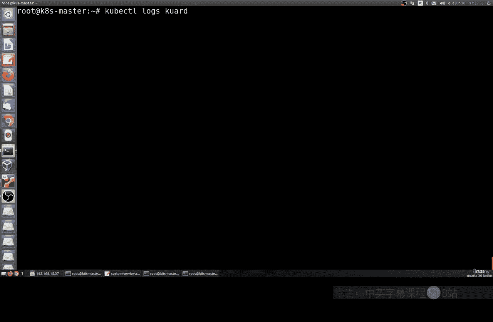

此命令将本地机器的8000端口转发到指定Pod的8000端口。之后，我们便可通过浏览器访问 `http://127.0.0.1:8000` 或本地IP地址来访问容器服务。此方法支持IPv4和IPv6协议。

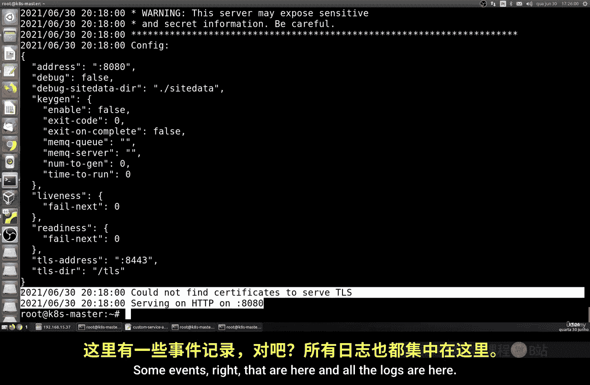

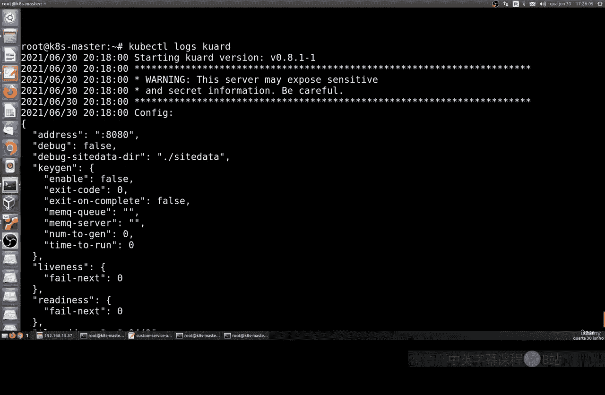

## 查看容器日志 📄

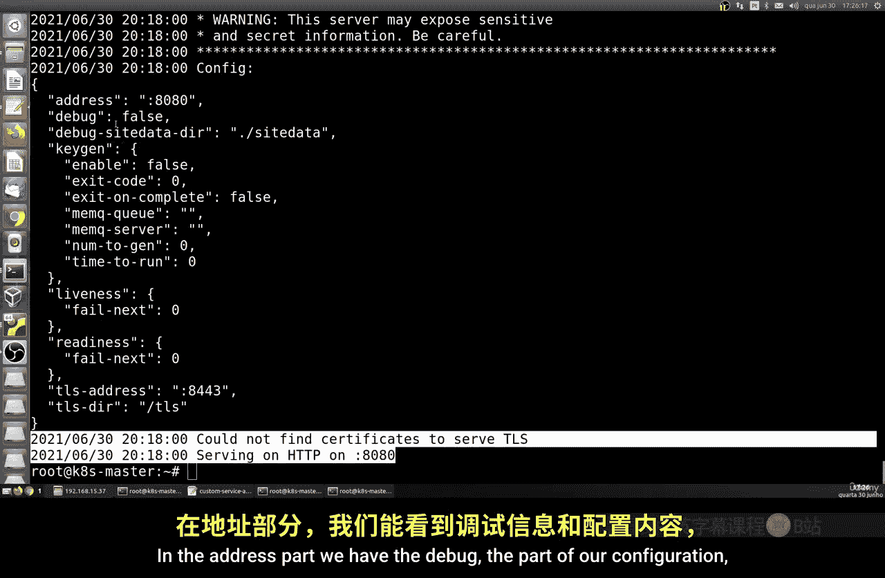

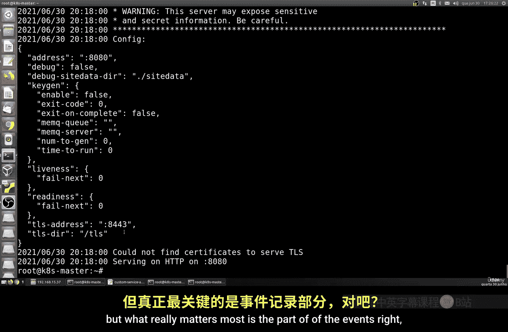

我们可以查看容器运行时产生的事件和日志，这对于调试和监控非常有用。

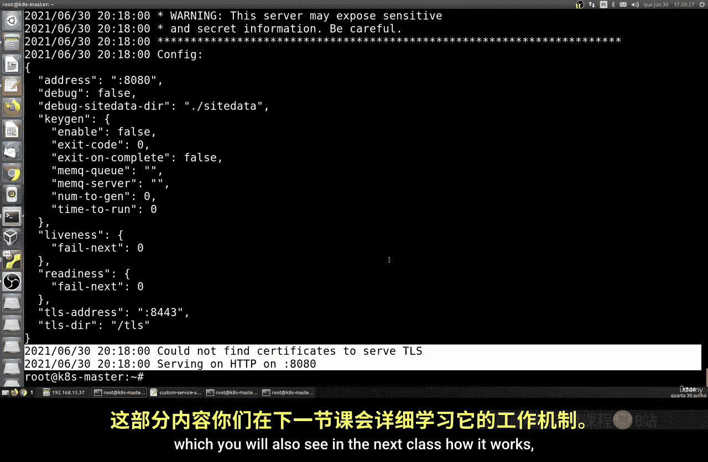

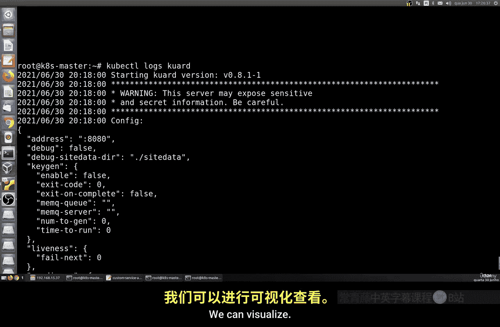

以下是查看指定Pod日志的命令：

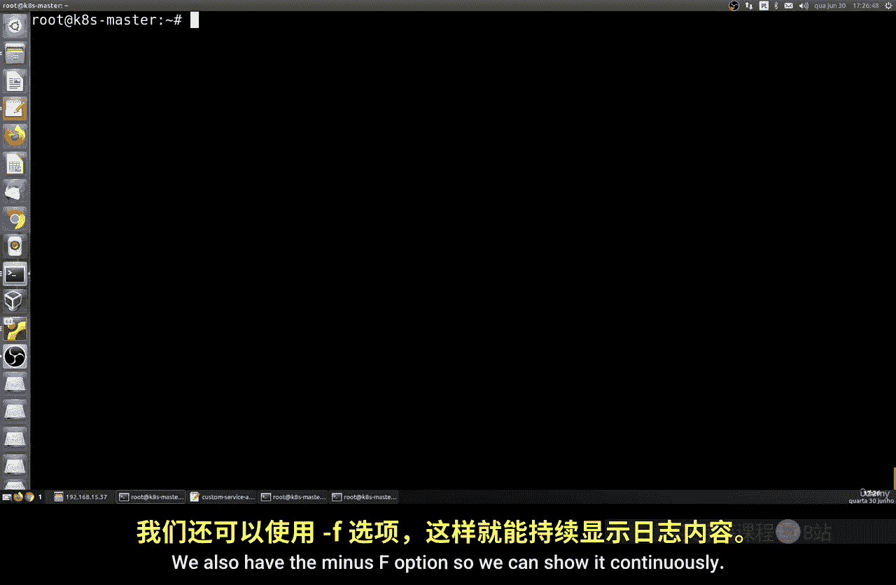

```bash
kubectl logs <pod-name>
```

此命令会输出该Pod的历史日志。若想实时查看日志流（即新日志产生时立即显示），可以使用 `-f` 选项：

```bash
kubectl logs -f <pod-name>
```

需要注意的是，在生产环境中，当存在多个Pod和用户时，通常需要集成专业的日志管理系统（如Elasticsearch）来集中收集、分析和告警。

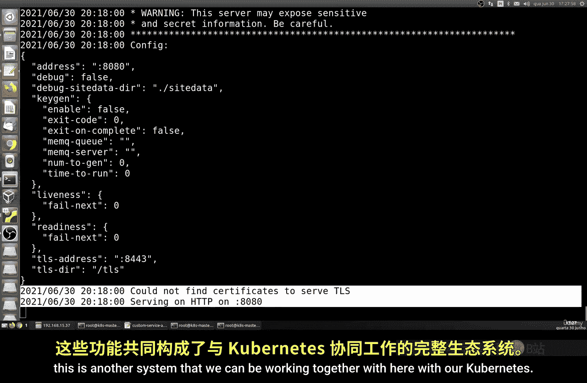

## 在容器内执行命令 ⚙️

除了查看，我们还可以直接在容器内部执行Linux命令。

以下是在容器内执行单条命令（例如查看运行时间）的方法：

```bash
kubectl exec <pod-name> -- uptime
```

如果我们希望进入容器的交互式Shell终端，可以使用以下命令：

```bash
kubectl exec -it <pod-name> -- /bin/bash
```

进入后，你便可以像在普通Linux系统中一样执行命令（如 `pwd`, `ls`）。使用 `exit` 命令可以退出该Shell。

## 在本地与容器间复制文件 🔄

我们可以在本地文件系统和容器之间相互复制文件，这对于传递配置或数据非常方便。

以下是将本地文件复制到容器中的命令格式：

```bash
kubectl cp /本地路径/文件名 <pod-name>:/容器内路径/
```

例如，将本地的 `test.txt` 复制到Pod的 `/tmp/` 目录：

```bash
kubectl cp /root/test.txt my-pod:/tmp/
```

反之，将容器内的文件复制到本地，命令格式如下：

```bash
kubectl cp <pod-name>:/容器内路径/文件名 /本地目标路径/
```

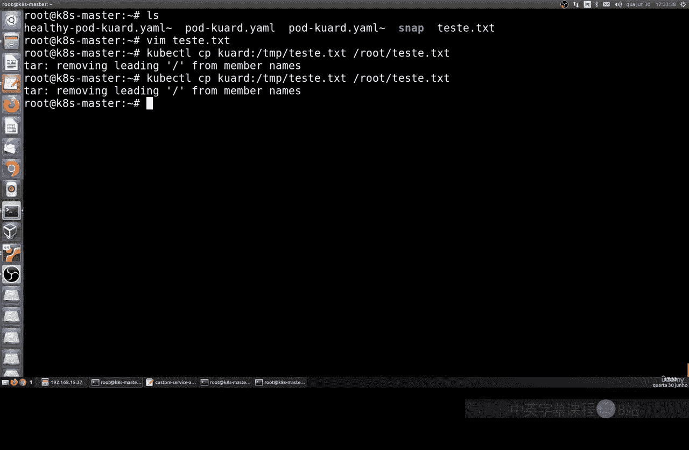

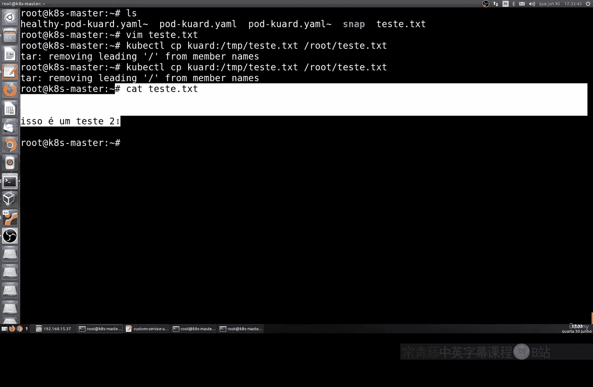

例如，将Pod中 `/tmp/test.txt` 复制到本地当前目录：

```bash
kubectl cp my-pod:/tmp/test.txt ./test.txt
```

通过 `cat` 等命令可以验证文件内容是否复制成功。

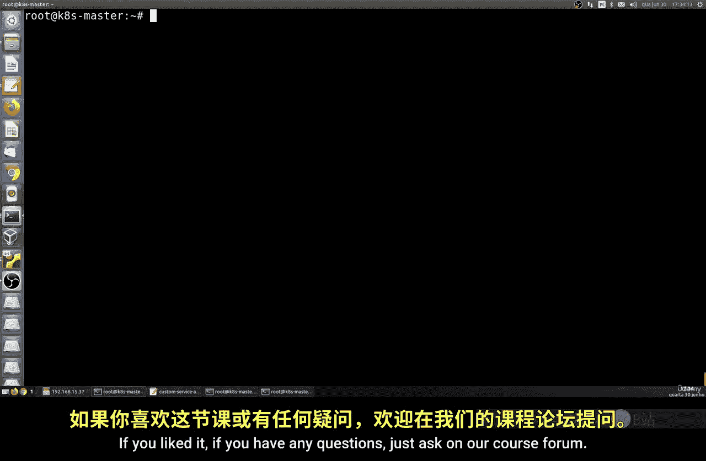


本节课中我们一起学习了访问Kubernetes容器的几种核心操作：通过端口转发访问服务、查看实时或历史日志、在容器内执行命令以及双向复制文件。这些技能是与容器化应用进行交互的基础。下一节课，我们将进行更多实践，包括创建文件、进行健康检查以及更深入地使用日志和端口功能。