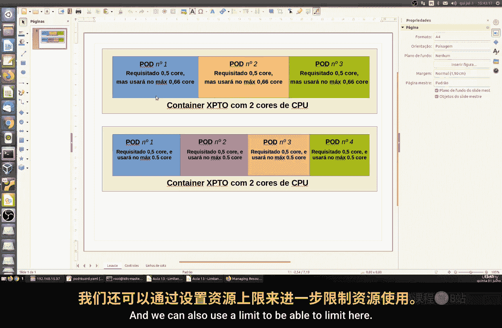
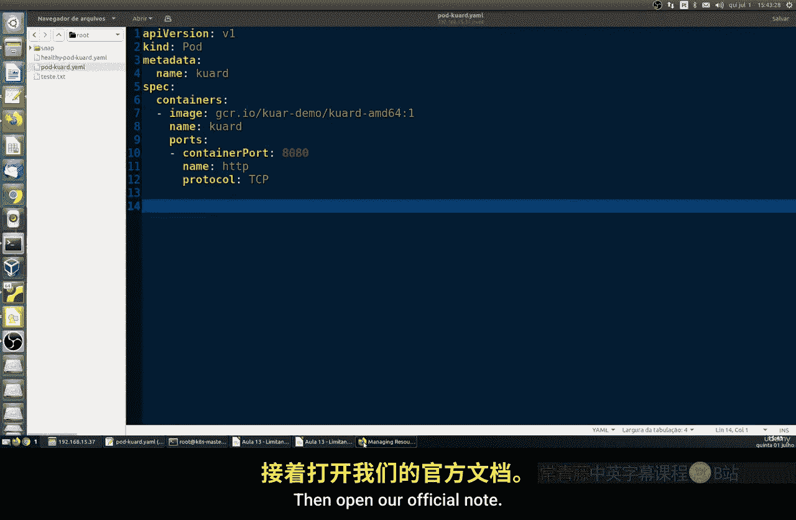
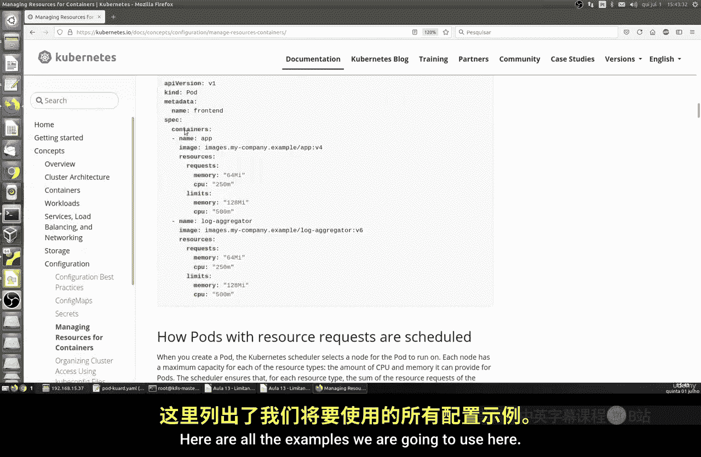
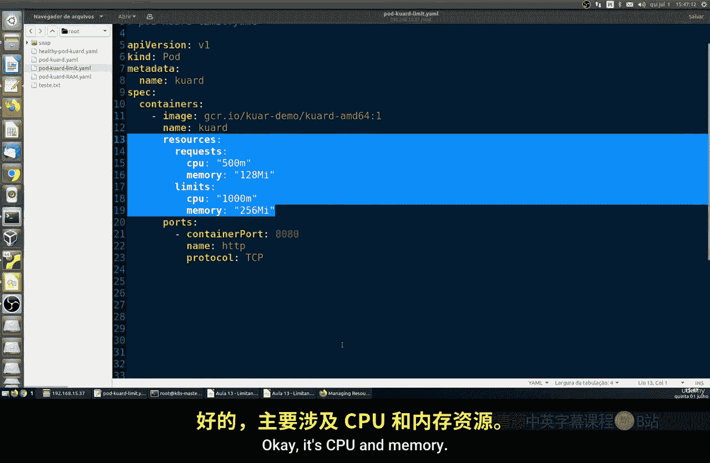
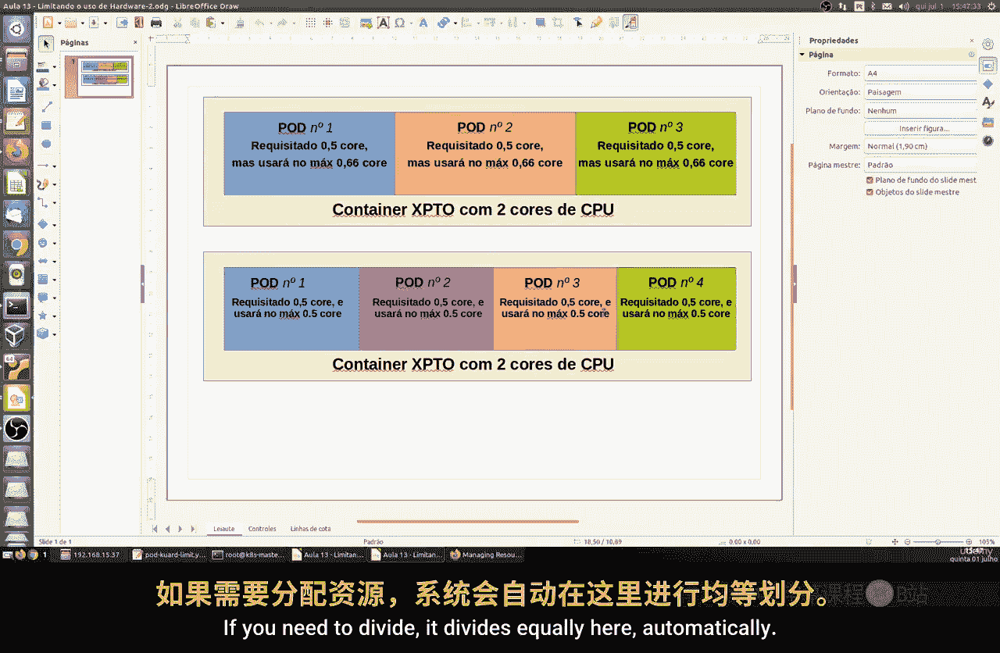
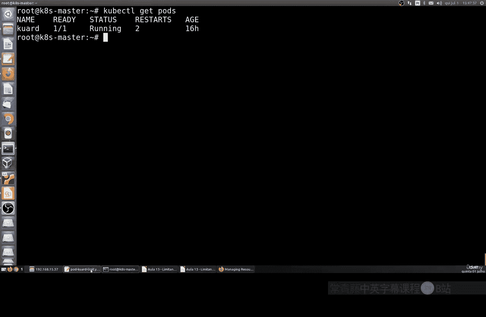
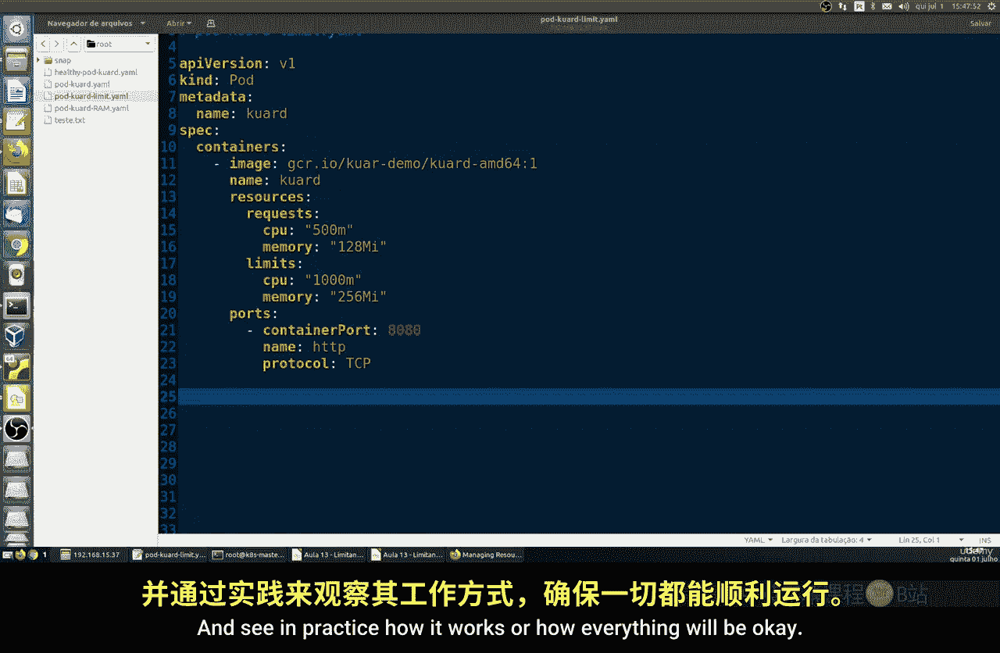

# 200：限制硬件使用 💻

在本节课中，我们将学习如何为容器设置硬件资源限制。我们将重点了解两种核心资源：CPU和内存。通过设置请求（requests）和限制（limits），我们可以确保容器稳定运行，同时避免过度消耗系统资源。

## 核心概念：请求与限制

上一节我们介绍了容器的基础知识，本节中我们来看看如何管理其资源。在Kubernetes中，我们主要通过两个指标来控制容器的硬件使用：

*   **请求（requests）**：这是容器**正常运行所需的最小资源量**。如果系统无法满足此请求，容器将无法启动。
*   **限制（limits）**：这是容器**允许使用的最大资源量**。设置限制可以防止单个容器耗尽所有资源，导致系统不稳定。

例如，一个应用可能需要至少150MB内存（请求）来运行，同时我们规定它不能使用超过256MB内存（限制）。

## 资源分配原理

以下是CPU资源在多个Pod之间分配的工作原理：

假设一个节点（Node）总共有2个CPU核心。我们创建一个容器，并为其设置请求为0.5核心，限制为1核心。

*   **场景一：单个Pod**
    *   该Pod至少需要0.5核心。
    *   由于没有其他竞争者，它最多可以使用全部2个核心（如果未设限制）或最多1个核心（如果设置了限制）。

*   **场景二：两个相同的Pod**
    *   每个Pod至少需要0.5核心，总和为1核心，节点可以满足。
    *   每个Pod最多可以使用1核心。两个Pod会平分节点的2个核心，各得1核心。

*   **场景三：四个相同的Pod**
    *   每个Pod至少需要0.5核心，总和为2核心，恰好用尽节点所有CPU。
    *   此时，每个Pod的CPU限制实际上会变为0.5核心，因为2个核心被4个Pod均分。这意味着Pod无法突破这个平均值使用更多CPU。

通过这种方式，我们可以有效限制和保障容器应用的资源使用。





## 实践：编写资源配置文件



让我们通过创建YAML文件来实际定义这些限制。

### 示例一：仅设置请求

首先，我们创建一个名为 `run-pod.yaml` 的文件，仅定义资源请求，不设置上限。

```yaml
apiVersion: v1
kind: Pod
metadata:
  name: example-pod
spec:
  containers:
  - name: app-container
    image: nginx
    resources:
      requests:
        memory: "128Mi"
        cpu: "500m" # 代表0.5个CPU核心
    ports:
    - containerPort: 80
      protocol: TCP
```

在这个配置中，我们保证了容器至少能获得128MB内存和0.5个CPU核心。如果没有这些资源，容器将无法运行。但容器可以使用的最大资源量取决于节点的空闲资源。

### 示例二：同时设置请求和限制

接下来，我们创建另一个文件 `limit-pod.yaml`，同时定义请求和限制。

```yaml
apiVersion: v1
kind: Pod
metadata:
  name: limited-pod
spec:
  containers:
  - name: app-container
    image: nginx
    resources:
      requests:
        memory: "128Mi"
        cpu: "500m"
      limits:
        memory: "256Mi"
        cpu: "1000m" # 代表1个CPU核心
    ports:
    - containerPort: 80
      protocol: TCP
```

这个配置新增了 `limits` 部分。它规定容器：
*   **至少需要**：128MB内存和0.5个CPU核心（请求）。
*   **最多可以使用**：256MB内存和1个完整的CPU核心（限制）。



## 总结 🎯





本节课中我们一起学习了容器硬件资源限制的核心概念。
*   我们理解了 **请求（requests）** 是容器运行的**最低保障**，而 **限制（limits）** 是其资源使用的**最高天花板**。
*   我们看到了资源（尤其是CPU）如何在多个Pod之间进行分配和限制。
*   我们通过编写YAML配置文件，实践了如何为容器设置内存和CPU的请求值与限制值。



掌握资源限制对于维护Kubernetes集群的稳定性和效率至关重要。在接下来的课程中，我们将结合更多概念进行实践，加深理解。