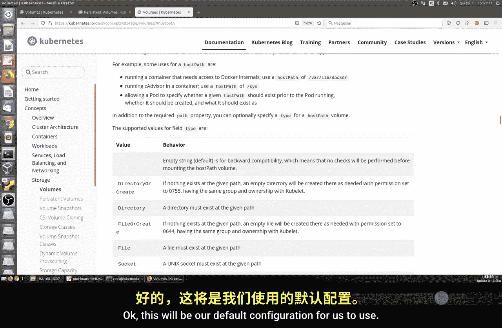
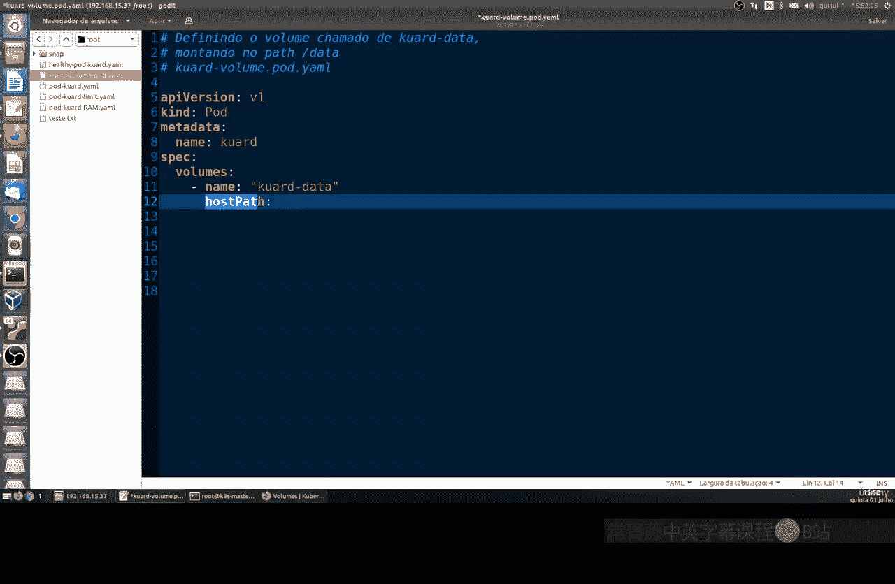
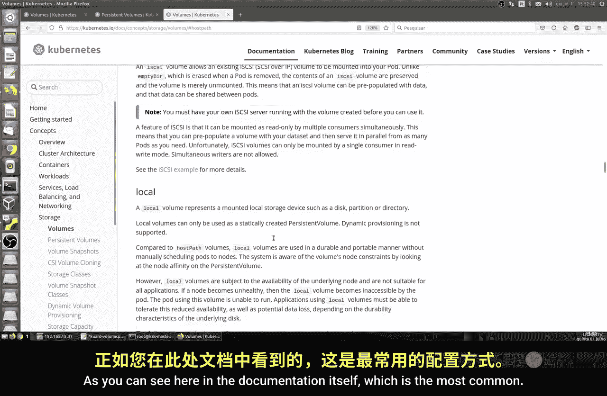
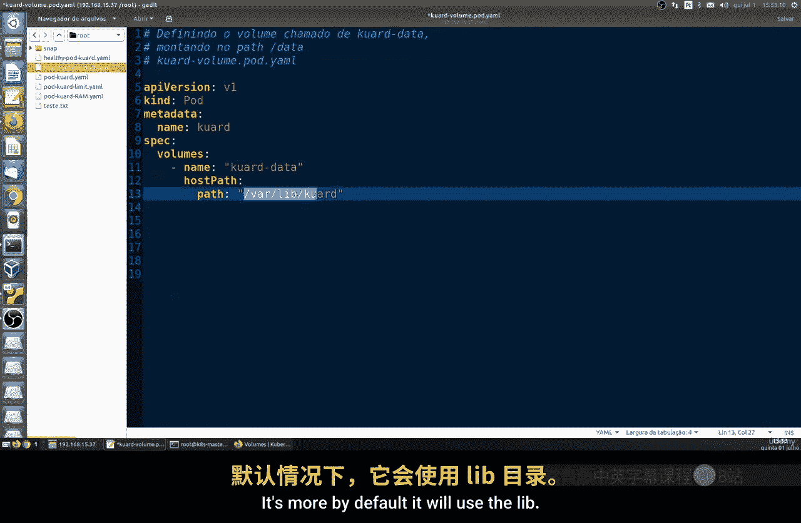
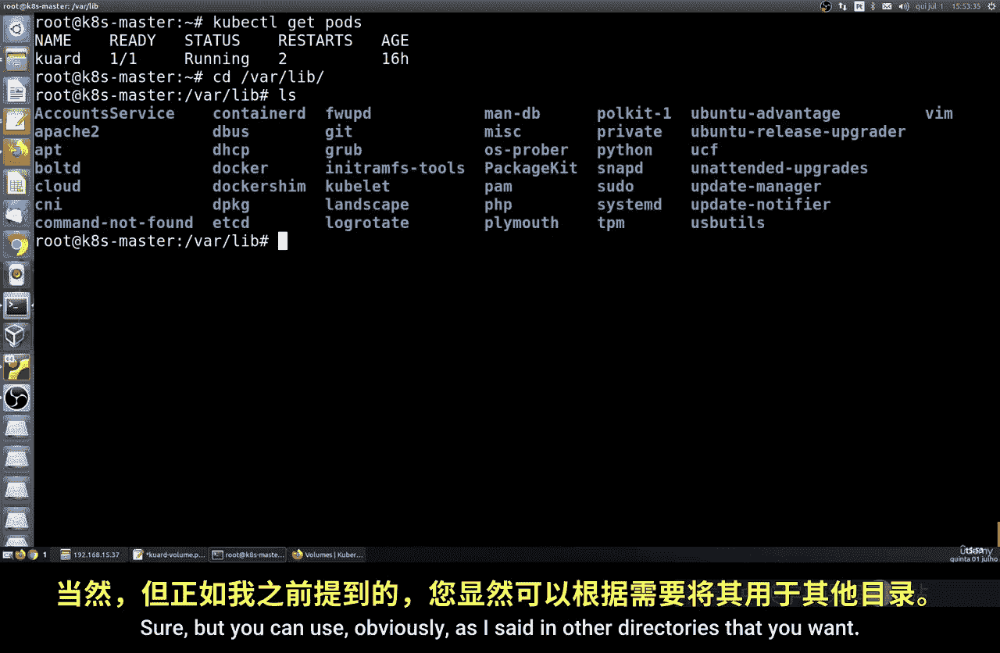
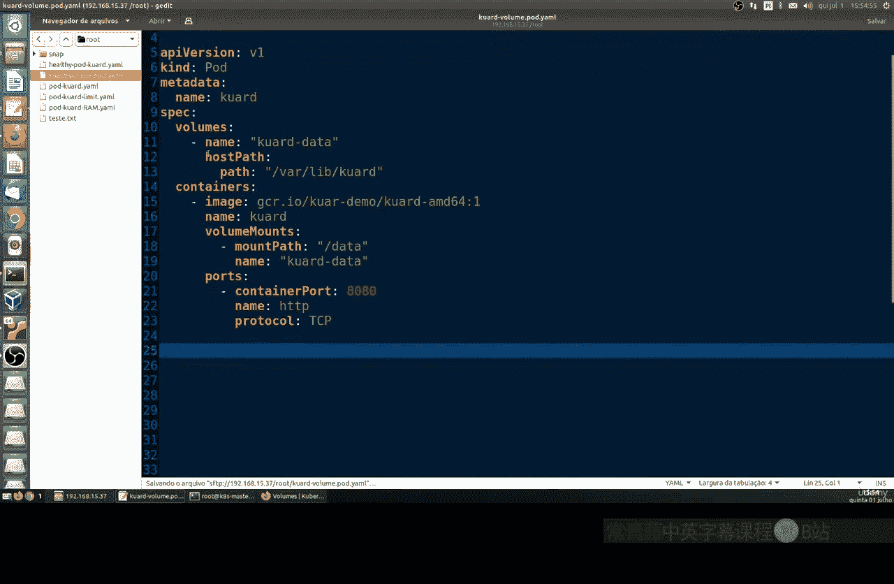
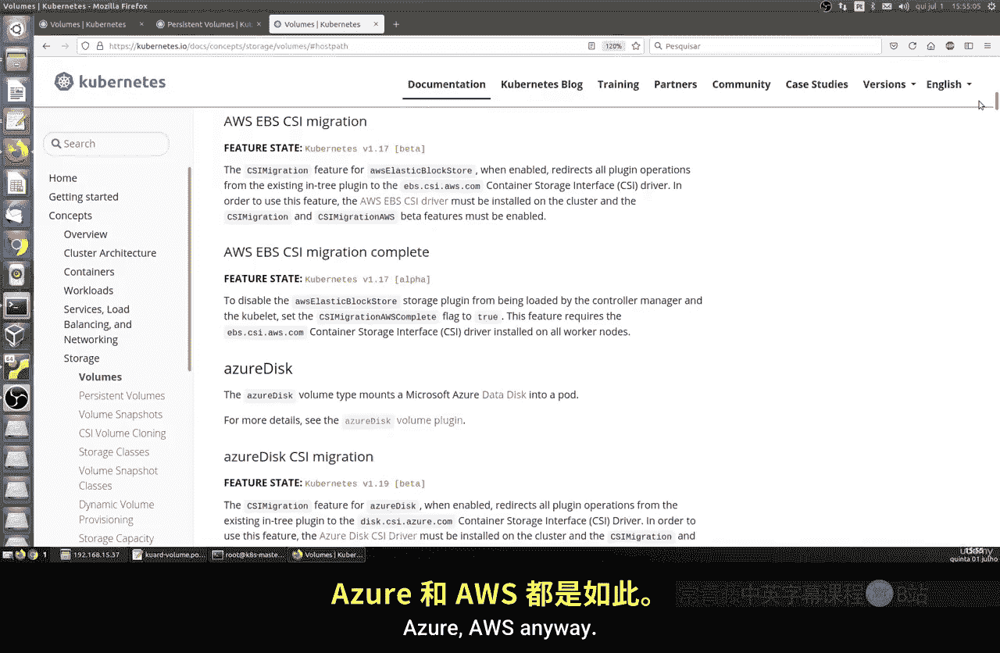
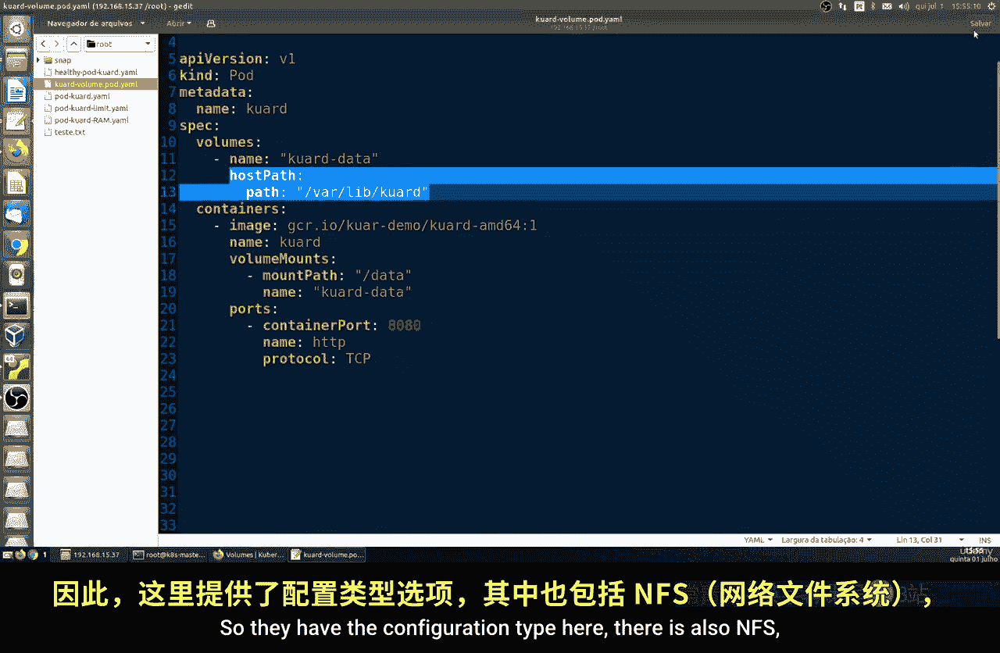
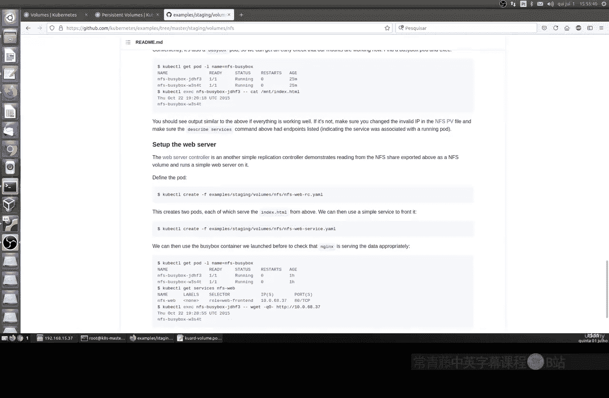

# 001：使用持久卷 📦

在本节课中，我们将要学习如何在 Kubernetes 中配置和使用持久卷。默认情况下，Pod 中的容器文件系统是临时的，当 Pod 重启时，所有文件都会被删除。为了持久化存储数据，我们需要使用持久卷。

上一节我们介绍了 Pod 的基本配置，本节中我们来看看如何为 Pod 添加持久化存储。

## 持久卷概念

在 Kubernetes 中，默认情况下，当你创建一个 Pod 时，它会自动创建一个临时的文件系统。然而，当 Pod 重启时，所有文件都会被删除并重新创建。除了某些不需要保留信息的特例外，在绝大多数情况下，我们需要使用持久卷来保存数据，确保重启时不丢失信息。

我们将学习以下三个核心概念：
*   **持久卷声明**：定义存储需求。
*   **存储位置**：声明卷在宿主机（我们的 Linux 机器）上的存储路径。
*   **卷挂载**：定义卷在容器内部的哪个目录被使用。



Kubernetes 支持多种类型的卷，包括用于 AWS、Azure 等云服务的卷。在本课程中，我们将使用 `hostPath` 类型，因为它适用于本地机器环境。

## 配置持久卷

以下是配置一个使用 `hostPath` 持久卷的 Pod 的步骤。



首先，我们创建一个名为 `pod-volume.yaml` 的配置文件。

```yaml
apiVersion: v1
kind: Pod
metadata:
  name: my-pod-with-volume
```



接下来，我们定义卷的部分。我们需要指定卷的名称和类型。



```yaml
spec:
  volumes:
  - name: my-storage
    hostPath:
      path: /var/lib/k8s-data
      type: DirectoryOrCreate
```

*   `name`: 卷的名称，可以任意指定。
*   `hostPath`: 指定卷类型为宿主机路径。
*   `path`: 定义数据在宿主机 Linux 系统上的存储路径。示例中使用了 `/var/lib/k8s-data`，这个目录类似于 Docker 存储容器数据的 `/var/lib/docker` 目录。你可以根据需要更改为其他路径。
*   `type`: 确保目录存在，如果不存在则创建。



然后，我们配置容器部分，并设置卷挂载。

```yaml
  containers:
  - name: my-app
    image: nginx:latest
    volumeMounts:
    - name: my-storage
      mountPath: /app/data
    ports:
    - containerPort: 80
      protocol: TCP
```

*   `image`: 容器使用的镜像名称。
*   `volumeMounts`: 定义卷在容器内部的挂载点。
    *   `name`: 引用上面定义的卷名称 `my-storage`。
    *   `mountPath`: 指定卷在容器内部挂载的路径，例如 `/app/data`。容器将在此路径下读写持久化数据。
*   `ports`: 定义容器暴露的端口。

## 其他卷类型简介



除了 `hostPath`，Kubernetes 还支持许多其他卷类型，例如：
*   **云存储卷**：如 `awsElasticBlockStore`、`azureDisk`、`gcePersistentDisk`，用于公有云环境。
*   **网络文件系统**：如 `nfs`，允许跨多个节点共享存储。
*   **配置卷**：如 `configMap`、`secret`，用于向容器注入配置信息。



这些类型的配置方式类似，但需要根据具体的存储后端提供相应的参数。你可以在 Kubernetes 官方文档中找到更多示例。



## 总结



本节课中我们一起学习了 Kubernetes 持久卷的基础知识。我们了解到，为了持久化保存容器数据，需要配置 `volumes` 和 `volumeMounts`。我们以 `hostPath` 类型为例，详细演示了如何定义宿主机存储路径并将它挂载到容器内的特定目录。掌握持久卷的使用是部署有状态应用的关键一步。