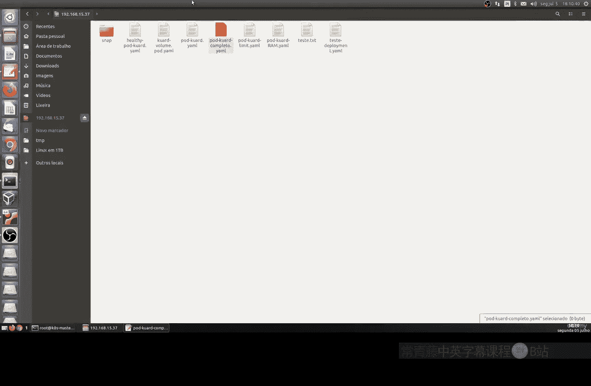
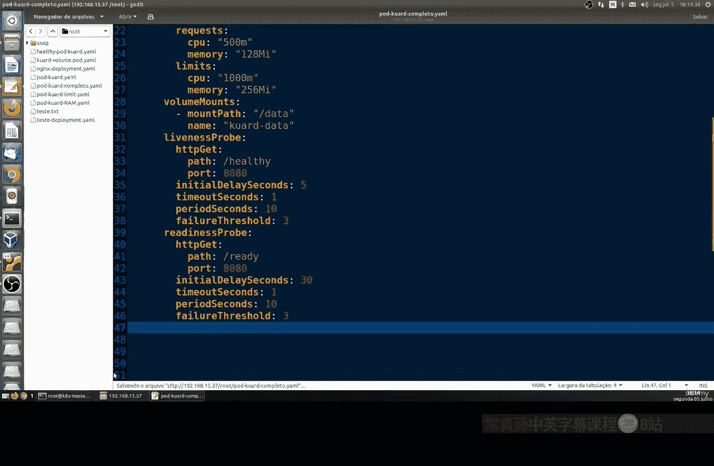
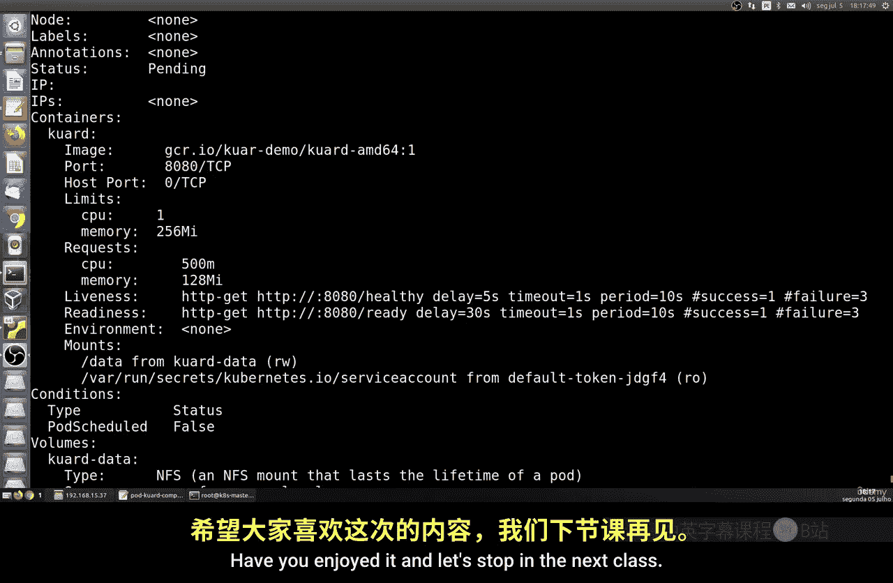

# 002：整合所有内容

在本节课中，我们将把之前课程中学到的所有知识整合起来，创建一个完整的容器配置文件。我们将使用NFS存储、设置硬件资源限制、配置健康检查，并回顾端口映射等核心概念。


## 概述



在前面的课程中，我们学习了Kubernetes配置的各个独立部分。本节将把这些部分组合成一个完整的YAML配置文件，用于部署一个使用NFS存储、具有资源限制和健康检查功能的容器。通过这个实践，你将理解如何将分散的知识点整合应用。

## 配置文件详解

以下是配置文件的各个部分及其解释。我们将逐步分析每个配置块的作用。

### 1. 基础信息与镜像

我们首先定义部署的基本信息，包括名称和要使用的容器镜像。

```yaml
apiVersion: v1
kind: Pod
metadata:
  name: example-pod
spec:
  containers:
  - name: app-container
    image: nginx:latest
```
*   **`metadata.name`**: 定义Pod的名称。
*   **`spec.containers[].image`**: 指定要拉取和运行的容器镜像。

### 2. 端口配置

接下来，我们配置容器对外暴露的端口。

```yaml
    ports:
    - containerPort: 8080
      protocol: TCP
      name: http
```
*   **`containerPort`**: 容器内部监听的端口号。
*   **`protocol`**: 使用的网络协议（如TCP或UDP）。
*   **`name`**: 为端口指定一个名称，便于识别。

### 3. 资源限制

为了防止容器消耗过多主机资源，我们需要设置请求（requests）和限制（limits）。

```yaml
    resources:
      requests:
        cpu: "500m"
        memory: "128Mi"
      limits:
        cpu: "1"
        memory: "256Mi"
```
*   **`requests`**: 容器运行所需的最小资源量。调度器会确保节点能满足此要求。
*   **`limits`**: 容器所能使用的最大资源量。超过此限制，容器可能会被终止或重启。
*   **CPU单位**: `500m` 表示500毫核，即0.5个CPU核心；`1` 表示1个完整的CPU核心。
*   **内存单位**: `Mi` 表示Mebibyte (2^20字节)。



### 4. 存储卷挂载

为了持久化数据，我们将配置一个NFS类型的存储卷，并将其挂载到容器内的特定路径。

```yaml
    volumeMounts:
    - name: app-data
      mountPath: /data
  volumes:
  - name: app-data
    nfs:
      server: nfs-server-ip-or-hostname
      path: /exports/data
```
*   **`volumeMounts.mountPath`**: 容器内部挂载存储卷的目录路径。
*   **`volumes.nfs`**: 定义卷类型为NFS，并指定NFS服务器的地址和共享路径。

### 5. 健康检查

健康检查（探针）用于监控容器的运行状态，确保服务可用性。我们配置存活探针（livenessProbe）和就绪探针（readinessProbe）。

```yaml
    livenessProbe:
      httpGet:
        path: /
        port: 8080
      initialDelaySeconds: 5
      timeoutSeconds: 1
      periodSeconds: 10
      failureThreshold: 3
    readinessProbe:
      httpGet:
        path: /health
        port: 8080
      initialDelaySeconds: 30
      timeoutSeconds: 1
      periodSeconds: 10
      failureThreshold: 3
```
*   **`httpGet`**: 通过HTTP GET请求检查健康状态。
*   **`initialDelaySeconds`**: 容器启动后，等待多少秒才开始第一次探测。
*   **`periodSeconds`**: 执行探测的频率（每隔多少秒一次）。
*   **`failureThreshold`**: 连续探测失败多少次后，判定容器不健康。对于存活探针，这将导致容器重启；对于就绪探针，这将把Pod从服务端点中移除。

## 应用与验证配置

配置文件编写完成后，我们需要将其应用到集群并验证其状态。

1.  **应用配置**：使用 `kubectl apply` 命令创建资源。
    ```bash
    kubectl apply -f pod-config.yaml
    ```
2.  **查看状态**：使用 `kubectl get pods` 命令查看Pod是否成功创建并运行。
    ```bash
    kubectl get pods example-pod
    ```
3.  **查看详情**：使用 `kubectl describe` 命令获取Pod的详细配置和事件信息，这对于调试非常有用。
    ```bash
    kubectl describe pod example-pod
    ```
    在输出中，你可以验证镜像、端口、资源限制、卷挂载以及健康检查的配置是否与预期一致。

## 总结

本节课中，我们一起学习了如何将之前课程中独立的Kubernetes概念整合到一个完整的Pod配置文件中。我们回顾并实践了：
*   定义容器镜像和基础信息。
*   配置网络端口。
*   设置CPU和内存的资源请求与限制。
*   挂载NFS存储卷以实现数据持久化。
*   配置存活和就绪探针以实现应用健康监控。
*   使用 `kubectl` 命令应用和验证配置。



这个示例是一个重要的起点。在实际应用中，你将遇到更多配置选项和复杂的部署场景，但掌握这种整合能力是管理容器化应用的基础。我们将在后续课程中继续探索其他高级配置和概念。