# 004：服务配置 🚀

在本节课中，我们将要学习Kubernetes中的服务。服务是一种抽象方式，用于将运行在一组Pod中的应用程序暴露为网络服务。它类似于Kubernetes中的其他资源，具有高度可扩展性和易于修改的特点。通过服务，你可以更改后端Pod的数量，而无需修改应用程序本身。

上一节我们介绍了Pod和部署，本节中我们来看看如何配置服务来管理网络访问。

## 什么是服务？

服务是一种抽象，用于将运行在一组Pod中的应用程序暴露为网络服务。它允许你编辑IP地址、配置DNS名称服务器，并在Pod之间进行负载均衡。服务有助于确定哪些进程在等待数据，以及它们的地址和端口。服务是编辑所有网络配置的最快方式，无需直接更改Pod。

**核心概念**：服务通过一个稳定的IP地址和DNS名称，将流量路由到一组动态变化的Pod。

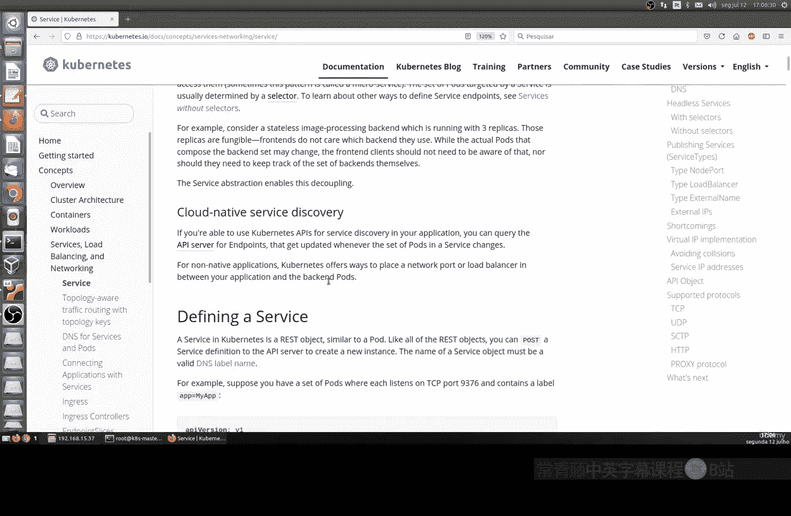

## 创建Pod与服务

我们可以为Pod创建服务。其逻辑与创建部署或Pod类似。我们可以创建一个YAML文件，其`kind`字段指定为`Service`。推荐的做法是创建配置文件，以便管理和复用配置。

为了有所变化，本节课将直接使用命令行创建Pod，然后将其暴露为一个服务。

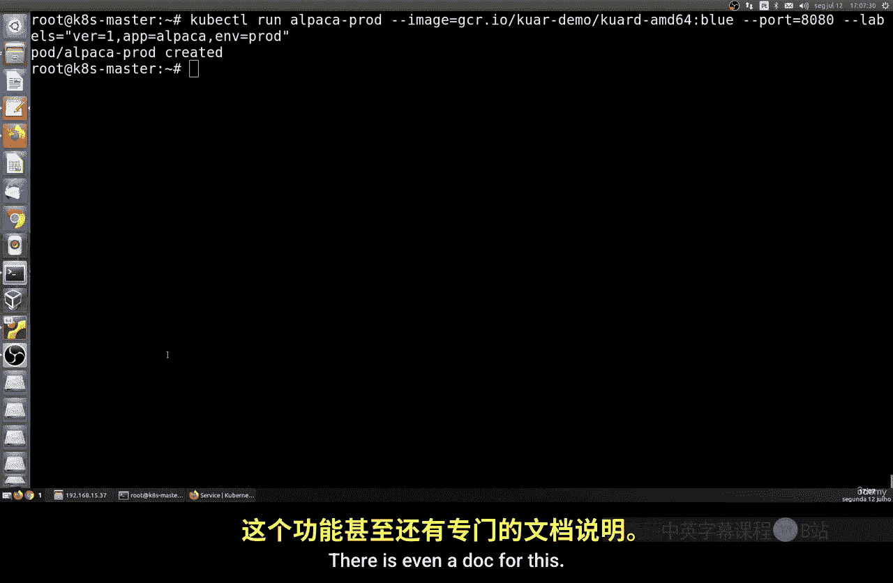

以下是创建Pod和服务的步骤：

1.  首先，在Linux终端中运行命令创建一个Pod。
2.  然后，使用`expose`命令基于该Pod创建一个服务。

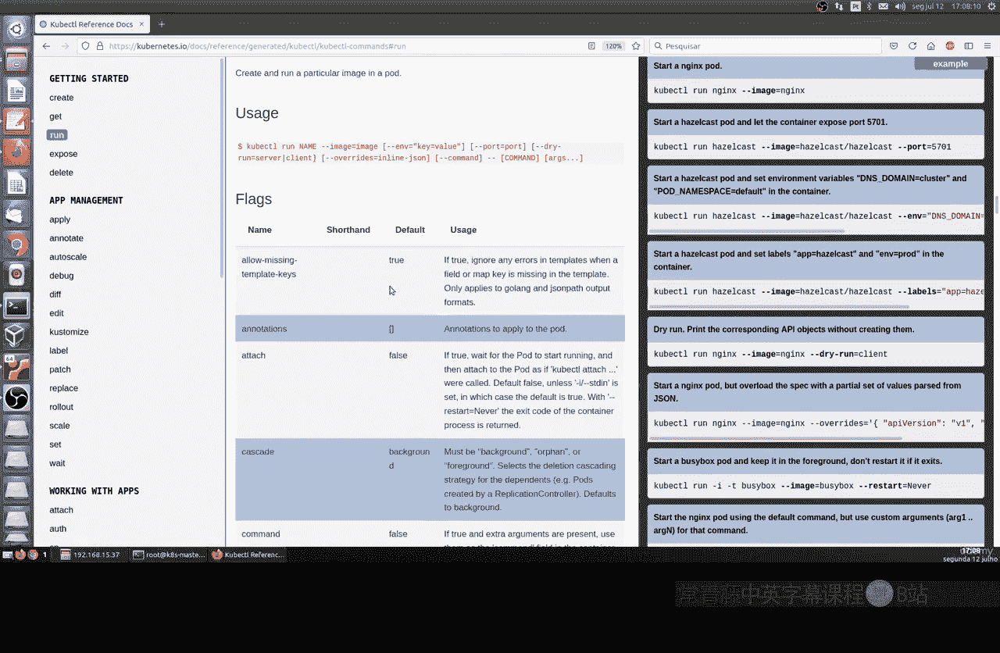

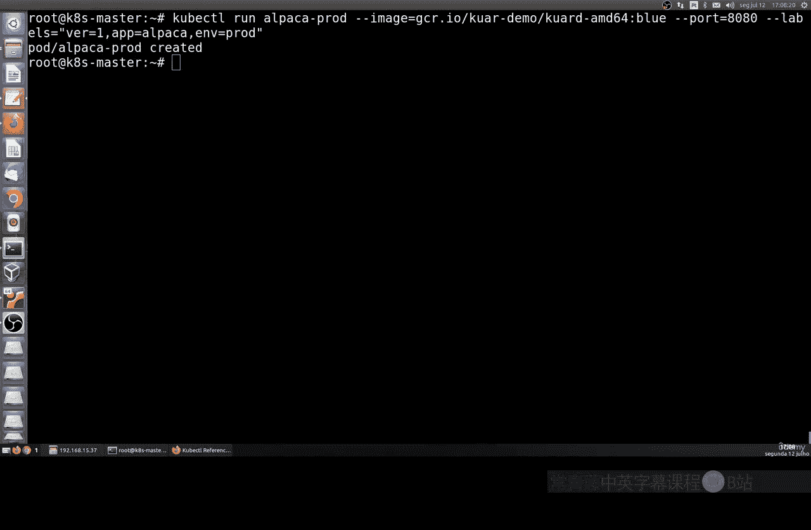

让我们开始操作。打开终端，运行以下命令创建一个名为`alpaca-prod`的Pod：

```bash
kubectl run alpaca-prod --image=nginx:alpine --port=8080 --labels=app=alpaca,version=simple
```

这个命令创建了一个使用`nginx:alpine`镜像的Pod，暴露了8080端口，并设置了`app=alpaca`和`version=simple`的标签。

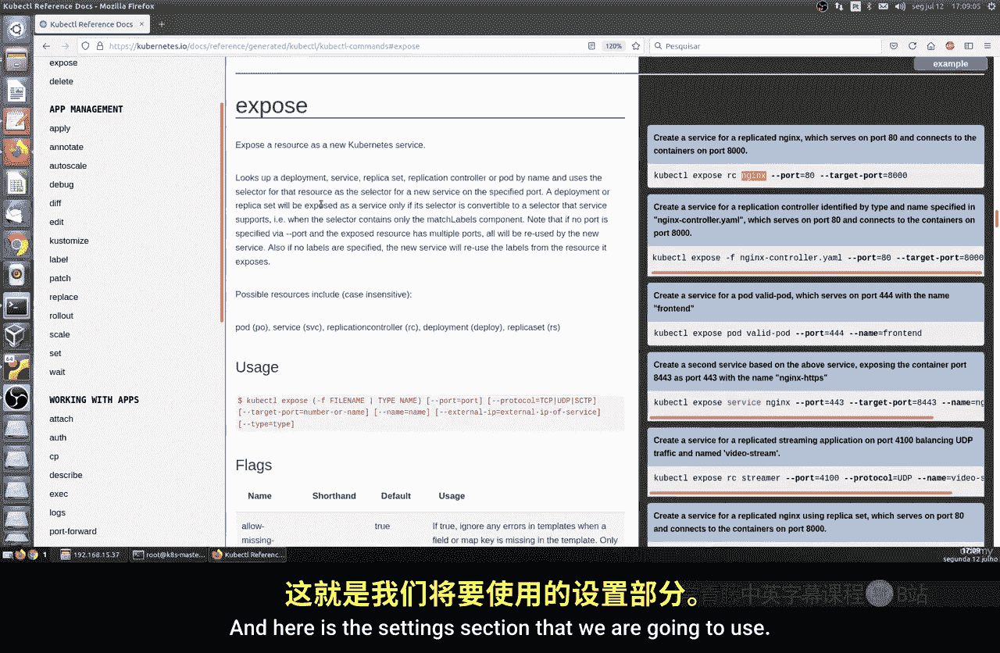

接下来，我们将这个Pod暴露为一个服务：

```bash
kubectl expose pod alpaca-prod --name=alpaca-prod-service
```

这个`expose`命令将我们的Pod作为服务暴露出来。现在，让我们查看已创建的服务：

```bash
kubectl get services
```

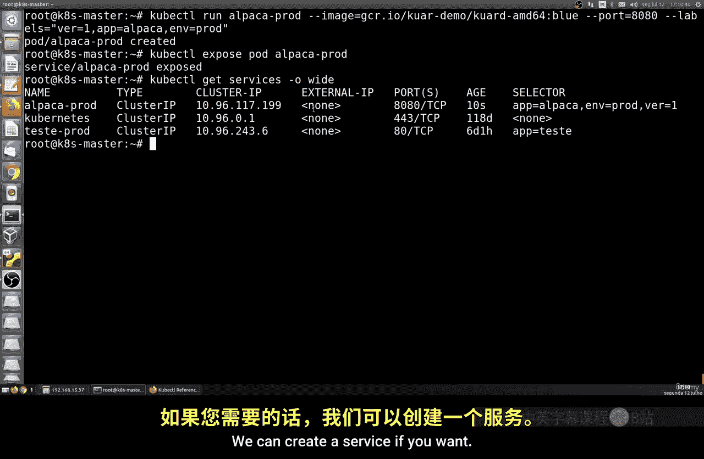

你可以看到已经创建了一个服务。选择器也已自动创建并配置。我们创建了一个非常简单的Pod，几乎没有配置。有趣的部分是我们的服务；我们使用了`expose`命令，并根据Pod配置了一个服务。

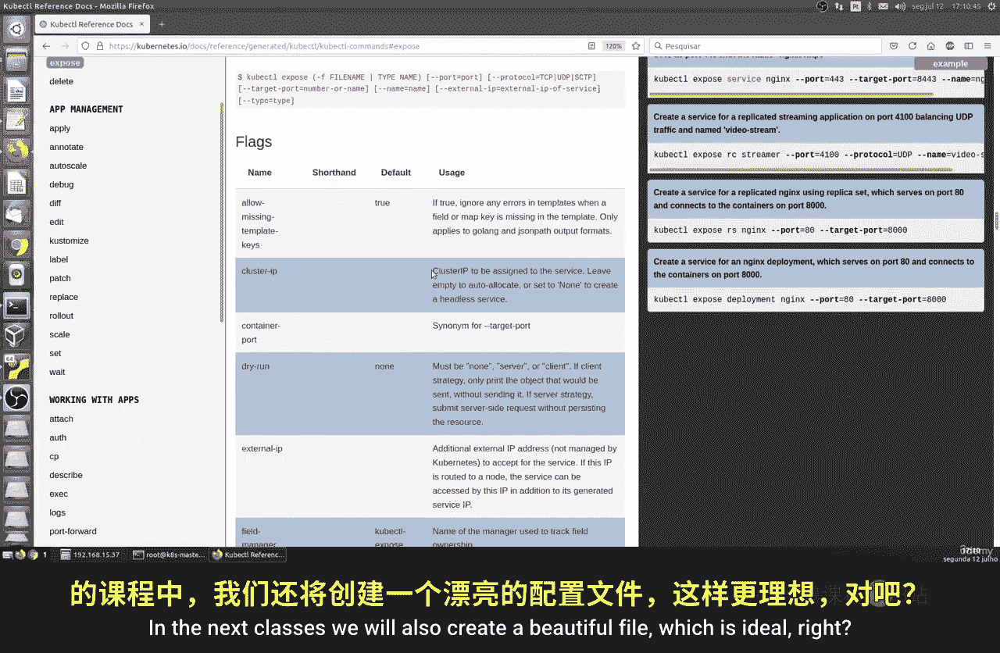

我们这里有一个集群IP，这是由Kubernetes自动提供的。类型是`ClusterIP`，这是一个自动化的过程。你可以稍后更改这些设置。

## 查看与编辑服务

查看服务的详细信息也很重要。我们可以使用`describe`命令：

```bash
kubectl describe service alpaca-prod-service
```

这个命令会显示服务的各种信息，包括命名空间、名称、类型、集群IP、端口以及选择器标签等。由于我们创建时配置很简单，很多字段可能为空或为默认值。

我们也可以编辑这个服务。例如，要编辑服务，可以运行：

```bash
kubectl edit service alpaca-prod-service
```

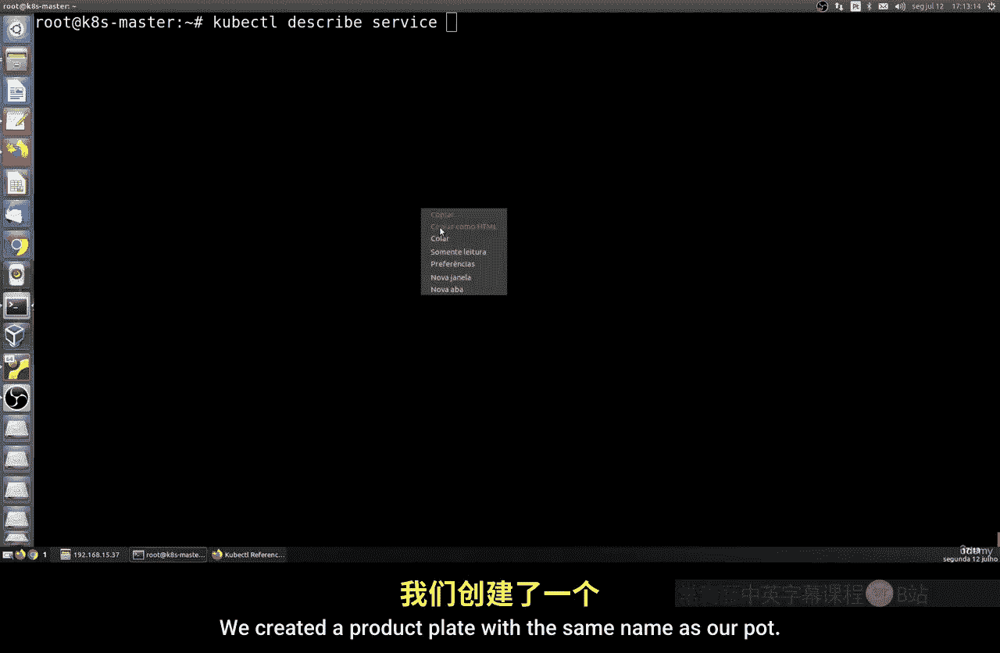

这将打开默认的文本编辑器（例如Vim），你可以在其中修改配置，比如更改标签选择器。保存并退出后，更改就会生效。如果配置无效，系统会给出错误提示。

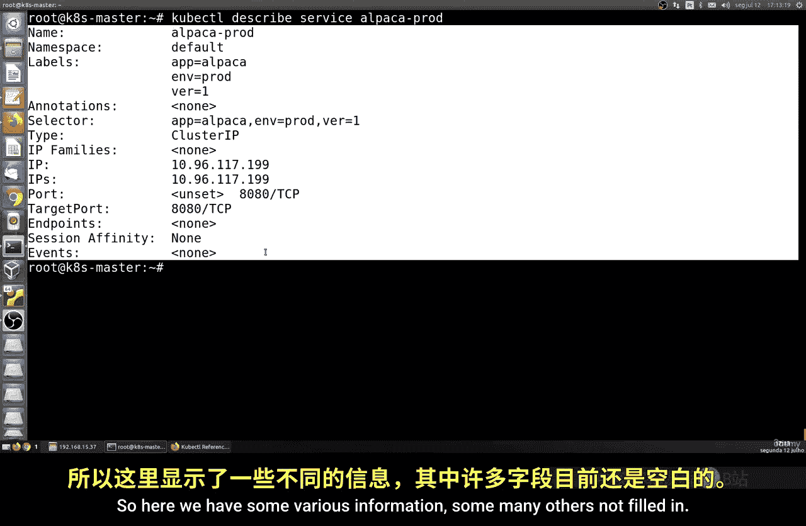

但是，这种命令行方式只适用于快速、简单的配置。最佳实践始终是通过YAML文件进行配置，这样你可以拥有完全的控制权，便于版本管理和复杂配置。

## 删除资源

要删除创建的服务，可以使用`delete`命令：

```bash
kubectl delete service alpaca-prod-service
```

要删除Pod，同样可以使用`delete`命令：

```bash
kubectl delete pod alpaca-prod
```

## 最佳实践与总结

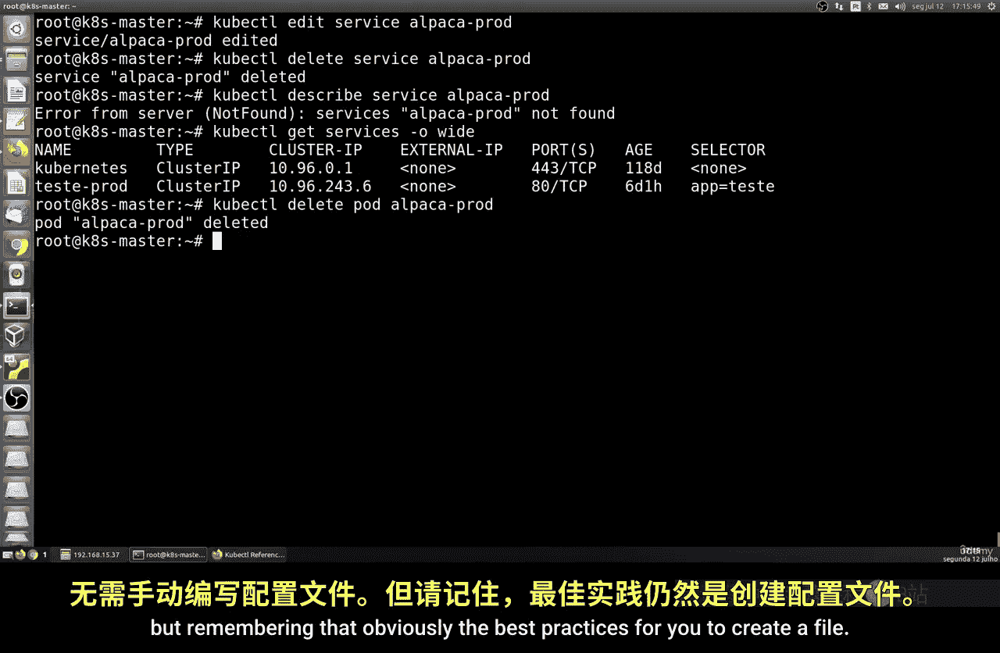

本节课中我们一起学习了Kubernetes服务的基础知识。这是一种简单的方式来了解如何创建Pod并通过Pod自动创建服务，而无需手动编写文件。

但请记住，最佳实践是创建一个YAML配置文件。在文件中，你可以详细定义服务类型、选择器、端口、IP地址设置、负载均衡策略等。这让你能完全控制服务的行为，正如Kubernetes官方文档所推荐的那样。

这只是关于服务的入门介绍，包括它能做什么以及它的用途。服务配置还有很多其他类型，例如负载均衡等，这些主题较为复杂，我们将在后续课程中继续探讨。

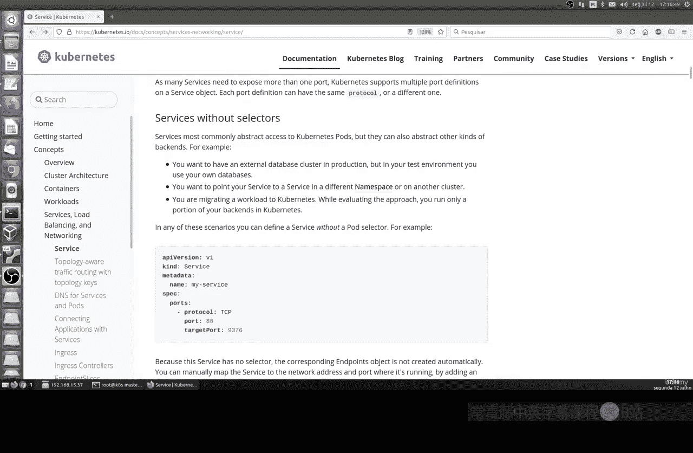

**总结**：服务是Kubernetes中管理网络访问和实现负载均衡的关键抽象。通过命令行可以快速创建和测试服务，但对于生产环境，使用声明式的YAML文件进行配置是推荐的最佳实践。