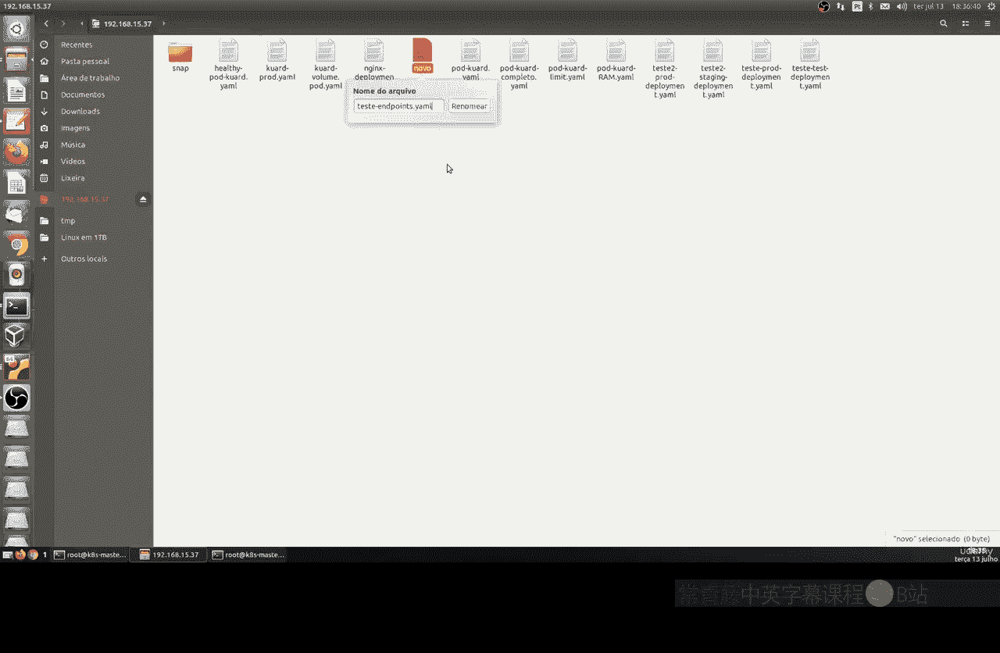
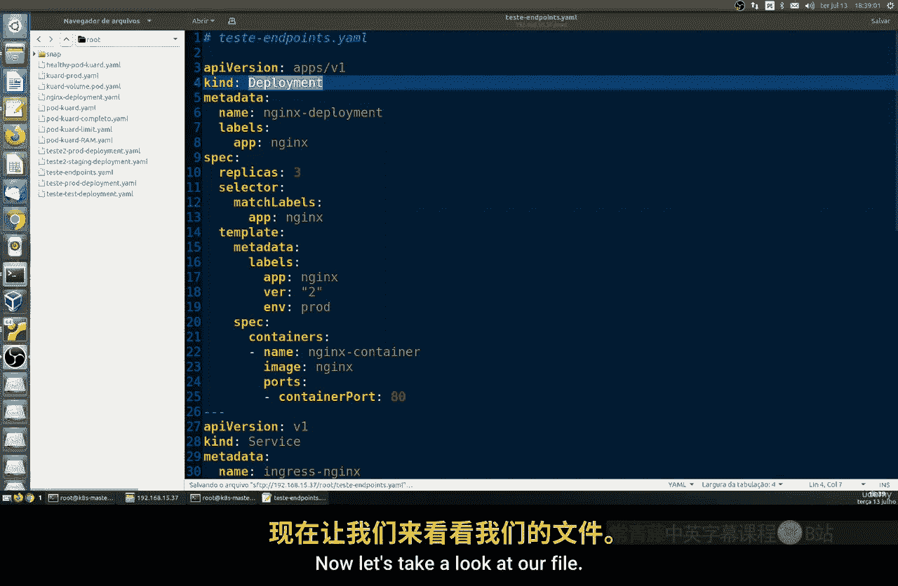
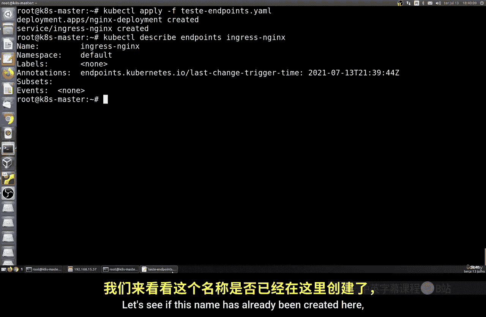
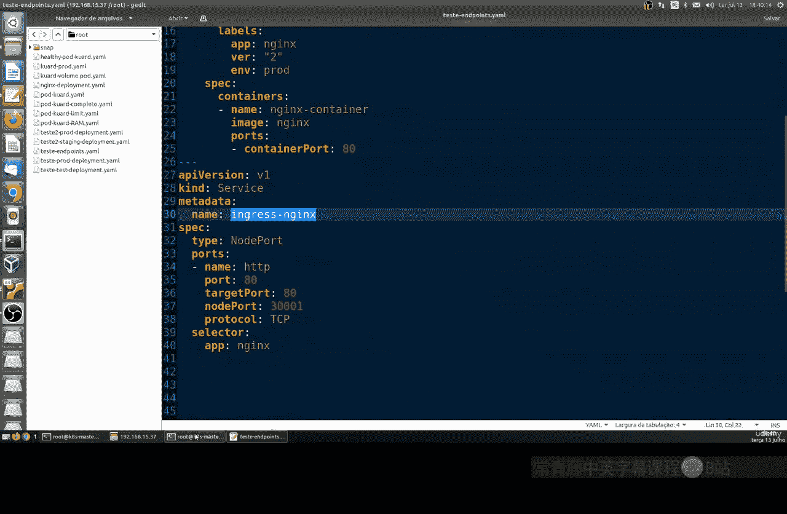
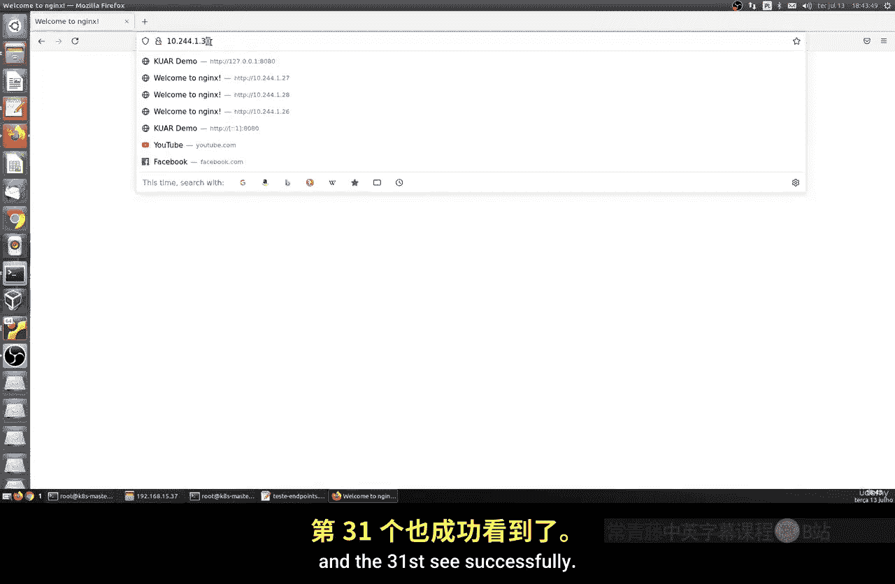
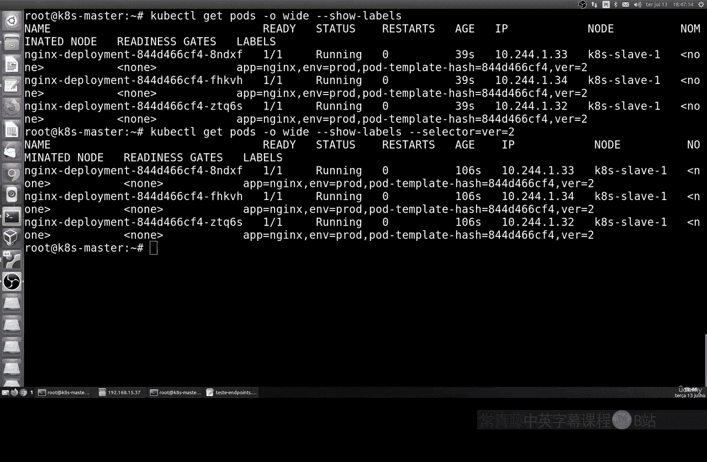

# 005：端点（Endpoints）详解 🎯

在本节课中，我们将学习Kubernetes中的端点（Endpoints）概念。端点是一个地址列表，用于跟踪服务（Service）将流量发送到哪些Pod的IP地址。我们将通过实际操作，演示端点如何自动创建、更新和管理。

## 概述

上一节我们介绍了Kubernetes服务（Service）及其标签选择器（Selector）。本节中，我们将深入探讨端点（Endpoints）。端点是服务背后Pod的IP地址列表，它由Kubernetes自动管理，确保服务总能将流量路由到正确的Pod实例。我们将创建一个包含部署（Deployment）和服务（Service）的YAML文件，并观察端点的动态变化。

## 创建组合YAML文件


为了简化操作并遵循最佳实践，我们将部署和服务的配置定义在同一个YAML文件中。



以下是创建该文件的步骤：

1.  创建一个名为 `test-endpoints.yaml` 的文件。
2.  在文件中，我们先定义部署（Deployment）部分。
3.  使用 `---` 分隔符后，再定义服务（Service）部分。

文件内容如下：

```yaml
apiVersion: apps/v1
kind: Deployment
metadata:
  name: nginx-deployment
spec:
  replicas: 3
  selector:
    matchLabels:
      app: nginx
  template:
    metadata:
      labels:
        app: nginx
    spec:
      containers:
      - name: nginx
        image: nginx:latest
        ports:
        - containerPort: 80
---
apiVersion: v1
kind: Service
metadata:
  name: nginx-service
spec:
  ports:
  - port: 80
  selector:
    app: nginx
```

**代码解释**：
*   `Deployment` 部分创建了3个运行Nginx的Pod副本。
*   `Service` 部分创建了一个服务，通过标签选择器 `app: nginx` 与这些Pod关联。
*   服务创建后，Kubernetes会自动生成对应的端点资源，其中包含这3个Pod的IP地址。

## 应用配置并查看端点

现在，让我们应用这个YAML文件来创建资源，并检查自动生成的端点。



执行以下命令应用配置：
```bash
kubectl apply -f test-endpoints.yaml
```

应用成功后，使用以下命令查看名为 `nginx-service` 的端点的详细信息：
```bash
kubectl describe endpoints nginx-service
```





命令输出将显示端点资源的状态，其中包含一个地址列表，列出了3个Pod的IP地址（例如 `10.244.1.29`， `10.244.1.30`， `10.244.1.31`）以及它们监听的端口（80/TCP）。这证实了服务已成功关联到后端Pod。

## 观察端点的动态行为

端点的核心特性是能够自动更新。我们可以通过一个简单的实验来观察这一点。




首先，删除我们刚刚创建的部署：
```bash
kubectl delete deployment nginx-deployment
```

删除后，立即再次查看端点：
```bash
kubectl describe endpoints nginx-service
```
你会发现端点中的地址列表变为空，因为后端Pod已不存在。

接着，重新应用YAML文件以再次创建部署：
```bash
kubectl apply -f test-endpoints.yaml
```

创建完成后，再次查看端点。你会发现Kubernetes自动生成了新的IP地址列表（例如 `10.244.1.32`， `10.244.1.33`， `10.244.1.34`），对应新创建的Pod。这个过程完全自动化，无需手动干预。

## 使用标签进行资源筛选

在拥有大量Pod的集群中，高效地查找和管理资源至关重要。Kubernetes的标签（Labels）和选择器（Selector）是强大的过滤工具。

例如，要列出所有带有 `app=nginx` 标签的Pod，可以使用：
```bash
kubectl get pods -l app=nginx
```

你也可以根据其他标签进行筛选，例如按版本：
```bash
kubectl get pods -l version=2.0
```

这种筛选能力在调试、监控和管理大规模部署时非常有用。

## 总结



本节课中我们一起学习了Kubernetes端点（Endpoints）的核心概念与操作。我们了解到端点是服务背后Pod IP地址的自动维护列表，它确保了服务流量的正确路由。通过创建组合YAML文件、应用配置以及手动删除并重建部署，我们直观地验证了端点的自动创建与更新机制。最后，我们还回顾了使用标签选择器进行资源筛选的方法，这是管理复杂Kubernetes环境的基础技能。