# 008：DaemonSet 详解 🚀

在本节课中，我们将要学习 Kubernetes 中的 **DaemonSet**。DaemonSet 允许我们在集群的每个节点上运行一个 Pod 副本，常用于部署系统守护进程，例如日志收集器、监控代理等。

---

## DaemonSet 的核心概念

上一节我们介绍了 ReplicaSet，本节中我们来看看 DaemonSet。两者都用于创建长期运行的 Pod 并保证其状态。但与 ReplicaSet 不同，DaemonSet 旨在确保集群中的**每个节点**上都运行一个 Pod 副本。

默认情况下，DaemonSet 会覆盖集群中的所有节点。当有新节点加入集群时，DaemonSet 控制器会自动在该节点上创建一个 Pod。

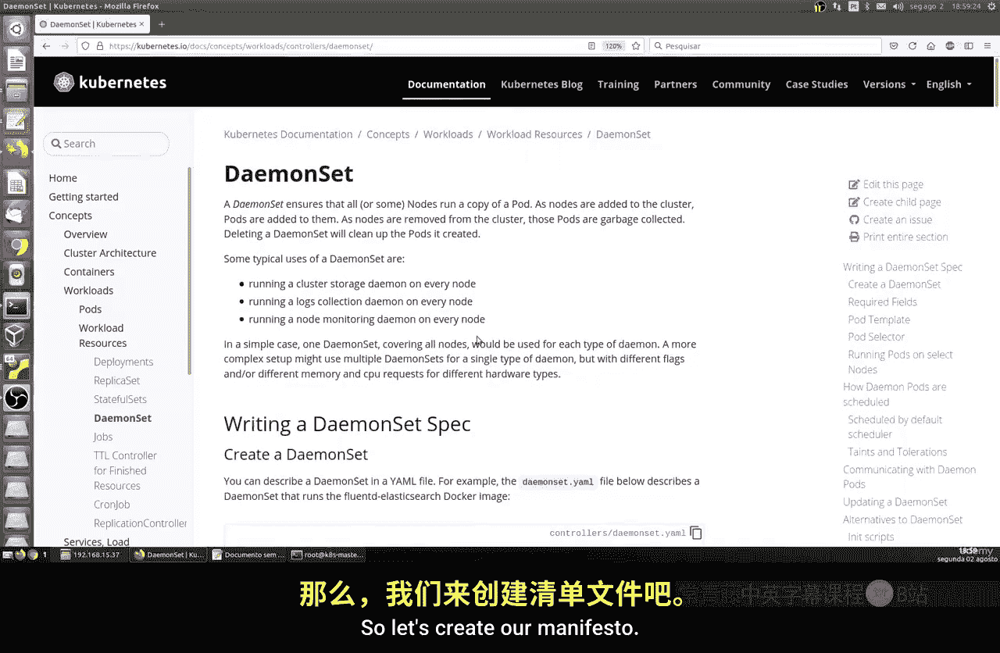

---

## 创建第一个 DaemonSet

让我们开始创建一个 DaemonSet。首先，我们需要编写一个清单文件。

以下是创建 DaemonSet 清单文件的基本步骤：

1.  **定义 API 版本和类型**：指定 `kind: DaemonSet`。
2.  **设置元数据**：`metadata.name` 必须是唯一的。
3.  **配置 Pod 模板**：在 `spec.template` 中定义要运行的容器。

让我们创建一个名为 `fluentd.yaml` 的文件：

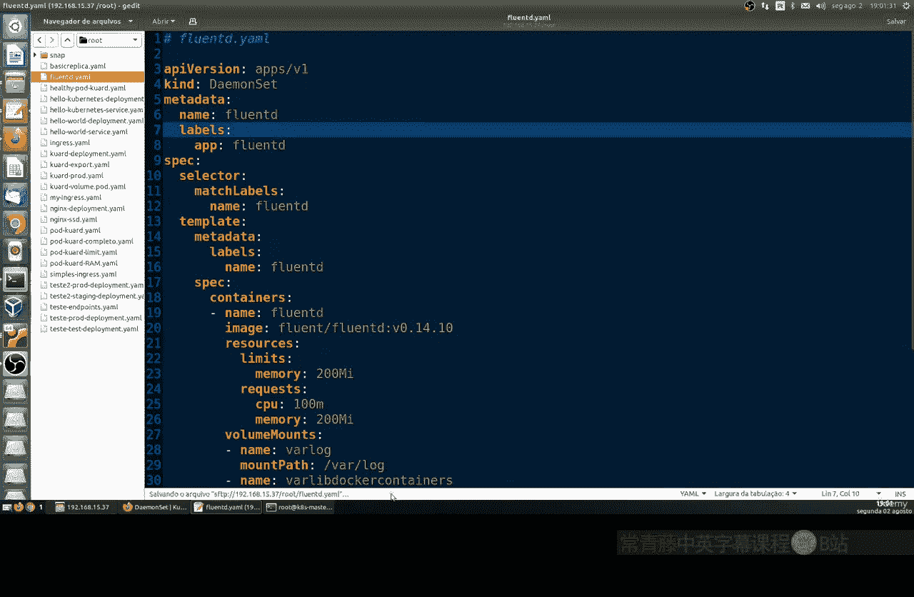

```yaml
apiVersion: apps/v1
kind: DaemonSet
metadata:
  name: fluentd-logging
  labels:
    app: fluentd
spec:
  selector:
    matchLabels:
      name: fluentd
  template:
    metadata:
      labels:
        name: fluentd
    spec:
      containers:
      - name: fluentd
        image: fluent/fluentd:v1.14-debian-1
        resources:
          limits:
            memory: "200Mi"
          requests:
            cpu: "100m"
            memory: "200Mi"
```

**关键点**：`metadata.name` 必须唯一，否则会报错。Pod 模板部分与常规 Pod 定义类似，可以设置资源限制、卷挂载等。

---

## 部署与验证 DaemonSet

创建好清单文件后，我们可以使用 `kubectl apply` 命令来部署它。

首先，让我们查看当前集群中 DaemonSet 的状态：

```bash
kubectl get daemonsets
```

接着，应用我们创建的清单文件：

```bash
kubectl apply -f fluentd.yaml
```

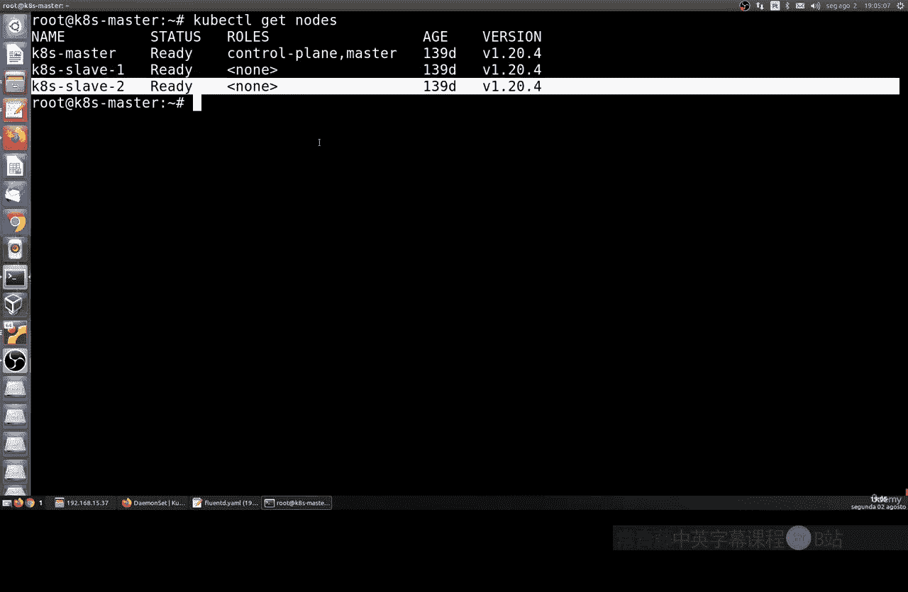

部署完成后，我们可以查看 DaemonSet 的详细信息：

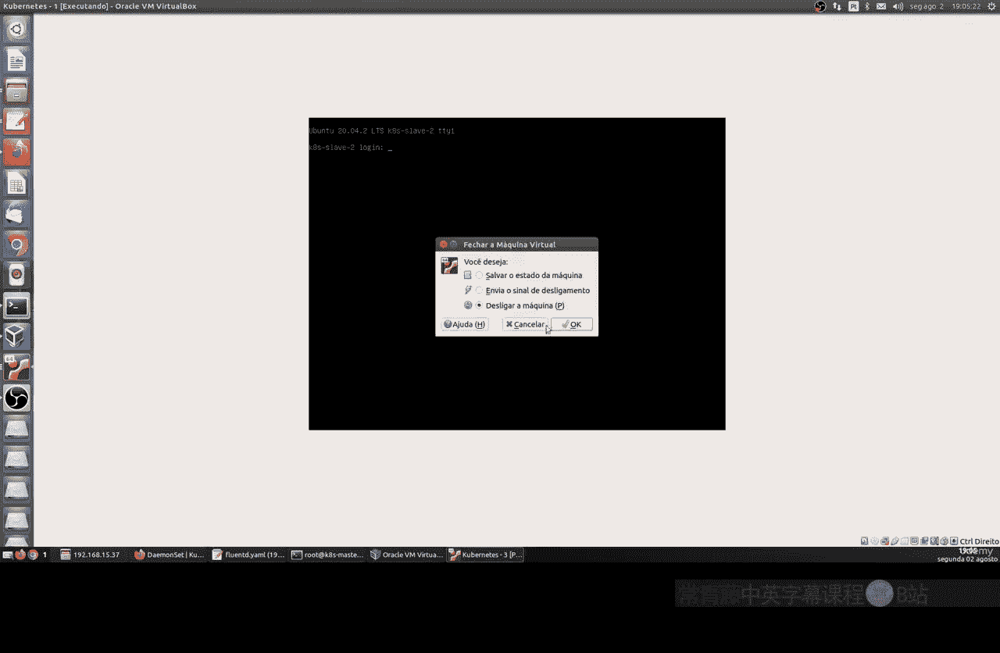

```bash
kubectl describe daemonset fluentd-logging
```

输出信息会显示 DaemonSet 在多少个节点上运行、Pod 状态以及事件日志。例如，如果集群有 2 个工作节点，你应该能看到 2 个 `fluentd` Pod 被创建。

为了更直观地查看 Pod 分布，可以运行：

```bash
kubectl get pods -o wide
```

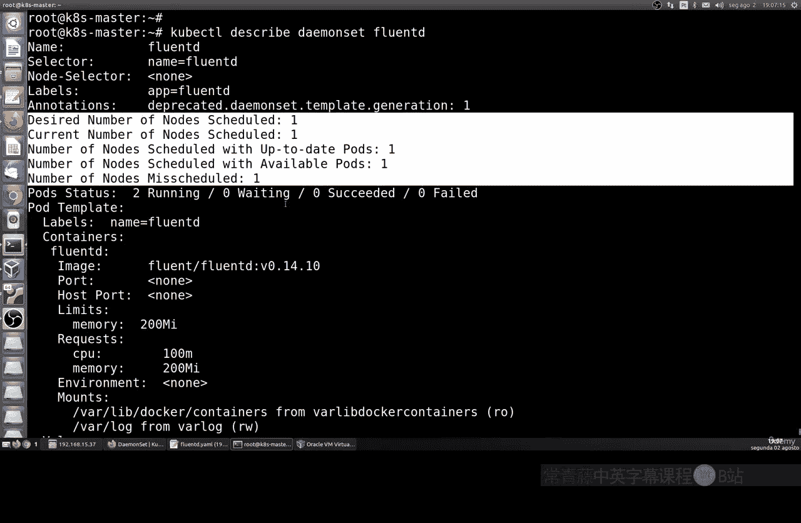

---

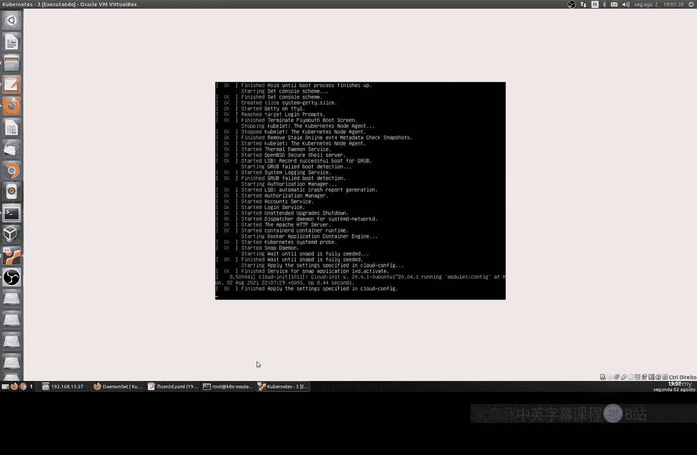

## 理解 DaemonSet 的节点亲和性

DaemonSet 默认会在所有节点上运行 Pod。但有时我们可能希望只在特定的节点上运行。

这可以通过**节点选择器**来实现。其工作原理是：
1.  为特定节点打上**标签**。
2.  在 DaemonSet 的 `spec.template.spec` 中配置 `nodeSelector`，指定该标签。

首先，我们给一个节点添加标签。假设我们有一个节点 `k8s-slave2`，我们为其添加标签 `disktype=ssd`：

```bash
kubectl label nodes k8s-slave2 disktype=ssd
```

可以验证标签是否添加成功：

```bash
kubectl get nodes --show-labels
```

现在，创建一个新的 DaemonSet 清单文件 `ssd-monitor.yaml`，使其只运行在带有 `disktype=ssd` 标签的节点上：

```yaml
apiVersion: apps/v1
kind: DaemonSet
metadata:
  name: ssd-monitor
spec:
  selector:
    matchLabels:
      app: ssd-monitor
  template:
    metadata:
      labels:
        app: ssd-monitor
    spec:
      nodeSelector:
        disktype: ssd
      containers:
      - name: main
        image: nginx:alpine
```

应用这个清单：

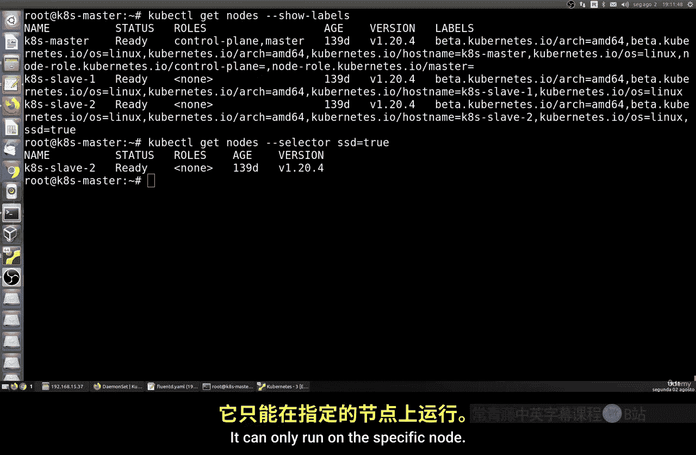

```bash
kubectl apply -f ssd-monitor.yaml
```

现在，查看这个 DaemonSet 的 Pod 分布：

```bash
kubectl get pods -l app=ssd-monitor -o wide
```

你会发现，`ssd-monitor` Pod 只运行在 `k8s-slave2` 节点上，而不是所有节点。

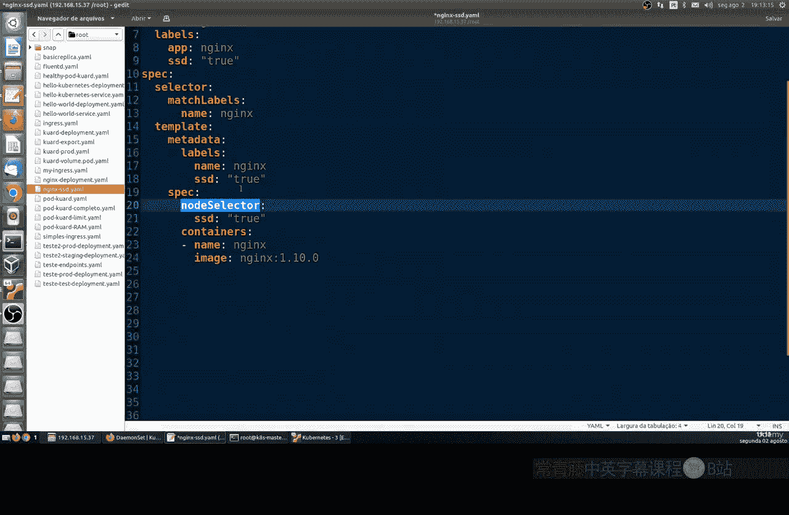

---

## 管理 DaemonSet

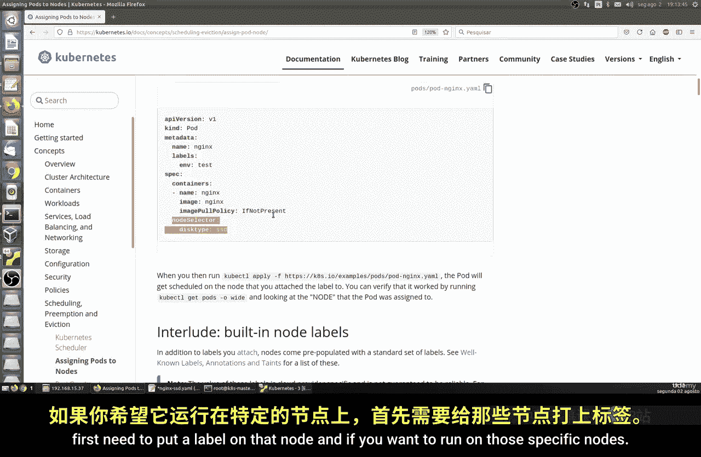

当我们不再需要某个 DaemonSet 时，可以将其删除。同样，也可以删除不再需要的节点标签。

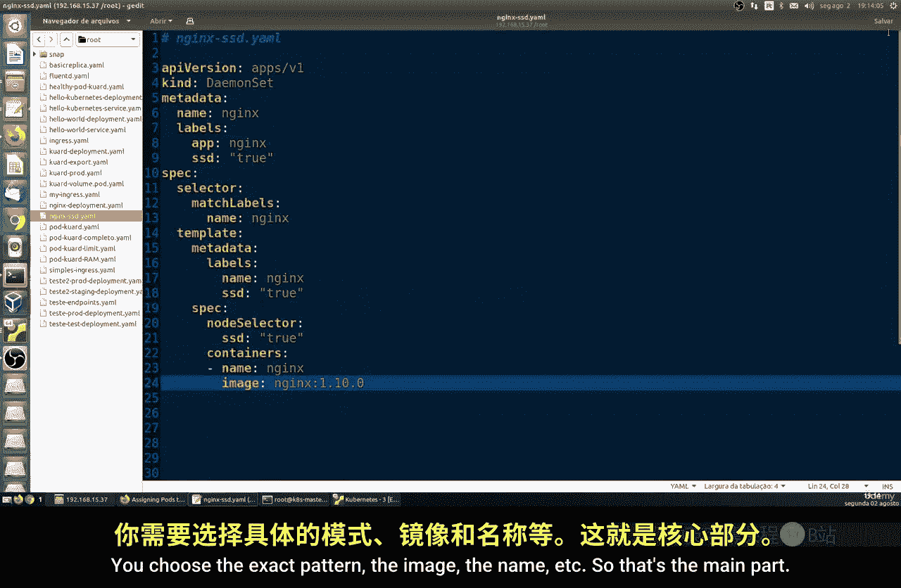

删除 DaemonSet 的命令如下：

```bash
kubectl delete -f fluentd.yaml
kubectl delete -f ssd-monitor.yaml
```

删除我们之前添加的节点标签：

```bash
kubectl label nodes k8s-slave2 disktype-
```

可以再次验证标签已被移除：

```bash
kubectl get nodes k8s-slave2 --show-labels
```

---

## 总结

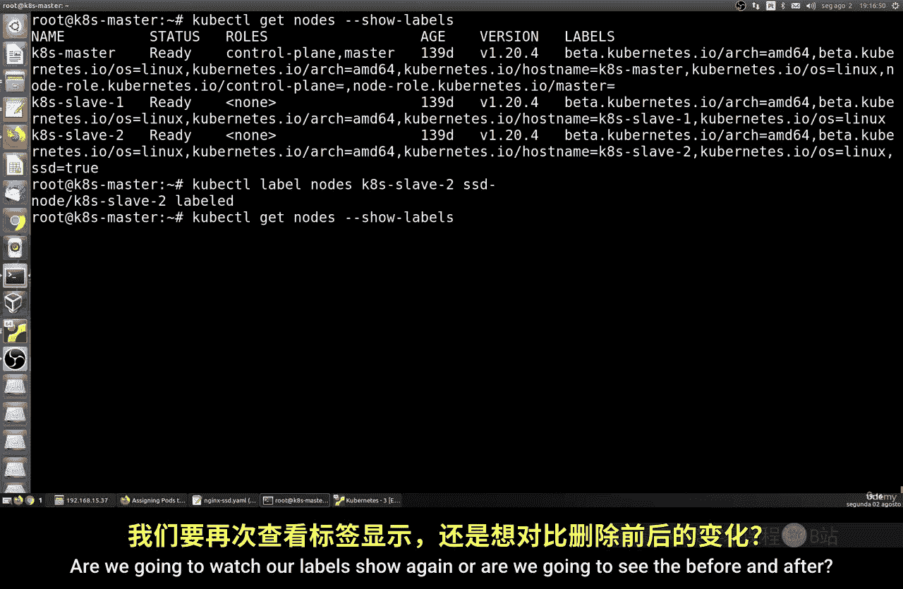

本节课中我们一起学习了 Kubernetes DaemonSet 的核心概念与操作。我们了解到：
*   **DaemonSet** 确保集群中每个（或特定）节点上都运行一个 Pod 副本，非常适合系统级守护进程。
*   通过 `kubectl apply -f <file.yaml>` 来部署 DaemonSet。
*   使用**节点标签**和 **`nodeSelector`** 可以控制 DaemonSet 只在特定节点上运行。
*   使用 `kubectl delete` 可以删除 DaemonSet，使用 `kubectl label ... <label名>-` 可以删除节点标签。

通过灵活运用 DaemonSet，你可以在 Kubernetes 集群中高效地部署和管理需要在每个节点上运行的服务。