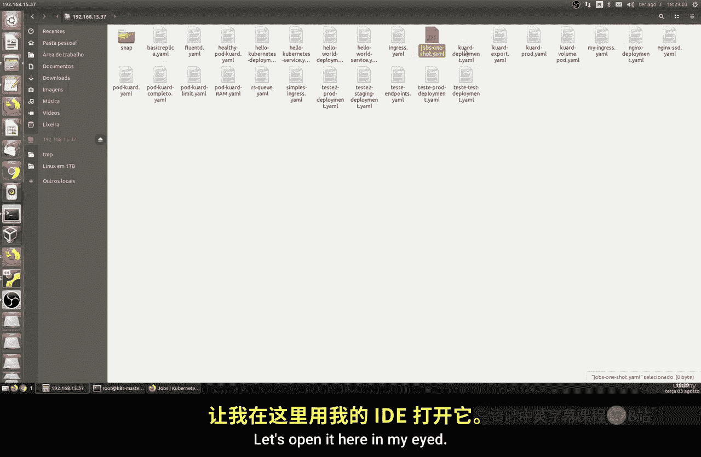
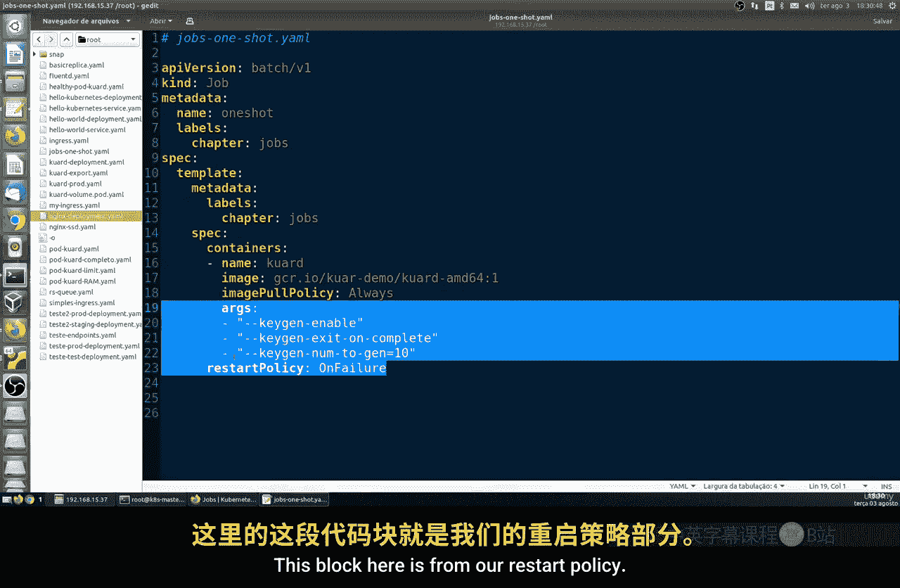
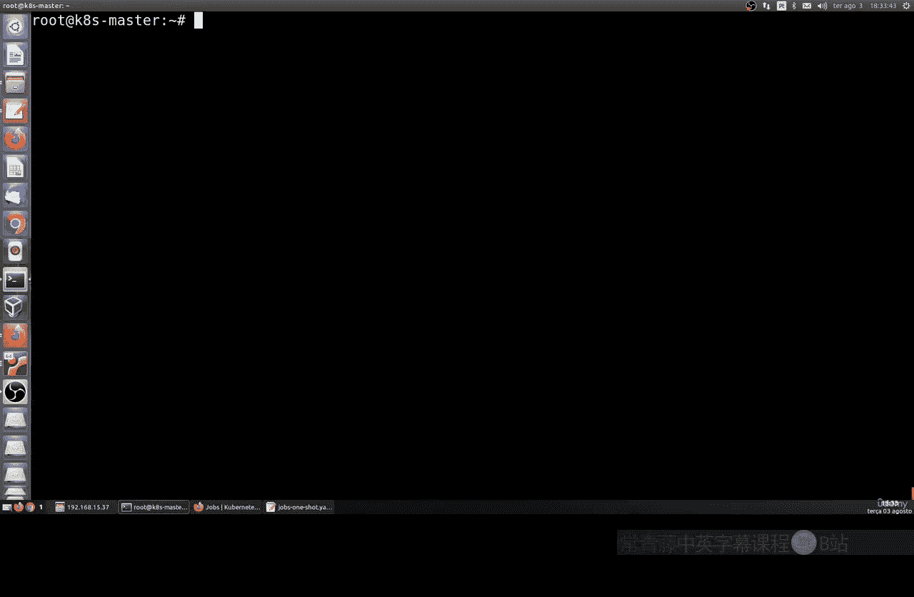
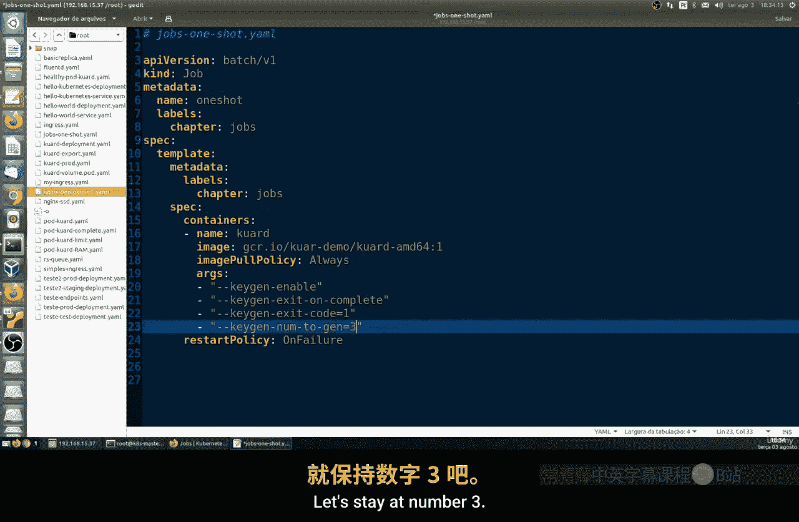
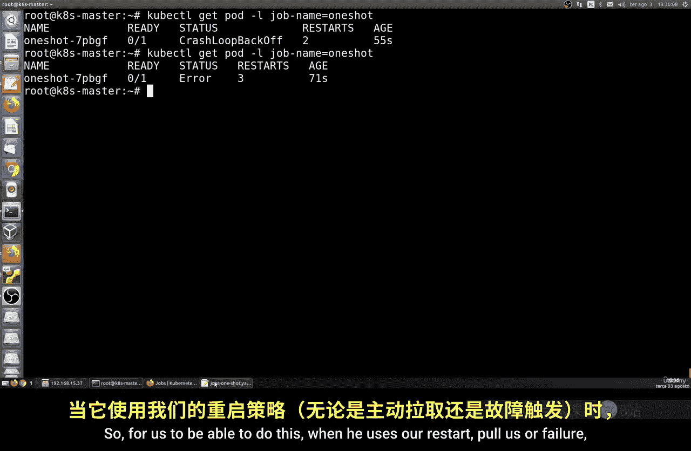
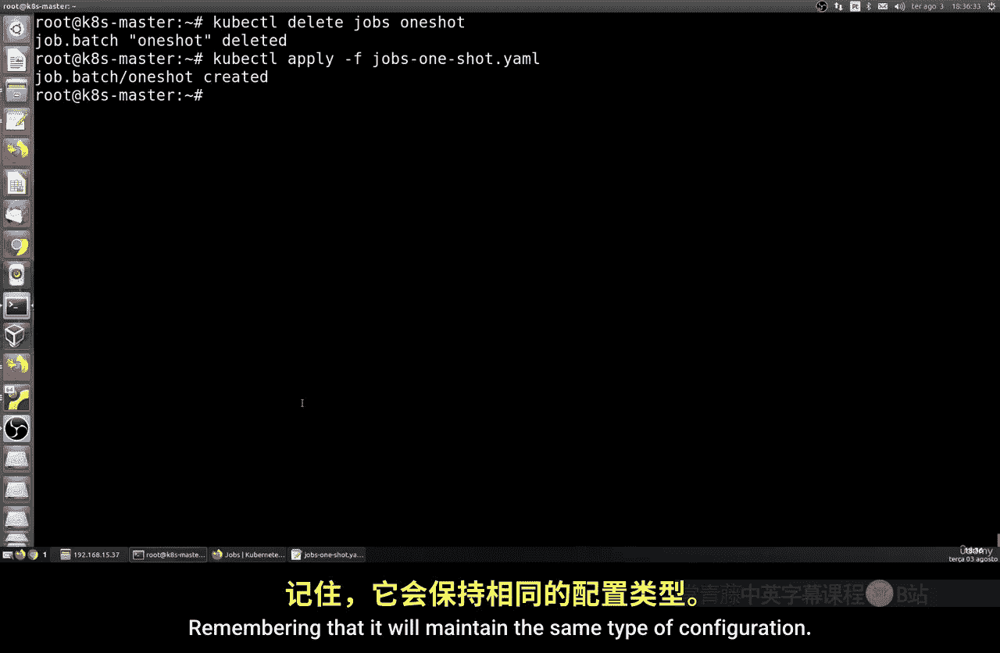
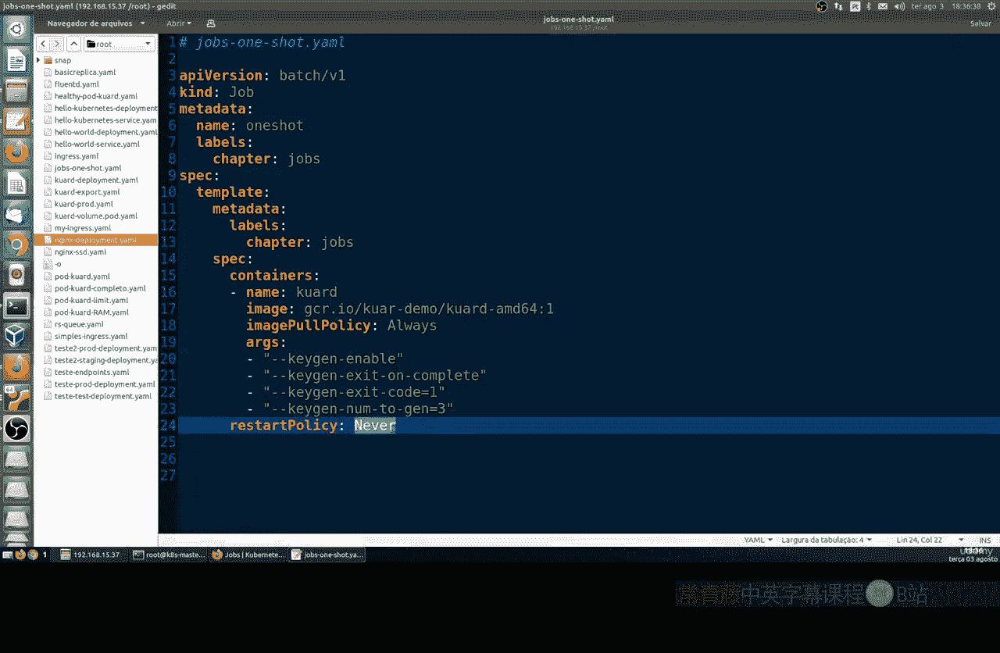
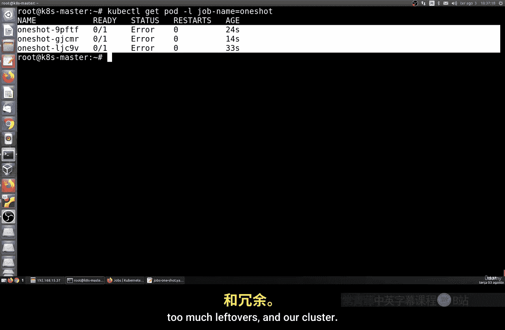
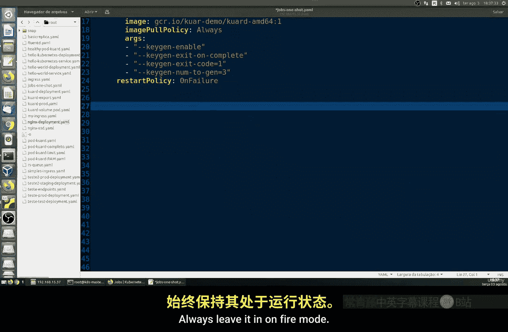
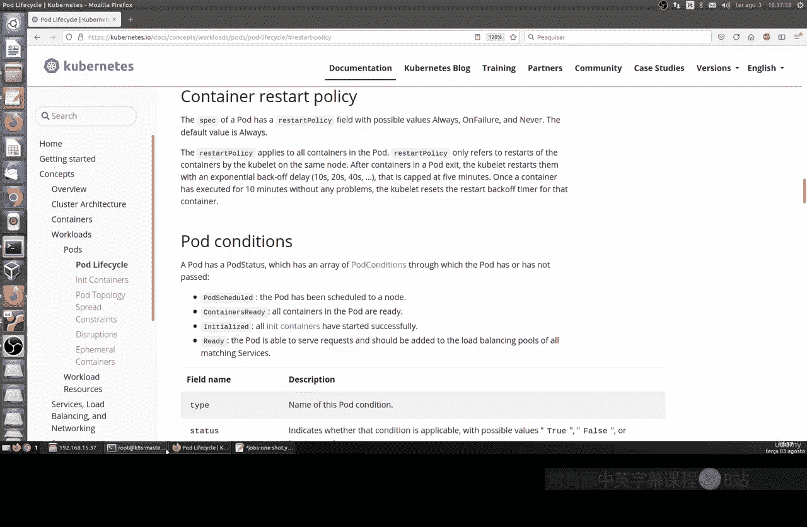

# 009：Jobs 基础

在本节课中，我们将要学习 Kubernetes 中的 **Jobs** 概念。Jobs 用于创建并管理一个或多个 Pod，并确保这些 Pod 执行的任务能够成功完成。这对于运行一次性任务、批处理作业或确保任务可靠执行直至完成至关重要。

## Jobs 核心概念

上一节我们介绍了 Pod 的基本管理，本节中我们来看看如何管理需要确保完成的任务。

Jobs 会创建一个或多个 Pod，并持续尝试执行这些 Pod 中的任务，直到指定数量的任务成功完成为止。Job 会跟踪成功的完成次数。当达到指定的成功完成次数时，该 Job 任务即告完成。删除一个 Job 时，它所创建的 Pod 也会被清理。对于被挂起的 Job，其相关资源会被删除，直到该 Job 被恢复。

例如，创建一个 Job 对象可以确保任务以可靠的方式执行，直至完成。这在数据交换、数据库迁移等场景中应用广泛。

Kubernetes 主要支持三种类型的 Job：

以下是三种主要的 Job 类型：

1.  **One-shot Job**：仅执行一次，运行直至成功完成。常用于数据库迁移等一次性任务。
2.  **Parallel Job**：并行执行固定数量的任务，所有任务完成后 Job 结束。它包含一组并行运行的任务。
3.  **Work Queue (CronJob)**：这是一种更复杂的方式，它维护一个任务队列，可以一次执行一个或多个 Pod。通常用于集中式的任务队列处理。

## 创建 One-shot Job

让我们从最基础的 One-shot Job 开始。首先，我们需要创建一个清单文件。

以下是创建 `job-one-shot.yaml` 清单文件的步骤和内容：



```yaml
apiVersion: batch/v1
kind: Job
metadata:
  name: one-shot-job
spec:
  template:
    spec:
      containers:
      - name: keygen
        image: alpine
        command: ["/bin/sh"]
        args: ["-c", "for i in $(seq 1 10); do echo 'Generating key $i'; sleep 1; done"]
      restartPolicy: OnFailure
```

这个清单文件的结构与之前的 Pod 清单类似，但 `kind` 字段指定为 `Job`。最重要的部分是 `spec.template.spec.containers.args`，它定义了容器要执行的命令。

*   `apiVersion` 和 `kind` 表明这是一个 Job 资源。
*   `spec.template` 定义了 Job 将要创建的 Pod 模板。
*   `args` 中的命令会生成 10 个密钥（此处为模拟，仅输出信息）。
*   `restartPolicy: OnFailure` 表示仅在容器执行失败时才会重启。

## 应用并观察 Job

现在，我们将这个 Job 应用到集群并观察其行为。

使用以下命令应用 Job：



```bash
kubectl apply -f job-one-shot.yaml
```

应用后，我们可以查看 Job 和 Pod 的状态。

使用以下命令查看 Job 状态：

```bash
kubectl get jobs
```

使用以下命令查看由 Job 创建的 Pod：

```bash
kubectl get pods
```

Pod 的名称会包含一个随机生成的 ID。找到对应的 Pod 后，可以查看其日志以确认任务执行情况。

使用以下命令查看 Pod 日志（请将 `<pod-name>` 替换为实际的 Pod 名称）：

```bash
kubectl logs <pod-name>
```



日志会显示 “Generating key 1” 到 “Generating key 10” 的信息，表明任务已成功执行完毕。

## 理解重启策略



上一节我们成功运行了一个 Job，本节中我们来看看当任务失败时，不同的重启策略会如何影响 Job 的行为。

Kubernetes Job 支持几种 `restartPolicy`：

以下是主要的重启策略选项：

*   **`OnFailure`**：仅在容器异常退出（即失败）时重启。这是运行 Job 时的推荐做法。
*   **`Never`**：无论容器因何原因退出，都不重启。
*   **`Always`**：总是重启（默认策略，但 Job 不支持此策略）。

让我们修改清单文件，模拟一个会失败的任务，并观察 `OnFailure` 策略的效果。

将 `args` 修改为以下内容，使其在执行 3 次后失败：

```yaml
args: ["-c", "for i in $(seq 1 3); do echo 'Generating key $i'; if [ $i -eq 3 ]; then exit 1; fi; sleep 1; done"]
```



在应用修改前，需要先删除旧的 Job。


使用以下命令删除旧 Job：





```bash
kubectl delete job one-shot-job
```

然后重新应用修改后的清单文件：

```bash
kubectl apply -f job-one-shot.yaml
```

再次查看 Pod 状态和日志。你会发现 Pod 在第三次循环时失败，然后根据 `OnFailure` 策略进行了重启。通过 `kubectl get pods` 可以看到 `RESTARTS` 计数增加。但 Job 会控制重试次数，不会无限重启，避免了资源浪费。



如果将策略改为 `Never`，则 Pod 失败后不会重启，Job 状态会显示错误。这有助于快速发现故障，但不会自动重试。



**最佳实践**：对于 Job，建议始终将 `restartPolicy` 设置为 `OnFailure`。这能确保在任务偶然失败时有机会自动恢复，同时又防止因程序固有错误导致的无限重启循环，从而保护集群资源。



## 总结

本节课中我们一起学习了 Kubernetes Job 的基础知识。我们了解了 Job 的作用是确保批处理任务可靠完成，探讨了三种 Job 类型，并动手创建和运行了一个 One-shot Job。我们还重点研究了 `restartPolicy`（重启策略），特别是 `OnFailure` 策略的实践意义，它是避免资源浪费和确保任务弹性的关键配置。


记住，合理使用 Job 和配置重启策略，是管理 Kubernetes 中一次性任务和批处理作业的核心技能。