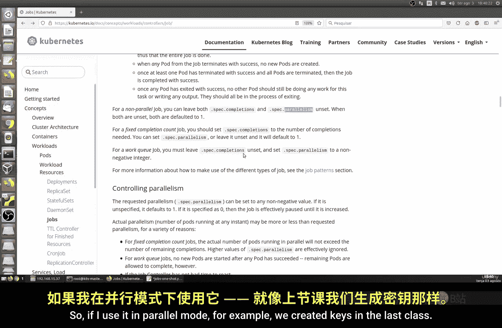
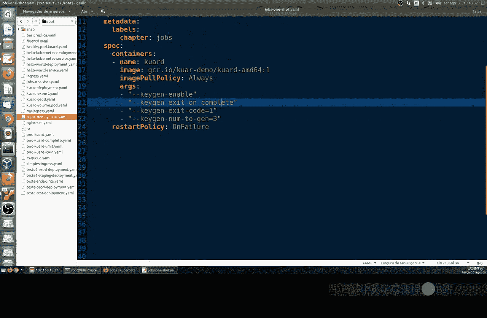
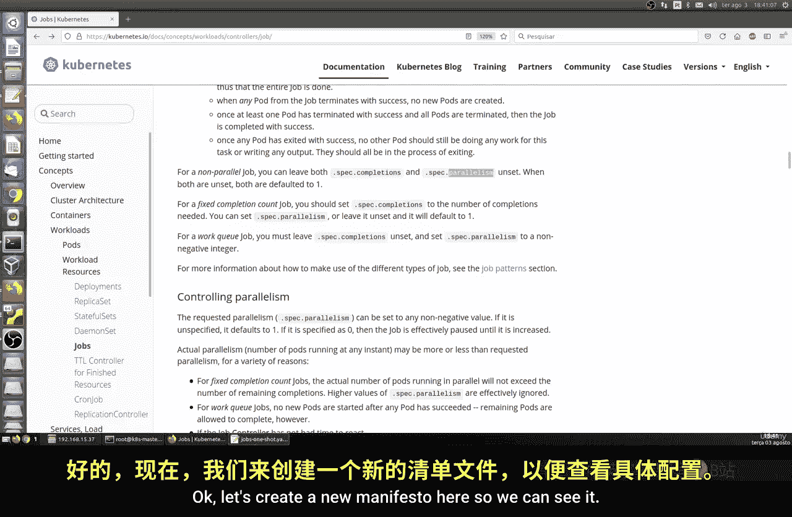
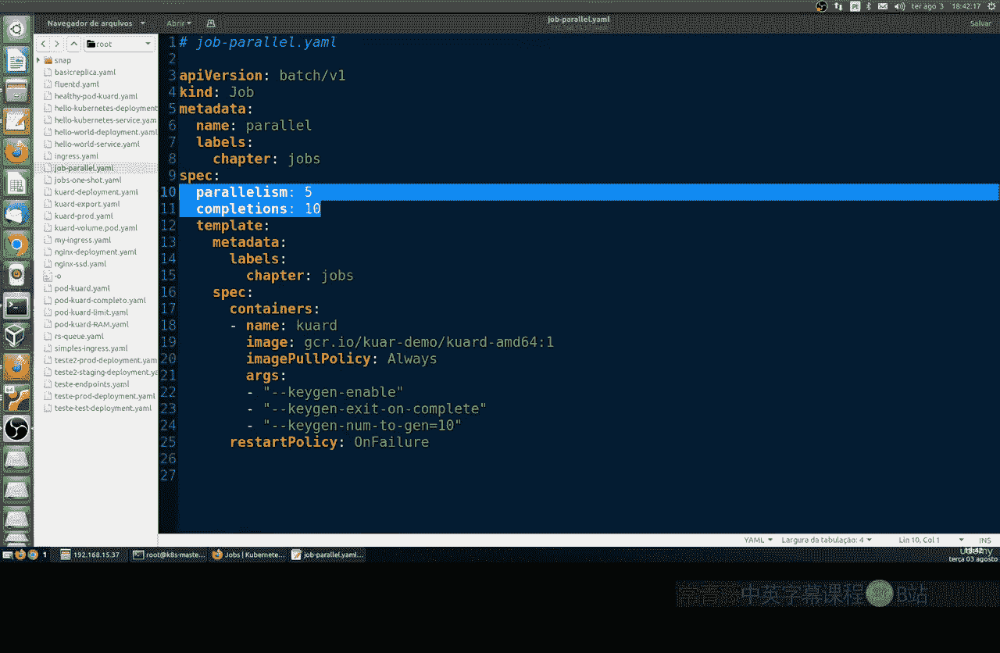
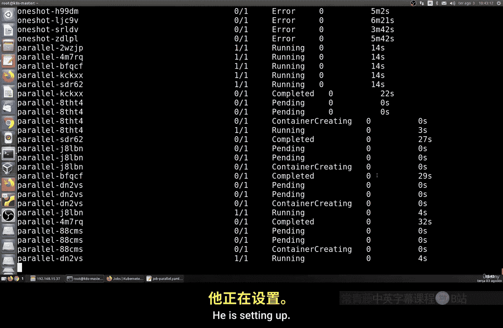
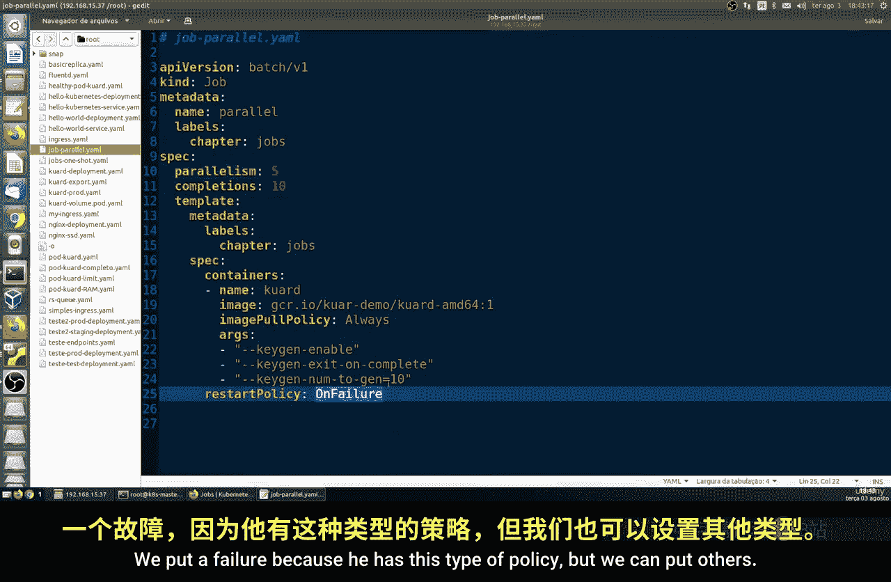

# 010：并行任务 🚀

在本节课中，我们将学习Kubernetes中的并行任务。我们将重点介绍两个核心参数：`completions`（完成数）和`parallelism`（并行度）。通过使用这些参数，可以有效执行大量重复性任务，同时避免硬件资源过载。

## 概述

上一节我们介绍了基本的Job资源。本节中，我们来看看如何通过控制并行度来优化资源使用。当需要创建大量资源（例如密钥）时，一次性运行所有任务可能会压垮集群。通过设置并行任务，我们可以限制同时运行的任务数量，从而保护集群的稳定性。



## 核心概念与参数



以下是控制并行任务的两个关键参数：

*   **`completions`**： 这定义了Job需要成功完成的总任务数量。公式表示为：`completions = N`，其中N是期望完成的任务总数。
*   **`parallelism`**： 这定义了在任意时刻，可以同时运行的最大任务副本（Pod）数量。公式表示为：`parallelism = M`，其中M是最大并行数。

## 实践：创建并行Job



让我们通过一个例子来理解如何应用这些参数。假设我们需要模拟创建100个密钥，但希望每次最多只并行运行5个Pod，并且确保总共完成10个任务。

首先，我们创建一个YAML清单文件，例如 `parallel-job.yaml`：

```yaml
apiVersion: batch/v1
kind: Job
metadata:
  name: parallel-job
spec:
  completions: 10    # 总共需要完成10个任务
  parallelism: 5     # 同时最多运行5个Pod
  template:
    spec:
      containers:
      - name: key-generator
        image: busybox
        command: ["sh", "-c", "echo Generating key $RANDOM; sleep 5"]
      restartPolicy: Never
```

在这个配置中：
*   `completions: 10` 意味着这个Job需要成功运行10次才算完成。
*   `parallelism: 5` 意味着Kubernetes最多会同时创建5个Pod来执行这些任务。
*   容器中的命令会生成一个随机密钥并休眠5秒，用于模拟任务执行。

## 运行与观察

使用以下命令应用这个配置：



```bash
kubectl apply -f parallel-job.yaml
```

然后，我们可以实时观察Pod的创建和运行状态：

```bash
kubectl get pods -w
```



你将看到Pod并非一次性全部启动，而是根据`parallelism`的设置（本例中为5个）分批启动和完成。当一个Pod完成任务后，新的Pod才会被创建，直到达到`completions`指定的总数（10个）。这种方式显著降低了对集群资源的瞬时压力。



## 管理并行Job

任务执行完毕后，如果需要清理资源，可以使用删除命令：

```bash
kubectl delete job parallel-job
```

执行此命令后，该Job创建的所有Pod也会被自动清理。

## 总结


本节课中我们一起学习了Kubernetes Job的并行执行。核心在于利用 `completions` 和 `parallelism` 这两个参数来控制任务的总数和并发度。这种方法非常适合处理批量任务，既能保证任务完成，又能有效避免集群资源过载，是日常运维中的一项重要实践。在接下来的课程中，我们将继续探讨Job的其他高级概念和用法。