# 012：ConfigMaps详解 🗺️

在本节课中，我们将要学习Kubernetes中的一个重要API对象——ConfigMap。ConfigMap用于存储非敏感的配置数据，它可以帮助我们将应用程序的配置与容器镜像解耦，从而实现更灵活的配置管理。

## 什么是ConfigMap？

ConfigMap是Kubernetes的一个API对象，主要用于存储非敏感数据。这些数据默认没有任何安全保护或加密。ConfigMap以键值对的形式存储数据，其格式与我们常见的JSON格式非常相似。

ConfigMap的用途主要有三种：
*   作为环境变量供Pod使用。
*   作为命令行参数传递给容器。
*   作为配置文件挂载到Pod的文件系统中。

通过使用ConfigMap，你可以将特定于环境的配置与容器镜像分离，从而更轻松地管理应用程序。Kubernetes会创建一个小的文件系统来存放这些配置，并将其附加到引用了该ConfigMap的Pod上。这样，你只需修改ConfigMap，就可以在不同的应用程序中复用配置。

需要注意的是，ConfigMap中的数据**没有加密**。如果你需要存储敏感信息（如密码、密钥），应该使用Kubernetes的Secret对象，我们将在下一节课中学习它。

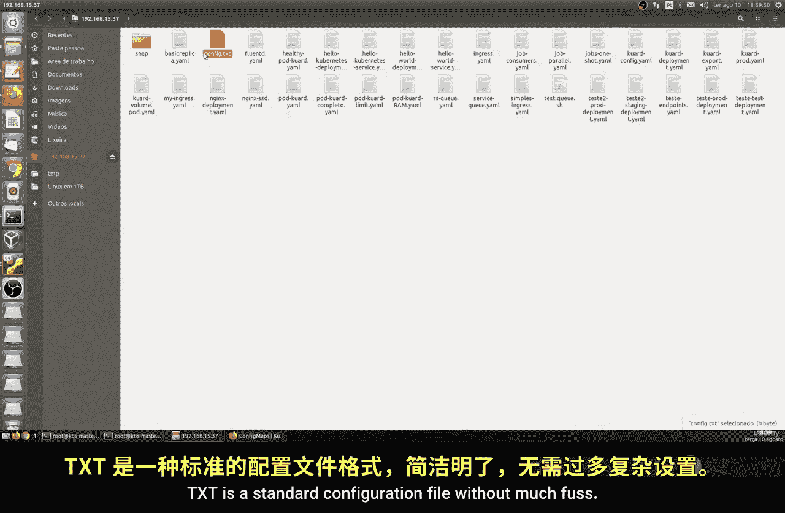

## 创建ConfigMap

上一节我们介绍了ConfigMap的基本概念，本节中我们来看看如何创建一个ConfigMap。我们将通过两种方式创建：从文件创建和从字面量创建。

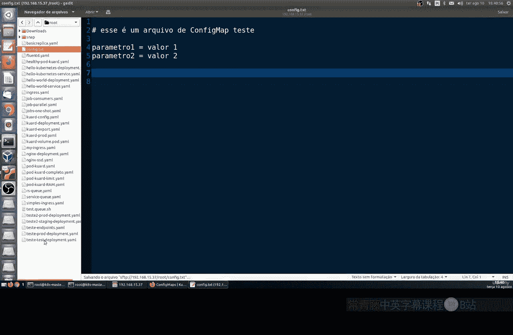

首先，我们需要创建一个简单的配置文件。这是一个标准的TXT文件，内容如下：

```txt
# 这是一个ConfigMap测试文件
parameter1=value1
parameter2=value2
```

接下来，我们通过`kubectl`命令来创建ConfigMap。请确保你的终端位于配置文件所在的目录。

以下是创建ConfigMap的命令：

```bash
kubectl create configmap sky-config \
  --from-file=config.txt \
  --from-literal=extra-parameter=extra-value \
  --from-literal=another-parameter=another-value
```

这个命令创建了一个名为`sky-config`的ConfigMap。它从`config.txt`文件加载配置，并额外添加了两个字面量键值对。

创建成功后，我们可以查看这个ConfigMap的内容：

```bash
kubectl get configmaps sky-config -o yaml
```

你会看到类似以下的输出，其中包含了文件的所有内容以及我们添加的额外参数：

```yaml
apiVersion: v1
data:
  another-parameter: another-value
  config.txt: |
    # 这是一个ConfigMap测试文件
    parameter1=value1
    parameter2=value2
  extra-parameter: extra-value
kind: ConfigMap
metadata:
  name: sky-config
  ...
```

## 在Pod中使用ConfigMap

我们已经成功创建了ConfigMap，现在来看看如何在Pod中使用它。我们将创建一个Pod，并将ConfigMap以两种方式挂载进去：作为环境变量和作为卷（文件）。

首先，我们需要创建一个Pod的清单文件（例如`pod-config.yaml`）。以下是一个示例配置：


```yaml
apiVersion: v1
kind: Pod
metadata:
  name: myapp-pod
spec:
  containers:
  - name: myapp-container
    image: myapp:latest # 请替换为你的应用镜像
    command: ["/bin/sh"]
    args: ["-c", "while true; do echo $(EXTRA_PARAM); sleep 10; done"]
    env:
    - name: EXTRA_PARAM
      valueFrom:
        configMapKeyRef:
          name: sky-config
          key: extra-parameter
    volumeMounts:
    - name: config-volume
      mountPath: /etc/config
  volumes:
  - name: config-volume
    configMap:
      name: sky-config
```

在这个配置中：
1.  我们定义了一个名为`myapp-pod`的Pod。
2.  容器通过`env`字段，将ConfigMap中`extra-parameter`键的值注入为环境变量`EXTRA_PARAM`。
3.  容器通过`volumeMounts`字段，将名为`config-volume`的卷挂载到容器的`/etc/config`路径。
4.  `volumes`字段定义了这个卷的来源是我们的`sky-config` ConfigMap。

现在，应用这个清单文件来创建Pod：

```bash
kubectl apply -f pod-config.yaml
```

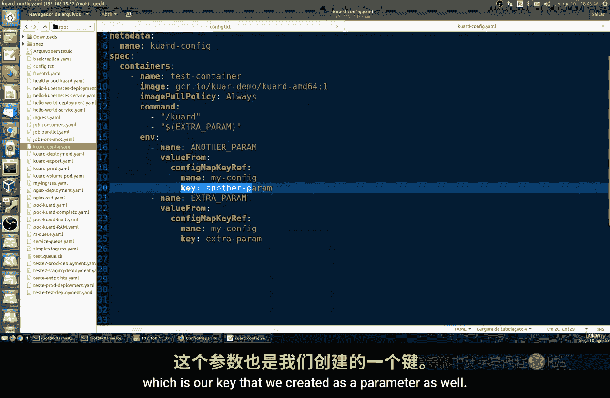

创建Pod后，我们可以验证ConfigMap是否被正确加载。

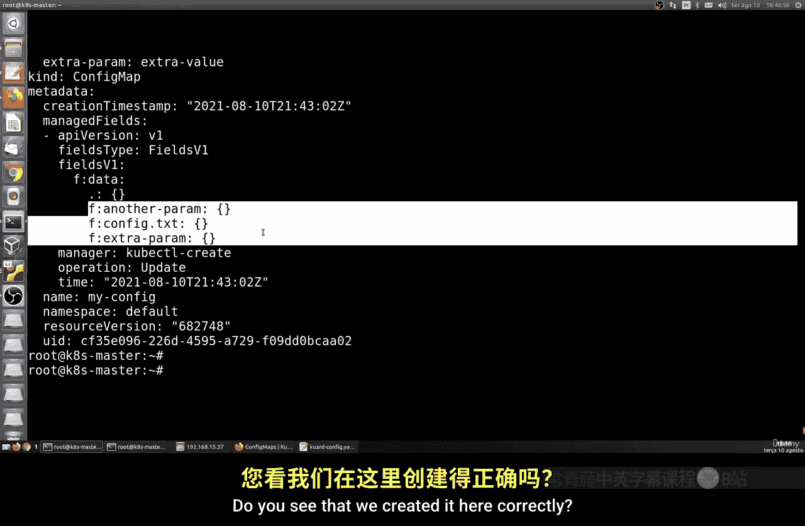

首先，检查环境变量。你可以进入Pod的shell并打印环境变量：

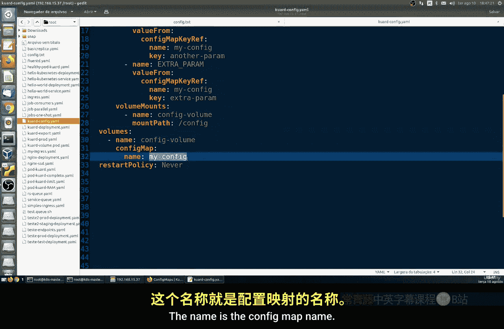

```bash
kubectl exec myapp-pod -- printenv | grep EXTRA_PARAM
```

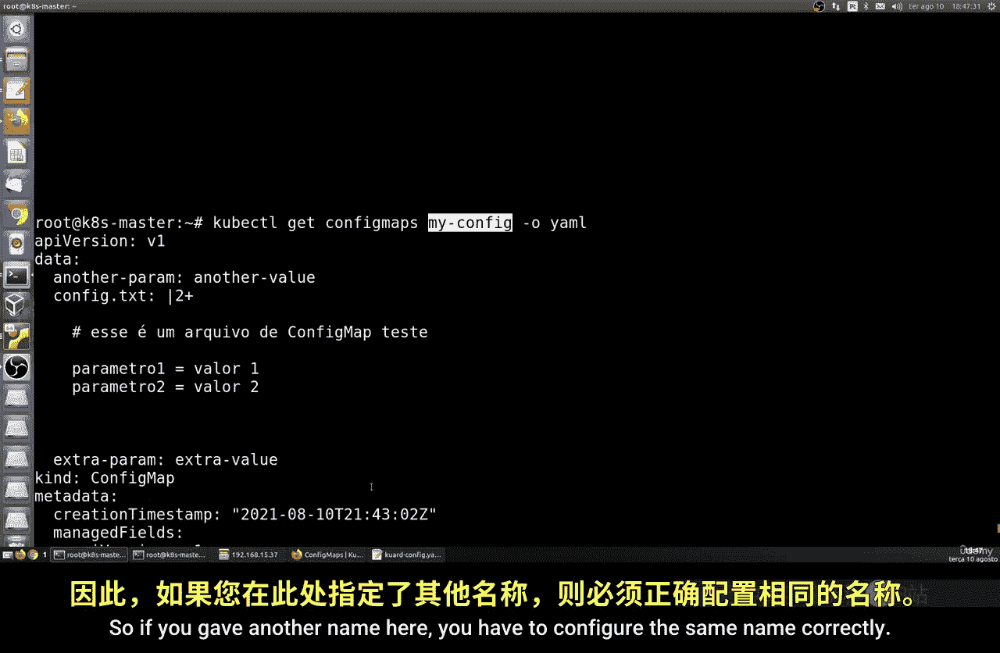

这应该会输出`EXTRA_PARAM=extra-value`。

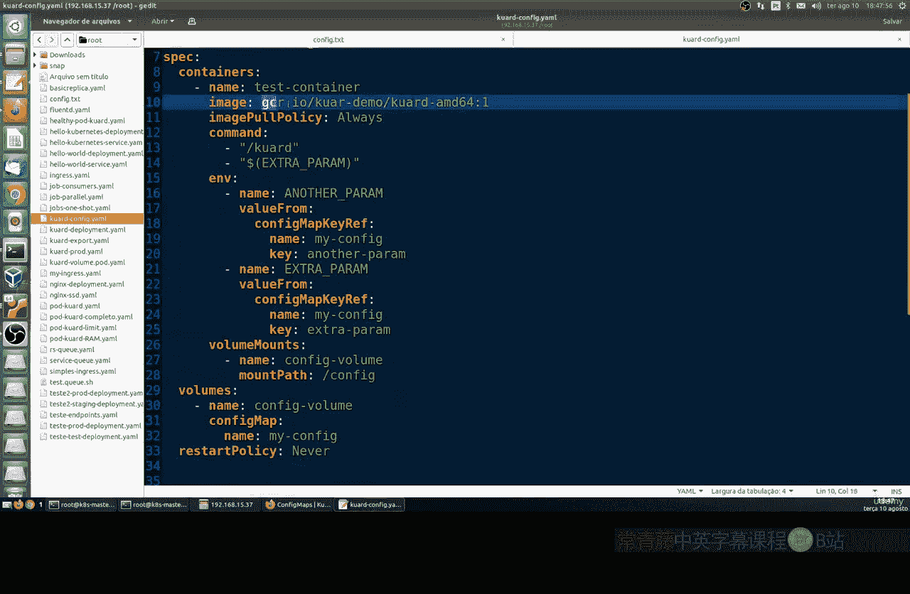

其次，检查挂载的文件。你可以列出挂载目录的内容：

```bash
kubectl exec myapp-pod -- ls /etc/config
```

你会看到类似`another-parameter`、`config.txt`、`extra-parameter`的文件。查看`config.txt`文件的内容：

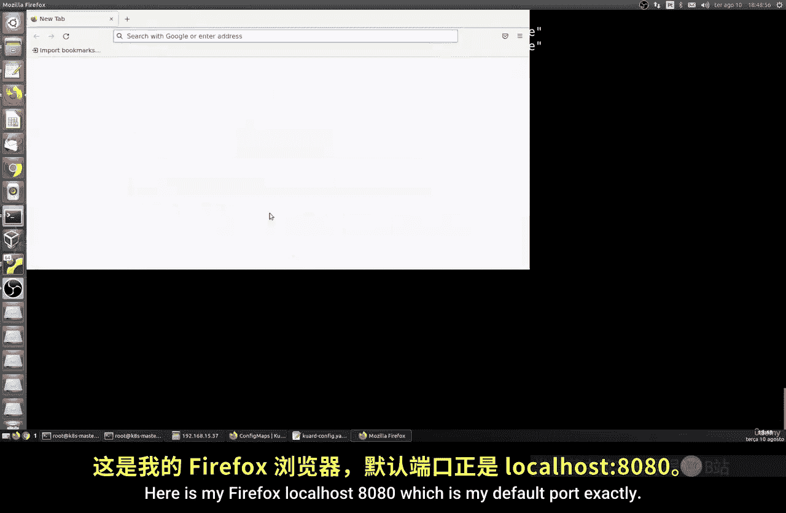

```bash
kubectl exec myapp-pod -- cat /etc/config/config.txt
```

这将显示我们最初创建的配置文件内容。

## 总结

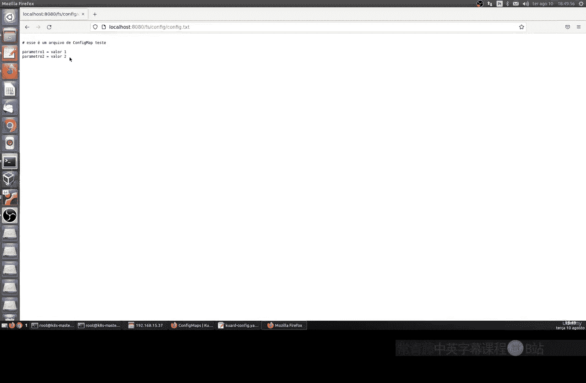

本节课中我们一起学习了Kubernetes ConfigMap的核心概念和用法。

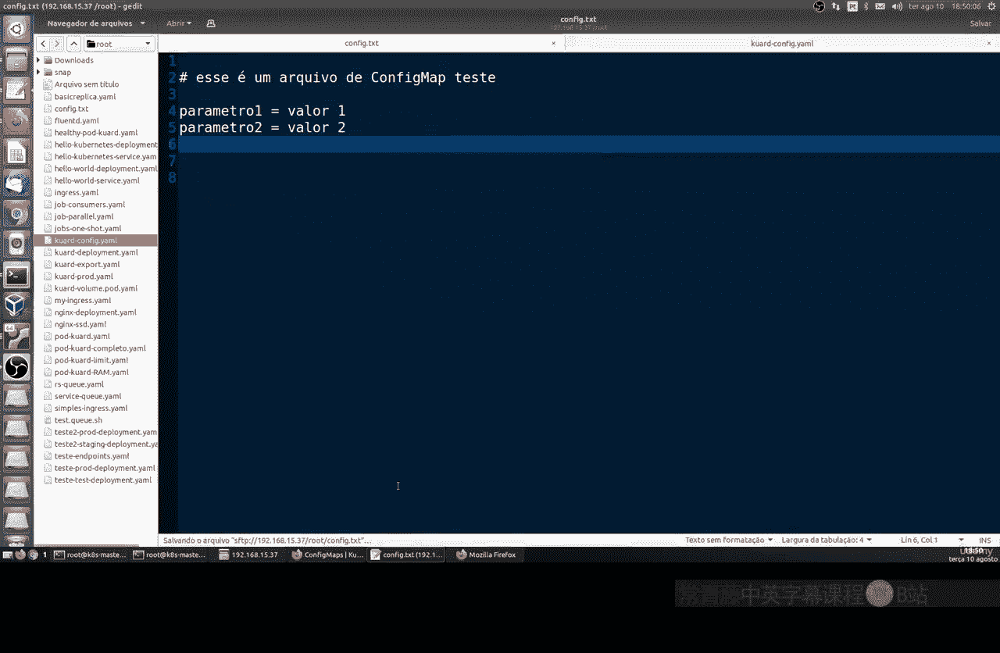

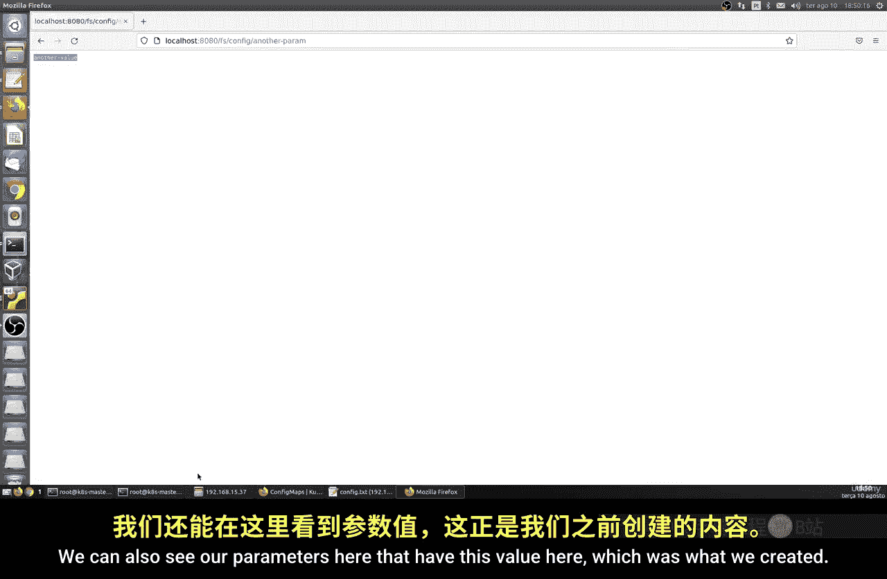

我们首先了解到，ConfigMap是一个用于存储非敏感配置数据的Kubernetes对象，它采用键值对格式，有助于实现配置与容器镜像的解耦。

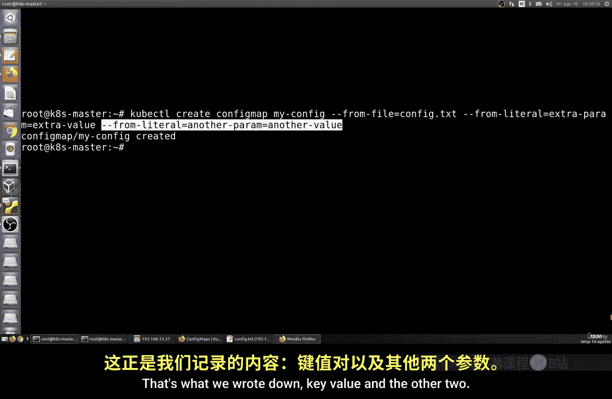

接着，我们实践了如何通过`kubectl create configmap`命令，从文件和字面量两种方式创建ConfigMap。

最后，我们学习了如何在Pod中使用ConfigMap：既可以通过环境变量将单个配置项注入容器，也可以通过卷（Volume）的形式将整个配置文件挂载到容器的文件系统中。

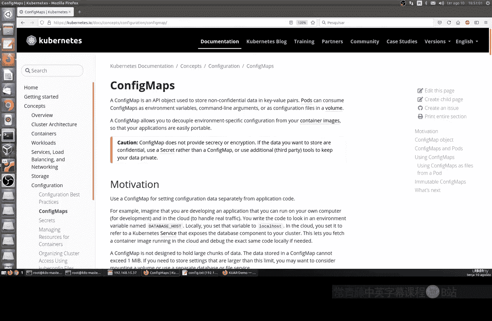

记住，ConfigMap**不适合存储密码、令牌等敏感信息**，这类数据应使用下一节课将要介绍的Secret对象来管理。通过灵活运用ConfigMap，你可以大大提高Kubernetes应用配置管理的效率和灵活性。