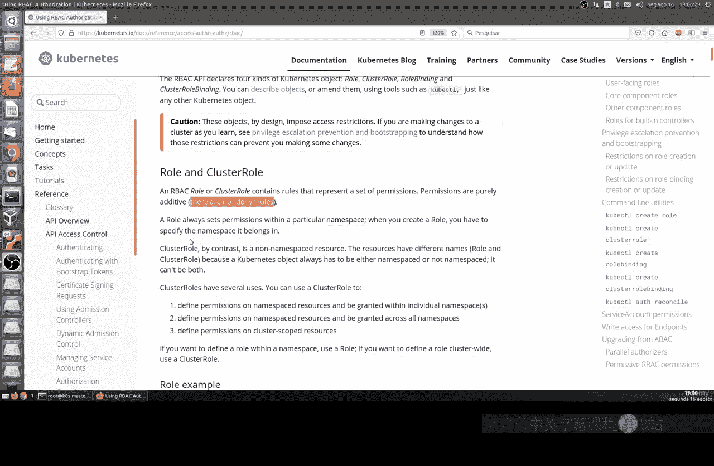
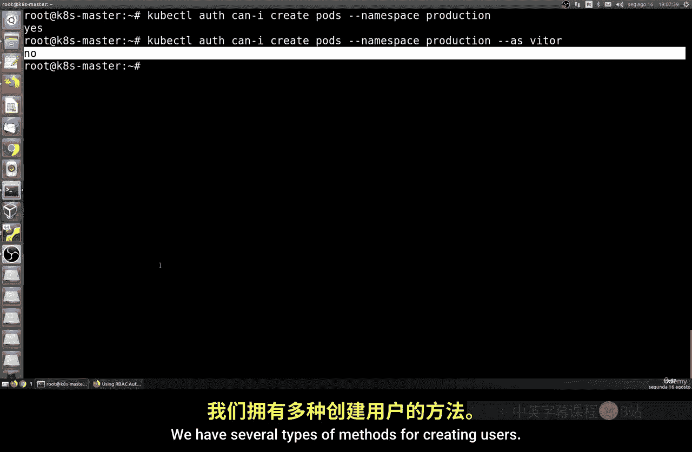
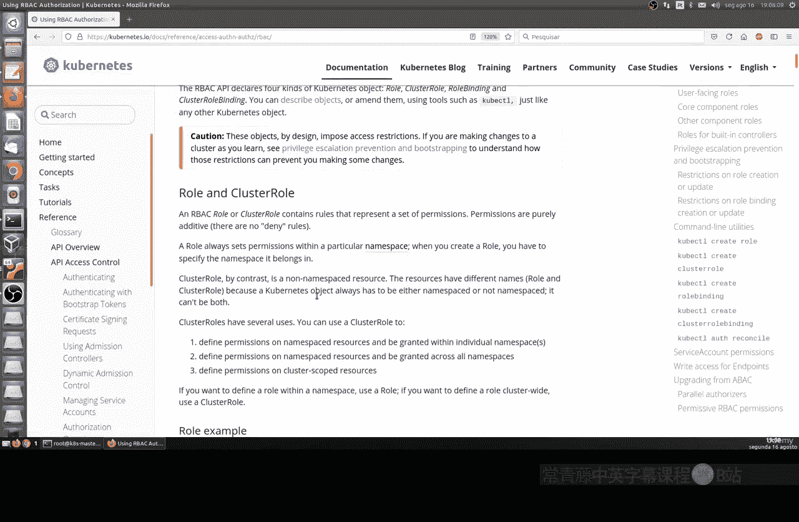
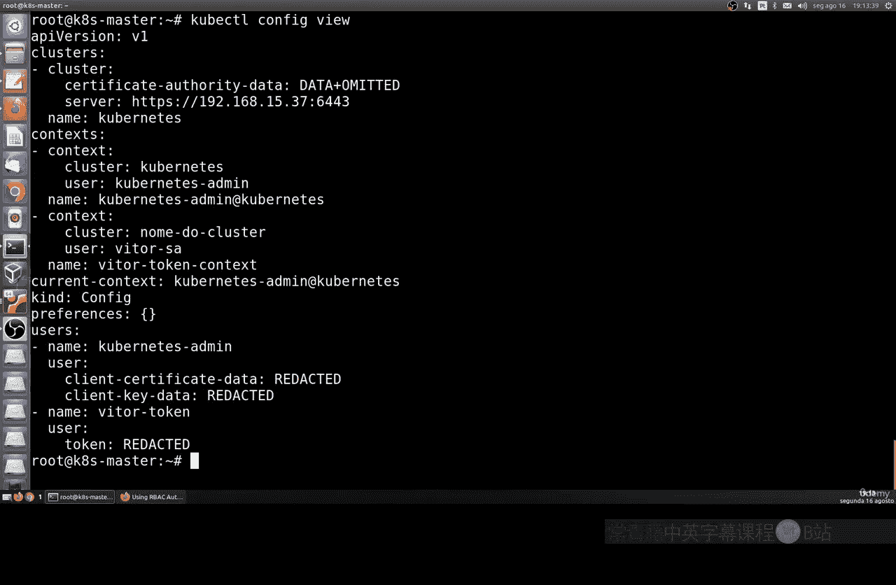

# 014：在Kubernetes中创建与管理用户

## 概述
在本节课中，我们将要学习如何在Kubernetes中创建和管理用户。我们将进入Kubernetes的认证与授权部分，了解其安全模型，并实践使用令牌创建用户的方法。

Kubernetes本身不直接管理用户，但它提供了原生工具来实现用户认证和权限管理。我们将学习角色、集群角色和角色绑定等核心概念，并理解如何通过它们来构建团队和权限层级。

---

## 认证与授权基础

上一节我们介绍了Kubernetes的基本操作，本节中我们来看看其安全模型的核心：认证与授权。



认证是确认用户身份的过程，而授权是确定该用户能做什么和不能做什么的过程。Kubernetes默认采用“拒绝所有”的安全实践，这意味着所有权限都需要后续逐步配置和开放。

以下是认证与授权的关键区别：
*   **认证**：验证用户是谁。例如，确认用户“Victor”的身份。
*   **授权**：定义用户能执行的操作。例如，决定用户“Victor”是否可以创建Pod。

这两个系统是分开配置和管理的，这有助于为不同团队（如开发团队、数据库管理团队、前端团队）设置精细的权限。

---



## 检查用户权限

在配置权限之前，我们可以先检查当前用户在特定命名空间下的权限。



我们可以使用 `kubectl auth can-i` 命令来检查权限。例如，检查当前用户是否能在 `production` 命名空间中创建Pod：
```bash
kubectl auth can-i create pods --namespace production
```
如果用户是管理员，此命令会返回 `yes`。

我们也可以检查特定用户（如用户“Victor”）的权限。这通过在命令中添加 `--as` 标志来实现：
```bash
kubectl auth can-i create pods --namespace production --as victor
```
如果用户“Victor”没有相应权限，命令将返回 `no`。

---

## 创建用户的方法

了解了如何检查权限后，接下来我们看看如何创建用户。Kubernetes提供了多种创建用户的方法。

以下是几种主要的用户创建方式：
1.  **私钥认证**：使用X509客户端证书。
2.  **令牌**：使用Bearer Token，这是一种更简单快捷的方法。

在本教程中，我们将使用**令牌**的方式来创建用户，因为这种方法更易于管理和撤销。

---

## 使用ServiceAccount和令牌创建用户

现在，让我们开始实践，使用ServiceAccount来创建一个带有令牌的用户。

首先，我们创建一个名为 `victor` 的ServiceAccount。ServiceAccount是Kubernetes中用于Pod或外部系统进行身份验证的实体：
```bash
kubectl create serviceaccount victor
```
创建成功后，我们需要获取与此ServiceAccount关联的Secret名称，该Secret中包含了身份验证令牌：
```bash
kubectl get serviceaccount victor -o yaml
```
在输出的YAML中，找到 `secrets` 字段下的 `name`，其格式类似 `victor-token-xxxxx`。

接下来，我们提取这个Secret中的令牌。这是一个较长的命令，它创建了一个Bash变量来存储令牌：
```bash
TOKEN=$(kubectl get secret <你的secret名称> -o jsonpath='{.data.token}' | base64 --decode)
```
请将 `<你的secret名称>` 替换为上一步获取到的实际Secret名称。

现在，我们使用这个令牌为用户配置kubectl的认证凭据：
```bash
kubectl config set-credentials victor --token=$TOKEN
```
然后，将这个用户配置到我们的集群上下文中：
```bash
kubectl config set-context victor-context --cluster=kubernetes --user=victor
```
最后，切换到新创建的上下文，以用户“Victor”的身份操作：
```bash
kubectl config use-context victor-context
```
至此，用户“Victor”已成功创建并配置完成。你可以使用 `kubectl config view` 命令查看配置，会发现多出了一个用户和上下文条目。

---

## 总结
本节课中我们一起学习了Kubernetes用户管理的基础知识。我们理解了认证与授权的区别，学会了使用 `kubectl auth can-i` 命令检查权限，并重点实践了通过ServiceAccount和令牌来创建用户的方法。创建的用户可以用于外部访问或分配给特定的团队角色。



这只是Kubernetes权限管理的起点。在接下来的课程中，我们将学习如何创建**角色**和**集群角色**，并通过**角色绑定**来为用户或ServiceAccount赋予具体的操作权限，从而构建起完整的访问控制体系。