# 015：RBAC 角色详解与实战 🛡️

在本节课中，我们将深入学习 Kubernetes 中的 RBAC（基于角色的访问控制），并动手创建和配置不同的角色。我们将了解角色的核心概念、组成部分，并通过实例演示如何为特定命名空间创建具有不同权限的角色。

---

## 概述

上一节我们介绍了如何创建用户。本节中，我们来看看如何为用户定义权限，即创建角色。Kubernetes 支持多种授权方法，其中最常用的是 RBAC（Role-Based Access Control，基于角色的访问控制）。RBAC 通过配置角色和用户类型来限制对集群资源的访问。

## RBAC 核心概念

RBAC 的基本逻辑是限制通过资源对集群的访问。我们需要学习四种主要的访问控制类型：`Role`、`ClusterRole`、`RoleBinding` 和 `ClusterRoleBinding`。

简单来说，角色就是基于配置文件和用户类型的访问控制。我们可以将角色理解为一种“配置文件”，并将其分配给多个用户。例如，我们上节课创建了用户 `Vitor`，现在需要为他添加一个角色和配置文件，因为仅创建用户本身并不赋予任何权限。通过分配角色，我们可以控制用户在集群中的访问范围，确保他只能访问被允许的资源，而不能执行不应进行的操作。

一个基本的模型是允许用户管理特定区域，例如某个命名空间（Namespace）。因此，最好为特定类型的用户和角色创建一个新的、私有的命名空间。

在 Kubernetes 中，我们使用 RBAC 授权模型。这意味着你可以通过 Kubernetes 的 API 动态创建和配置这些策略。

在 RBAC 中，用户被称为 **主体（Subject）**。而用户可能访问或不能访问的 API 和资源则被称为 **资源（Resource）**。此外，还有 **操作（Verb）** 的概念，它代表主体可以对资源执行的动作，例如查看、创建或删除。

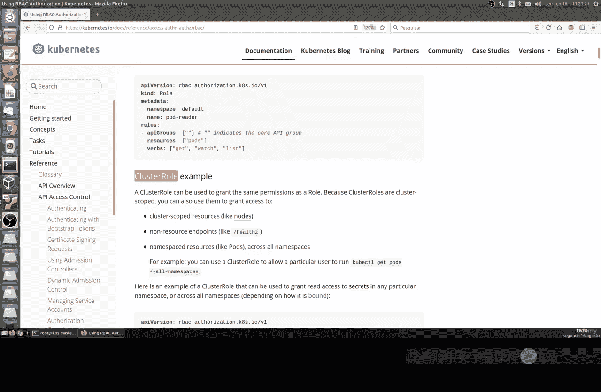

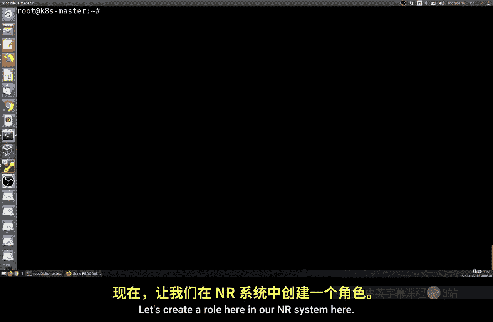

**公式表示：**
`访问控制 = 主体(Subject) + 操作(Verb) + 资源(Resource)`

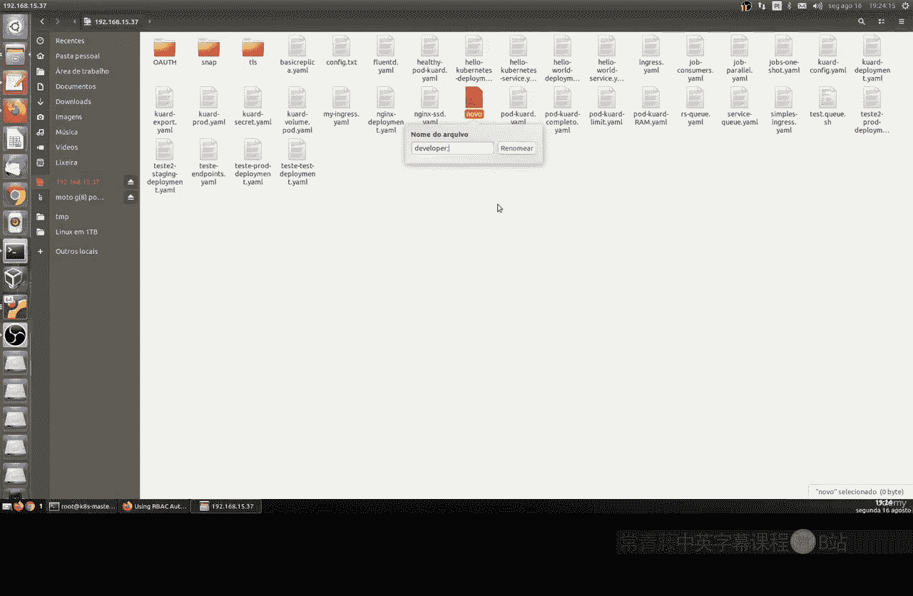

我们还有 `ClusterRole`。角色是用于一个或多个资源的访问规则，但 `Role` 对象仅限于其自身的命名空间。而 `ClusterRole` 的适用范围更广，它应用于整个集群，不受命名空间限制。

---

## 创建基础角色

现在，让我们开始创建基础角色。我们将创建一个名为 `developer` 的角色。

首先，创建一个 YAML 文件，例如 `developer-role.yaml`。文件内容如下：

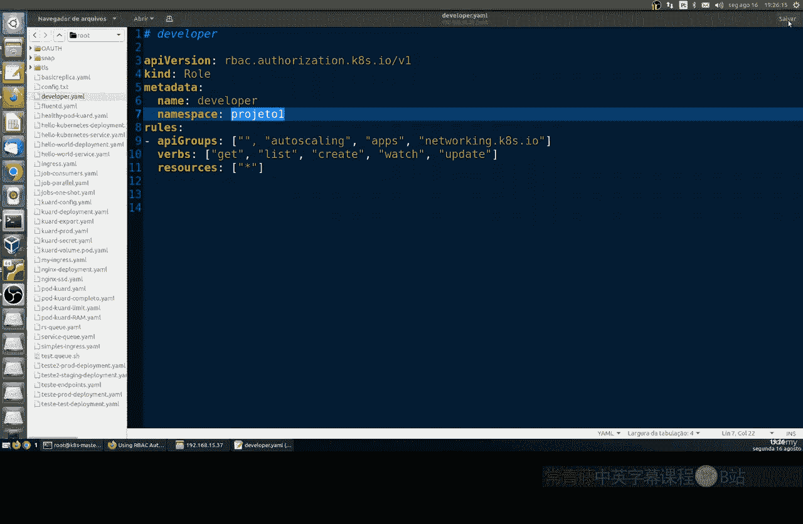

```yaml
apiVersion: rbac.authorization.k8s.io/v1
kind: Role
metadata:
  name: developer
  namespace: project1
rules:
- apiGroups: ["", "autoscaling", "apps", "networking.k8s.io"]
  resources: ["*"]
  verbs: ["get", "list", "create", "watch", "update"]
```

**代码解释：**
*   `apiVersion` 和 `kind` 定义了这是一个 RBAC 角色资源。
*   `metadata.name` 指定角色名称为 `developer`。
*   `metadata.namespace` 指定此角色仅作用于 `project1` 命名空间，所有权限将被限制在该命名空间内。
*   `rules` 部分定义了权限规则：
    *   `apiGroups` 列出了角色有权访问的 API 组。空字符串 `""` 代表核心 API 组。
    *   `resources: ["*"]` 表示角色可以访问指定 API 组下的所有资源。
    *   `verbs` 列出了允许执行的操作，例如获取、列表、创建、监视和更新。

在应用此角色之前，需要先创建 `project1` 命名空间。

使用以下命令创建命名空间并应用角色：
```bash
kubectl create namespace project1
kubectl apply -f developer-role.yaml
```

角色创建后，可以使用以下命令查看：
```bash
kubectl get roles -n project1
```
或者使用 `describe` 命令查看详情：
```bash
kubectl describe role developer -n project1
```

这将显示角色的详细信息，包括其规则和策略。规则表明，该角色有权访问 `autoscaling`、`apps` 和 `networking.k8s.io` 等 API 组中的所有资源，并可以执行列出的操作。

关于 API 组：
*   空字符串 `""` 通常指代核心 API 资源（如 Pod、Service），当创建新工作负载时，如果未指定其他组，则属于此 API。
*   `autoscaling` 组控制应用程序的水平伸缩等功能。
*   更多 API 组的详细说明，请参考 [Kubernetes 官方 API 文档](https://kubernetes.io/docs/reference/generated/kubernetes-api/v1.28/)。

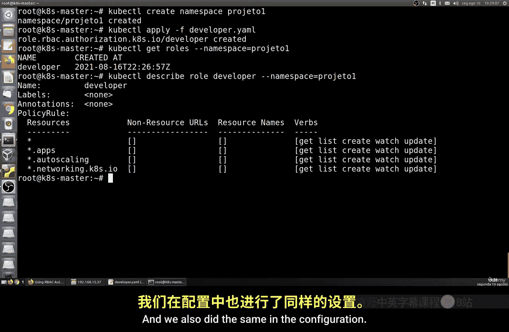

---

## 创建只读角色

接下来，我们创建一个权限更受限的只读角色。

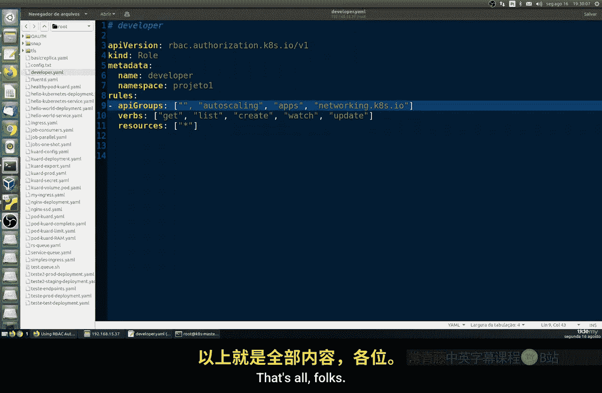

创建一个新文件，例如 `developer-readonly.yaml`：

```yaml
apiVersion: rbac.authorization.k8s.io/v1
kind: Role
metadata:
  name: developer-readonly
  namespace: project1
rules:
- apiGroups: ["*"]
  resources: ["*"]
  verbs: ["get", "list"]
```

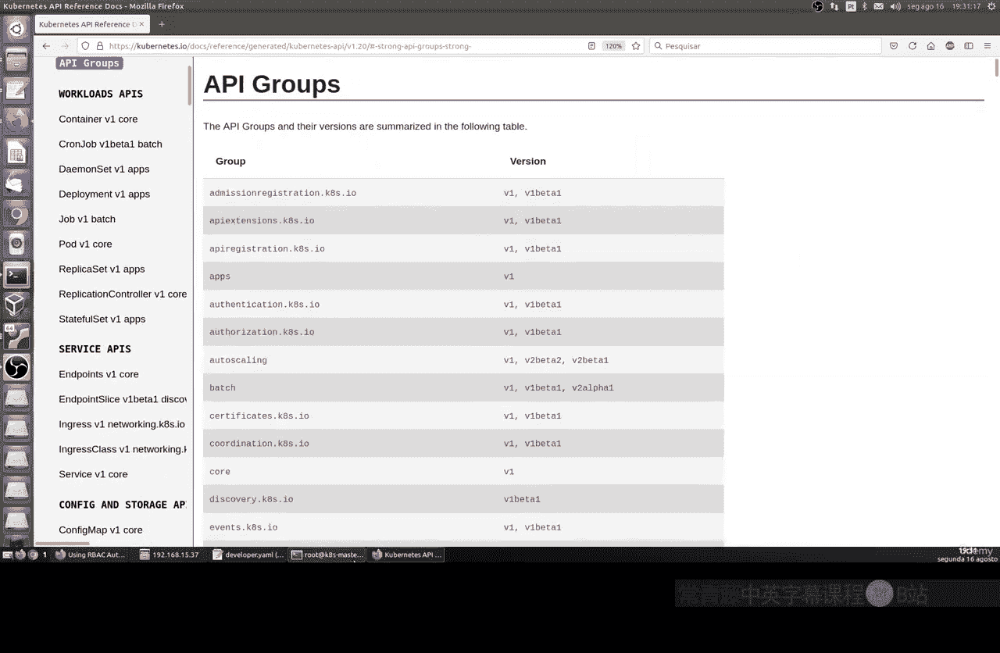

**代码解释：**
这个角色配置允许主体查看（`get`）和列出（`list`）所有 API 组中的所有资源，但不能进行创建、更新或删除等操作。这适用于只需要监控和管理视图，而不需要修改权限的用户。

应用这个角色：
```bash
kubectl apply -f developer-readonly.yaml
```

再次列出 `project1` 命名空间中的角色，可以看到新创建的 `developer-readonly`。使用 `describe` 命令可以确认其权限仅限于 `get` 和 `list`。

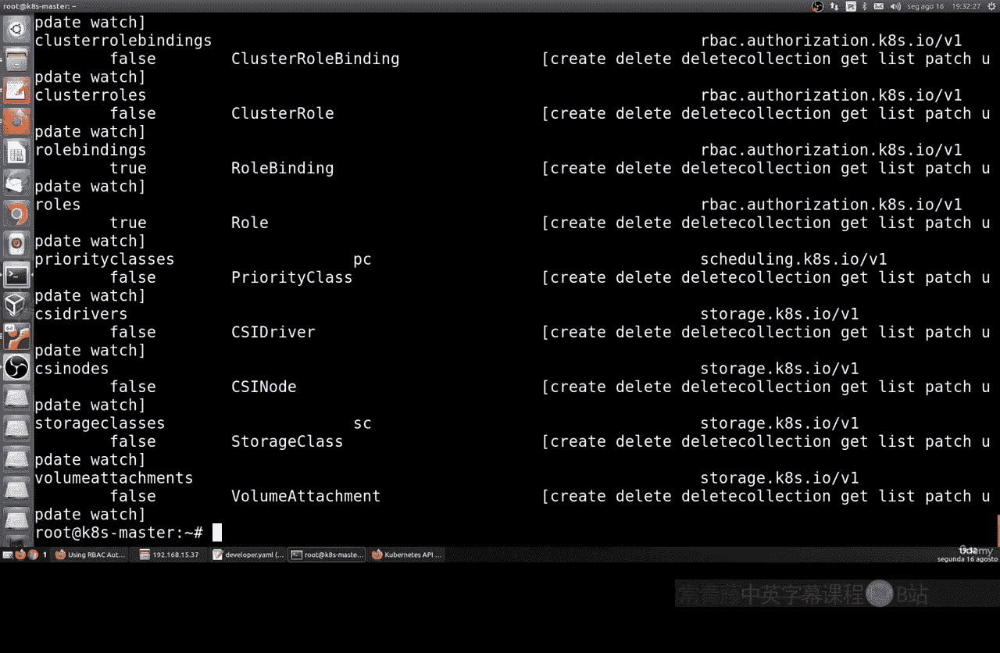

---

## 创建管理员角色

最后，我们创建一个拥有更广泛权限的管理员角色。首先，创建一个超级用户角色，仅限于 `project1` 命名空间。

文件 `developer-admin.yaml` 内容如下：
```yaml
apiVersion: rbac.authorization.k8s.io/v1
kind: Role
metadata:
  name: developer-admin
  namespace: project1
rules:
- apiGroups: ["*"]
  resources: ["*"]
  verbs: ["*"]
```

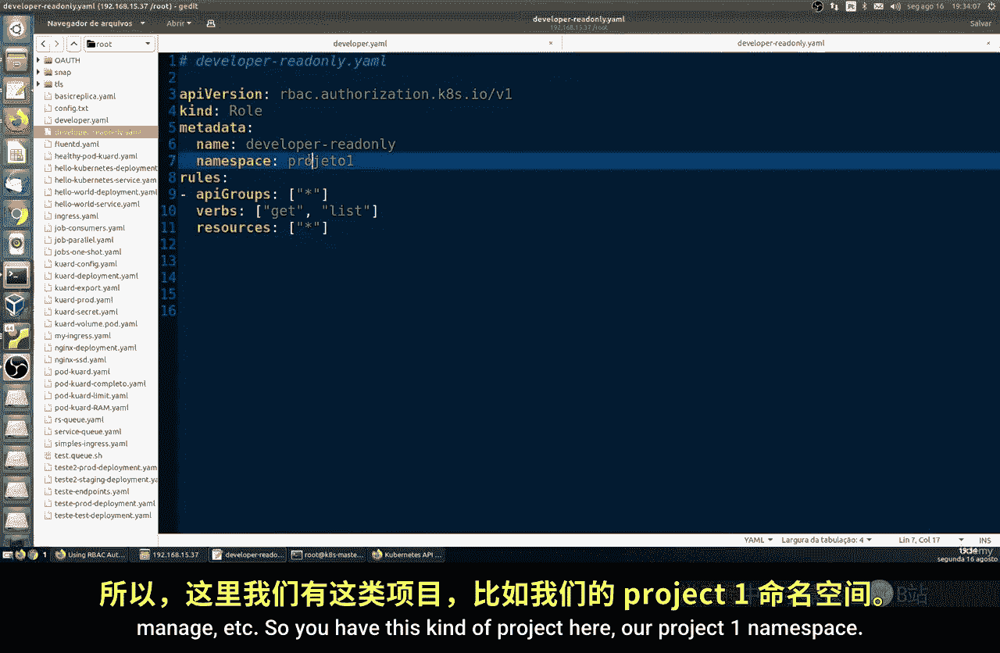

**代码解释：**
`verbs: ["*"]` 表示允许所有操作，这赋予了该角色在 `project1` 命名空间内的超级用户权限。

为了展示跨命名空间管理，我们再创建一个可以管理两个不同项目的管理员角色。

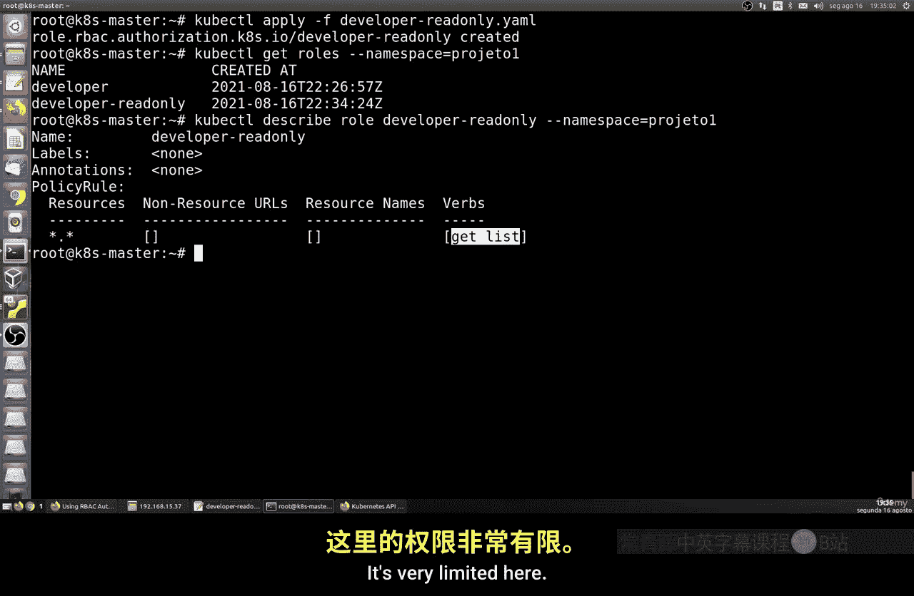

创建另一个文件 `developer-admin-multi.yaml`：
```yaml
apiVersion: rbac.authorization.k8s.io/v1
kind: Role
metadata:
  name: developer-admin
  namespace: project2
rules:
- apiGroups: ["*"]
  resources: ["*"]
  verbs: ["*"]
```

**代码解释：**
这个角色与上一个名称相同，但作用于 `project2` 命名空间。这演示了同一个角色名称可以在不同的命名空间中独立存在并拥有不同的绑定。

在应用之前，需要创建第二个命名空间：
```bash
kubectl create namespace project2
kubectl apply -f developer-admin.yaml -f developer-admin-multi.yaml
```

现在，可以分别查看两个命名空间中的角色：
```bash
kubectl get roles -n project1
kubectl get roles -n project2
```
使用 `describe` 命令查看详情，会发现在 `project1` 和 `project2` 中，`developer-admin` 角色都拥有无限制的权限。

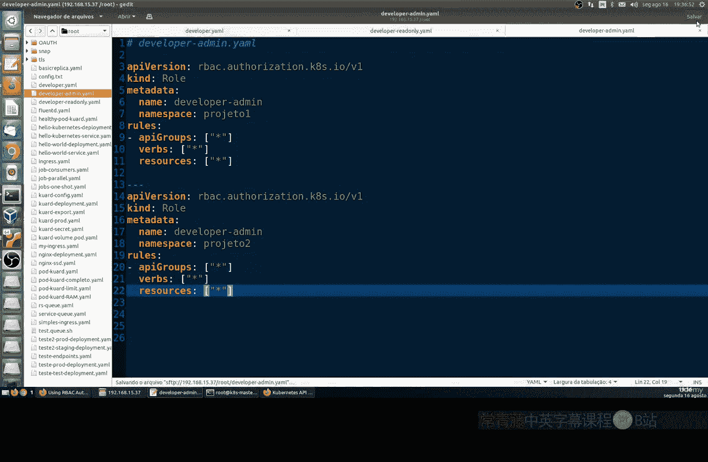

---

## 重要提示

请注意，到目前为止，我们只是创建了角色（即权限配置文件），但**还没有将这些角色关联到任何用户**。角色本身只是一个权限集合的模板。在接下来的课程中，我们将学习如何通过 `RoleBinding` 将创建好的角色绑定到特定的用户或服务账户，从而真正赋予他们相应的权限。

---

## 总结

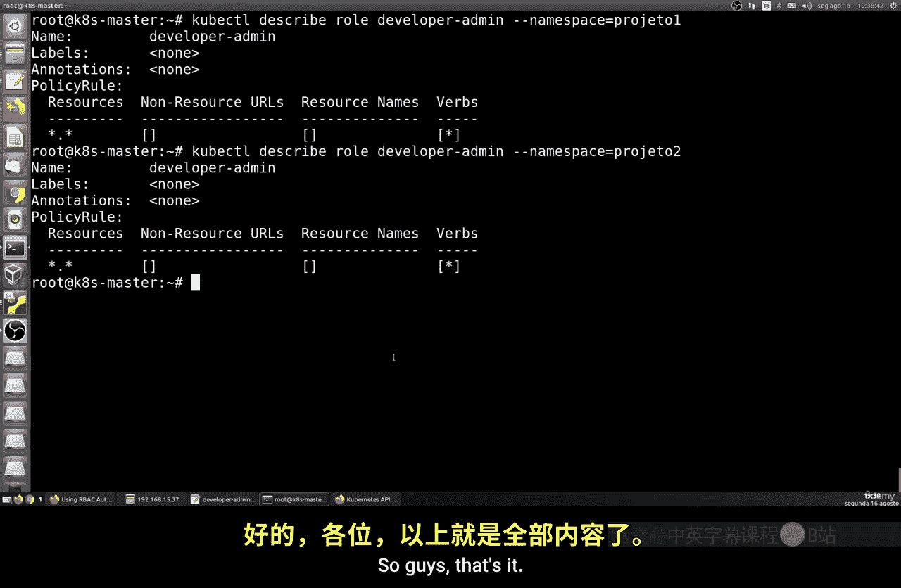

本节课中我们一起学习了 Kubernetes RBAC 的核心概念。我们了解了主体、资源和操作的含义，并动手实践了如何创建三种不同类型的角色：一个具有多项操作权限的开发者角色、一个仅能查看的只读角色，以及拥有完全控制权的管理员角色。我们还学会了如何为角色指定命名空间范围。记住，角色创建后需要绑定到用户才能生效，这是我们下节课将要学习的内容。

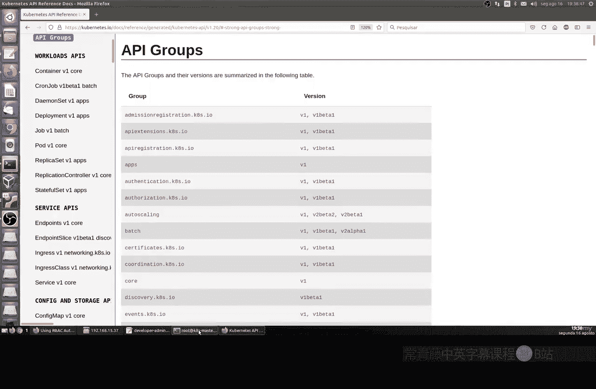

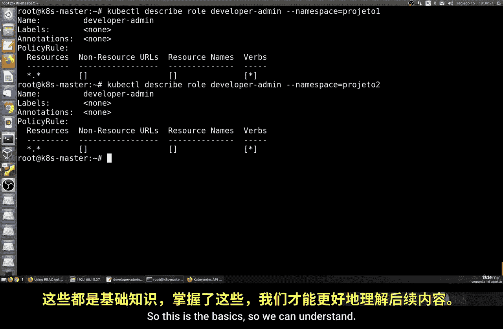

建议多查阅 [Kubernetes 官方文档](https://kubernetes.io/docs/reference/access-authn-authz/rbac/) 以深入了解各种资源类型和角色配置，从而构建更精细的访问控制策略。