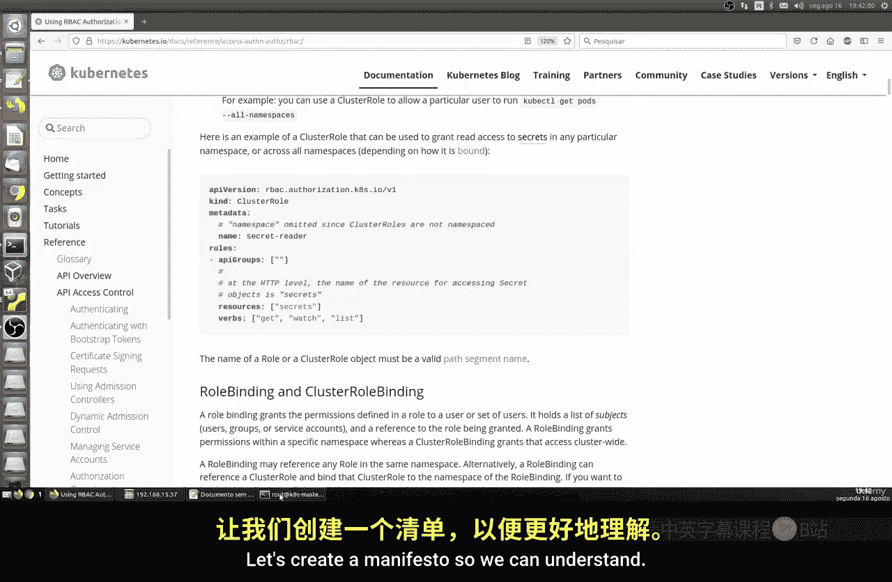
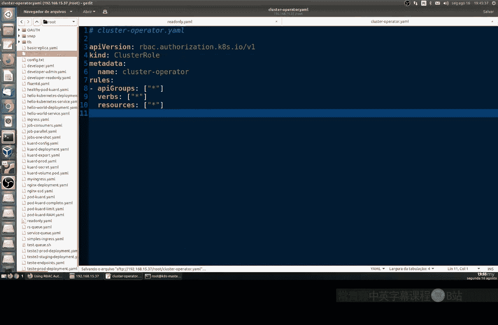
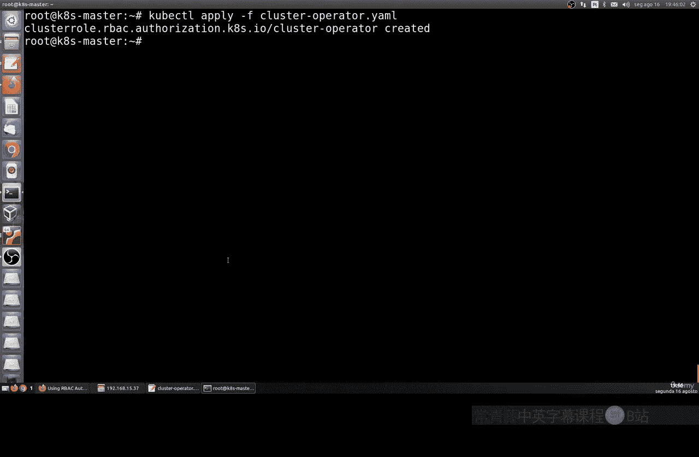
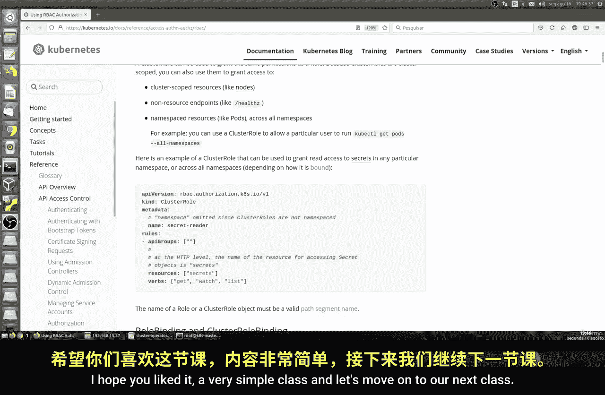

# 016：ClusterRoles 🧩

在本节课中，我们将要学习 Kubernetes 中的 ClusterRole 概念。上一节我们介绍了 Role，它用于在特定命名空间内授予权限。本节中我们来看看 ClusterRole，它是一种作用于整个集群范围的权限集合。

## 概述

ClusterRole 与 Role 类似，都是定义一组权限规则。核心区别在于，ClusterRole 是集群级别的资源，其权限可以应用于集群中的所有命名空间，而 Role 的权限仅限于单个命名空间。当您需要为某个用户或服务账户授予跨多个命名空间的访问权限时，ClusterRole 非常有用。

## 创建只读 ClusterRole



以下是创建一个基础只读 ClusterRole 的步骤。这个角色将允许绑定它的主体（如用户）读取和列出集群中任何命名空间内的任何资源类型。

首先，我们创建一个名为 `read-only` 的清单文件。请注意，由于是 ClusterRole，其定义中不包含 `namespace` 字段。

```yaml
apiVersion: rbac.authorization.k8s.io/v1
kind: ClusterRole
metadata:
  name: read-only
rules:
- apiGroups: ["*"]
  resources: ["*"]
  verbs: ["get", "list", "watch"]
```

**代码解释**：
*   `kind: ClusterRole`：指定资源类型为集群角色。
*   在 `rules` 部分，我们定义了权限规则：
    *   `apiGroups: ["*"]`：规则适用于所有 API 组。
    *   `resources: ["*"]`：规则适用于所有资源类型。
    *   `verbs: ["get", "list", "watch"]`：允许的操作是读取、列出和监视，这些都是只读操作。

这个配置文件创建了一个通用的“只读”权限模板，它本身不会生效，需要后续通过 ClusterRoleBinding 绑定到具体的用户或服务账户。

## 创建集群操作员 ClusterRole

接下来，我们创建一个权限更高的 ClusterRole，例如用于集群操作员。这个角色需要拥有对所有资源的完全访问权限。

我们创建另一个名为 `cluster-operator` 的清单文件。

```yaml
apiVersion: rbac.authorization.k8s.io/v1
kind: ClusterRole
metadata:
  name: cluster-operator
rules:
- apiGroups: ["*"]
  resources: ["*"]
  verbs: ["*"]
```

**代码解释**：
*   此配置与只读角色结构相同。
*   关键区别在于 `verbs: ["*"]`，这里的星号 (`*`) 通配符表示允许所有操作（如 create, delete, update 等）。
*   这创建了一个拥有集群范围完全控制权的权限模板。

再次强调，目前我们只是定义了权限模板（ClusterRole），还没有将其授予任何具体的用户（例如上一节课创建的 `vitor` 用户）。应用权限需要通过 `ClusterRoleBinding` 来完成，这将是下一节课的内容。

## 应用 ClusterRole

创建好清单文件后，使用 `kubectl apply` 命令将其应用到集群。

对于只读角色：
```bash
kubectl apply -f read-only.yaml
```

对于集群操作员角色：
```bash
kubectl apply -f cluster-operator.yaml
```

执行命令后，您就成功在集群中创建了这两个 ClusterRole 对象。



## 查看官方文档示例

为了加深理解，您可以参考 Kubernetes 官方文档。文档中可能包含更具体的示例，例如创建一个仅能读取 `secrets` 资源的 ClusterRole：



```yaml
apiVersion: rbac.authorization.k8s.io/v1
kind: ClusterRole
metadata:
  name: secret-reader
rules:
- apiGroups: [""]
  resources: ["secrets"]
  verbs: ["get", "watch", "list"]
```

**公式/概念强调**：
*   **Role**：权限范围 = 单个命名空间。
*   **ClusterRole**：权限范围 = 整个集群。

通过对比这些示例，您可以更清晰地理解如何根据实际需求，精细地定义不同范围的权限模板。

## 总结

本节课中我们一起学习了 Kubernetes RBAC 中的 ClusterRole。
*   我们了解了 ClusterRole 是**集群级别**的权限定义集合。
*   我们实践了如何创建两个 ClusterRole：一个拥有只读权限 (`read-only`)，另一个拥有完全操作权限 (`cluster-operator`)。
*   我们明确了 ClusterRole **本身只是一个权限模板**，需要通过 `ClusterRoleBinding` 绑定到用户、组或服务账户后才能生效。



下一节课，我们将学习如何使用 RoleBinding 和 ClusterRoleBinding 将这些定义好的角色权限实际授予给主体。