# 018：单例模式与持久化存储实践 🚀

在本节课中，我们将学习一个在 Kubernetes 中被广泛使用的概念——单例模式。我们将了解它的定义、用途，并通过一个 MySQL 数据库的实例，学习如何在 Kubernetes 中创建单例应用，并配合持久化存储来确保数据安全。

---

## 概述

单例模式是一种设计模式，它保证一个类只有一个实例，并提供一个全局访问点来获取该实例。在 Kubernetes 中，虽然默认行为通常是运行应用的多个副本以确保高可用性，但某些应用（如特定的日志系统或需要顺序处理消息的应用）只需要一个实例运行。本节课，我们将通过部署一个 MySQL 单例应用，来实践这一模式，并学习如何使用持久卷来保护数据。

---

## 创建持久卷

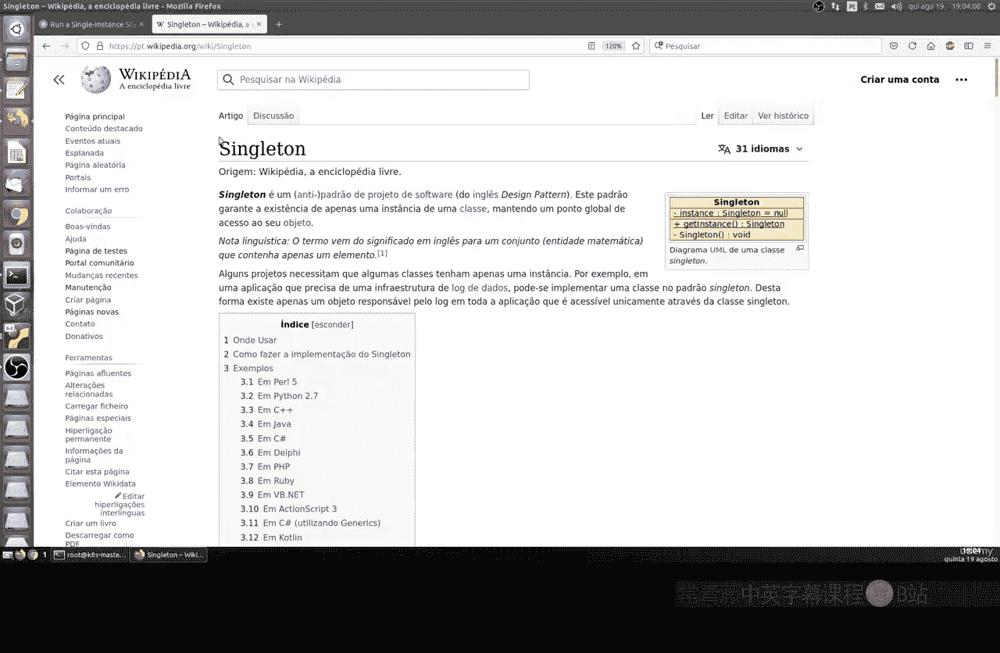

上一节我们介绍了单例模式的概念，本节中我们来看看如何为单例应用配置存储。首先，我们需要创建一个持久卷。持久卷是集群中的一块静态存储，即使 Pod 被删除，数据也不会丢失。

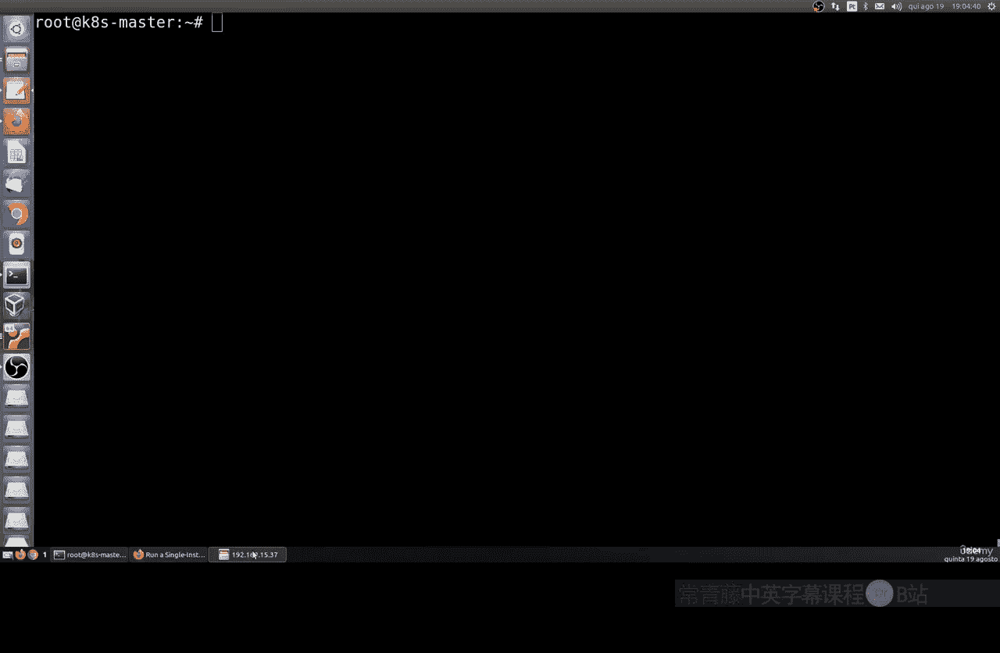

以下是创建持久卷的步骤：

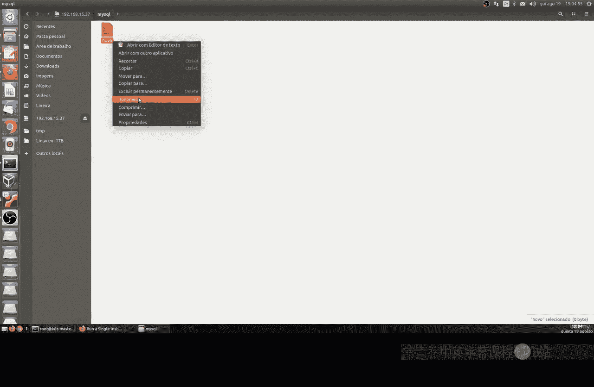

1.  在服务器上创建一个用于存储的目录。
2.  编写一个持久卷的配置文件。
3.  使用 `kubectl apply` 命令应用该配置。

配置文件 `mysql-pv.yaml` 的内容如下：

```yaml
apiVersion: v1
kind: PersistentVolume
metadata:
  name: mysql-pv
spec:
  capacity:
    storage: 1Gi
  accessModes:
    - ReadWriteOnce
  hostPath:
    path: "/mnt/data"
```

在这个配置中：
*   `capacity.storage: 1Gi` 定义了存储容量为 1GB。
*   `accessModes: ReadWriteOnce` 表示这个卷只能被一个节点以读写模式挂载，这正符合单例模式的需求。
*   `hostPath.path` 指定了数据在宿主机上存储的路径。

应用配置：
```bash
kubectl apply -f mysql-pv.yaml
```

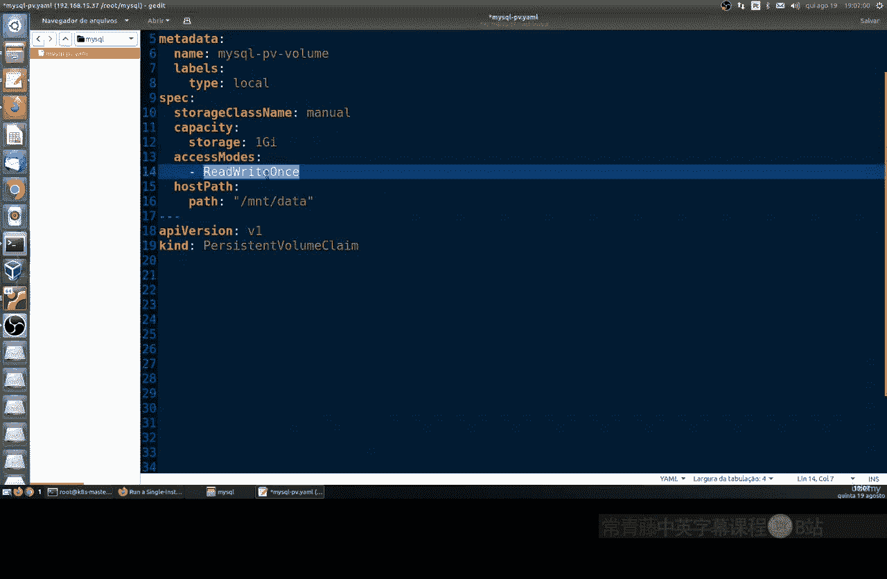

---

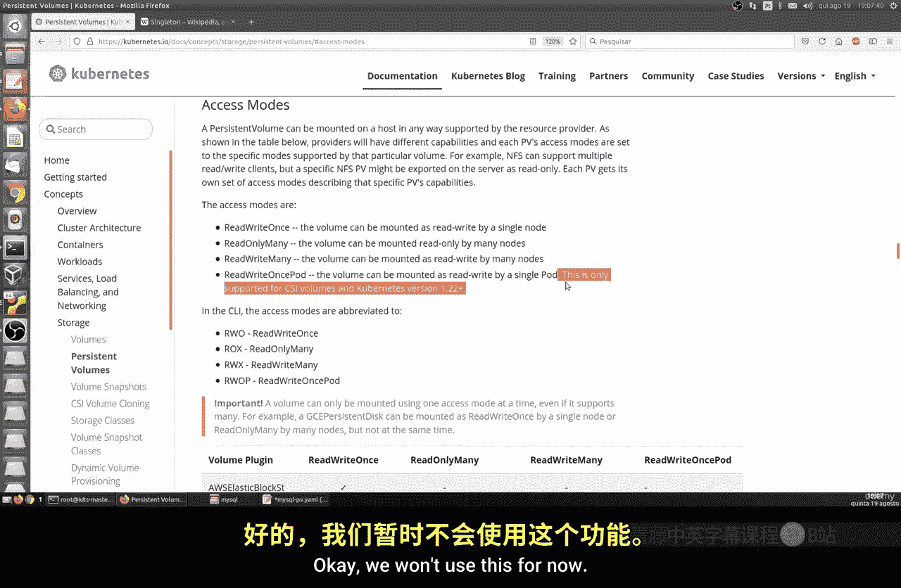

## 创建持久卷声明

持久卷声明是 Pod 对存储的请求。它像一个“接口”，将 Pod 与具体的持久卷连接起来，使存储配置与 Pod 定义分离。

以下是持久卷声明的配置文件 `mysql-pvc.yaml`：

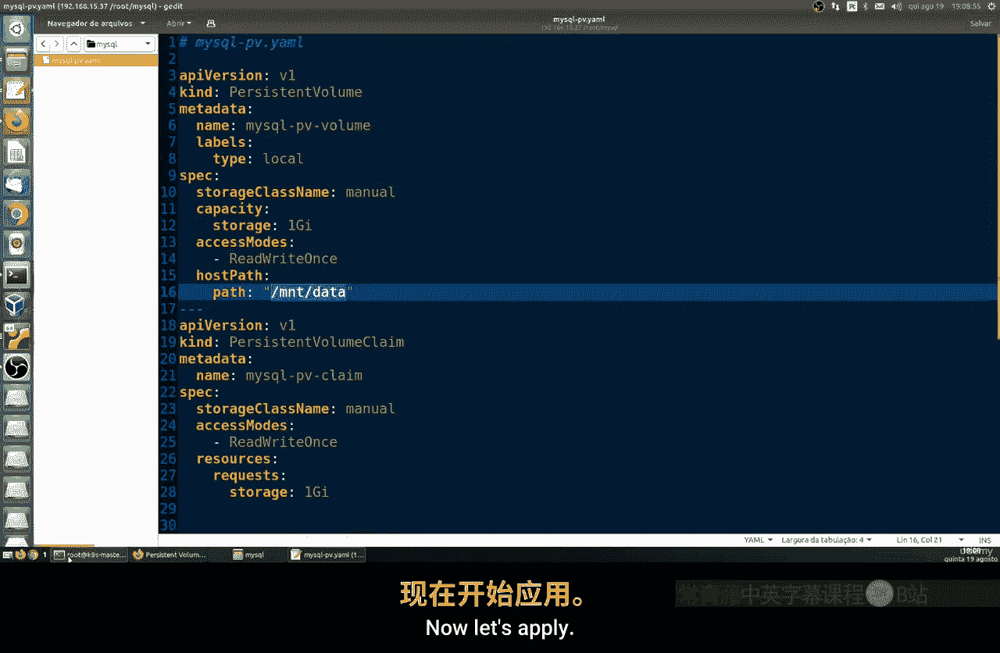

```yaml
apiVersion: v1
kind: PersistentVolumeClaim
metadata:
  name: mysql-pvc
spec:
  accessModes:
    - ReadWriteOnce
  resources:
    requests:
      storage: 1Gi
```

应用配置：
```bash
kubectl apply -f mysql-pvc.yaml
```

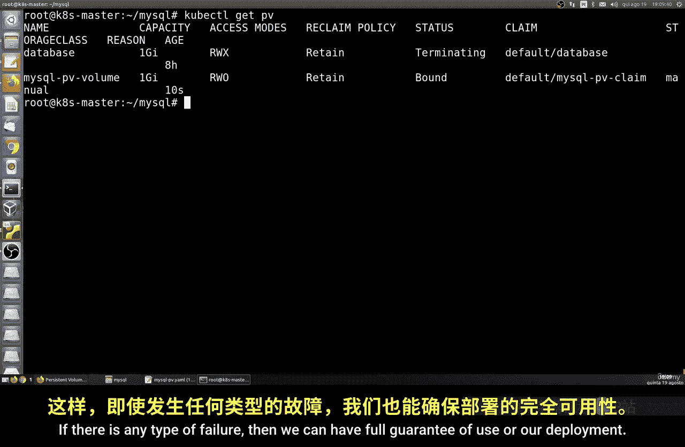

---

## 部署 MySQL 单例应用

现在，我们将部署 MySQL 应用本身。我们将创建一个 Deployment，但将其副本数设置为 1，并挂载上一步创建的持久卷声明，从而实现一个带持久化存储的单例数据库。

以下是 MySQL 部署的配置文件 `mysql-deployment.yaml`：

```yaml
apiVersion: apps/v1
kind: Deployment
metadata:
  name: mysql-deployment
spec:
  replicas: 1
  selector:
    matchLabels:
      app: mysql
  strategy:
    type: Recreate
  template:
    metadata:
      labels:
        app: mysql
    spec:
      containers:
      - name: mysql
        image: mysql:5.6
        env:
        - name: MYSQL_ROOT_PASSWORD
          value: "yourpassword"
        ports:
        - containerPort: 3306
        volumeMounts:
        - name: mysql-storage
          mountPath: /var/lib/mysql
      volumes:
      - name: mysql-storage
        persistentVolumeClaim:
          claimName: mysql-pvc
---
apiVersion: v1
kind: Service
metadata:
  name: mysql-service
spec:
  type: NodePort
  ports:
  - port: 3306
    nodePort: 30330
  selector:
    app: mysql
```


在这个配置中：
*   `replicas: 1` 确保了只运行一个 Pod 实例。
*   `strategy.type: Recreate` 指定更新策略为“重新创建”，这更适合单例有状态应用。
*   `volumeMounts` 将名为 `mysql-storage` 的卷挂载到容器内的 `/var/lib/mysql` 路径，这是 MySQL 默认的数据目录。
*   `volumes` 部分引用了我们之前创建的持久卷声明 `mysql-pvc`。
*   `Service` 部分创建了一个 NodePort 类型的服务，将集群内的 3306 端口映射到宿主机的 30330 端口，以便外部访问。

应用部署和服务：
```bash
kubectl apply -f mysql-deployment.yaml
```

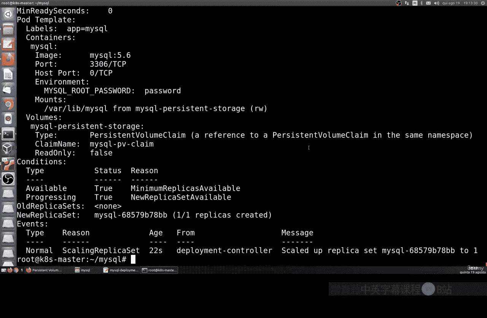

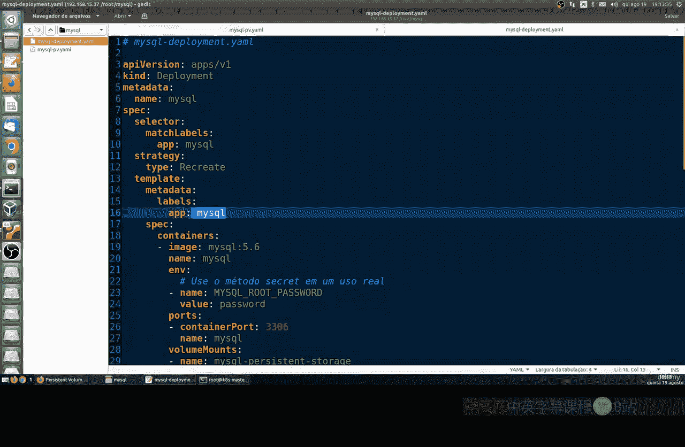

---

## 验证与测试

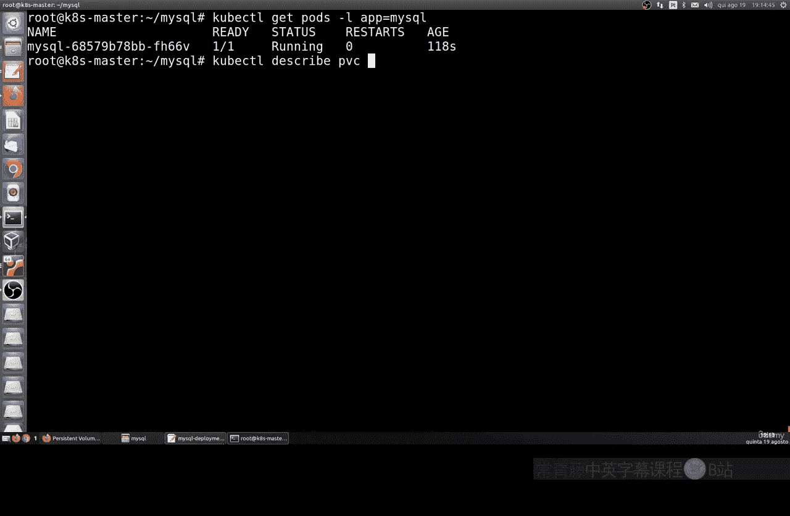

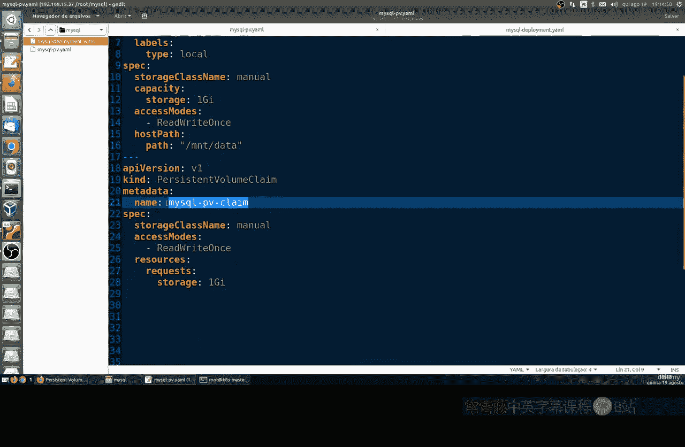

部署完成后，我们需要验证应用是否正常运行，并测试持久化存储的效果。

1.  **检查 Pod 状态**：
    ```bash
    kubectl get pods -l app=mysql
    ```
    应该能看到一个状态为 `Running` 的 MySQL Pod。

2.  **访问 MySQL 数据库**：
    我们可以使用 `kubectl exec` 命令进入 Pod 并连接数据库。
    ```bash
    kubectl exec -it <mysql-pod-name> -- mysql -uroot -p
    ```
    输入密码后，可以执行 SQL 命令，例如创建一个测试数据库：
    ```sql
    CREATE DATABASE test;
    ```

3.  **测试数据持久性**：
    这是最关键的一步。我们模拟一个故障场景：删除整个 Deployment。
    ```bash
    kubectl delete deployment mysql-deployment
    kubectl delete service mysql-service
    ```
    此时，Pod 被删除，但持久卷和声明还在。我们重新应用部署文件：
    ```bash
    kubectl apply -f mysql-deployment.yaml
    ```
    等待新的 Pod 启动后，再次进入数据库查看：
    ```sql
    SHOW DATABASES;
    ```
    你会发现之前创建的 `test` 数据库依然存在，数据没有丢失。这是因为数据被安全地保存在宿主机的 `/mnt/data` 目录下，不受 Pod 生命周期的影响。

---

## 总结

本节课中我们一起学习了 Kubernetes 中的单例模式及其应用。我们通过一个完整的例子，演示了如何：
1.  使用 `PersistentVolume` 和 `PersistentVolumeClaim` 为有状态应用配置持久化存储。
2.  创建 `Deployment` 并将副本数设为 1 来部署一个单例应用。
3.  验证了持久化存储如何保证在 Pod 被删除并重建后，应用数据不会丢失。

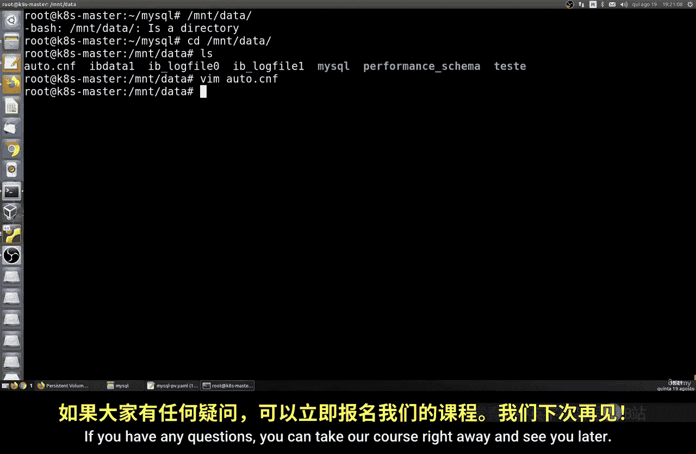

这种模式对于数据库、消息队列消费者等需要唯一实例或稳定存储的应用场景非常有用。记住，合理使用单例和持久化存储是构建可靠 Kubernetes 应用的关键一步。