# 019：StatefulSets详解与MongoDB集群部署 🚀

在本节课中，我们将学习Kubernetes中的StatefulSets概念。StatefulSets是一种用于管理有状态应用的工作负载API对象。我们将了解它与ReplicaSets的区别，并通过一个具体的MongoDB集群部署示例，来掌握如何创建和使用StatefulSets。

## 什么是StatefulSets？ 🤔

StatefulSets是Kubernetes中用于管理有状态应用的工作负载API对象。它用于管理一组Pod的部署和扩缩容，并保证这些Pod的顺序性和唯一性。这是StatefulSets与ReplicaSets或普通Deployment的主要区别。

简单来说，StatefulSets可以基于相同的容器规范来管理Pod，但为每个Pod维护一个固定的、唯一的身份标识。这是其核心特性。


## StatefulSets的核心特性与适用场景 🎯

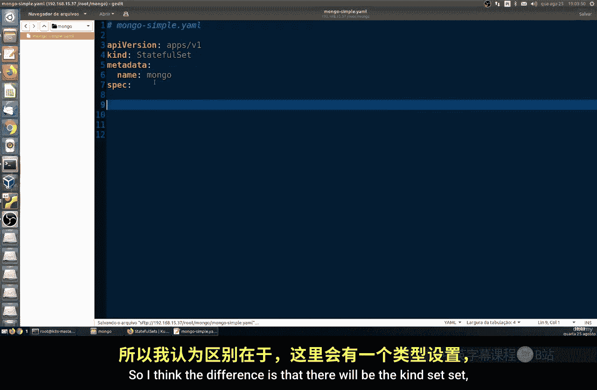

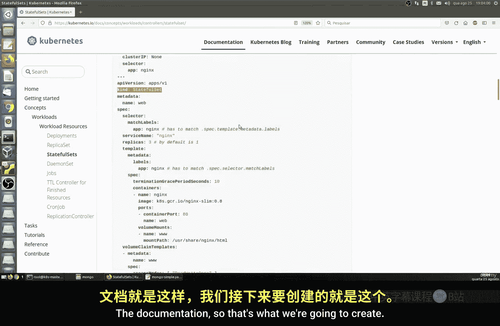

上一节我们介绍了StatefulSets的基本概念，本节中我们来看看它的核心特性和典型应用场景。

StatefulSets具有以下主要特性：
*   **唯一身份标识**：每个Pod拥有一个持久、唯一的标识符（如 `mongo-0`, `mongo-1`）。
*   **顺序部署/扩缩容**：Pod按顺序（从0到N-1）创建和终止。
*   **稳定的网络标识**：每个Pod拥有稳定的DNS主机名，格式为：`<statefulset-name>-<ordinal>.<service-name>.<namespace>.svc.cluster.local`。
*   **持久化存储**：可以与PersistentVolumes配合使用，为每个Pod提供独立的持久化存储。

由于其特性，StatefulSets非常适合运行需要稳定网络标识和持久化存储的应用，例如：
*   **数据库**：如MongoDB、PostgreSQL、MySQL等。
*   **分布式系统**：如ZooKeeper、etcd、Elasticsearch等。

## 创建MongoDB StatefulSet 🛠️

理解了StatefulSets的特性后，现在我们来动手创建一个MongoDB的StatefulSet。我们将创建三个MongoDB副本，为后续构建集群做准备。

以下是创建StatefulSet的YAML清单文件核心部分：

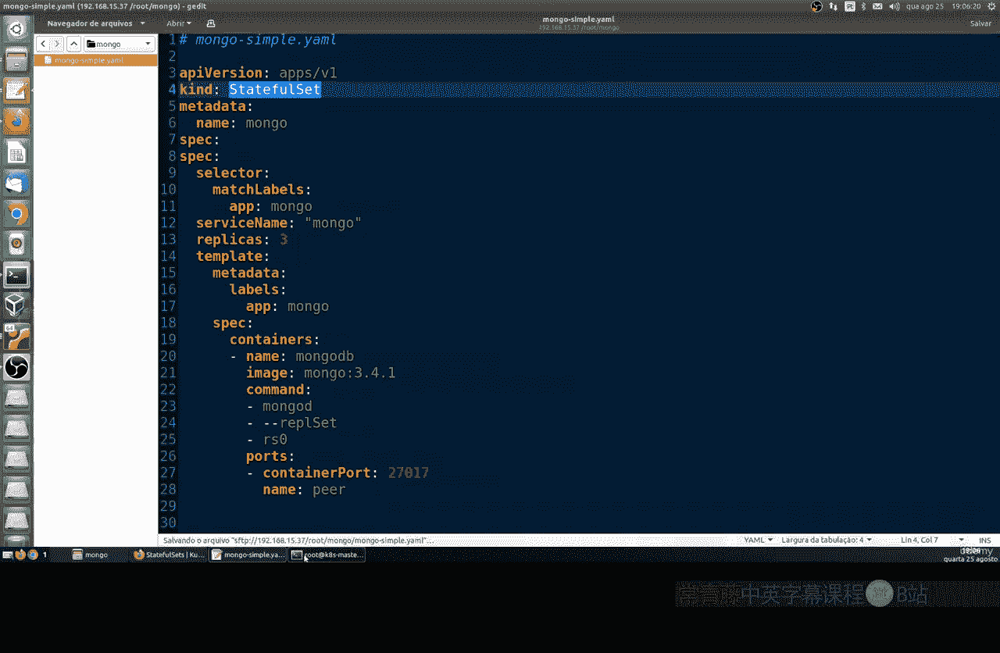

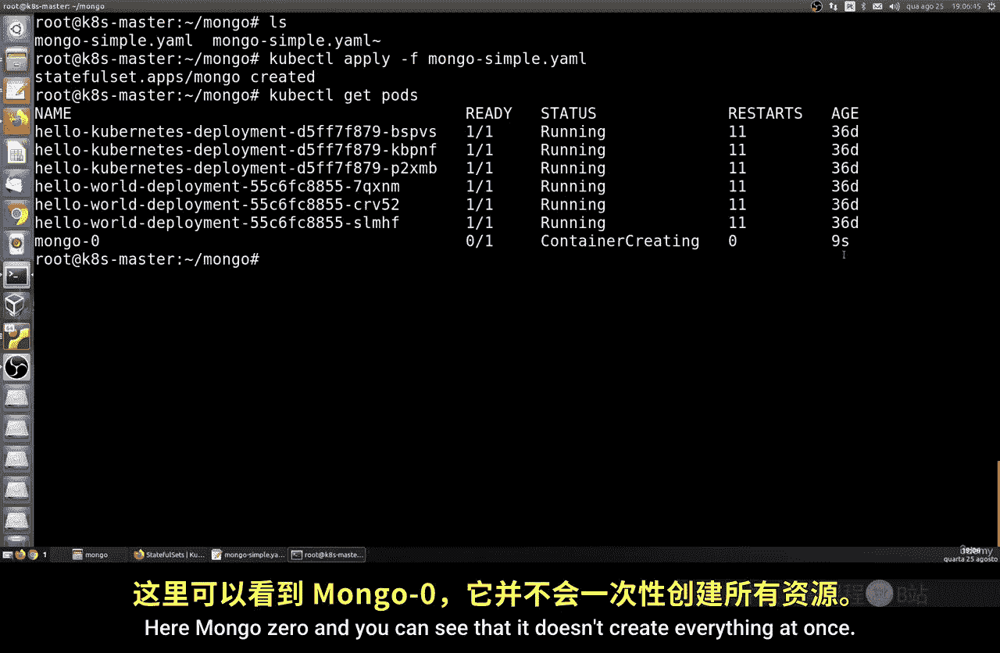

```yaml
apiVersion: apps/v1
kind: StatefulSet
metadata:
  name: mongo
spec:
  serviceName: "mongo"
  replicas: 3
  selector:
    matchLabels:
      app: mongo
  template:
    metadata:
      labels:
        app: mongo
    spec:
      containers:
      - name: mongo
        image: mongo
        command:
        - mongod
        - "--replSet"
        - rs0
        - "--bind_ip_all"
        ports:
        - containerPort: 27017
```

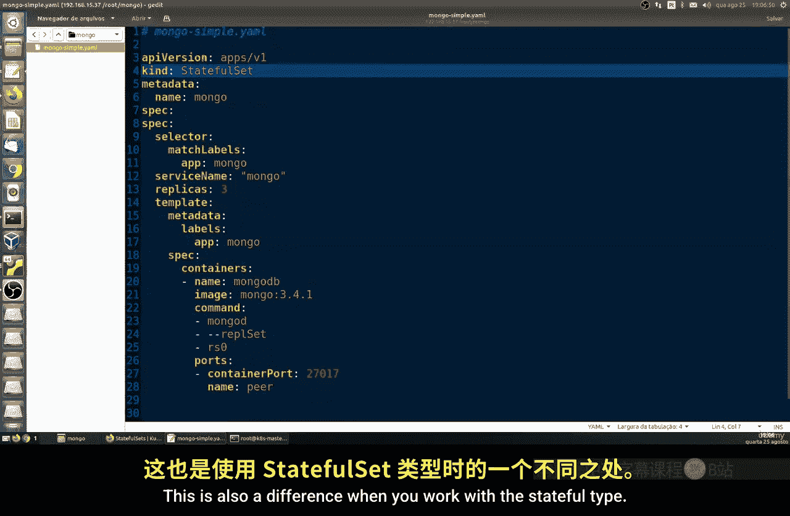

**关键配置说明：**
*   `kind: StatefulSet`： 定义资源类型为StatefulSet。
*   `replicas: 3`： 指定需要创建3个Pod副本。
*   `command`: 指定容器启动命令，这里配置MongoDB以副本集模式启动，副本集名称为 `rs0`。
*   `serviceName: "mongo"`： 关联一个无头服务（Headless Service），这是StatefulSet能够为每个Pod提供独立DNS记录的关键。

使用 `kubectl apply -f mongo-statefulset.yaml` 命令应用此清单。创建过程是顺序的，你会依次看到 `mongo-0`、`mongo-1`、`mongo-2` 被创建并运行。

## 创建Service以暴露Pod 🌐


为了让StatefulSet中的Pod能够通过DNS相互发现，我们需要创建一个无头服务。

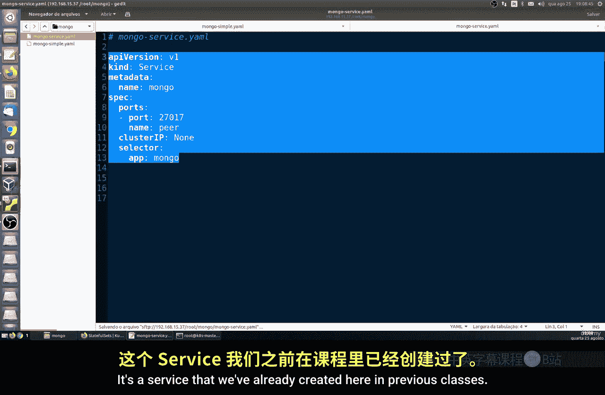

以下是Service的YAML清单：

```yaml
apiVersion: v1
kind: Service
metadata:
  name: mongo
spec:
  clusterIP: None # 这是一个无头服务
  selector:
    app: mongo
  ports:
  - port: 27017
    targetPort: 27017
```

应用此服务后，每个Pod将获得一个稳定的DNS条目，例如：
*   `mongo-0.mongo.default.svc.cluster.local`
*   `mongo-1.mongo.default.svc.cluster.local`
*   `mongo-2.mongo.default.svc.cluster.local`

我们可以使用一个临时Pod来测试网络连通性：
```bash
kubectl run busybox --image=busybox --restart=Never --rm -it -- sh
# 在busybox容器内执行
ping mongo-0.mongo
```

## 配置MongoDB副本集 🔗

现在，我们的三个MongoDB Pod已经运行并可以通过DNS访问。接下来，我们需要将它们配置成一个MongoDB副本集。

首先，进入第一个Pod（`mongo-0`）的shell：
```bash
kubectl exec -it mongo-0 -- mongosh
```

在MongoDB shell中，执行以下命令初始化副本集：
```javascript
rs.initiate({
  _id: "rs0",
  members: [
    { _id: 0, host: "mongo-0.mongo:27017" },
    { _id: 1, host: "mongo-1.mongo:27017" },
    { _id: 2, host: "mongo-2.mongo:27017" }
  ]
})
```

执行 `rs.status()` 可以查看副本集的状态，确认所有成员都已正常加入。

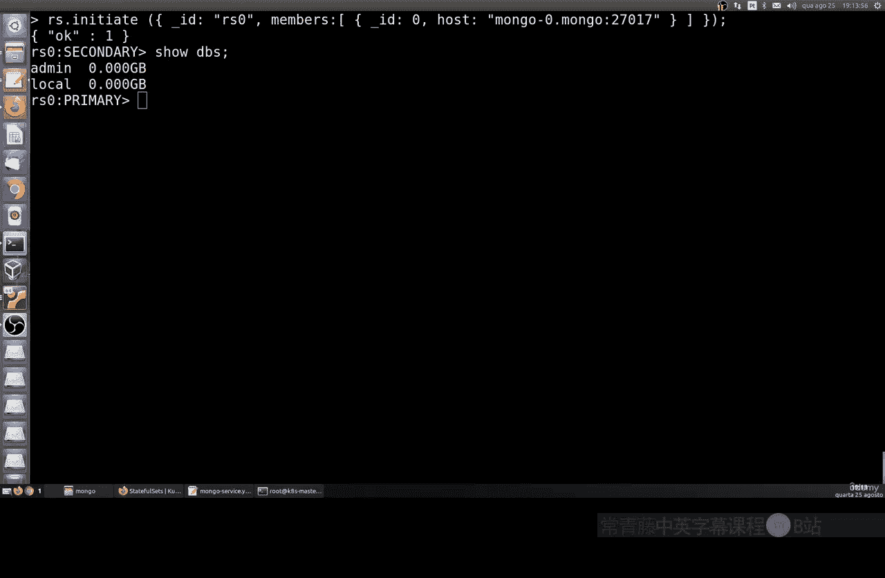

## 使用ConfigMap自动化初始化 📝

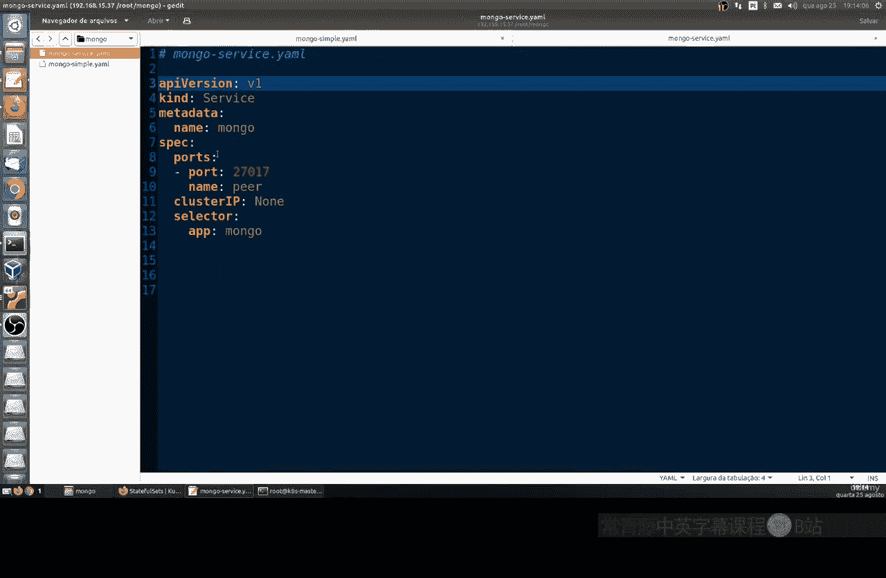

手动初始化副本集在测试时可行，但在生产环境中，我们更希望这个过程能自动化。我们可以使用ConfigMap来存储一个初始化脚本。

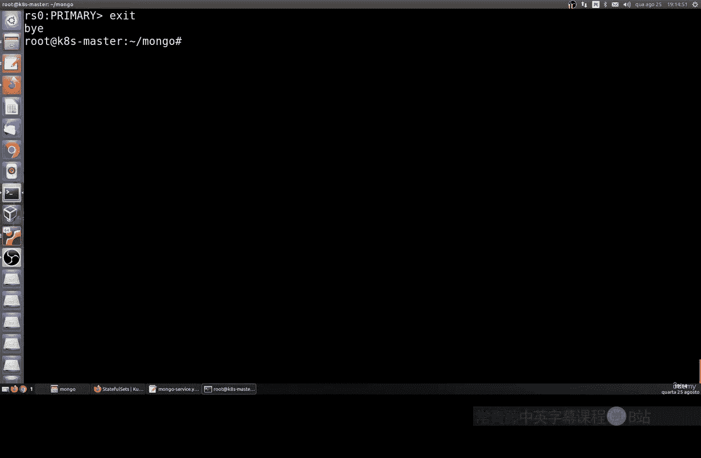

以下是ConfigMap的YAML清单示例，它包含一个用于检查和初始化副本集的Shell脚本：

```yaml
apiVersion: v1
kind: ConfigMap
metadata:
  name: mongo-init-script
data:
  init.sh: |
    #!/bin/bash
    # 等待所有Pod就绪
    until ping -c1 mongo-0.mongo &>/dev/null && \
          ping -c1 mongo-1.mongo &>/dev/null && \
          ping -c1 mongo-2.mongo &>/dev/null; do
      sleep 2
    done
    # 连接到mongo-0并初始化副本集
    mongosh --host mongo-0.mongo:27017 --eval "
      if (!rs.status().ok) {
        rs.initiate({
          _id: 'rs0',
          members: [
            {_id:0, host:'mongo-0.mongo:27017'},
            {_id:1, host:'mongo-1.mongo:27017'},
            {_id:2, host:'mongo-2.mongo:27017'}
          ]
        })
      }
    "
```

然后，你可以在StatefulSet的Pod模板中，将这个ConfigMap挂载为卷，并在容器的启动命令或生命周期钩子中执行这个脚本，从而实现副本集的自动初始化。

## 总结 📚

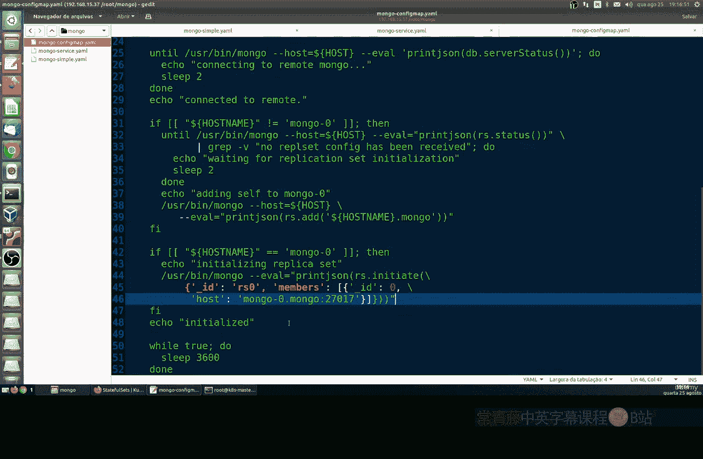

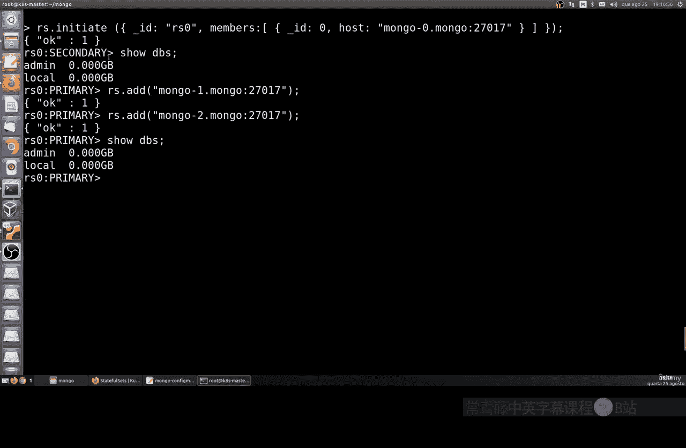

本节课中我们一起学习了Kubernetes StatefulSets的核心知识。我们了解到StatefulSets是为有状态应用设计的，它通过为每个Pod提供稳定的唯一标识符、顺序性保证以及稳定的网络身份，完美支持了像MongoDB这类数据库的集群化部署。

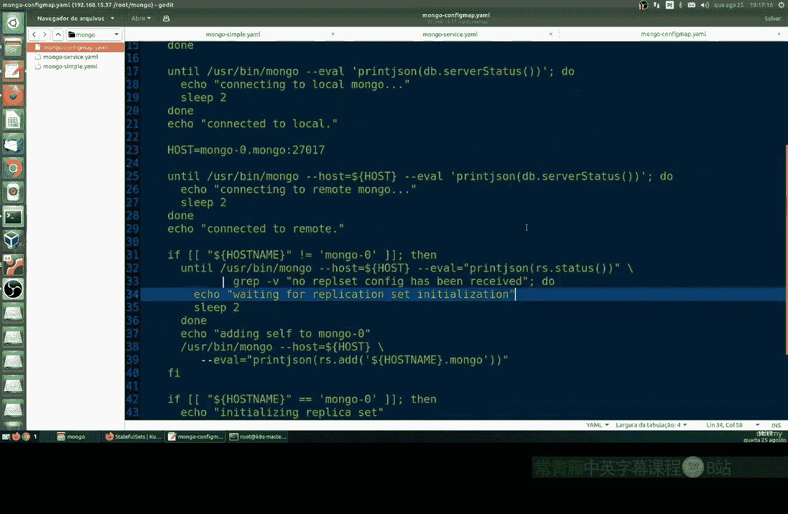

我们通过一个完整的示例，实践了如何：
1.  定义和创建StatefulSet。
2.  创建无头服务为Pod提供DNS发现。
3.  手动配置MongoDB副本集。
4.  引入ConfigMap来实现初始化过程的自动化。

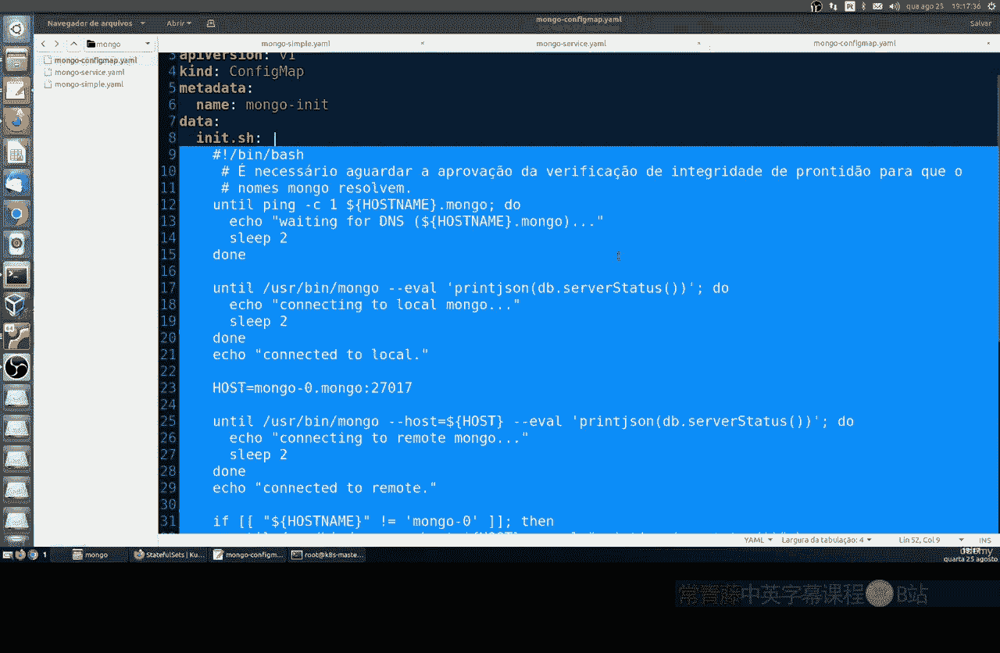

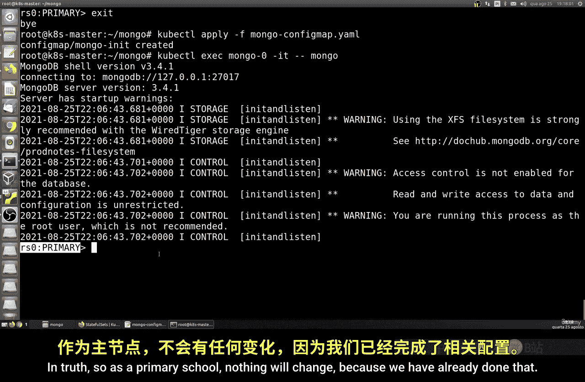

StatefulSets是运行有状态服务的关键组件，掌握它对于在Kubernetes上部署数据库、消息队列等复杂应用至关重要。