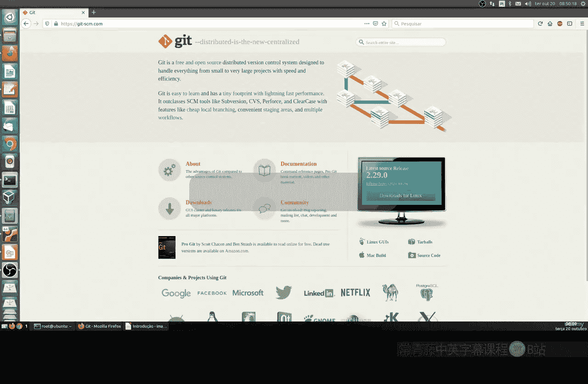
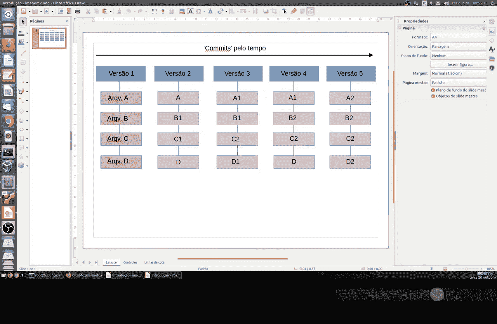
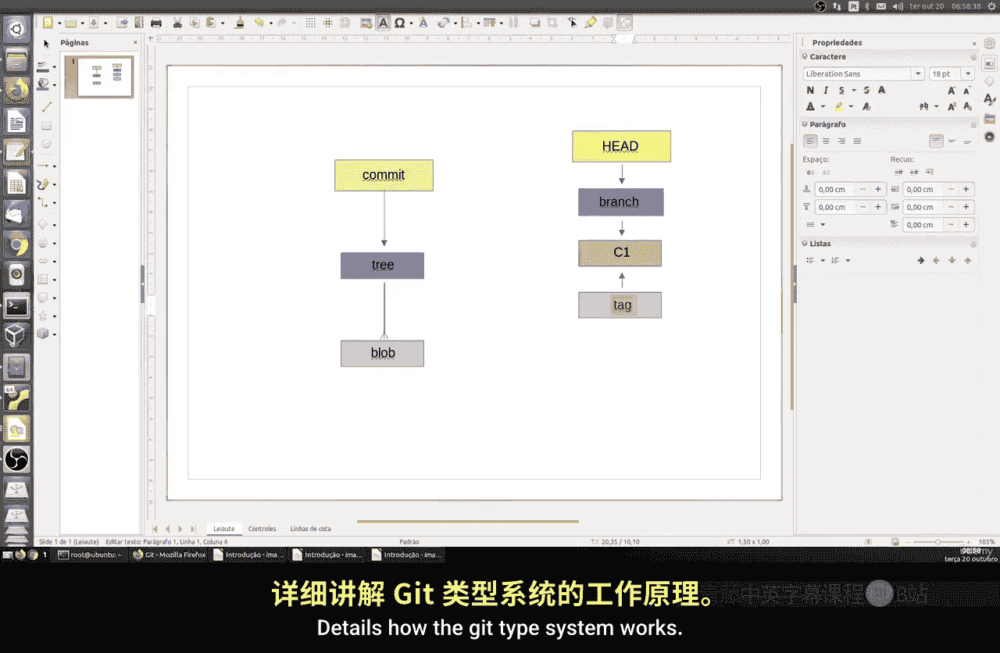
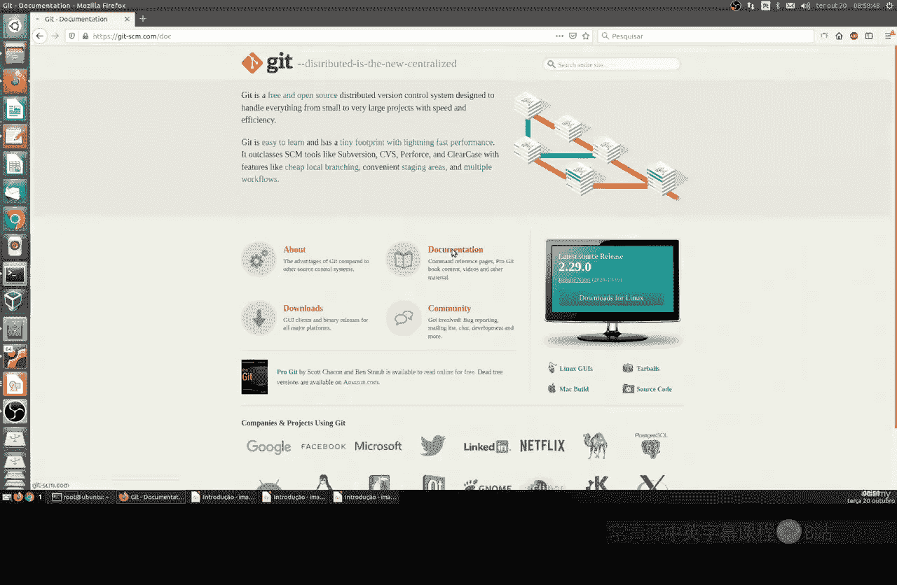
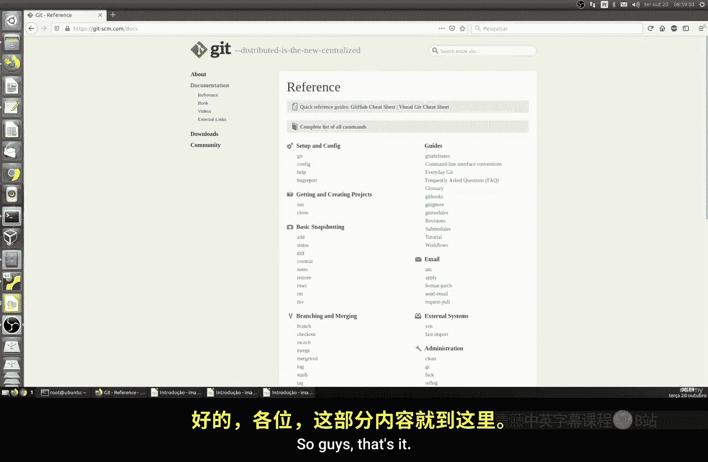

# 020：Git介绍 🚀



在本节课中，我们将要学习一个非常重要的主题：Git。Git是一个完全免费的开源版本控制系统，被广泛用于管理各种类型的项目，无论是网站、程序还是应用程序的开发。

## 概述

Git最初由Linux内核的创造者Linus Torvalds开发，旨在帮助Linux内核的开发工作。它不同于传统的版本控制系统，采用了一种独特的方式来记录项目的变更历史。

## Git与传统版本控制系统（CVS）的区别

上一节我们介绍了Git的起源，本节中我们来看看Git与传统版本控制系统（如CVS）在工作原理上的核心区别。

传统的CVS系统将数据存储为初始文件，然后记录一系列针对该文件的更改（称为“补丁”或“差异”）。其工作模式可以概括为：

**公式：文件版本 = 初始文件 + 补丁1 + 补丁2 + ...**

而Git的工作方式则截然不同。它不会记录文件的差异，而是每次提交（commit）时，都会对整个项目被跟踪文件的状态拍一张“快照”（snapshot）。如果文件在两次提交之间没有变化，Git不会重新存储该文件，而是创建一个指向之前已存储文件的链接。这种方式使得Git在查看历史版本时非常高效。

## Git的数据存储模型

理解了Git的快照机制后，我们进一步了解其内部的数据存储结构。Git的核心是对象数据库，它主要包含四种类型的对象：

以下是Git中的四种核心对象类型：



*   **Blob**： 代表一个文件的数据内容。可以理解为文件内容的二进制大对象。
*   **Tree**： 代表一个目录。它记录了目录结构，并包含指向其下Blob（文件）和其他Tree（子目录）的指针。
*   **Commit**： 代表一次提交。它指向一个根Tree对象（即项目在该次提交时的完整目录快照），并包含作者、提交者、提交信息以及指向父提交的指针。
*   **Tag**： 是一个指向特定Commit的静态指针，通常用于标记重要的版本（如v1.0.0）。

每次创建对象时，Git会通过SHA-1哈希算法为其生成一个唯一的40位十六进制ID（例如 `a1b2c3d...`）。这个ID作为键（Key），对象本身作为值（Value），存储在Git的数据库中。这种设计保证了数据的完整性。

## Git的引用：Branch与HEAD

除了上述对象，Git还有两个重要的引用概念，它们帮助我们在项目中导航：

*   **分支（Branch）**： 本质上是一个指向某个Commit对象的可移动指针。它代表一条独立的开发线。
*   **HEAD**： 这是一个特殊的指针，它指向当前所在的分支（或者说，指向当前分支指针所指向的那个Commit）。它表示你当前的工作目录是基于哪个提交。

**代码示例：查看当前HEAD指向**
```bash
cat .git/HEAD
```

## 官方资源与后续学习

Git拥有非常详尽和优秀的官方文档。对于希望深入学习Git的同学，访问其官方网站并阅读文档是极佳的选择。

**官方网址：** [https://git-scm.com/](https://git-scm.com/)





## 总结



本节课中我们一起学习了Git的基础知识。我们了解了Git由Linus Torvalds创建的背景，认识了它与传统版本控制系统在“快照”与“差异”记录上的根本区别。我们还深入探讨了Git的内部对象模型，包括Blob、Tree、Commit、Tag四种对象，以及Branch和HEAD这两个关键引用。最后，我们指出了官方文档是进一步学习Git的宝贵资源。在接下来的课程中，我们将通过实践操作来更详细地掌握Git的使用。