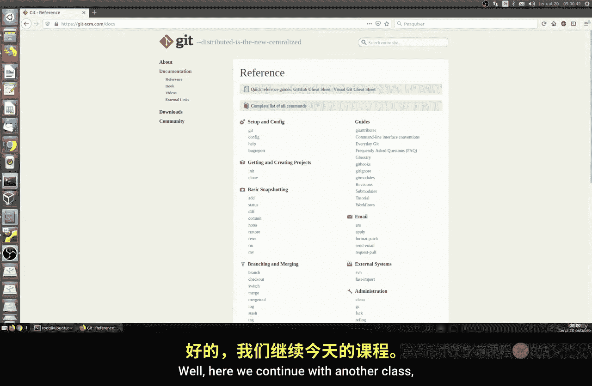
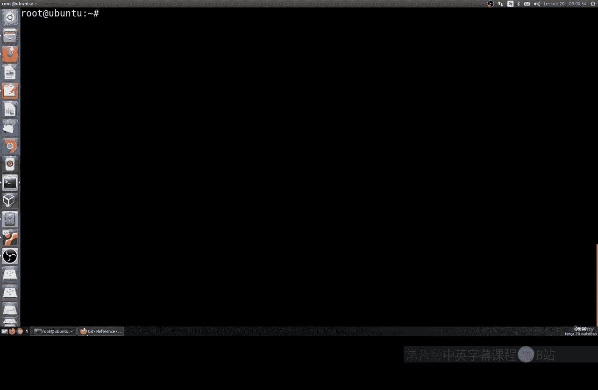
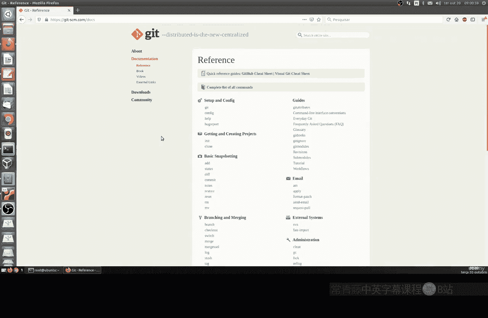
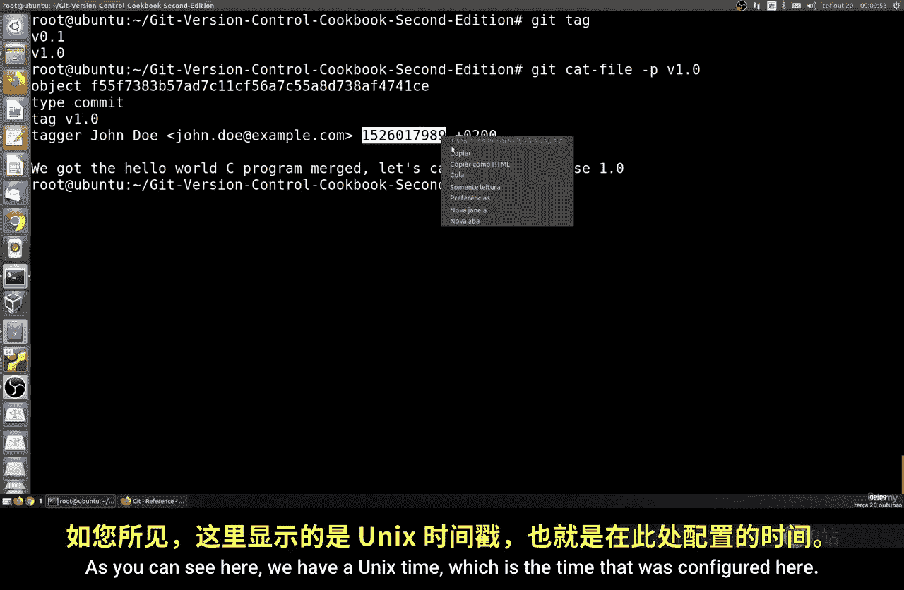
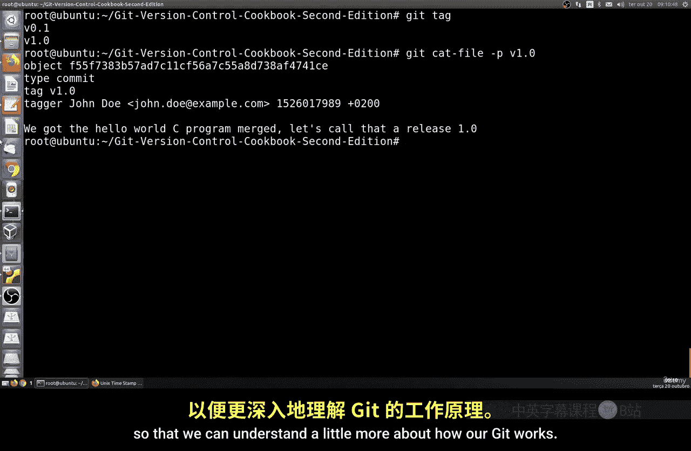

# 021：了解Git对象 🔍



在本节课中，我们将学习Git版本控制系统中的核心概念——Git对象。我们将通过实践操作，逐步了解Commit、Tree、Blob、Branch和Tag这些对象是如何构成Git仓库的。



---



## 概述

Git是一个分布式版本控制系统，它通过一系列对象来记录和管理项目的历史。理解这些对象是掌握Git工作原理的关键。本节我们将通过实际操作，逐一探索这些对象。

---

## 安装Git

首先，我们需要在系统上安装Git。大多数Linux发行版都通过官方软件仓库提供Git。

以下是安装命令：

*   **Ubuntu / Debian / Linux Mint**:
    ```bash
    sudo apt install git
    ```
*   **Fedora / Red Hat**:
    ```bash
    sudo dnf install git
    ```

安装完成后，在终端输入 `git` 命令，如果看到一系列帮助信息，说明安装成功。

---

## 克隆一个仓库

为了进行实践，我们需要一个Git仓库。让我们从GitHub克隆一个公开的仓库。`git clone` 命令会将远程仓库完整地复制到本地机器。

```bash
git clone <仓库URL>
```

例如，克隆一个示例仓库：
```bash
git clone https://github.com/username/repository.git
```

---

## 探索Git对象

进入克隆下来的仓库目录，我们就可以开始探索Git的内部对象了。

```bash
cd repository
ls -la
```

你会看到一些文件，包括一个名为 `.git` 的隐藏目录。Git的所有对象和历史都存储在这个目录中。

---

### HEAD对象

HEAD是一个特殊的指针，它总是指向当前工作目录所对应的快照（通常是某个分支的最新提交）。

我们可以查看HEAD指向的内容：
```bash
cat .git/HEAD
```
这条命令通常会输出类似 `ref: refs/heads/main` 的内容，表示HEAD指向`main`分支。

要查看HEAD指向的具体提交信息，可以使用：
```bash
git cat-file -p HEAD
```
输出会包含本次提交的**树（Tree）**对象的哈希值、作者、提交者、父提交（如果有）以及提交信息。

---

### 提交（Commit）对象

提交对象是Git版本历史的基本单元。它包含了一个**树（Tree）**对象（代表项目在某个时刻的目录结构）、作者、提交者、时间戳和提交信息。

上一节我们查看了HEAD指向的提交。每个提交都有一个唯一的SHA-1哈希值作为ID。你可以使用 `git log` 命令查看提交历史：
```bash
git log --oneline
```

---

### 树（Tree）对象

树对象代表了项目在某个时间点的目录结构。它可以包含其他树对象（子目录）和**Blob**对象（文件）。

从提交对象的输出中，找到`tree`后面的一串哈希值。我们可以查看这个树对象的内容：
```bash
git cat-file -p <tree的哈希值>
```
输出会列出该目录下的所有条目，包括文件类型（`blob`或`tree`）、权限、哈希值和文件名。

---

### 数据块（Blob）对象

Blob对象存储着文件的实际内容。在树对象的输出中，类型为`blob`的条目就对应着文件。

我们可以查看某个Blob对象的内容：
```bash
git cat-file -p <blob的哈希值>
```
这条命令会直接输出该文件的内容。它和用 `cat` 命令查看普通文件的结果是一致的。

---

### 分支（Branch）

分支本质上是一个指向某个提交对象的可变指针。它本身不是一个独立的Git对象，而是一个引用（reference）。

主分支（通常是`main`或`master`）的指针存储在 `.git/refs/heads/` 目录下。查看主分支指向的提交：
```bash
cat .git/refs/heads/main
# 或
git rev-parse main
```
你会发现，这个提交ID和 `git log` 中最新提交的ID，以及HEAD最终指向的ID是相同的。

---

### 标签（Tag）

标签是一个指向特定提交的静态指针，常用于标记发布版本（如v1.0）。主要有三种类型：轻量标签、附注标签和签名标签。

查看仓库中的所有标签：
```bash
git tag
```
查看某个标签指向的提交：
```bash
git show <标签名>
```
附注标签本身也是一个Git对象，它包含标签名、标签信息、时间戳和指向的提交对象。

---



## 时间戳

在提交和附注标签的信息中，你会看到类似 `1625097600` 的数字，这是Unix时间戳。它表示自1970年1月1日（UTC）以来经过的秒数。你可以使用在线工具将时间戳转换为易读的日期和时间。


---

## 总结

本节课我们一起学习了Git的核心对象模型：
1.  **提交（Commit）**：记录了项目的一次变更，包含作者、时间、信息和指向的树对象。
2.  **树（Tree）**：代表了项目在某个时刻的目录结构。
3.  **数据块（Blob）**：存储了文件的实际内容。
4.  **分支（Branch）**：指向提交的可变指针，用于开发流。
5.  **标签（Tag）**：指向提交的静态指针，用于标记重要节点。
6.  **HEAD**：指向当前检出的分支或提交的特殊指针。



理解这些对象如何相互关联，是深入掌握Git操作和解决复杂问题的基础。在接下来的课程中，我们将基于这些知识进行更多实践和测试。