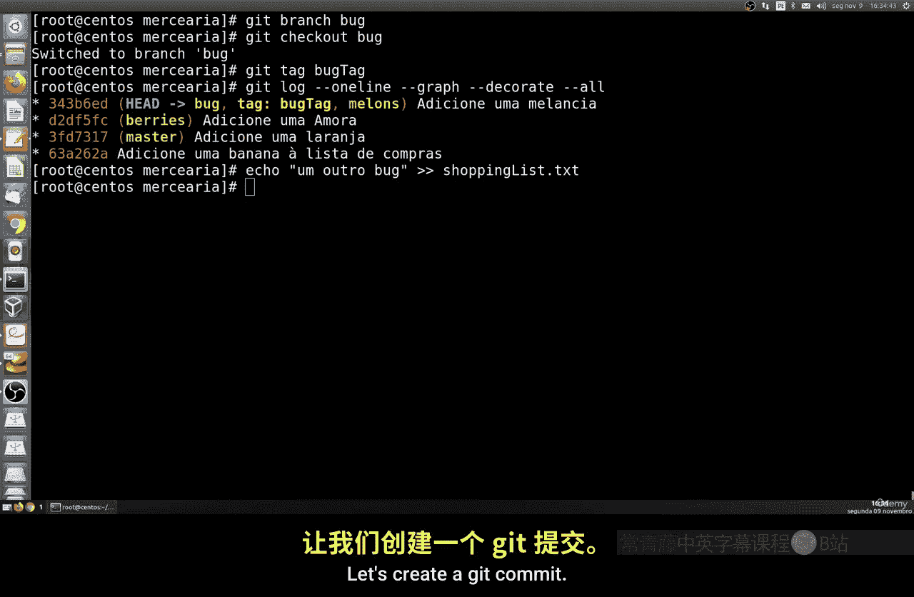
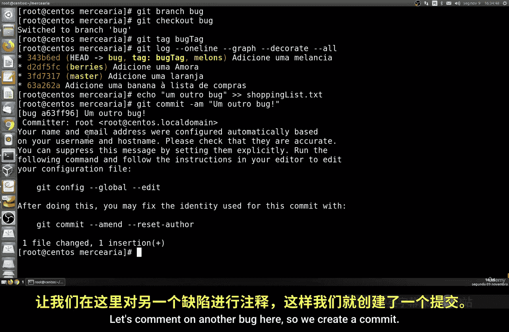
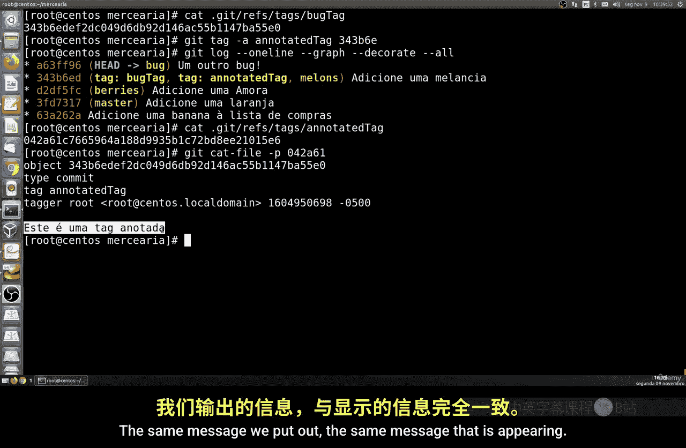
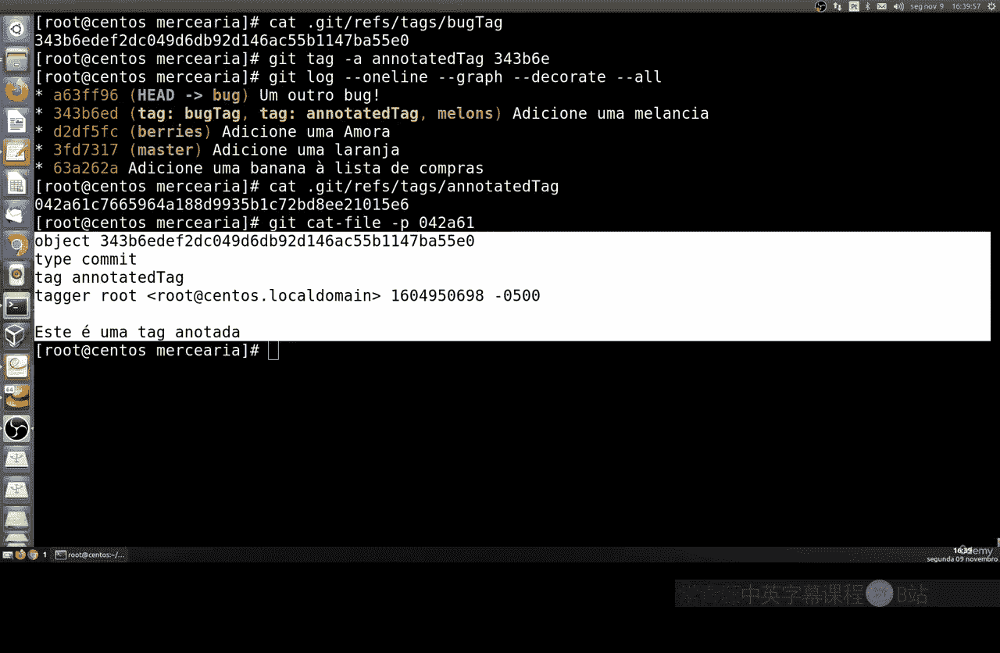
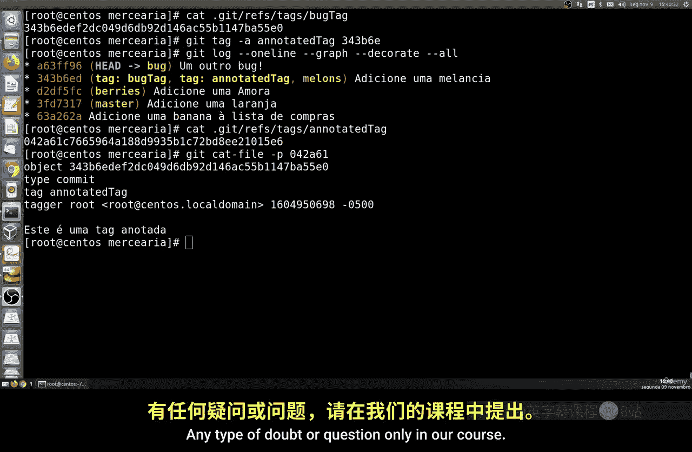

# 027：标记与注释标签 📌

在本节课中，我们将要学习如何在Git仓库中创建和使用标签。标签就像是一个可以永久固定在特定提交上的标记，与分支不同，它不会移动。这对于标记重要的版本（如发布版）或记录特定的问题点（如bug）非常有用。

## 标签的基本概念

上一节我们介绍了分支的创建与切换，本节中我们来看看如何为提交打上标签。标签是Git中一个指向特定提交的静态引用。你可以把它想象成给某个历史时刻拍了一张快照并贴上一个永久的标签，方便日后快速定位。

## 创建简单标签

以下是创建简单标签的步骤，这通常用于标记版本号。

1.  首先，确保你处于目标提交上。你可以使用 `git log` 命令查看提交历史。
2.  使用 `git tag <标签名>` 命令创建一个轻量级标签。例如，要标记当前提交为 `v1.0`，可以运行：
    ```bash
    git tag v1.0
    ```
3.  创建后，你可以通过 `git log --oneline --decorate` 命令查看标签是否已附加到对应的提交上。

## 创建带注释的标签



带注释的标签不仅包含名称，还可以存储额外的信息，如标签说明、创建者、日期等，功能更强大。



以下是创建带注释标签的步骤：

1.  使用 `git tag -a <标签名> -m "标签信息"` 命令。`-a` 表示创建带注释的标签，`-m` 后面直接跟上说明信息。
    ```bash
    git tag -a v1.1 -m "Release version 1.1 with bug fixes"
    ```
2.  如果你想提供更详细的说明，可以不使用 `-m` 参数，Git会打开默认的文本编辑器（如Vim）让你输入完整的描述信息。
    ```bash
    git tag -a debug_tag
    ```
    执行上述命令后，Git会打开编辑器，你可以输入如“此提交包含一个内存泄漏问题”等详细注释，保存并退出即可。

## 查看与删除标签

创建标签后，你可能需要查看或管理它们。

*   **查看所有标签**：运行 `git tag` 命令会列出仓库中的所有标签。
*   **查看特定标签的详细信息**：对于带注释的标签，可以使用 `git show <标签名>` 命令查看其详细信息，包括注释内容、打标签的人和日期。
*   **删除标签**：如果标签创建错误或不再需要，可以使用 `git tag -d <标签名>` 命令将其删除。
    ```bash
    git tag -d v1.0
    ```

## 在特定提交上打标签

默认情况下，`git tag` 命令会在当前所在的提交上打标签。如果你想为历史上的某个特定提交打标签，只需要在命令末尾指定该提交的校验和（或部分校验和）即可。

1.  首先使用 `git log --oneline` 找到你想标记的提交的短校验和（例如 `a1b2c3d`）。
2.  然后运行：
    ```bash
    git tag -a v1.0 a1b2c3d -m "标记历史版本"
    ```

## 实战：为Bug修复创建标签

让我们在一个模拟的“bug修复”分支上进行实战。假设我们有一个 `bug-fix` 分支，上面有几个用于修复问题的提交。





1.  切换到 `bug-fix` 分支：`git checkout bug-fix`
2.  进行一些修改并提交。
3.  在修复了某个关键问题的提交上，创建一个带注释的标签，说明修复的内容：
    ```bash
    git tag -a bugfix_critical_issue -m "修复了导致应用崩溃的空指针异常问题"
    ```
4.  之后，无论这个分支如何变化，你都可以通过 `git show bugfix_critical_issue` 快速回顾这个重要的修复点。

---



本节课中我们一起学习了Git标签的用法。我们了解了轻量级标签和带注释标签的区别，掌握了使用 `git tag` 命令创建、查看和删除标签的方法，并学会了如何在特定的历史提交上打标签。标签是标记项目里程碑（如版本发布）和重要节点（如重大Bug修复）的利器，能让你更高效地管理项目历史。