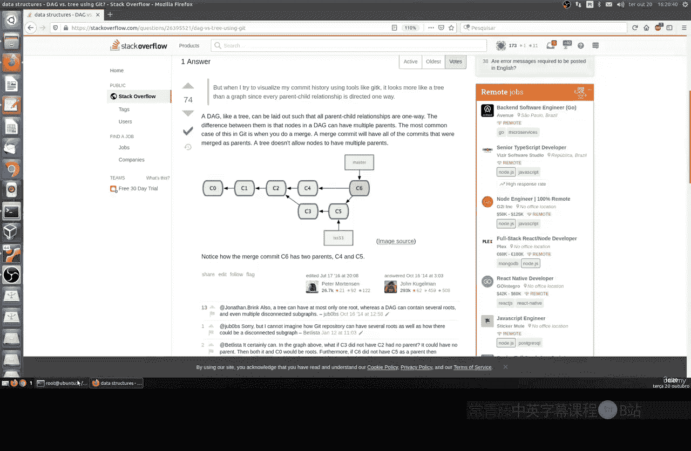
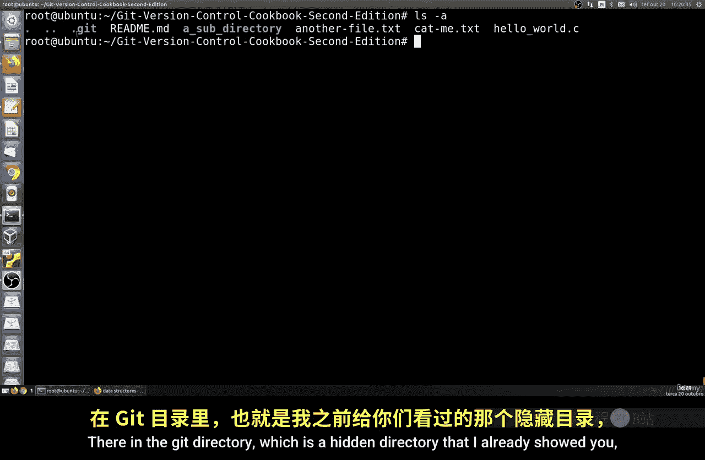
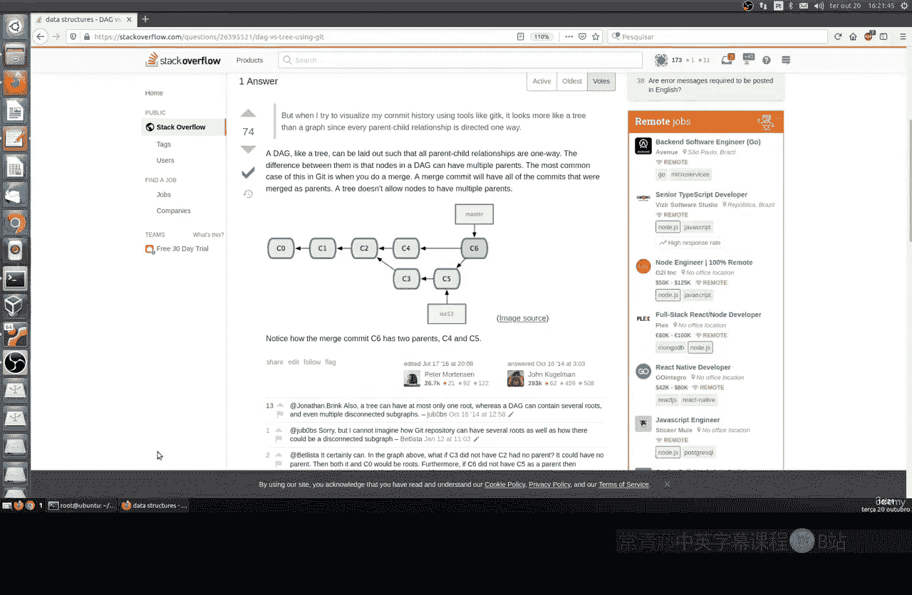
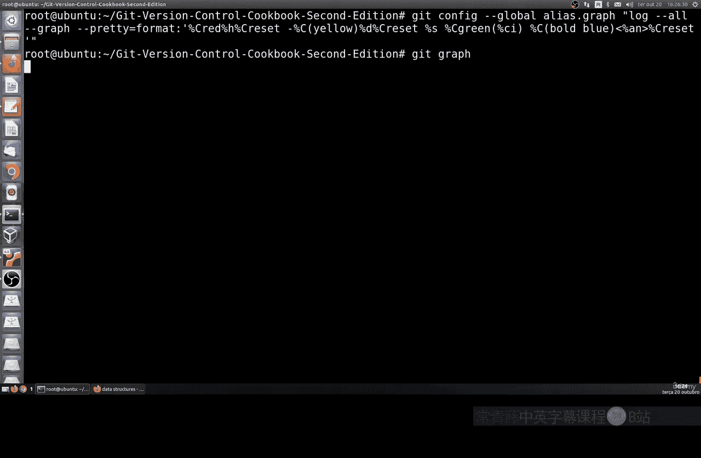

# 028：可视化DAG 🔍

在本节课中，我们将要学习如何可视化Git中的有向无环图（DAG）。DAG是Git版本控制的核心数据结构，理解它有助于我们更好地掌握项目的提交历史与分支结构。

## 概述：什么是DAG？

上一节我们介绍了Git的基本操作，本节中我们来看看Git如何组织提交历史。DAG，即有向无环图，是Git用来记录提交、分支和合并历史的一种数据结构。它确保了每次提交都指向其父提交，从而形成一个清晰、不可逆的历史链条。

## DAG与树状结构的区别

有同学曾询问DAG与树状结构的区别。在使用Git时，可以观察到一张很能说明问题的图片。

在我们的Git历史中，提交记录被存储在`.git`目录中。这是一个我之前展示过的隐藏目录。

它主要由对象构成。这些对象是提交对象，随着我们的开发进展而不断添加。

分支被创建、开发、合并。可以看到它们都汇聚在这里。例如，这里有`66065AC3`和`AC4`，它们都属于`C2`。这里的小箭头展示了提交如何被组织、合并，最终历史会形成一个有向的循环图。

DAG由于其链接方式，基本上每次提交都有一个父提交。这简化了我们的开发流程。

## 使用Git Log查看DAG

如果你想查看这种结构的日志，可以进入我们仓库的根目录，使用`git log`命令。

使用`git log`，你可以查看命令中使用的整个DAG历史。但我们也可以使用其他多种工具。

默认情况下，`git log`会按时间顺序（或反向时间顺序）输出历史记录。输出结果可以分页显示，也可以进行限制。

例如，你可以查看所有历史记录，包括作者、日期和提交信息。如果你想查看，我们有各种信息：邮件、日期、创建时间以及该提交的哈希值。

如果存在任何标签，我们也会在这里看到标签，例如版本`1.0`。如果你想减少输出，可以运行例如`git log -3`命令。这样你就可以以更有限的方式查看我们的历史，例如最近的三次提交。

## 图形化显示提交历史

默认情况下，Git打印的提交信息不是非常图形化。它们只是文本。

但你可以使用命令选项来实现图形化显示。有一个命令没有太多逻辑，更多是为了方便记忆，那就是`git log --graph --oneline`。

这看起来很有趣，我们这里有一些蓝色、红色和黄色的线条。

这样我们基本上就有了一个“树”状视图，可以查看所有历史记录，包括我们所说的分支。基本上，它会每行显示一个提交，由其缩写ID标识。在这种情况下，图表将由我们的提交绘制而成。

我们还有`--all`选项，它会在提交ID后显示分支名称。简而言之，这个选项会显示所有分支，而不仅仅是当前分支。

这样我们就有了一个非常有趣的完整图形化配置。可以查看所有历史记录：添加了什么，删除了什么，更新了什么。这里包含了我们文件中所有的设置。

## 高级日志格式

我们还有另一个选项，即`git log --oneline --graph`命令。你也可以使用这种命令来进行配置。

基本上，它也提供了这种功能。我们还可以选择提供日期和时间，如果你想使用其他类型的语法。

例如，如果我在这里展示给你看，这里稍微复杂一些：绿色的日期和时间，进行该配置的作者，以及这里绿色的日期和时间，简短的描述以及完成的操作。这里就是我们的提交。

这样，你就可以以更有趣的方式查看该提交的所有ID。我认为，从视觉上看，这更有趣，因为我们这里有完整的历史记录：初始提交，然后按顺序排列的一切，我们都可以看到。

## 创建命令别名

如果存在两个、三个、四个甚至十个人参与项目，了解是谁进行了那次提交就很重要。你可以在之后监控那次提交。在接下来的课程中，我们将看到如何监控。

你也可以使用我们这里的ID来监控那次提交。如果你想使用它或将其保存下来，不需要一直使用这一大串命令。你可以创建一个别名并保存它。

你可以运行`git config`命令，并为此使用`git classic`。

然后它会安全地保存下来。我觉得这种方式更有趣。

这样我们就可以清晰地观察项目中提交的历史记录。

## 总结

本节课中，我们一起学习了可视化Git DAG的最简单、最便捷的方法。这在我们开发项目时提供了极大的便利。

掌握这些命令和视图，能帮助我们更好地理解项目脉络，高效地进行版本控制和协作开发。