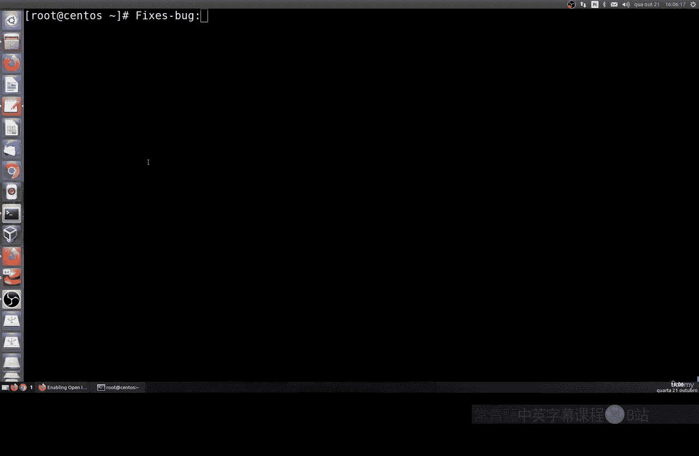
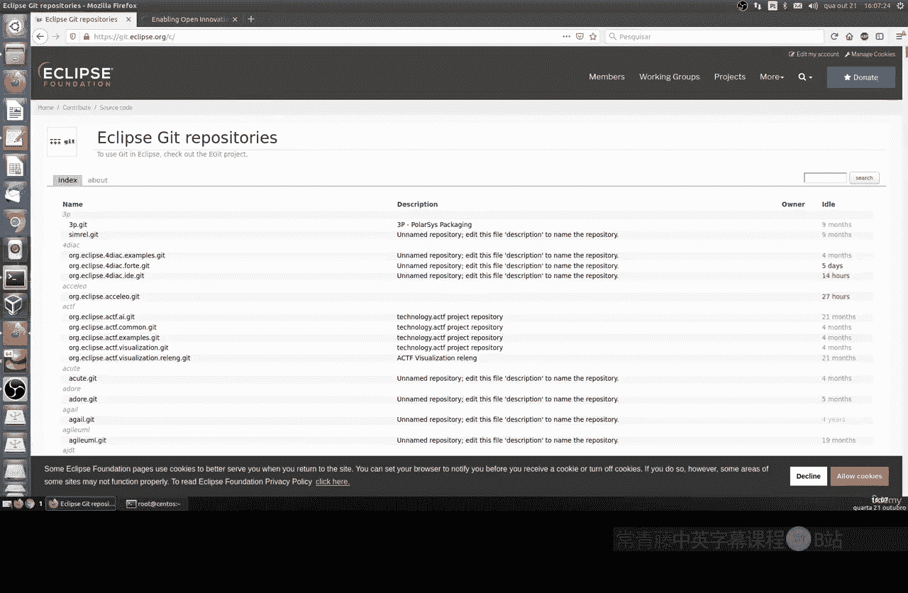
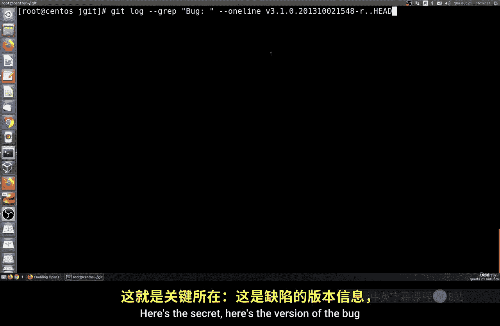

# 029：提取已修复问题 🔍

在本节课中，我们将学习如何在Git版本控制系统中，提取和查看已修复的问题或Bug。这对于跟踪项目进展和保持提交信息的标准化非常有帮助。



上一节我们介绍了Git的基本操作，本节中我们来看看如何利用Git日志来筛选特定的提交信息。

## 克隆项目并查看历史

首先，我们需要一个实际的项目来进行操作。我们将使用Eclipse项目的Git仓库作为示例。Eclipse是一个免费、开源的集成开发环境，其项目使用Git进行版本管理。



以下是克隆项目并进入目录的命令：
```bash
git clone https://github.com/eclipse/eclipse.jdt.core.git
cd eclipse.jdt.core
```
克隆完成后，项目文件会下载到本地。我们可以使用 `git log` 命令来查看项目的提交历史。

## 查找最新标签与提交

为了更精确地查看最近的提交，我们需要先找到最新的Git标签。标签通常用于标记发布版本。

使用以下命令可以找到最新的标签及其相关信息：
```bash
git describe
```
这个命令会输出类似 `r3.102-96-g0b14a93971` 的信息，其中 `r3.102` 是最后一个标签，`96` 表示自该标签后有96次提交，`g0b14a93971` 是当前提交的哈希值。

## 筛选包含“Bug”的提交

我们的核心目标是找出所有修复了Bug的提交。Git的 `log` 命令可以配合 `grep` 进行内容筛选。

以下是查看所有提交信息中包含“bug”一词的命令：
```bash
git log --oneline --grep="bug"
```
这个命令会列出所有提交信息摘要中包含“bug”的提交，显示其简短的提交哈希和说明。

为了获得更详细、格式更友好的输出，我们可以使用 `--pretty` 参数自定义格式。以下命令会显示完整的提交哈希、作者、日期和完整的提交信息正文：
```bash
git log --pretty=format:"%H - %an, %ad: %n%B" --grep="bug" --since=$(git describe --abbrev=0)
```
在这个命令中：
*   `%H` 代表完整的提交哈希。
*   `%an` 代表作者名字。
*   `%ad` 代表作者日期。
*   `%n` 是换行符。
*   `%B` 代表提交信息的完整正文。
*   `--since=$(git describe --abbrev=0)` 会将查看范围限制在最新标签之后的提交。

## 提取Bug标识符

在许多项目中，修复Bug的提交会遵循特定的格式，例如以“Fixed bug: ”开头，后面跟着Bug的编号（如12345）。

如果我们只想提取这些Bug的编号，可以结合使用 `grep` 和正则表达式进行更精细的筛选。

以下命令尝试从提交信息中匹配并提取类似“12345”的Bug编号：
```bash
git log --oneline --since=$(git describe --abbrev=0) | grep -oP “Fixed bug:\s*\K\d+”
```
这个命令做了以下几件事：
1.  `git log --oneline --since=...` 列出最新标签后的简短提交日志。
2.  通过管道 `|` 将结果传递给 `grep`。
3.  `-o` 参数让 `grep` 只输出匹配到的部分。
4.  `-P` 参数启用Perl兼容的正则表达式。
5.  正则表达式 `Fixed bug:\s*\K\d+` 会查找“Fixed bug: ”后面可能有的空格，然后 `\K` 会“丢弃”之前匹配的内容，最后 `\d+` 匹配一个或多个数字（即Bug ID）。



## 总结

本节课中我们一起学习了如何利用Git命令从项目历史中提取已修复的问题。
我们首先克隆了一个示例项目，然后学习了如何查找最新标签来限定查看范围。
接着，我们使用 `git log --grep` 来筛选包含特定关键词的提交，并通过自定义格式获得清晰的信息。
最后，我们介绍了如何使用更高级的 `grep` 正则表达式来精确提取Bug的标识符。
掌握这些技巧能帮助你有效地审查项目历史，理解代码的演变过程。