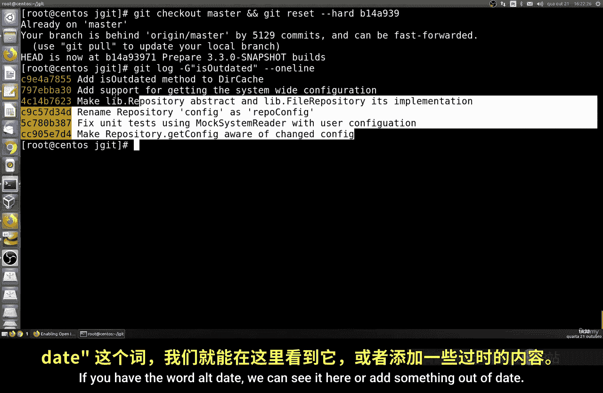
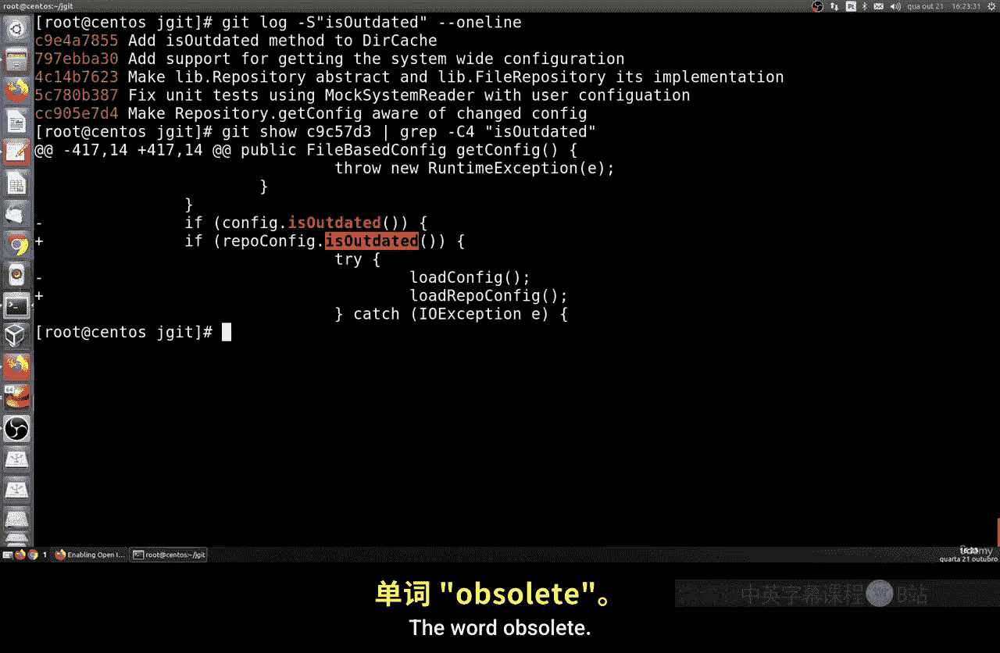
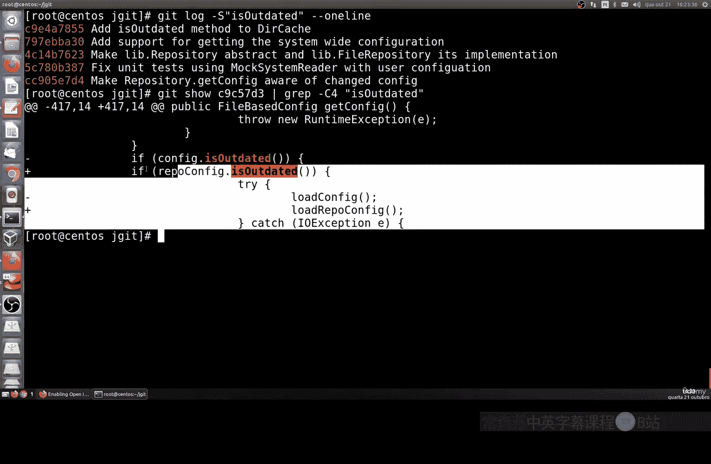
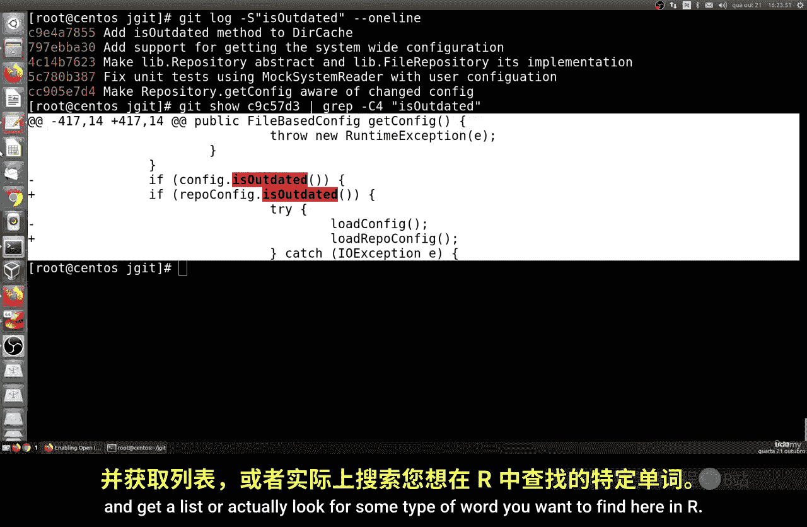
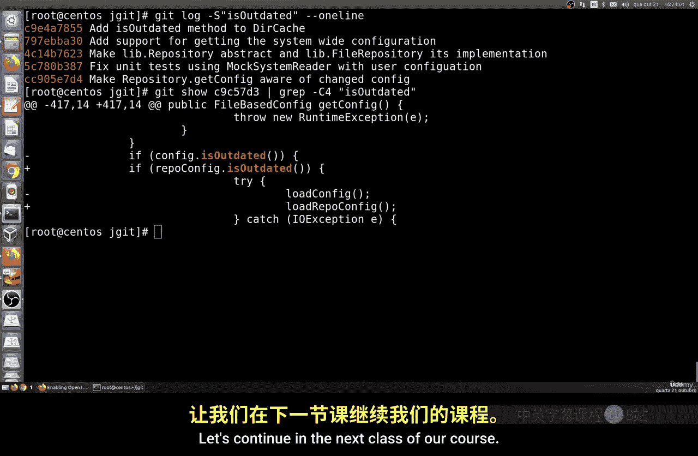

# 030：获取更改文件列表与搜索提交 🔍

在本节课中，我们将学习如何获取Git仓库中已更改文件的列表，以及如何根据关键词搜索特定的提交记录。我们将使用 `git diff` 和 `git log` 等命令来实现这些功能。

## 获取更改文件列表

上一节我们学习了如何列出文件，本节我们来看看如何筛选出那些被修改过的文件。在Git中，我们可以使用 `git diff` 命令来查看自上次提交以来所有发生变化的文件，包括新增、删除、修改等。

以下是获取更改文件列表的基本命令：

```bash
git diff --name-only
```

这个命令会列出所有自上次提交以来发生变化的文件的路径。`--name-only` 选项指示Git只输出文件路径，而不显示具体的差异内容。

有时，更改的文件列表可能很长。为了更精确地筛选，我们可以结合 `git diff` 的 `--diff-filter` 选项。该选项允许我们根据文件的状态进行过滤。

以下是不同过滤选项的示例：

*   **列出被删除的文件**：使用 `-D` 或 `--diff-filter=D`。
    ```bash
    git diff --diff-filter=D --name-only
    ```
*   **列出被修改的文件**：使用 `-M` 或 `--diff-filter=M`。
    ```bash
    git diff --diff-filter=M --name-only
    ```
*   **列出被重命名的文件**：使用 `-R` 或 `--diff-filter=R`。
    ```bash
    git diff --diff-filter=R --name-only
    ```
*   **列出被复制的文件**：使用 `-C` 或 `--diff-filter=C`。
    ```bash
    git diff --diff-filter=C --name-only
    ```
*   **列出新增的文件**：使用 `-A` 或 `--diff-filter=A`。这是一个非常重要的选项。
    ```bash
    git diff --diff-filter=A --name-only
    ```

## 搜索提交记录

除了查看文件更改，我们经常需要根据特定关键词来查找相关的提交记录。`git log` 命令的 `-p` 和 `-S` 选项在这方面非常有用。

如果你想搜索包含某个关键词的提交信息，可以使用 `git log --grep` 命令。

例如，搜索提交信息中包含“performance”这个词的所有提交：

```bash
git log --grep="performance"
```

这个命令会列出所有提交信息里含有“performance”的提交记录。

如果你想更高效地查看提交，或者希望获取与某段代码变更相关的提交，可以使用 `git log` 的格式化输出选项。



例如，使用 `--oneline` 选项让每个提交只显示一行摘要，再结合 `--grep` 进行搜索：

```bash
git log --oneline --grep="outdated"
```

此外，`git log` 还有两个强大的选项用于搜索代码变更本身：

*   **`-p` 选项**：显示每个提交引入的差异（patch）。你可以手动浏览这些差异来查找特定代码。
*   **`-S` 选项**：搜索那些添加或删除了指定字符串的提交。例如，查找所有添加或删除了“obsolete”这个词的提交：
    ```bash
    git log -S "obsolete"
    ```

最后，如果你想查看某次特定提交的完整内容，可以使用 `git show` 命令，后面跟上提交的哈希值。





```bash
git show <commit-hash>
```



你也可以将 `git log` 的搜索结果通过管道传递给 `git show` 来查看具体某次提交的细节。



本节课中我们一起学习了如何使用 `git diff --name-only` 和 `--diff-filter` 来获取并筛选更改过的文件列表，以及如何使用 `git log --grep`、`-S` 和 `-p` 等选项来根据关键词或代码内容搜索提交记录。这些技巧能帮助你更有效地审查代码变更历史和定位问题。