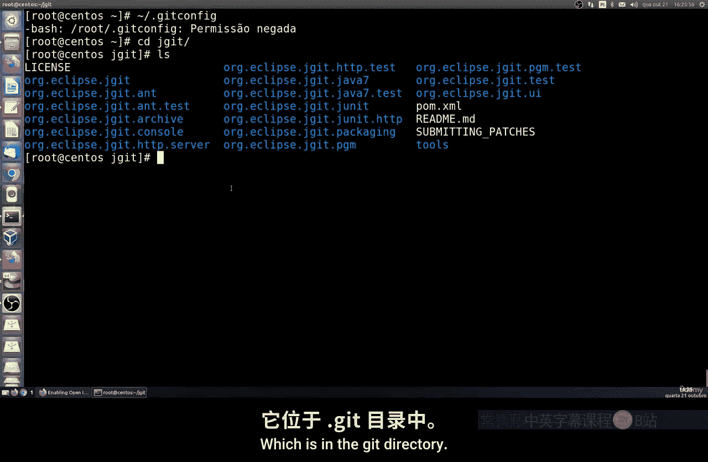
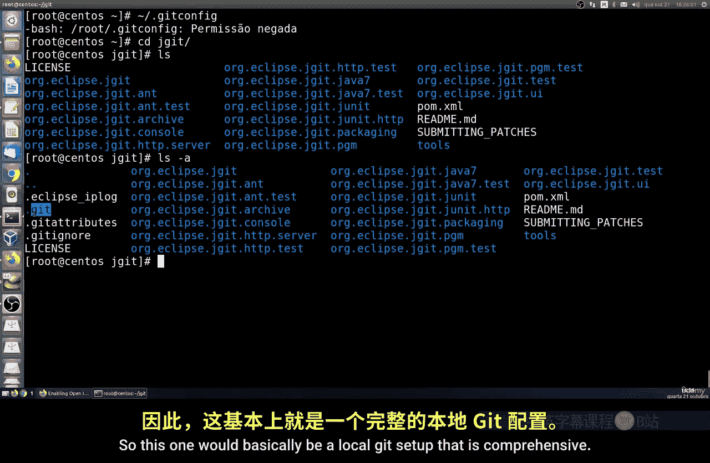
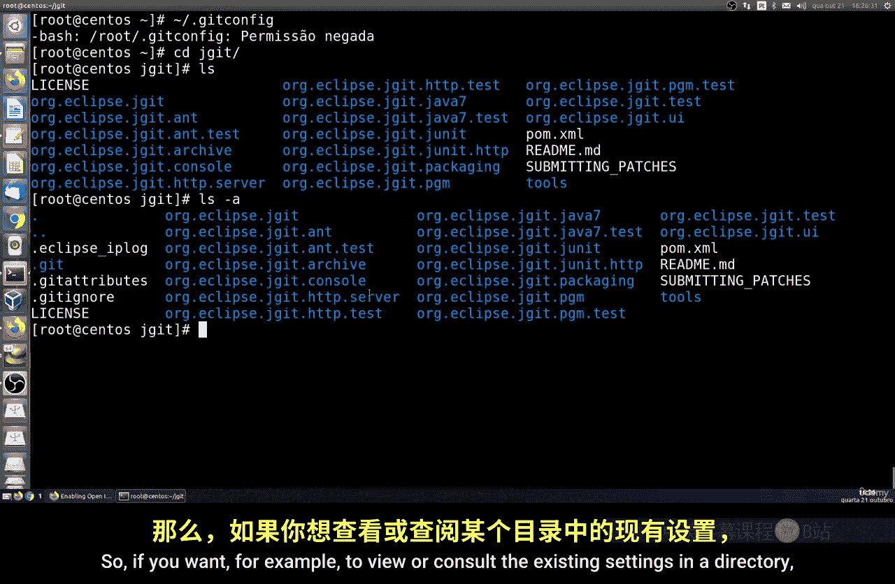
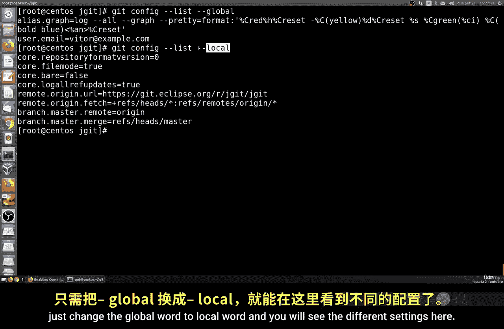
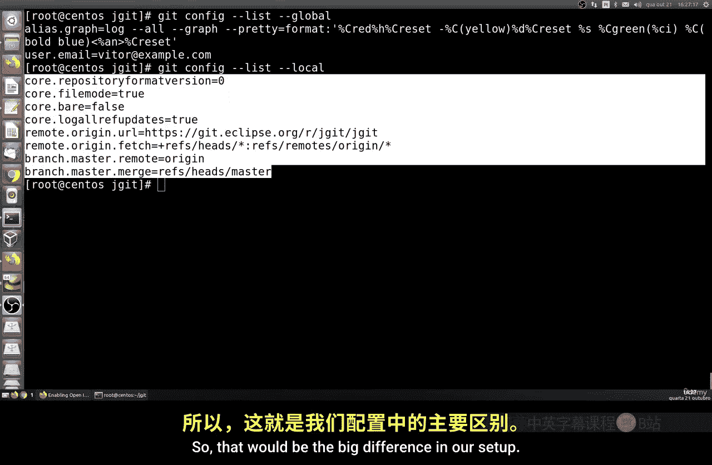
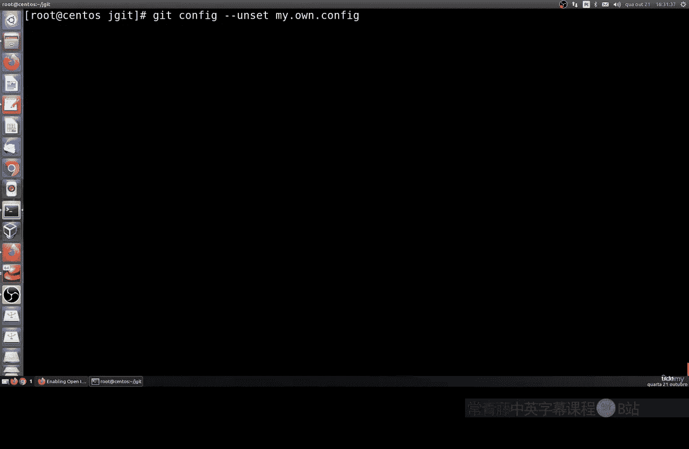
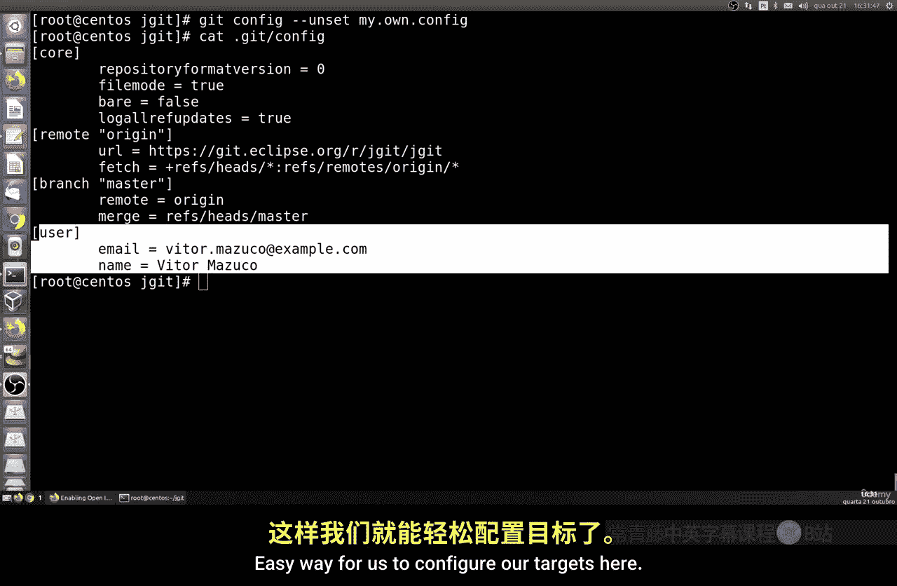
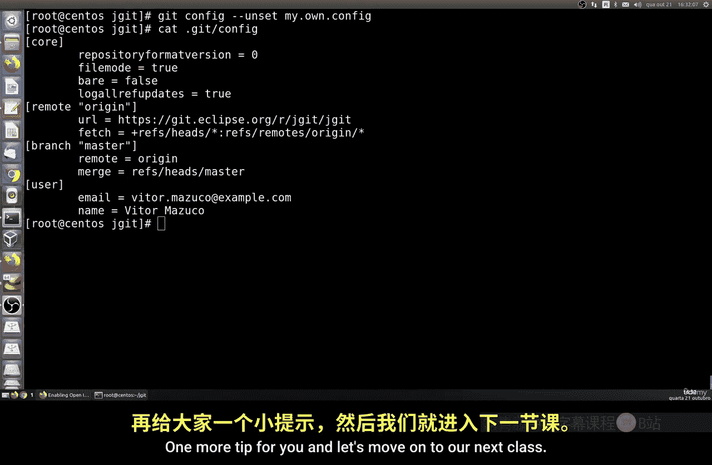

# 031：配置层级与设置 🎯

在本节课中，我们将学习如何在 Git 中查看和配置不同类型的配置层级，也称为目标。我们将了解系统层、全局层和本地层的区别，并掌握如何查看、设置和删除配置项。

## 概述

Git 的配置系统分为几个不同的层级，每个层级的作用范围不同。理解这些层级有助于我们为不同的项目或环境设置合适的配置，避免配置冲突。





## Git 配置层级

上一节我们介绍了 Git 的基本操作，本节中我们来看看 Git 的配置系统是如何组织的。



Git 配置主要分为三种类型：

*   **系统层**：此配置适用于系统上的所有用户和所有仓库。其配置文件通常位于 `/etc/gitconfig`。但请注意，此层级并非默认安装或预配置的。如果你想使用系统范围的设置，可以手动配置。
*   **全局层**：此配置适用于当前操作系统用户下的所有仓库。其配置文件位于用户的家目录下，通常是 `~/.gitconfig`。
*   **本地层**：此配置仅适用于特定的 Git 仓库。其配置文件位于该仓库的 `.git/config` 目录中。

## 查看配置





以下是查看不同层级配置的方法。

要查看全局配置，可以使用以下命令：
```bash
git config --list --global
```
此命令会列出所有应用于你所有仓库的全局设置。

要查看仅适用于当前仓库的本地配置，只需将 `--global` 替换为 `--local`：
```bash
git config --list --local
```
通过对比这两个命令的输出，你可以清楚地看到不同层级的设置差异。

## 设置与修改配置

我们不仅可以查看配置，还可以修改或定义新的配置项。

例如，如果你想全局设置你的邮箱，可以使用以下命令：
```bash
git config --global user.email "your-email@example.com"
```
同样，你也可以在本地仓库中设置邮箱：
```bash
git config --local user.email "your-email@example.com"
```

设置完成后，你可以使用 `git config --list` 命令查看所有已生效的配置。你会看到刚刚修改的邮箱信息已经更新。

除了邮箱，你还可以配置用户名。例如，设置全局用户名：
```bash
git config --global user.name "Your Name"
```

配置项的语法遵循 `section.key` 的格式。例如，`user.email` 就是一个配置项，其中 `user` 是段落，`email` 是键。你可以按照这个格式配置任何你需要的选项。

如果你想查看某个特定配置项的值，可以指定其键名。例如，只查看用户邮箱：
```bash
git config user.email
```

## 自定义配置与删除

你甚至可以定义自己的自定义配置项，这在脚本或特定工作流中可能很有用。

例如，添加一个自定义配置：
```bash
git config my.custom.setting "some value"
```
然后，你可以像查看其他配置一样列出它。

在修改配置时请务必谨慎。如果你需要删除某个配置项，可以使用 `--unset` 参数。



例如，删除我们刚才添加的自定义配置：
```bash
git config --unset my.custom.setting
```
命令执行后，该配置项即被成功移除。



## 总结



本节课中我们一起学习了 Git 的配置层级系统。我们了解了系统层、全局层和本地层的区别，并掌握了如何使用 `git config` 命令来查看、设置和删除不同层级的配置。合理利用这些层级，可以为不同的仓库设置独立的配置，避免相互干扰。这是一个非常实用的技巧，能帮助你更灵活地管理 Git 项目。