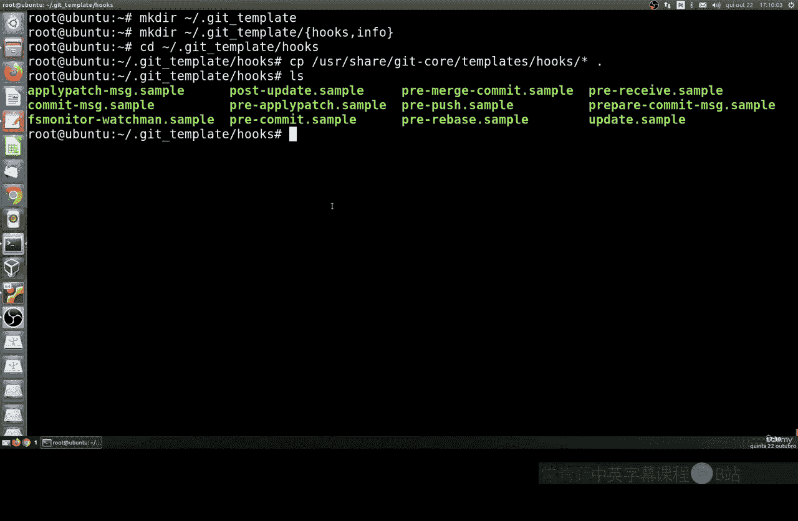
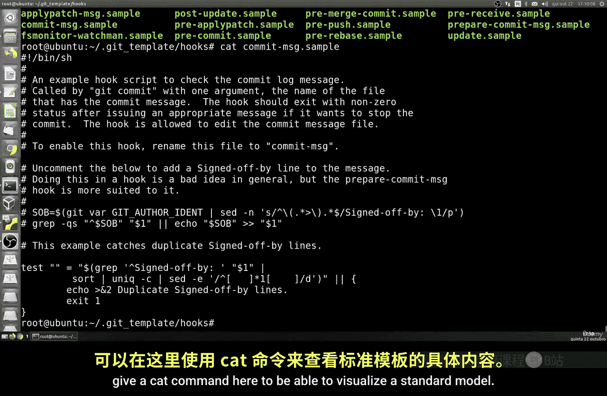
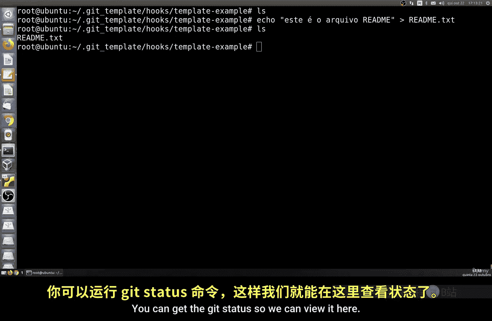
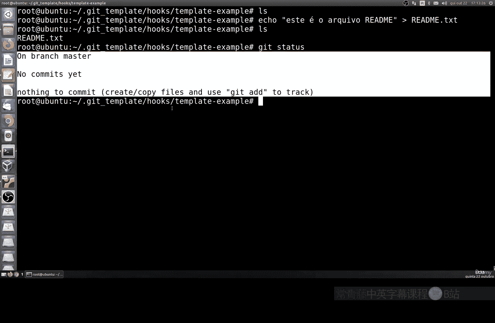
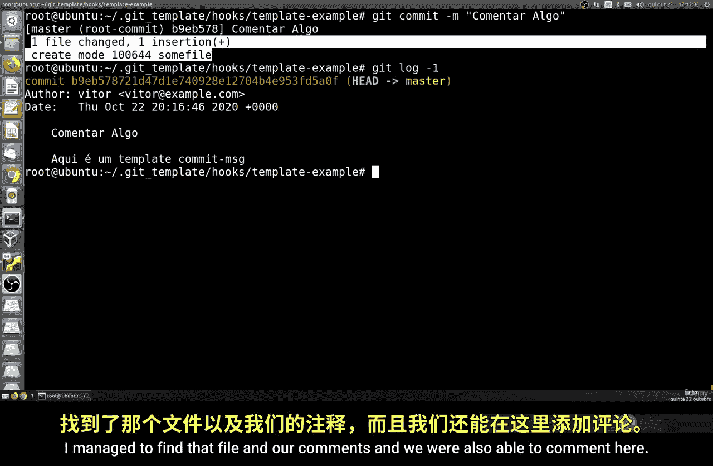
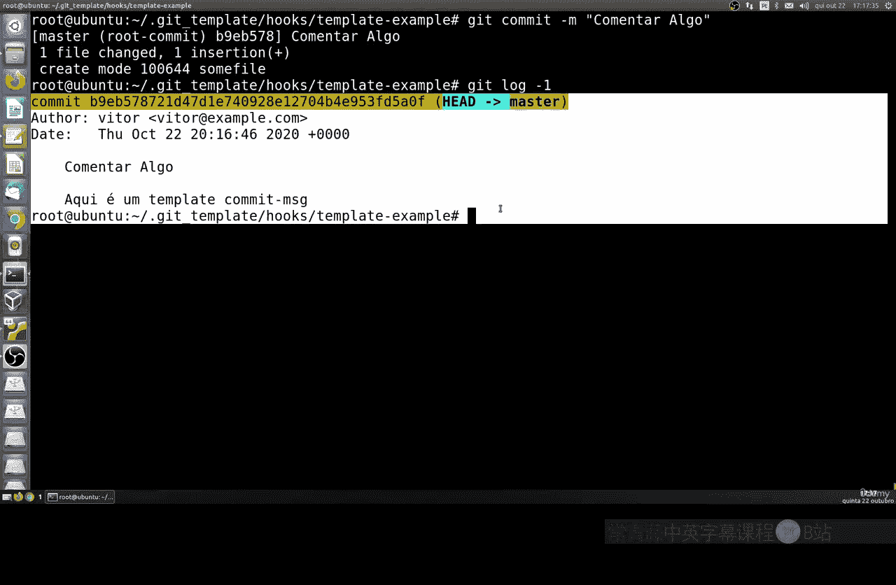
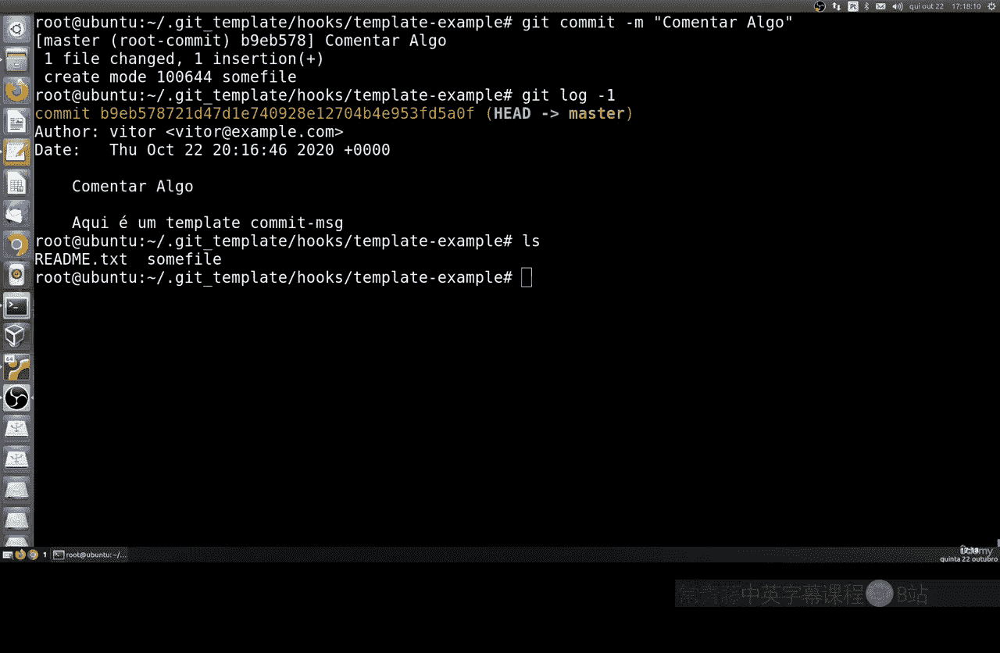

# 032：创建自定义Git模板 🛠️

在本节课中，我们将学习如何创建自定义的Git模板。全局配置有时不足以满足特定需求，通过创建模板，我们可以预设一些自动化脚本，例如在提交时自动删除特定类型的文件。

## 概述

上一节我们介绍了Git的基本配置。本节中，我们来看看如何创建和使用自定义模板，以实现更高级的自动化操作，例如文件过滤。

## 定位默认模板

首先，我们可以查看系统自带的Git模板。默认模板位于 `/usr/share/git-core/templates` 目录中。

以下是该目录包含的内容示例：
*   各种预设的钩子脚本模板。
*   例如，提交前（pre-commit）、更新后（post-update）等时机的脚本示例。
*   默认的提交信息模板。



## 创建自定义模板目录



我们需要创建一个自定义的模板目录。这个目录通常是隐藏的。

```bash
mkdir -p ~/.my-git-template
cd ~/.my-git-template
mkdir hooks info
```

## 复制并编写钩子脚本

接下来，进入 `hooks` 目录，并开始创建我们的脚本。

以下是创建脚本的步骤：
1.  创建一个提交信息钩子脚本 `commit-msg`。
    ```bash
    #!/bin/sh
    MSG_FILE=$1
    echo "这是来自自定义模板的提交信息。" > $MSG_FILE
    ```
    保存后，需要赋予脚本执行权限：
    ```bash
    chmod +x commit-msg
    ```
2.  创建一个预提交钩子脚本 `pre-commit`，用于在提交前删除所有 `.txt` 文件。
    ```bash
    #!/bin/sh
    find . -name "*.txt" -type f -delete
    ```
    同样，赋予其执行权限：
    ```bash
    chmod +x pre-commit
    ```

## 配置Git使用自定义模板



创建好模板目录和脚本后，需要将其配置为Git的全局默认模板。



```bash
git config --global init.templatedir '~/.my-git-template'
```

此命令执行后，任何新初始化的Git仓库都将自动使用我们自定义的模板。

## 测试模板效果

现在，让我们测试模板是否生效。

以下是测试步骤：
1.  创建一个新的测试目录并初始化Git仓库。
    ```bash
    mkdir test-repo && cd test-repo
    git init
    ```
2.  创建一个 `.txt` 文件和一个其他类型的文件。
    ```bash
    echo "这是一个文本文件" > test.txt
    echo "这是一个其他文件" > other.file
    ```
3.  检查Git状态。你会发现 `test.txt` 文件没有被Git跟踪，因为它已被 `pre-commit` 钩子脚本删除。
    ```bash
    git status
    ```
4.  尝试添加文件并进行提交。提交时，`commit-msg` 脚本会自动填充提交信息。
    ```bash
    git add .
    git commit
    ```
    使用 `git log` 查看提交记录，确认提交信息来自我们的模板。





## 总结



本节课中我们一起学习了如何创建和使用自定义Git模板。我们完成了从创建模板目录、编写自动化钩子脚本（如删除特定文件、自定义提交信息），到全局配置并测试模板生效的全过程。通过自定义模板，你可以为所有新项目统一自动化规则，提升工作效率。