# 033：本地分支管理

在本节课中，我们将学习如何在本地Git仓库中管理分支。你将学会创建新分支、为分支添加描述、查看分支信息以及在不同分支间切换。

## 概述

本地分支管理是Git工作流的核心。它允许你在不影响主代码线的情况下，独立开发新功能或修复错误。本节我们将从零开始，在一个清理后的本地仓库中实践这些操作。

## 准备工作

首先，我们需要一个干净的本地Git仓库。为了避免遗留配置的影响，我们将删除现有的Eclipse项目仓库并重新克隆。

以下是操作步骤：
1.  删除旧的本地仓库目录。
2.  使用 `git clone <仓库地址>` 命令重新克隆项目。

完成上述步骤后，我们就拥有了一个全新的起点，可以开始进行分支管理。

## 创建新分支

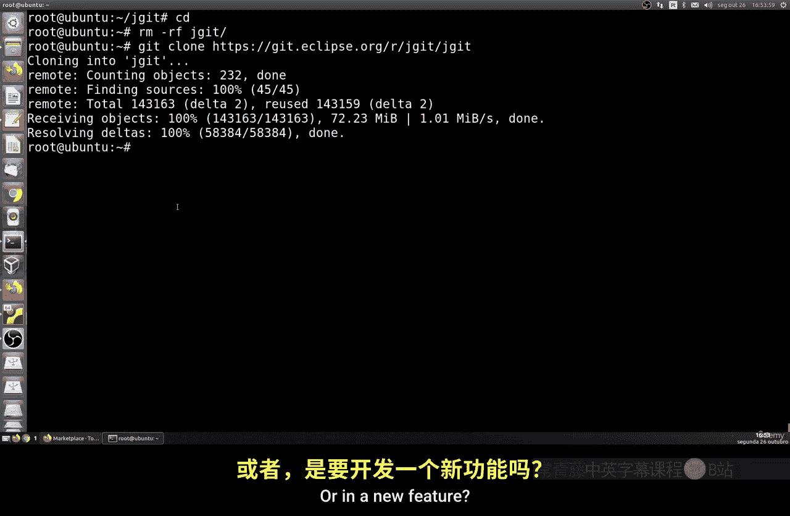

上一节我们准备好了本地环境，本节中我们来看看如何创建一个用于开发的新分支。

假设我们需要修复一个bug，可以创建一个名为 `new-bugfix` 的分支。创建分支的命令是：

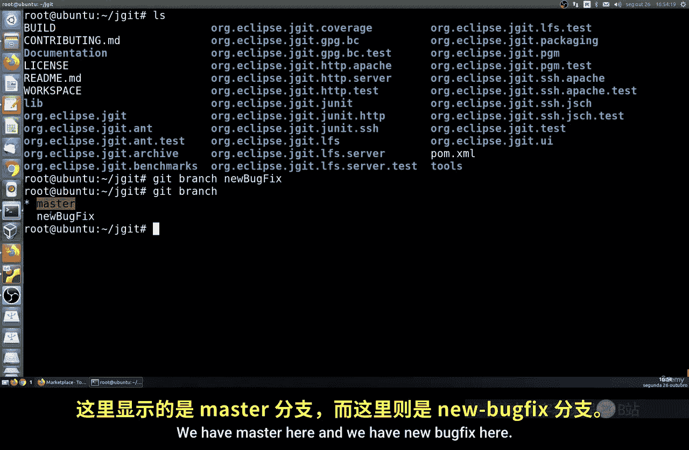

```bash
git branch new-bugfix
```

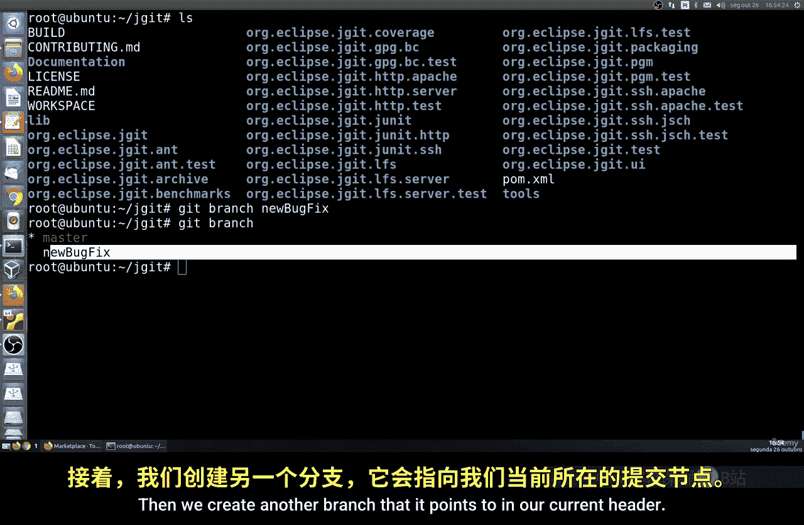

执行此命令后，Git会基于当前所在的提交（即`HEAD`指向的位置）创建一个新的分支指针。此时，新分支 `new-bugfix` 和原始分支（如 `master`）指向同一个提交。

你可以使用 `git log` 命令来验证新分支是否已创建，并查看其指向的提交ID。

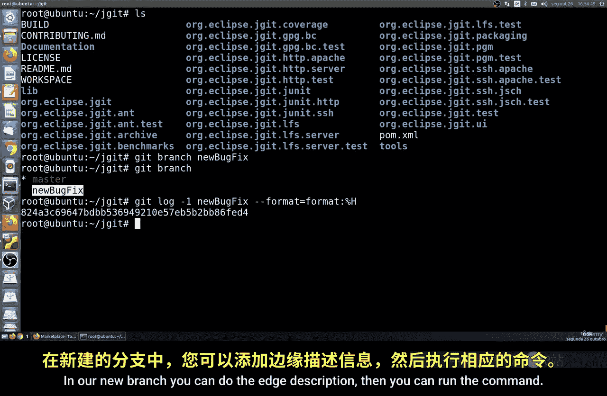

## 为分支添加描述

创建分支后，为其添加描述是一个好习惯，这有助于记录该分支的目的。

以下是添加或编辑分支描述的步骤：
1.  运行命令 `git config branch.new-bugfix.description` 进入编辑模式。
2.  系统会使用默认文本编辑器（如Nano、Vim）打开一个临时文件。
3.  输入描述信息，例如：“紧急修复组件Y的X问题”。
4.  保存并退出编辑器。

如果你想查看已保存的描述，可以使用以下命令：

```bash
git config branch.new-bugfix.description
```

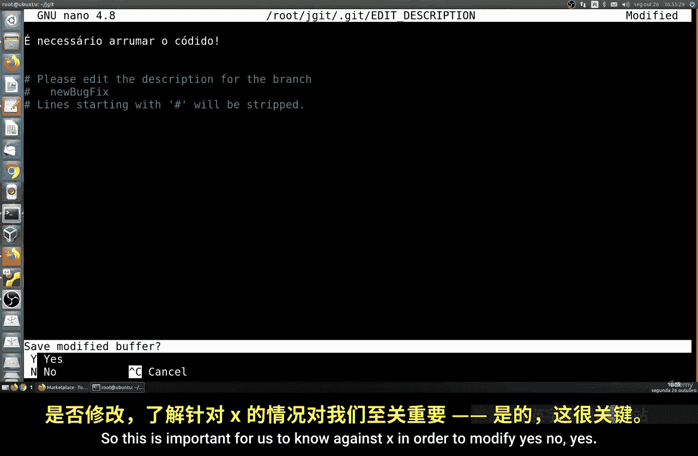

或者，你也可以直接查看Git的配置文件来获取信息。

## 基于特定提交创建分支

有时，你需要基于某个历史提交（而非当前提交）创建分支。

你可以使用以下命令格式，基于特定的提交ID创建分支：

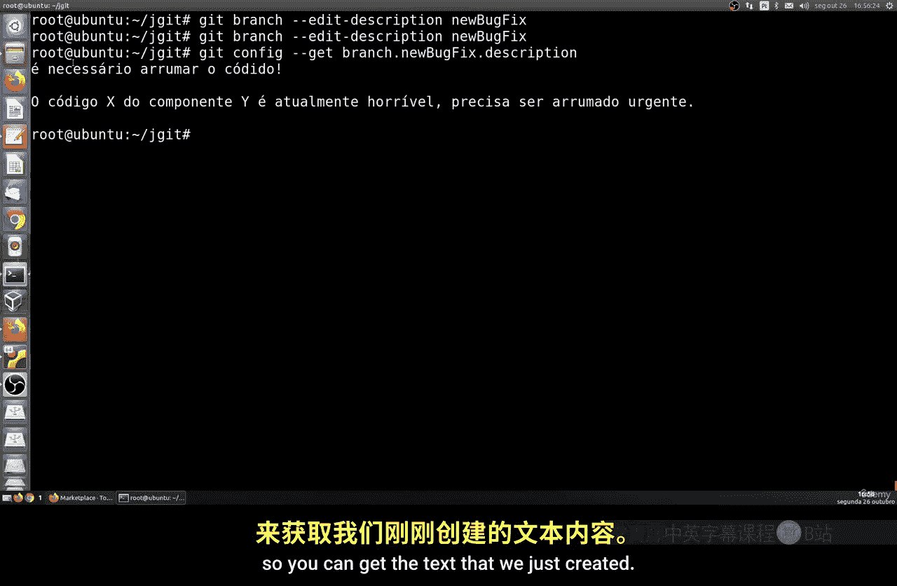

```bash
git branch another-bugfix <commit-hash>
```

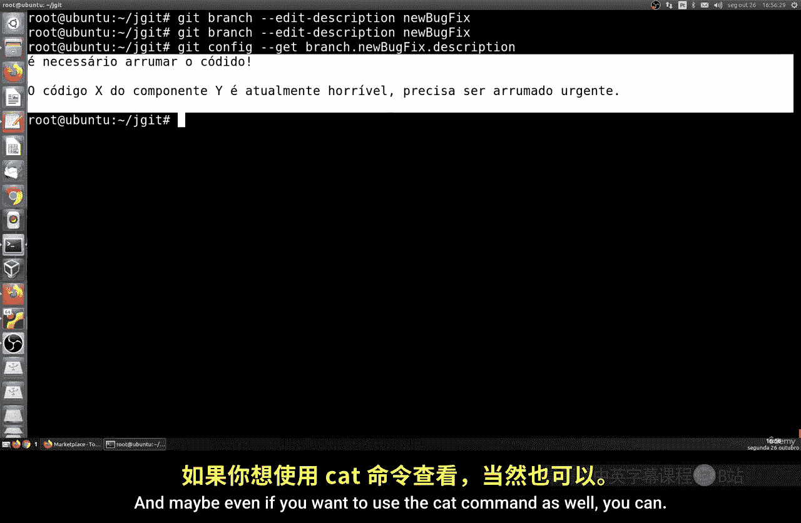

其中 `<commit-hash>` 是目标提交的ID（完整或缩写形式均可）。这样创建的分支将直接指向该历史提交。

## 创建并切换分支

通常，创建新分支后你会立即切换到该分支进行工作。`git checkout` 命令可以合并这两个步骤。

要创建并立即切换到一个新分支，请使用 `-b` 选项：

```bash
git checkout -b new-feature
```

这条命令等价于依次执行 `git branch new-feature` 和 `git checkout new-feature`。

## 查看分支列表

了解当前仓库中有哪些分支非常重要。

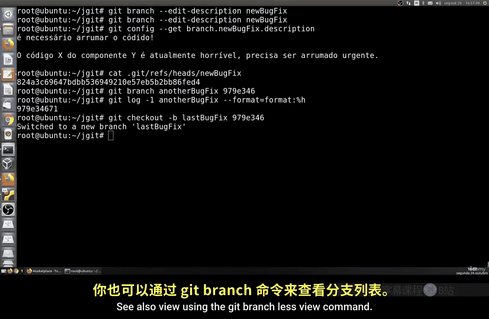

使用以下命令可以列出所有本地分支：

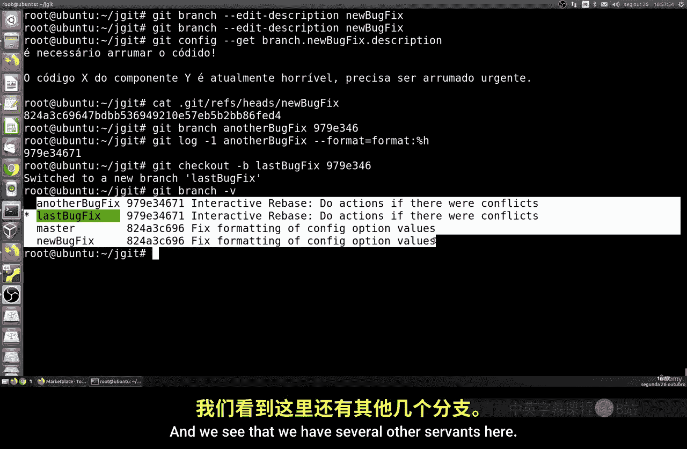

```bash
git branch
```

当前激活的分支前会有一个 `*` 号标记。默认情况下，你会看到类似这样的输出：
*   `master`
*   `new-bugfix`
*   `another-bugfix`

如果你想查看更详细的信息，包括每个分支对应的最新提交及其摘要，可以增加 `-v`（verbose）选项：

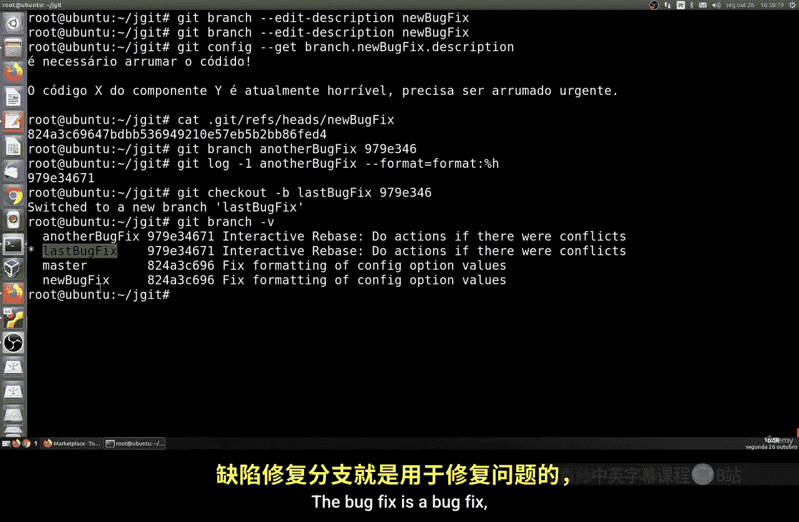

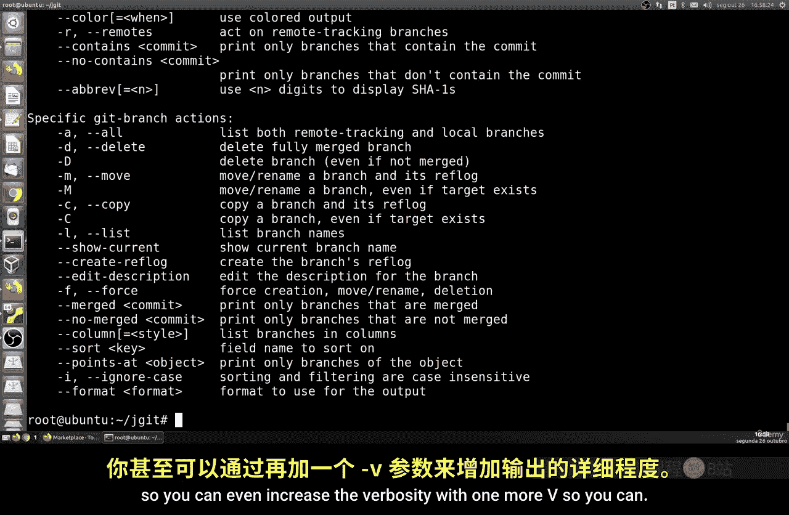

```bash
git branch -v
```

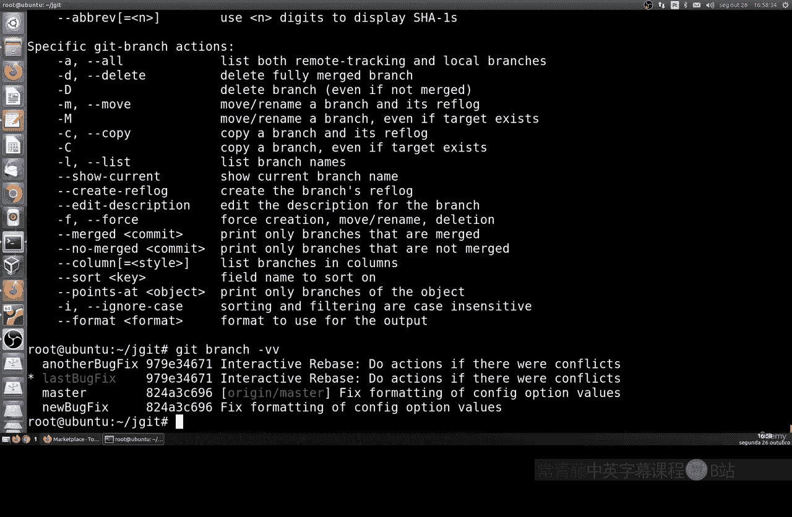

如果还想查看上游跟踪分支的信息，可以使用 `-vv` 选项：

```bash
git branch -vv
```

增加详细程度可以帮助你了解每个分支的来源和状态。

## 总结

本节课中我们一起学习了Git本地分支管理的基础操作。我们掌握了如何创建新分支、为分支添加描述性信息、基于特定历史提交创建分支、创建后立即切换到新分支，以及使用不同详细程度查看分支列表。这些技能是进行高效、有序代码开发的基础。

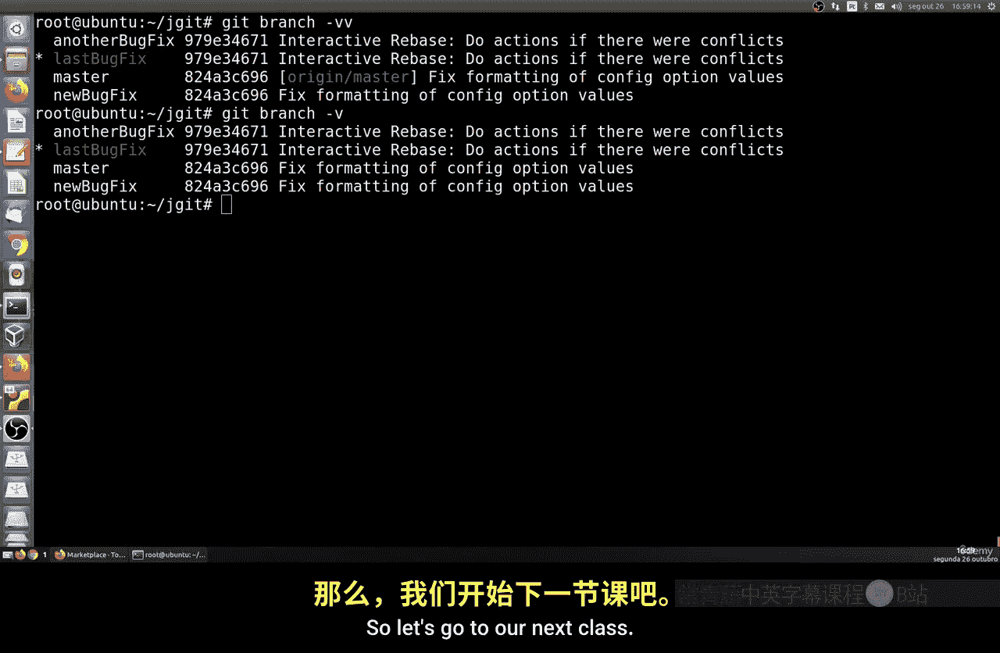

在下一节课中，我们将不再局限于本地，开始学习如何管理远程分支。