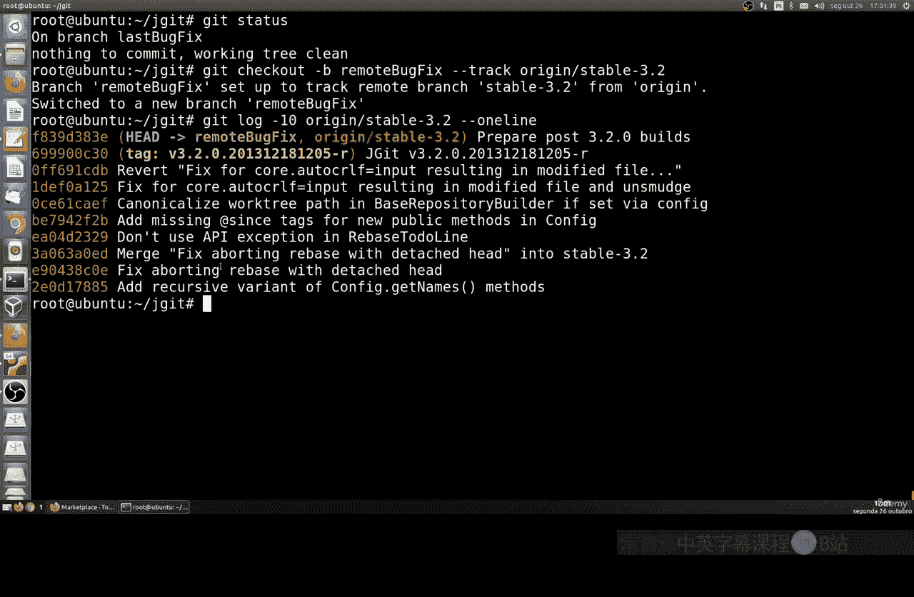
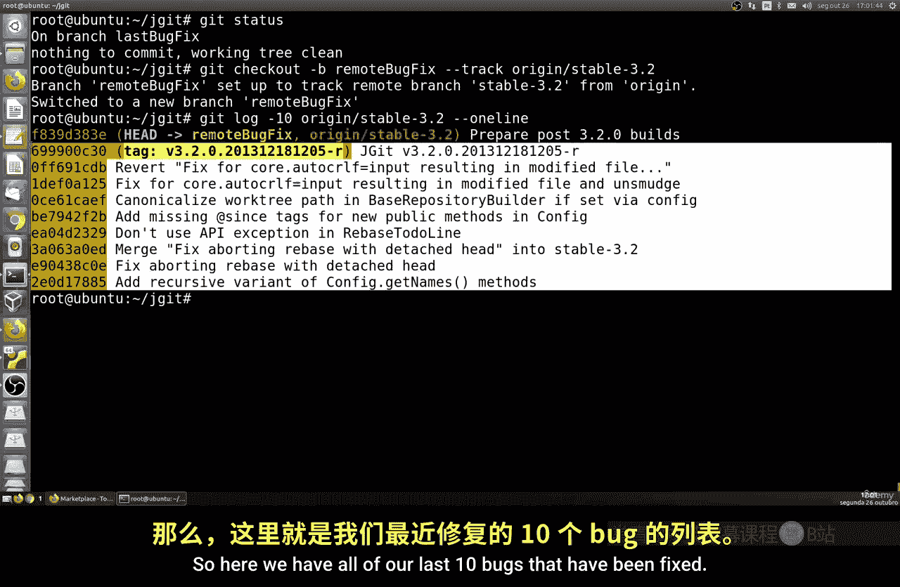
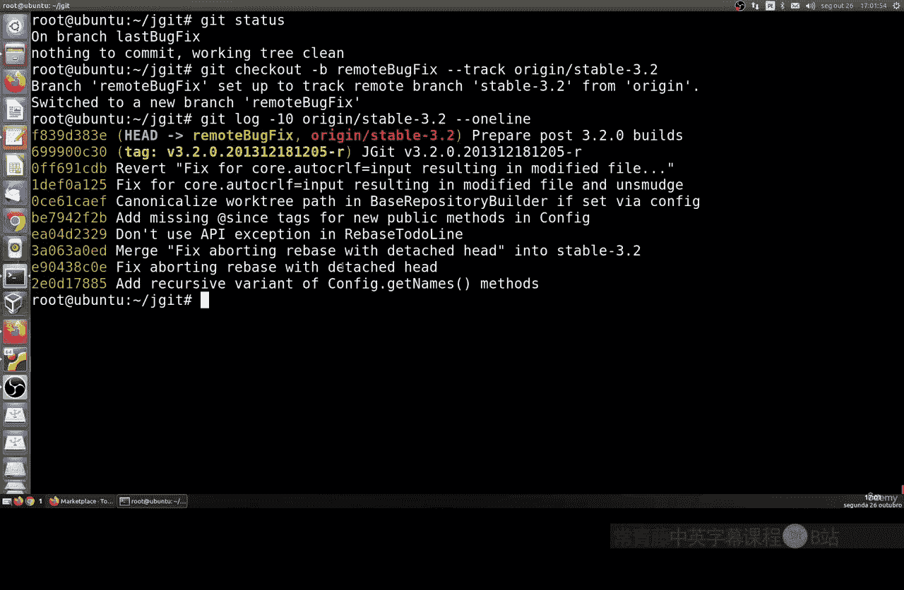
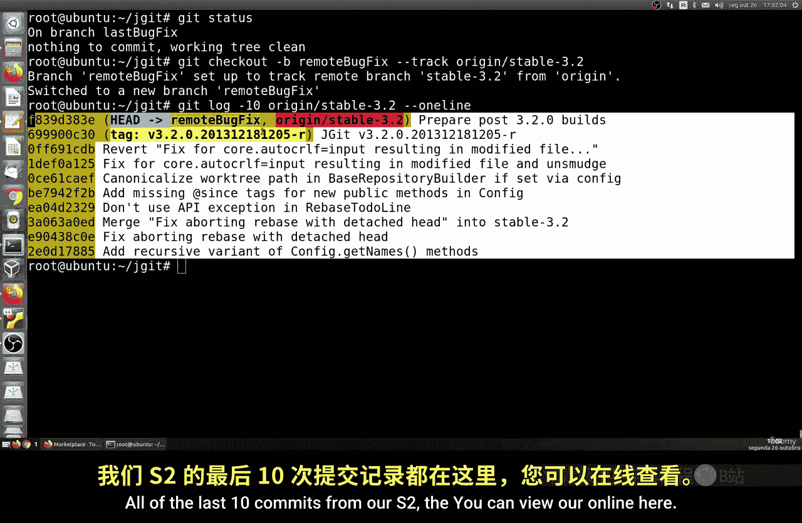
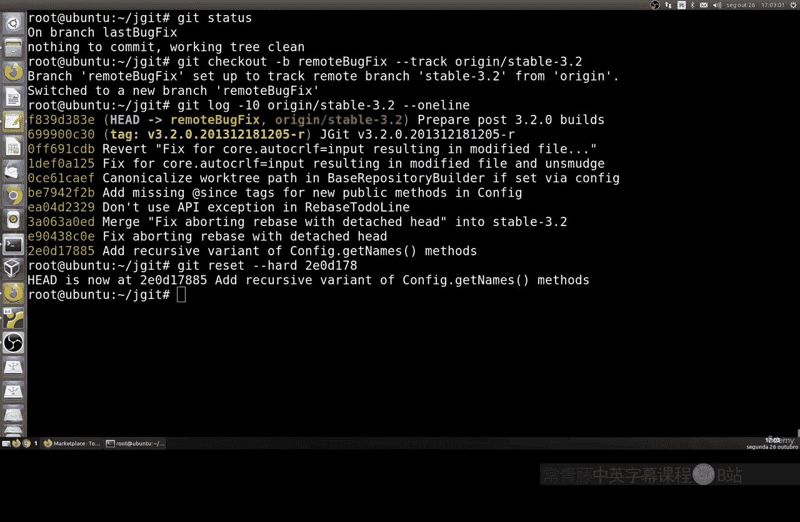
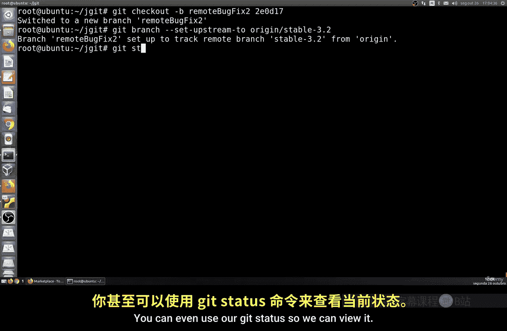
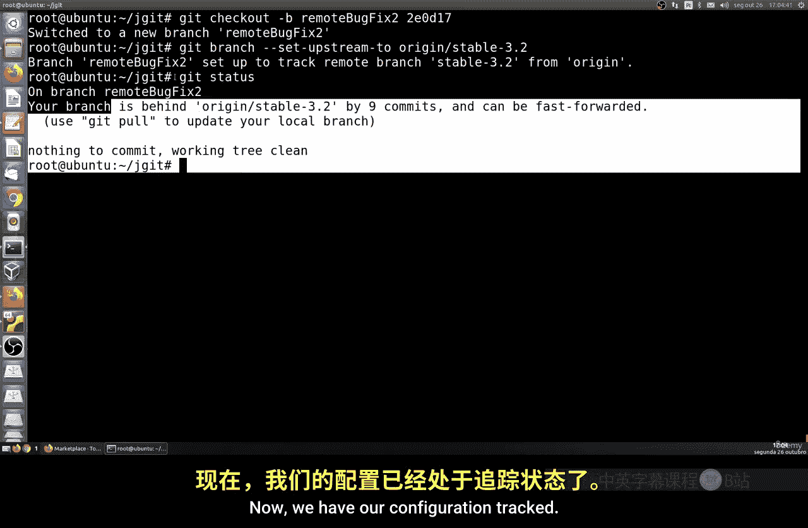
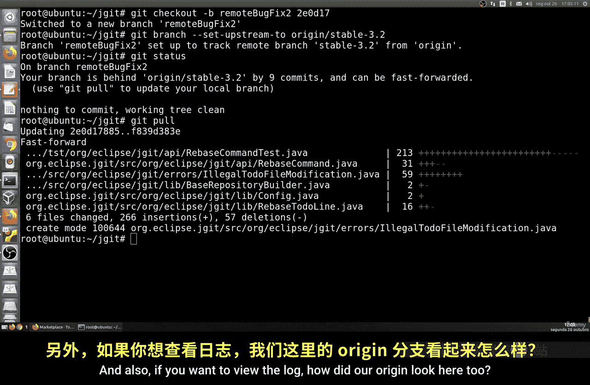
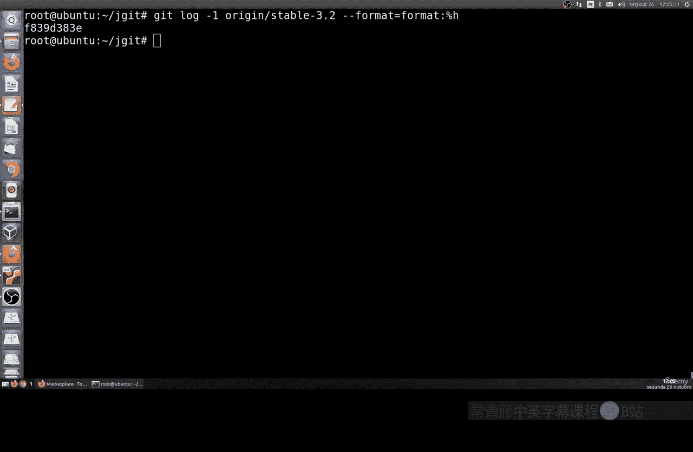

# 034：管理远程分支 🚀

在本节课中，我们将学习如何管理远程分支。我们将从克隆的在线仓库开始，探索如何查看、切换、重置分支，以及如何设置分支跟踪和合并。这些操作对于协同工作和版本控制至关重要。

上一节我们介绍了本地分支的管理，本节中我们来看看如何操作远程分支。远程分支通常存在于像GitHub这样的在线仓库中，当你克隆一个项目时，远程仓库默认被命名为 `origin`。

## 查看当前状态与分支

首先，我们可以使用 `git status` 命令来获取当前仓库的状态信息，包括我们所在的分支。

```bash
git status
```

接下来，我们可以切换到名为 `bug-fix` 的分支进行工作。假设我们想将其与远程的 `stable-3.2` 版本进行比较。

```bash
git checkout bug-fix
```

## 查看提交历史

为了了解分支之间的差异，或者需要回退到某个历史版本，我们需要查看提交日志。使用 `git log` 命令可以显示提交历史。

以下是查看最近10条提交记录的命令：

```bash
git log -10
```



执行后，你将看到类似下图的输出，其中包含了每次提交的哈希值、作者、日期和提交信息摘要。






通过日志，我们可以清晰地看到 `origin/stable-3.2` 和当前分支的提交轨迹。



## 重置分支到特定提交

如果我们决定将当前分支回退到历史上的某个特定提交点，可以使用 `git reset` 命令。例如，我们找到目标提交的哈希前缀（如 `20178`），然后执行重置。

```bash
git reset --hard 20178
```

此操作会将 `HEAD` 指针和当前分支一起移动到该次提交，之后的所有更改将被丢弃。重置后，可以再次使用 `git status` 来确认我们已处于新的历史位置。




## 合并分支

有时我们需要将一个分支的更改整合到另一个分支，这时就需要合并操作。使用 `git merge` 命令可以完成此任务。

例如，如果希望将 `bug-fix` 分支合并到当前分支：

```bash
git merge bug-fix
```

如果合并过程顺利，Git会执行一次“快进合并”。你可以使用 `git log --graph` 来可视化查看合并后的分支历史。

## 创建并跟踪新的本地分支

我们也可以基于远程分支创建一个新的本地分支。首先，切换到我们想要基于的远程分支（例如 `origin/stable-3.2`），然后创建并切换到一个新分支。

```bash
git checkout -b remote-bug-fix-2 origin/stable-3.2
```

此时，`remote-bug-fix-2` 只是一个本地分支。为了使它能跟踪对应的远程分支（便于后续的 `pull` 和 `push`），我们需要使用 `--set-upstream-to`（或 `-u`）参数。

```bash
git branch -u origin/stable-3.2
```



设置跟踪后，这个本地分支就会与指定的远程分支关联起来。再次使用 `git status`，可以看到它现在处于跟踪状态。




## 拉取远程更新

对于已设置跟踪的分支，我们可以使用 `git pull` 命令方便地获取远程仓库的最新更改并合并到当前分支。

```bash
git pull
```



同时，我们依然可以随时使用 `git log` 来查看远程分支 `origin/stable-3.2` 的最新提交历史，确保我们与团队进度同步。




本节课中我们一起学习了远程分支的核心管理操作。我们掌握了如何查看状态与日志、重置分支历史、合并分支变更、以及创建并设置跟踪新的本地分支。这些技能是高效利用Git进行团队协作和版本控制的基础。虽然步骤简洁，但对于管理远程工作流至关重要。接下来，我们将继续深入Git的其他功能。