# 036：了解GitHub主要功能 🚀

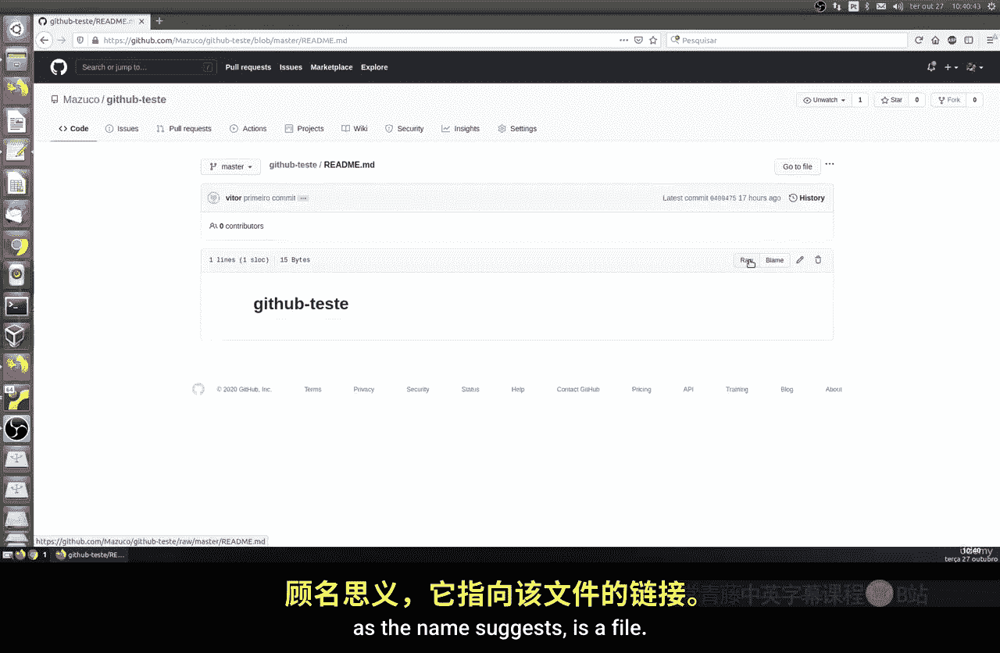

在本节课中，我们将快速了解GitHub平台提供的一些核心功能。我们将通过查看项目中的文件，来探索GitHub界面上各种按钮和选项的作用。

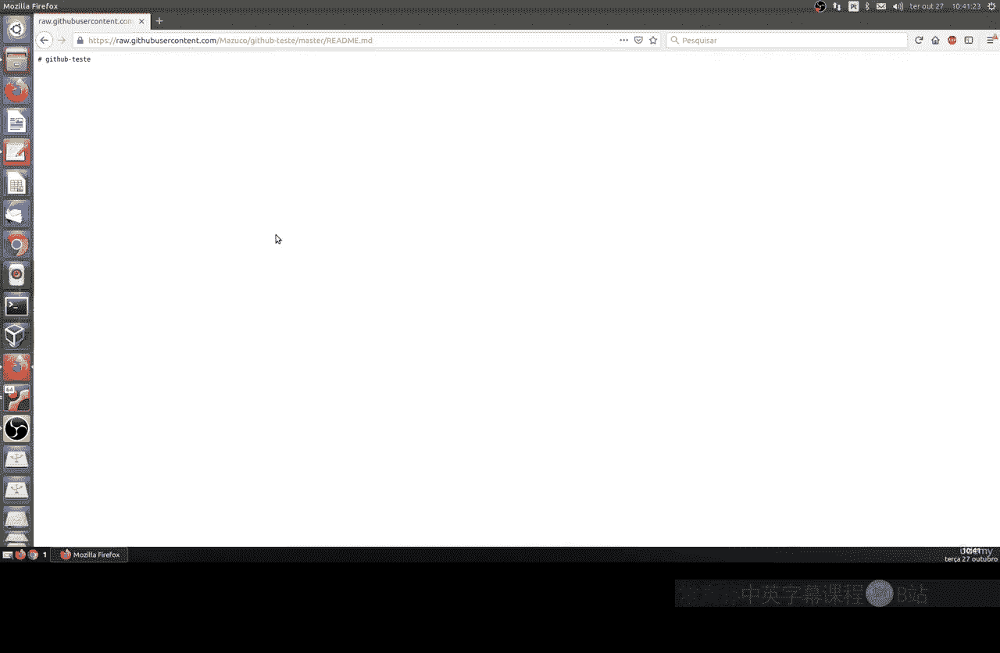

## 访问项目文件

上一节我们介绍了如何在GitHub上创建项目。本节中，我们来看看如何与项目中的文件进行交互。

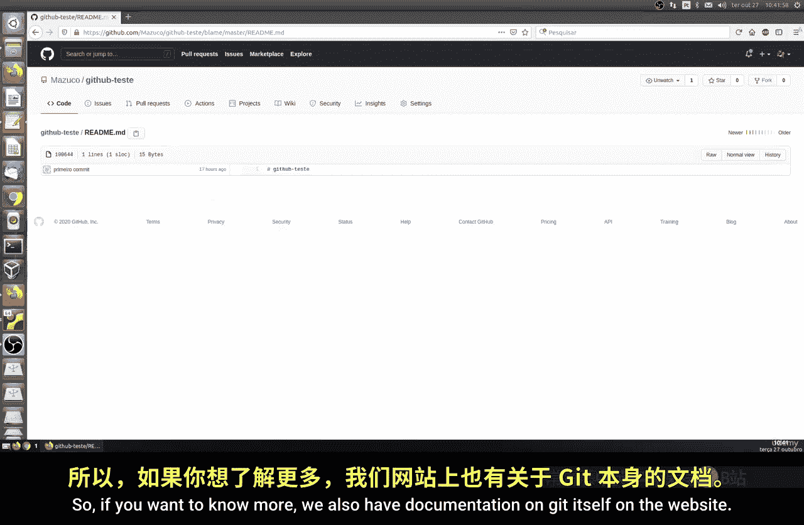

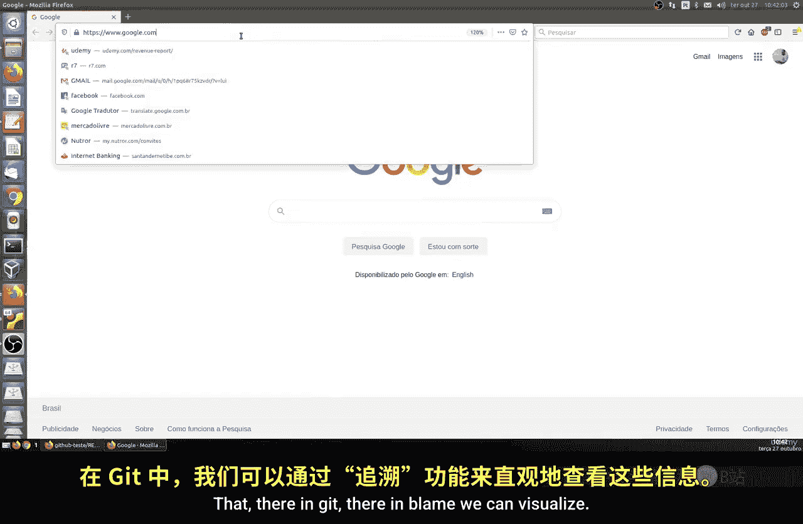

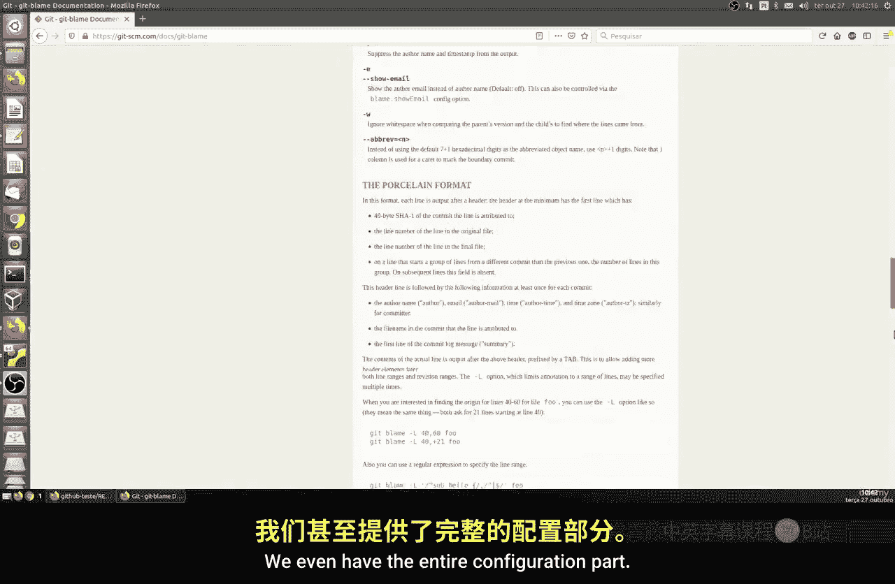

在GitHub仓库中，点击任何一个文件，我们都可以在文件内容上方看到几个功能按钮。

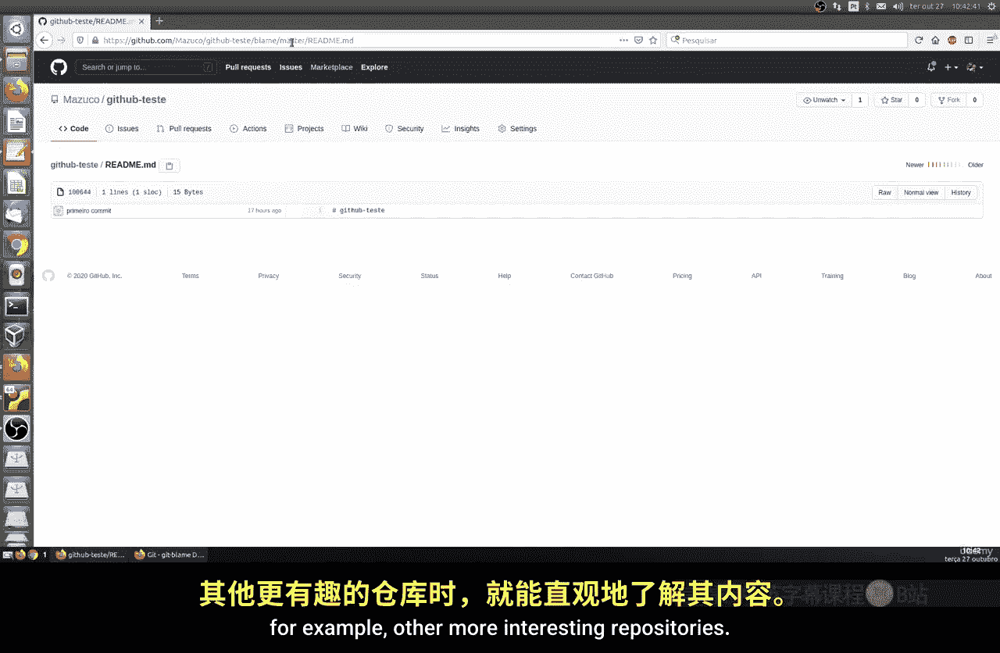

以下是这些按钮的详细说明：

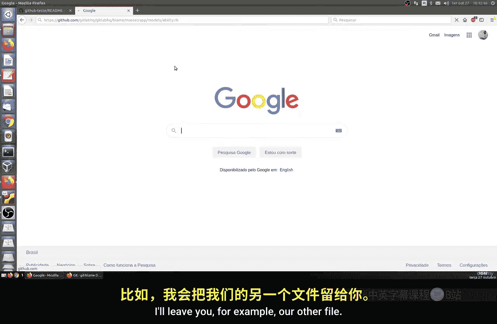

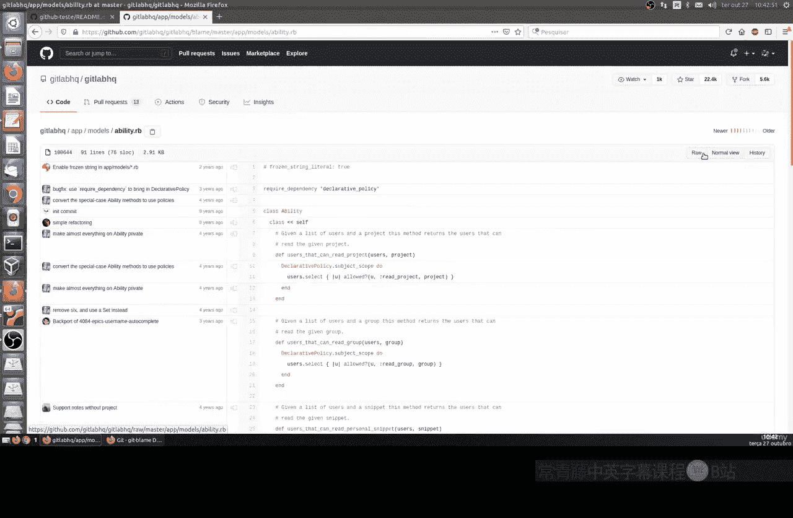

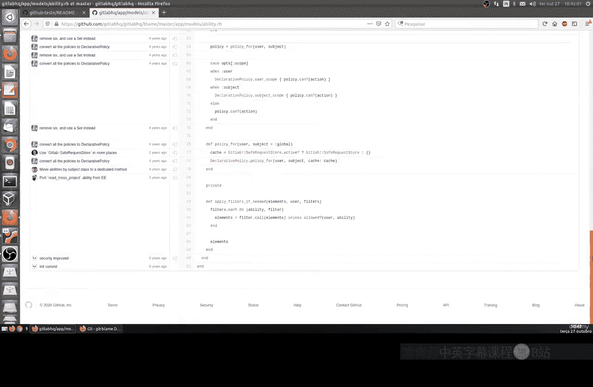

*   **Raw（原始文本）**：点击此按钮，浏览器会跳转到一个新的URL，该页面仅显示文件的原始文本内容，所有HTML格式和页面布局都会消失。这对于需要通过命令行工具（如 `wget` 或 `curl`）直接下载文件进行安装或配置的场景非常有用。
    *   **示例**：`wget https://raw.githubusercontent.com/username/repo/main/script.py`

*   **Blame（追溯）**：此功能对应Git命令中的 `git blame`。它会显示文件中每一行代码的最后修改者、修改时间以及对应的提交信息。这对于追踪代码变更历史、了解特定代码段的来源非常有帮助。

*   **Watch（关注）**：此按钮允许你“订阅”一个仓库。你可以设置不同的通知级别，以便在仓库发生特定活动时接收电子邮件通知。
    *   **Not watching（不关注）**：不接收任何通知（默认设置）。
    *   **Releases only（仅发布）**：仅在新版本发布或你被提及时接收通知。
    *   **Watching（关注）**：接收仓库的所有活动通知。

## 仓库级别的交互功能

了解了文件级别的操作后，我们再来看看仓库页面顶部的几个重要功能。

以下是仓库页面的主要交互按钮：

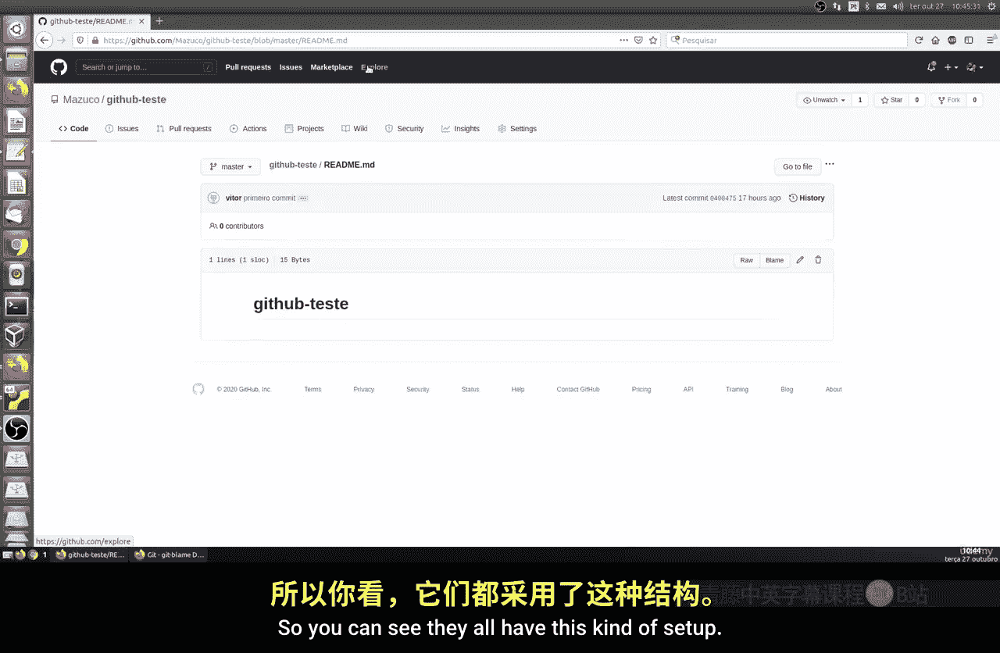

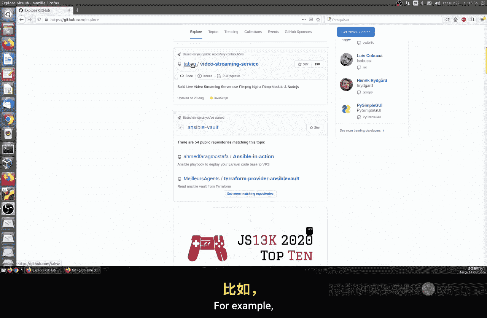

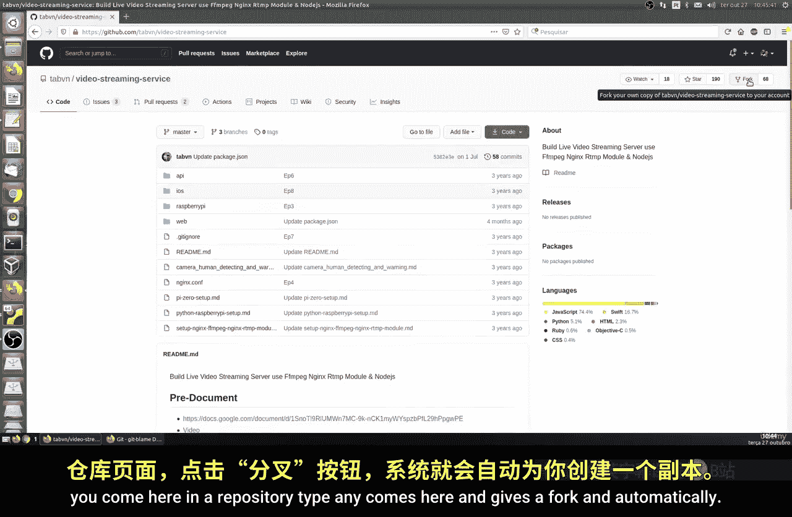

*   **Star（星标）**：点击星标按钮可以将该仓库添加到你的“已加星标”列表中。这既是对项目创建者的一种赞赏，也是标记你感兴趣或喜爱的项目的一种方式。星标数量通常被视为项目受欢迎程度的指标。

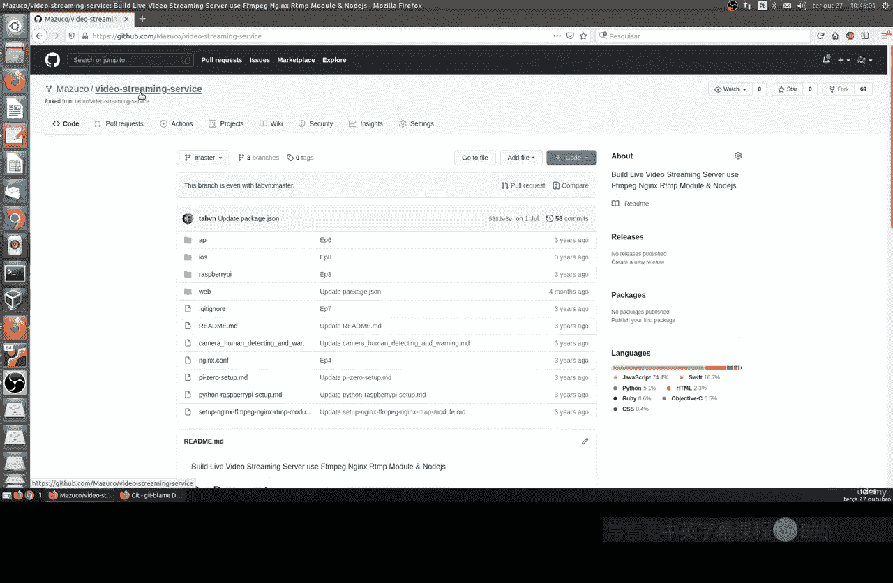

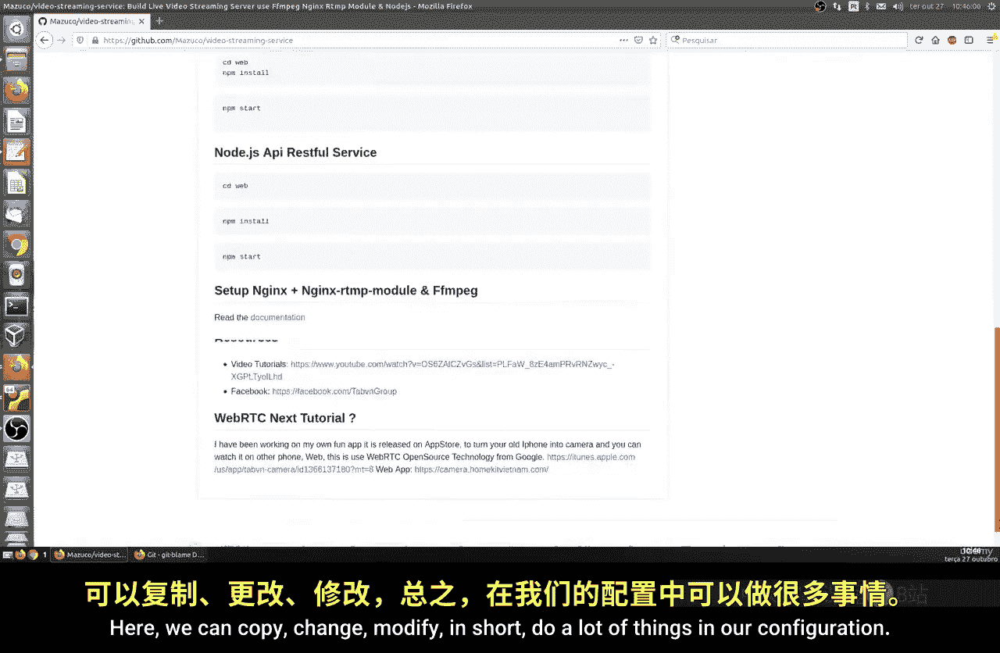

*   **Fork（分叉）**：这是GitHub一个非常强大的协作功能。点击“Fork”按钮，你可以在自己的GitHub账户下创建该仓库的一个完整副本。之后，你可以自由地在这个副本上进行修改、实验，而不会影响原始仓库。如果后续希望将你的改动合并回原项目，可以通过发起“Pull Request（拉取请求）”来实现。

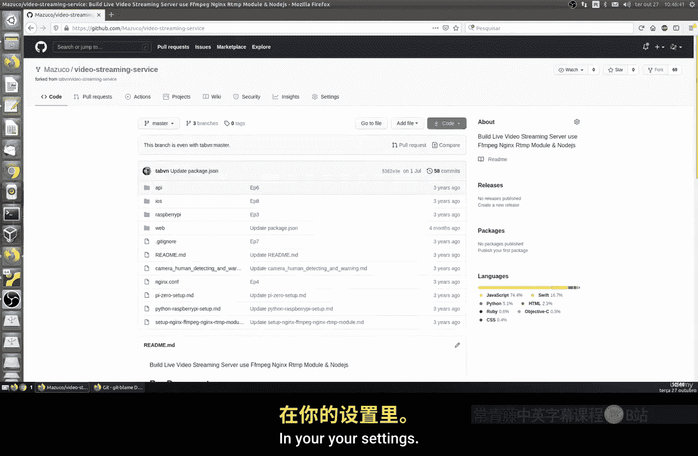

本节课中，我们一起学习了GitHub的几个关键功能：通过 **Raw** 按钮获取原始文件，使用 **Blame** 功能追溯代码历史，通过 **Watch** 设置关注仓库动态，用 **Star** 表达对项目的支持，以及利用 **Fork** 功能创建个人副本以进行独立开发和贡献。掌握这些功能，将帮助你更高效地使用GitHub进行代码管理和协作。