# 037：深入研究 `checkout` 与 `reset` 🔍

在本节课中，我们将深入学习 Git 中的 `checkout` 和 `reset` 命令。我们将通过实际操作，理解它们如何管理分支和撤销更改，并掌握 `soft`、`mixed` 和 `hard` 三种重置模式的区别。

## 概述

我们将从确认当前分支状态开始，然后探索如何使用 `checkout` 切换分支，以及当存在未提交的更改时会发生什么。接着，我们将深入研究 `reset` 命令，通过添加和撤销文件修改来演示 `git diff` 和 `git diff --cached` 的用法，并详细解释 `soft`、`mixed` 和 `hard` 三种重置选项的具体效果。

---

### 确认当前分支状态

首先，我们需要确保我们位于 `master` 分支上。可以使用以下命令进行重置和确认：

```bash
git reset --hard master
git branch
```

执行后，我们可以看到当前的所有分支，例如 `master`、`bug`、`berries` 和 `mellon`。

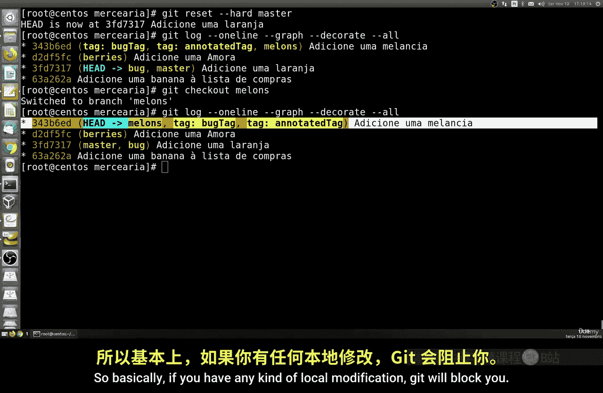

### 使用 `checkout` 切换分支

`checkout` 命令用于切换分支。其基本语法是：

```bash
git checkout <分支名>
```

例如，切换到 `chato` 分支：

```bash
git checkout chato
```

切换后，使用 `git log` 可以查看新分支的提交历史。

### `checkout` 的限制：存在未提交更改时

如果工作目录中存在未保存的修改（即“脏状态”），Git 会阻止你切换分支，以避免丢失更改。

让我们做一个测试：修改 `shopping_list.txt` 文件，添加一个新物品（例如“garlic”），然后尝试切换分支。

```bash
# 尝试切换分支，将会失败
git checkout master
```

Git 会提示错误，要求你先提交或贮藏（stash）更改。

为了成功切换，你需要撤销刚才的修改。可以手动编辑文件删除新增行，或者使用 `git checkout -- <文件名>` 来丢弃该文件的更改：

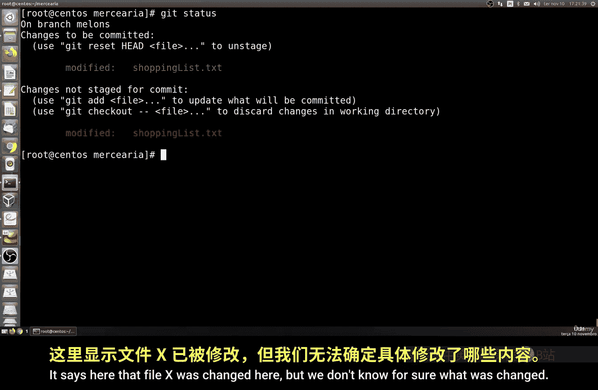

```bash
git checkout -- shopping_list.txt
```

### 使用 `git diff` 查看更改

在深入 `reset` 之前，了解如何查看更改很重要。`git diff` 命令可以显示工作目录与暂存区（或上一次提交）之间的差异。

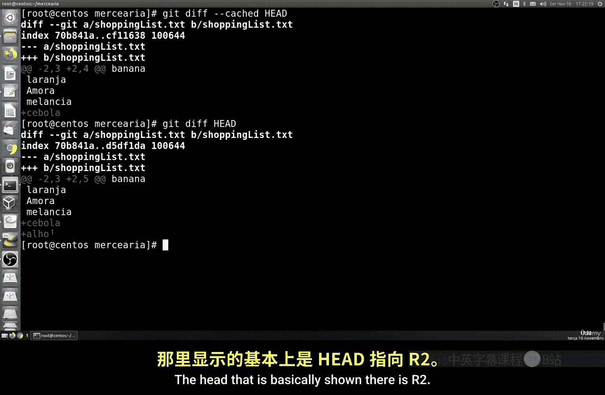

首先，让我们再次修改购物清单，添加“garlic”和“onion”：

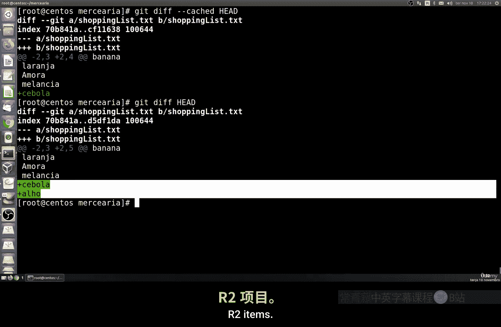

```bash
# 添加更改后，运行
git diff
```

命令输出会以 `-` 和 `+` 符号高亮显示具体被添加或删除的行，让你清晰看到“onion”被加入了文件。

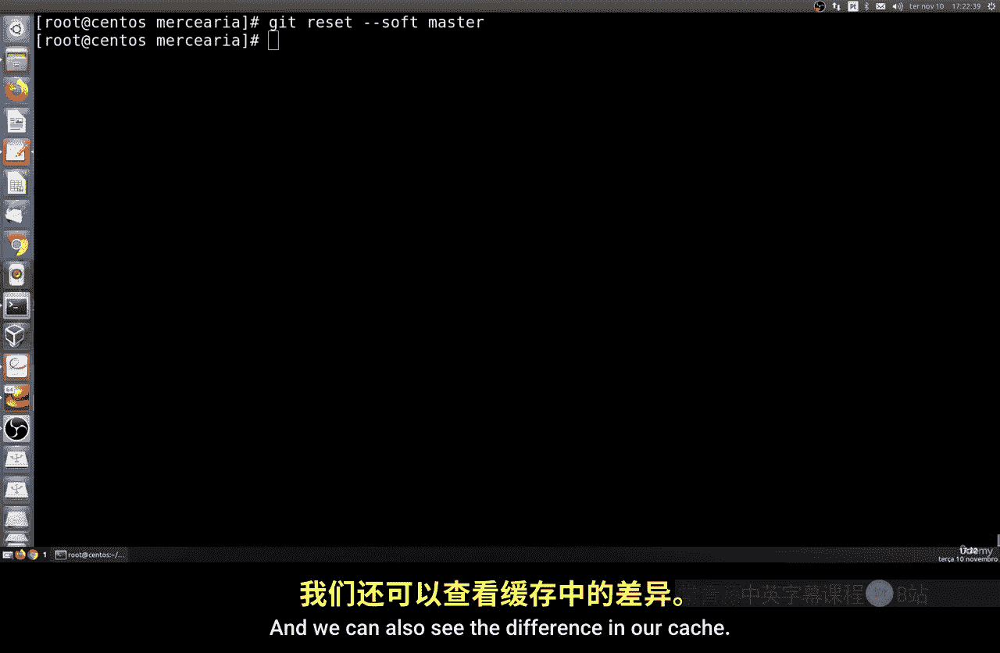

另一个有用的命令是 `git diff HEAD`，它可以比较工作目录与最新提交（HEAD）之间的差异。

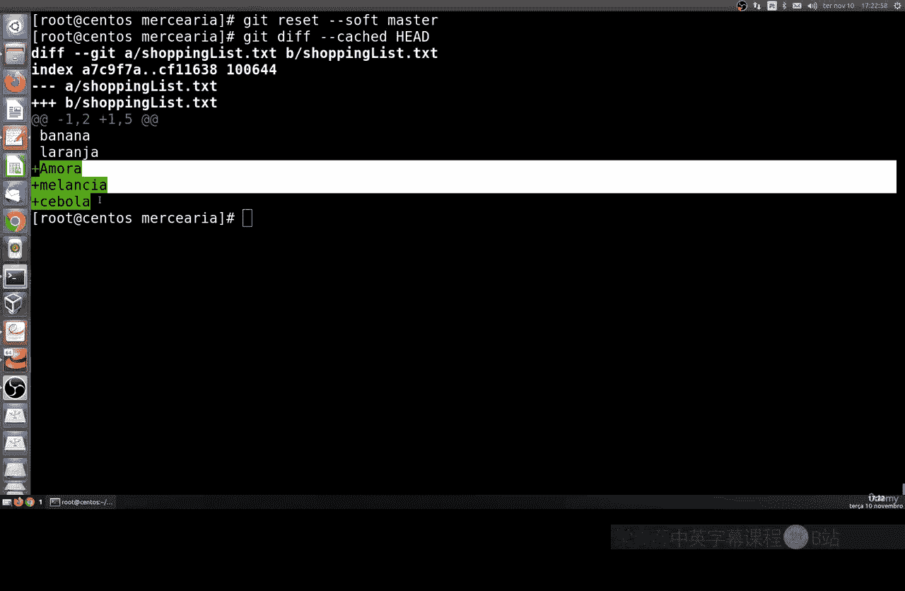

### 理解 `reset` 命令

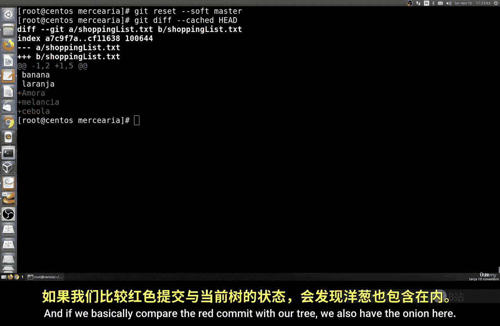

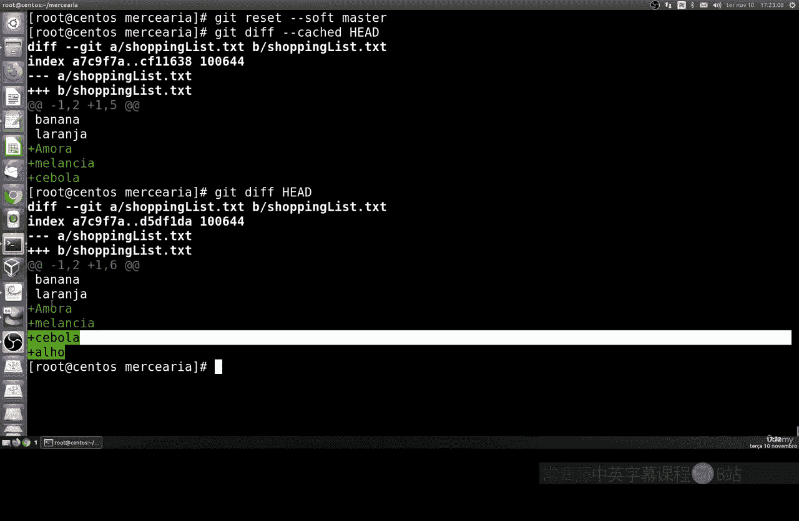

`reset` 命令用于将当前分支的 HEAD 指针重置到指定的提交，并根据使用的选项影响暂存区和工作目录。主要有三种模式：

1.  **`--soft`**：仅移动 HEAD 指针，不改变暂存区和工作目录。之前的更改会保留在暂存区。
2.  **`--mixed`**（默认）：移动 HEAD 指针，并重置暂存区以匹配新的提交，但不改变工作目录。更改会保留在工作目录中，但变为未暂存状态。
3.  **`--hard`**：移动 HEAD 指针，并重置暂存区和工作目录，完全匹配新的提交。**此操作会丢弃所有未提交的更改**，需谨慎使用。

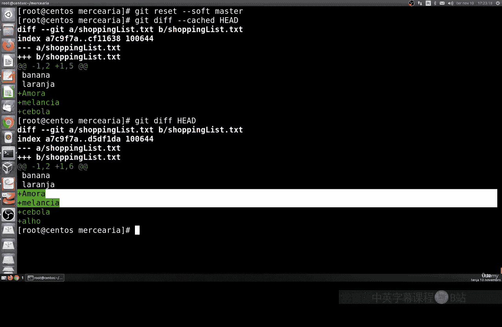

以下是每种模式的示例：

```bash
# 软重置：更改保留在暂存区
git reset --soft HEAD~1

# 混合重置（默认）：更改保留在工作目录，但未暂存
git reset --mixed HEAD~1
# 或简写为
git reset HEAD~1

# 硬重置：丢弃所有未提交的更改
git reset --hard HEAD~1
```

### 实践：比较重置前后的状态

为了看清区别，我们在重置后使用 `git diff` 和 `git diff --cached` 进行比较。

*   `git diff`：显示工作目录与暂存区的差异。
*   `git diff --cached`：显示暂存区与上一次提交（HEAD）的差异。

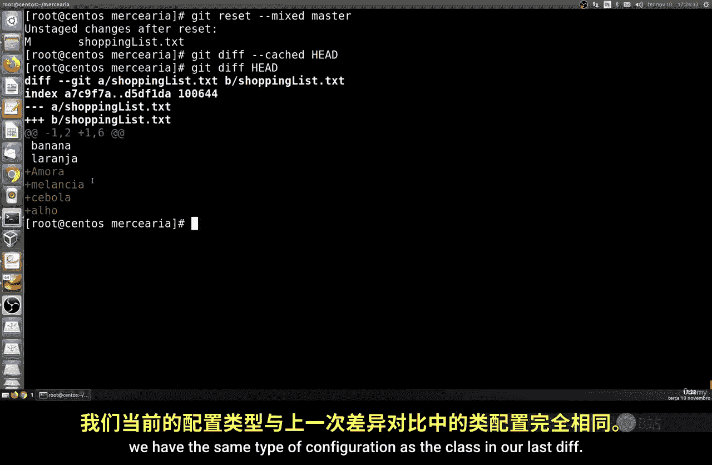

执行 `soft` 重置后，使用 `git diff --cached` 可能仍会显示之前暂存的更改。而执行 `mixed` 重置后，`git diff --cached` 将显示为空，但 `git diff` 会显示工作目录中的更改。执行 `hard` 重置后，`git diff` 和 `git diff --cached` 都将显示为空，因为所有更改都已丢弃。

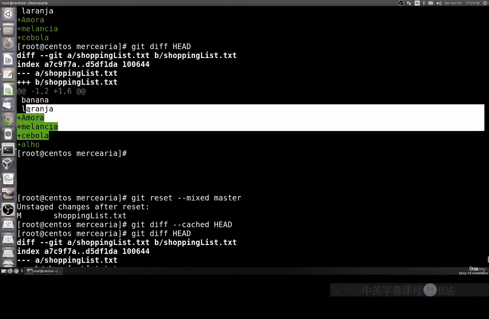

### `hard` 重置的用途

`git reset --hard` 最常用于**彻底丢弃最近的所有更改**，将仓库状态完全回退到某个特定提交。这是一个危险但强大的命令，使用时必须确保你不再需要那些即将被丢弃的修改。

---

## 总结

本节课我们一起深入学习了 Git 中的 `checkout` 和 `reset` 命令。

我们了解到，`checkout` 主要用于切换分支，但在工作目录不“干净”时会受到限制。而 `reset` 是一个强大的历史回退工具，它通过 `--soft`、`--mixed` 和 `--hard` 三种选项，提供了不同级别的撤销更改控制：从仅移动指针，到重置暂存区，再到彻底清除工作目录的修改。

核心在于理解这三个选项如何分别影响 **HEAD 指针**、**暂存区（Index）** 和 **工作目录（Working Directory）**。掌握这些命令能让你更自信地管理项目历史和修复错误。

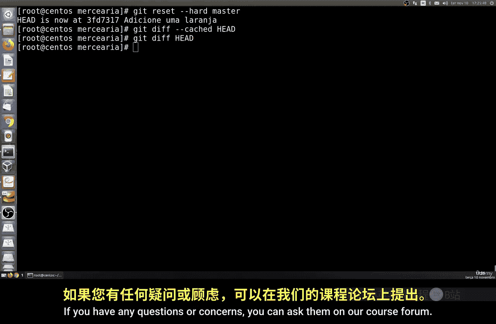

如果在学习过程中有任何疑问，欢迎在我们的课程论坛中提出。