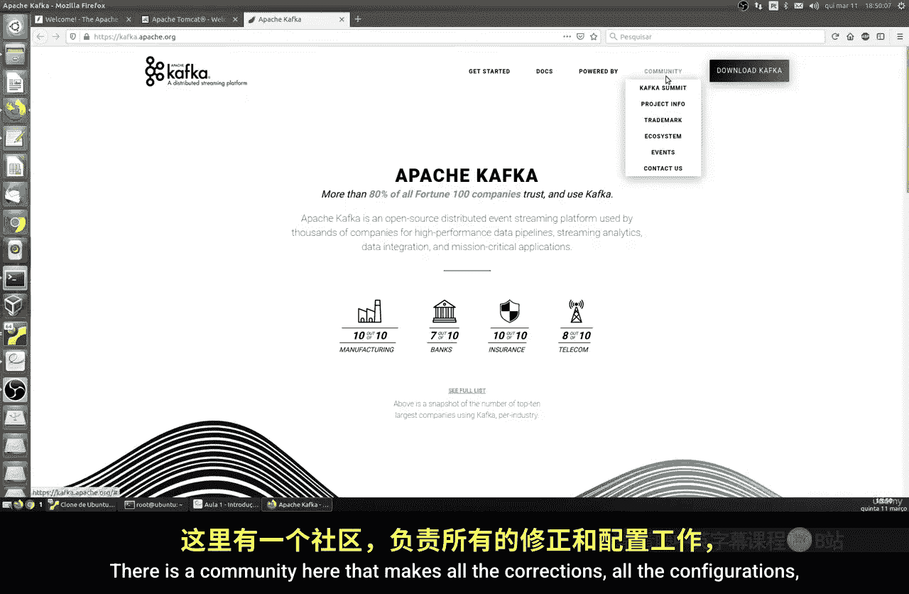
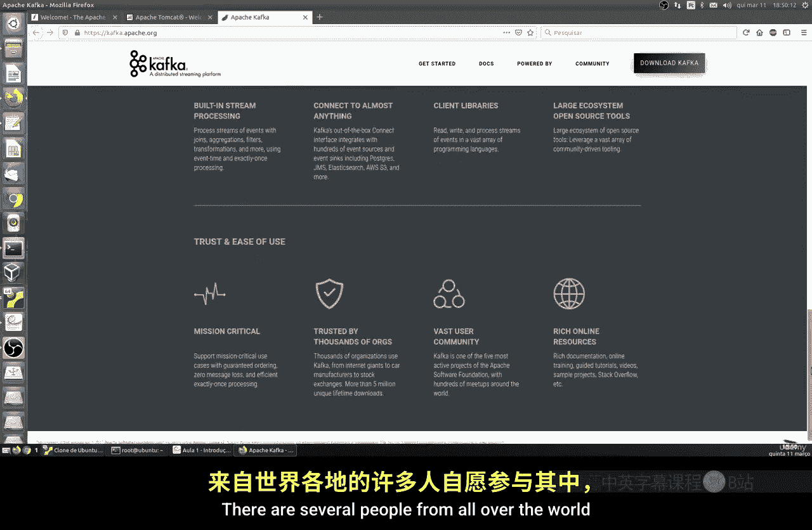
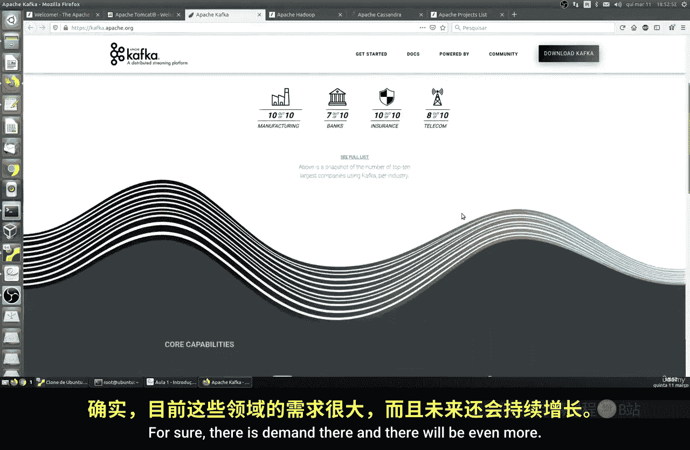
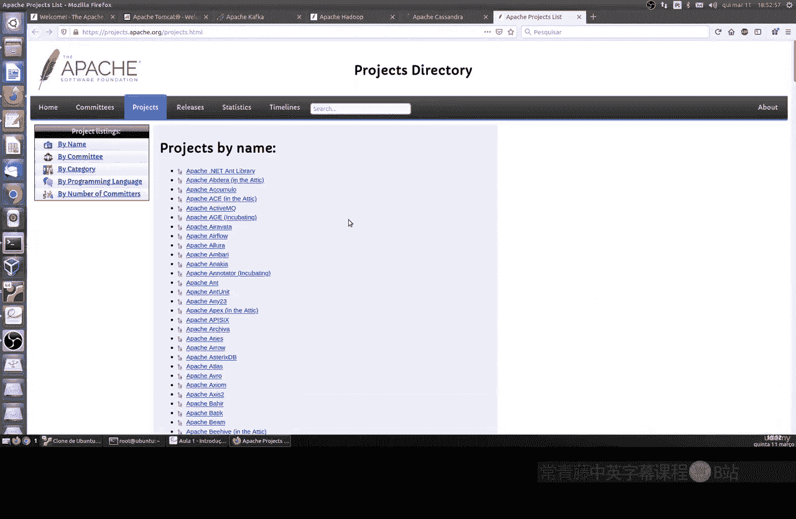

# 038：Apache介绍 🚀

在本节课中，我们将要学习Apache，一个开源且广泛使用的Web服务器软件。我们将了解它的历史、核心特性以及由Apache软件基金会维护的其他重要项目。

## 概述

Apache是一个开源的Web服务器软件，自1995年创建以来，在全球范围内被广泛使用。它以其高安全性、可扩展性和活跃的社区支持而闻名。除了Web服务器本身，Apache生态系统还包含许多其他专注于不同领域的项目。

## Apache Web服务器

上一节我们概述了Apache，本节中我们来看看Apache HTTP Server本身的核心特性。

Apache HTTP Server是Apache软件基金会下的旗舰项目。它是一个模块化的服务器，能够处理大量并发连接。其官方网站是 `httpd.apache.org`。

以下是Apache Web服务器的一些关键特性：

*   **高并发处理**：能够轻松处理超过10,000个并发连接。
*   **代理与负载均衡**：内置代理模块，支持负载均衡和服务器健康状态检查。
*   **灵活的安全控制**：支持基于名称、IP地址和地理位置的访问控制，以及TLS/SSL加密。
*   **广泛的协议与格式支持**：支持HTTP/2、WebSocket、CGI、FastCGI，以及GZip压缩等多种技术和格式。

## Apache生态系统中的其他项目

除了核心的Web服务器，Apache软件基金会还孵化了许多其他成功的开源项目，它们各自专注于不同的技术领域。

以下是几个重要且流行的Apache项目简介：

*   **Tomcat**：一个轻量级的应用服务器，专门用于运行Java Servlet和JavaServer Pages。如果你的应用基于Java技术栈，Tomcat是一个理想的选择。其核心是一个Java Web容器。
*   **Kafka**：一个分布式流处理平台，专注于高吞吐量、低延迟的实时数据处理。广泛应用于金融、电信等领域，用于构建实时数据管道和流式应用。其架构基于**发布-订阅消息系统**。
*   **Hadoop**：一个用于分布式存储和处理海量数据的框架。其核心是HDFS和MapReduce，特别注重集群的容错能力，是大数据领域的基石技术。
*   **Cassandra**：一个高度可扩展的分布式NoSQL数据库管理系统。它擅长跨多个数据中心处理大量数据，提供高可用性和无单点故障的集群支持，类似于MongoDB但架构不同。

所有这些项目都是免费、开源的，拥有庞大的社区支持，由来自世界各地的开发者共同维护和改进。

## 总结

本节课中我们一起学习了Apache HTTP Server及其庞大的生态系统。我们了解了Apache Web服务器的历史、核心优势与特性。同时，我们也简要介绍了Apache旗下的其他重要项目，如Tomcat、Kafka、Hadoop和Cassandra，它们分别在Java Web、实时流处理、大数据和分布式数据库领域扮演着关键角色。这些技术在当前IT行业均有很高的需求和应用价值。在接下来的课程中，我们将从最基础、最传统的Apache Web服务器开始，进行实际操作学习。