# 039：安装与配置Apache 🚀

在本节课中，我们将学习如何在Linux系统上安装Apache Web服务器，并进行初步配置。我们将了解Apache的基本工作原理、关键配置文件的位置以及如何管理网站。

---

## 概述

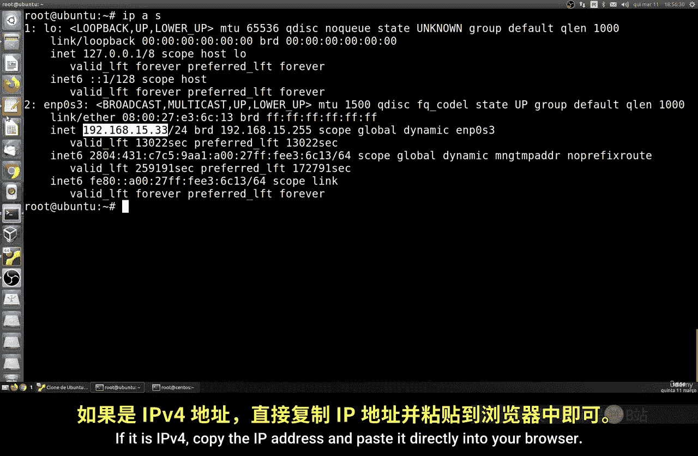

Apache是一款广泛使用的开源Web服务器软件。本节将指导你完成安装过程，并解释其默认配置和核心目录结构。我们还将初步了解虚拟主机的概念，这是Apache支持多网站托管的关键功能。

---

## 安装Apache

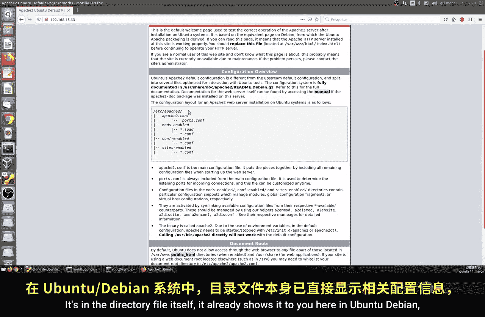

上一节我们介绍了Linux的网络基础，本节中我们来看看如何安装Web服务器。安装过程在不同Linux发行版上略有不同，主要在于包管理器的命令。

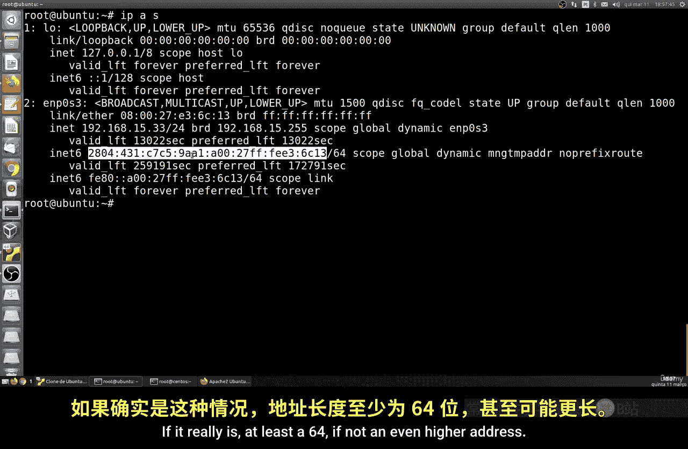

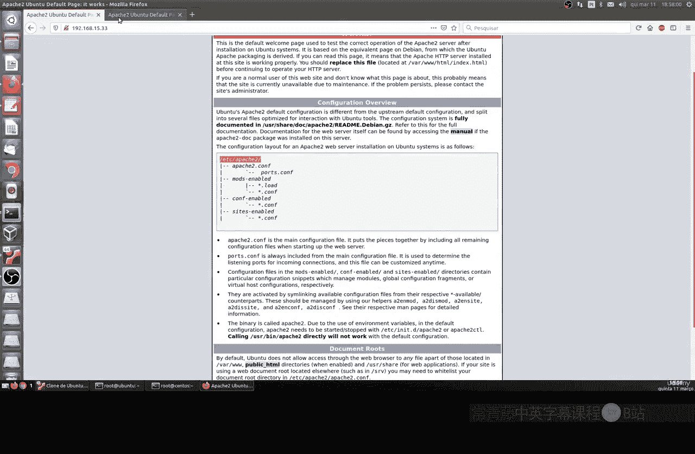

以下是安装步骤：

*   在Ubuntu或Debian系统上，使用 `apt` 包管理器：
    ```bash
    sudo apt update
    sudo apt install apache2
    ```
*   在Red Hat、Fedora或CentOS等系统上，使用 `dnf` 或 `yum` 包管理器：
    ```bash
    sudo dnf install httpd
    # 或
    sudo yum install httpd
    ```

安装过程非常快速。安装完成后，理论上你已经拥有了Web服务器的全部功能。

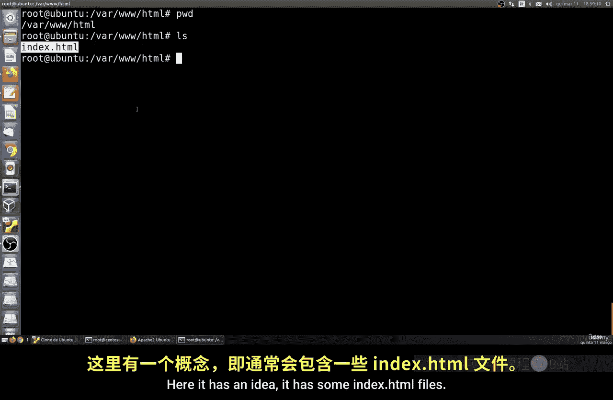

---

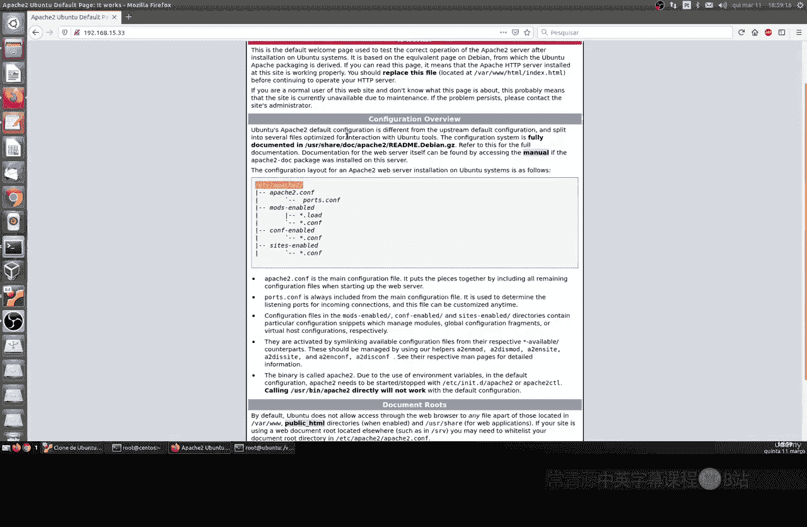

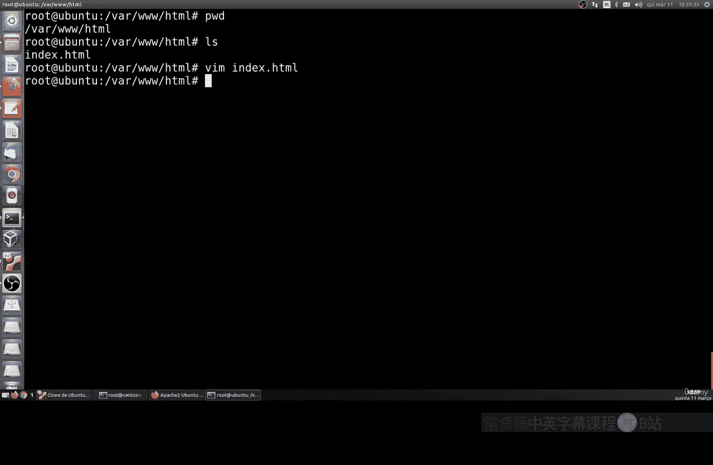

## 验证安装与访问默认页面

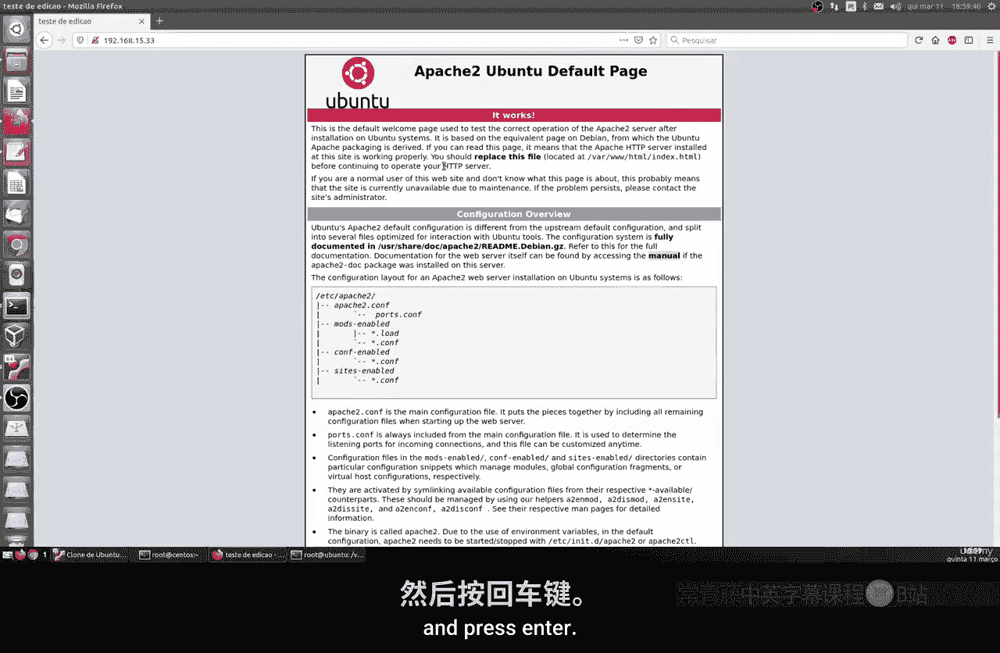

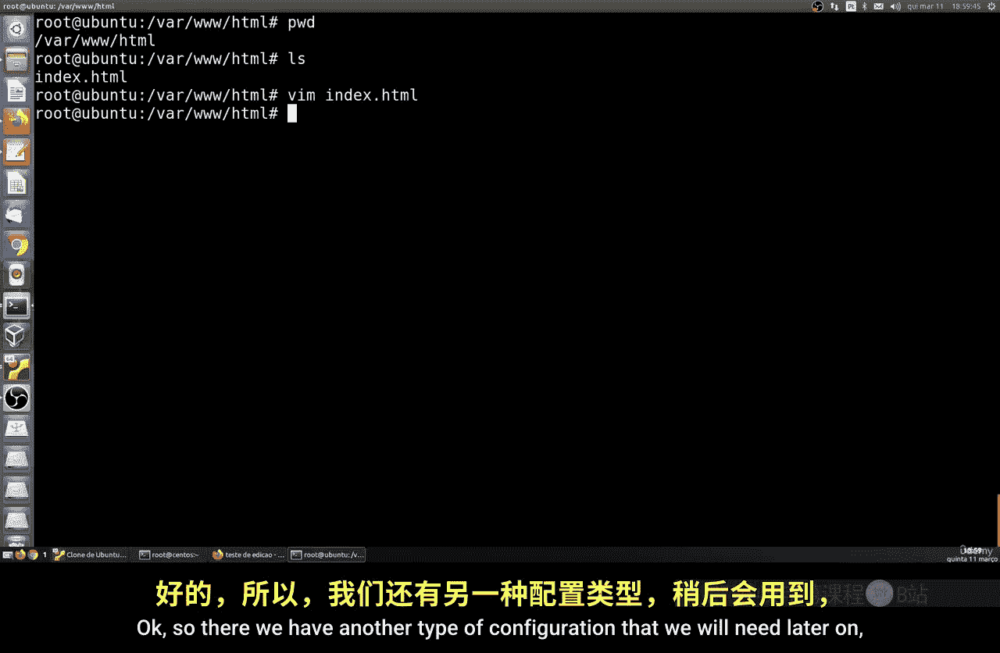

安装完成后，Apache会自动启动并应用一些默认配置。你可以通过服务器的IP地址来测试它是否正常工作。

以下是验证步骤：

1.  获取你的服务器IP地址。
2.  打开浏览器，在地址栏输入该IP地址。
3.  如果看到Apache的默认测试页面，说明安装成功。

对于IPv4地址，直接输入即可，例如 `192.168.1.100`。对于IPv6地址，需要将地址用方括号括起来，例如 `[2001:db8::1]`。两种方式都会显示相同的默认页面。

这个默认页面是一个名为 `index.html` 的文件，它位于Apache的默认网站文件目录中。

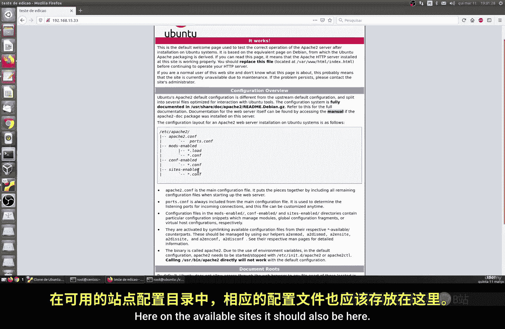

---

## Apache的核心目录与文件

现在我们已经让Apache运行起来了，接下来需要了解它的关键配置文件位于何处。这些文件控制着服务器的行为。

在Ubuntu/Debian系统中，Apache的主要配置目录是 `/etc/apache2/`。以下是一些重要子目录：

*   **`/etc/apache2/apache2.conf`**： 主配置文件。
*   **`/etc/apache2/sites-available/`**： 存放所有可用网站（虚拟主机）的配置文件。
*   **`/etc/apache2/sites-enabled/`**： 存放当前已启用的网站配置文件的符号链接。
*   **`/etc/apache2/mods-available/`** 和 **`/etc/apache2/mods-enabled/`**： 用于管理Apache模块。

网站的实际文件（如HTML、PHP文件）默认存放在 **`/var/www/html/`** 目录下。你之前访问的默认 `index.html` 文件就在这个目录里。

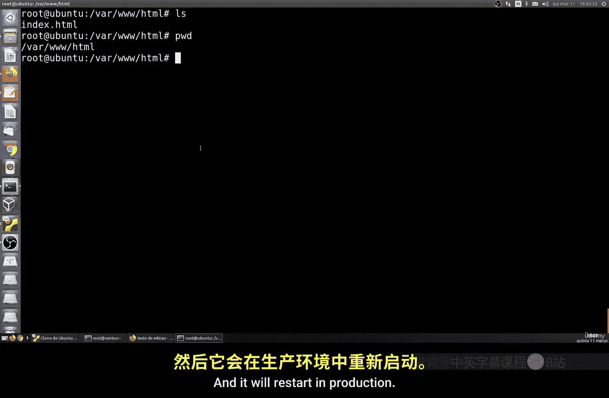

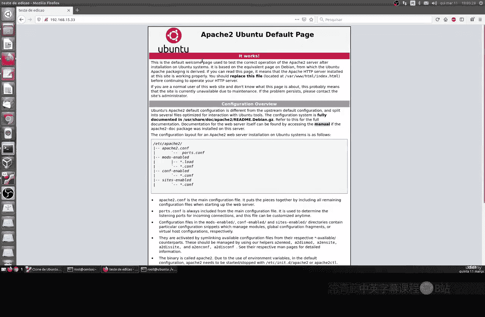

你可以编辑这个文件来测试更改。例如，使用文本编辑器修改 `/var/www/html/index.html` 的内容后，需要重新加载Apache配置才能使更改在浏览器中生效。

---

## 虚拟主机概念简介

Apache最强大的功能之一是支持**虚拟主机**。这意味着你可以在单个Apache服务器上托管多个不同的网站，而无需为每个网站配备单独的物理服务器。

虚拟主机的工作原理是：Apache根据用户访问的域名（如 `site1.com` 或 `site2.com`）来决定提供哪个网站的内容。这通过在 `sites-available` 目录中为每个网站创建独立的配置文件来实现。

要启用一个网站，你需要将其配置文件从 `sites-available` 链接到 `sites-enabled` 目录，然后让Apache重新加载配置。这样，你就可以在不影响其他网站的情况下，单独管理每一个站点。

---

## 管理Apache服务与网站配置

在管理网站时，理解如何控制Apache服务至关重要。以下是常用的管理命令：

*   **重新加载配置**： 当修改了网站配置文件（如虚拟主机设置）后，使用此命令。它不会中断现有的连接，只是平滑地应用新配置。
    ```bash
    sudo systemctl reload apache2  # Ubuntu/Debian
    sudo systemctl reload httpd    # RHEL/CentOS/Fedora
    ```
*   **重启服务**： 这会完全停止然后启动Apache服务，所有连接都会中断。通常在安装新模块或进行重大配置更改后使用。
    ```bash
    sudo systemctl restart apache2
    ```
*   **启用/禁用网站**： 在Ubuntu/Debian上，可以使用 `a2ensite` 和 `a2dissite` 工具来方便地管理虚拟主机。
    ```bash
    sudo a2ensite your-site-config.conf  # 启用网站
    sudo a2dissite your-site-config.conf  # 禁用网站
    ```
    执行以上命令后，通常需要运行 `sudo systemctl reload apache2` 来使更改生效。

`a2ensite` 命令实际上是在 `sites-enabled` 目录中创建指向 `sites-available` 目录中配置文件的**符号链接**。禁用网站则是移除这个链接。这样，你可以轻松地开关特定网站，而不会删除其配置文件。

---

## 总结

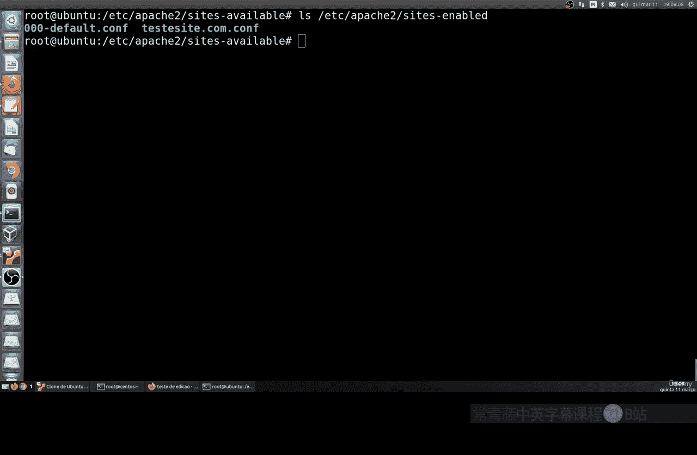

本节课中我们一起学习了Apache Web服务器的安装、基本验证和核心概念。我们完成了在主流Linux发行版上的安装，学会了通过IP地址访问默认页面，并了解了关键配置目录（如 `/etc/apache2/` 和 `/var/www/html/`）的作用。我们还初步探讨了Apache虚拟主机的强大功能，它允许在单台服务器上托管多个网站。最后，我们掌握了管理Apache服务（重新加载、重启）和启用/禁用特定网站配置的基本命令。下一节课，我们将深入讲解如何具体配置一个虚拟主机。