Linux命令行基础：Part3：虚拟主机配置 🖥️

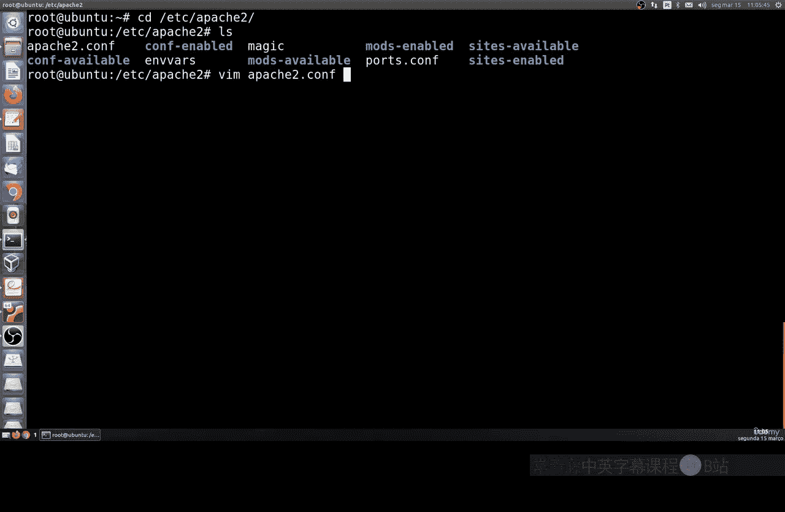

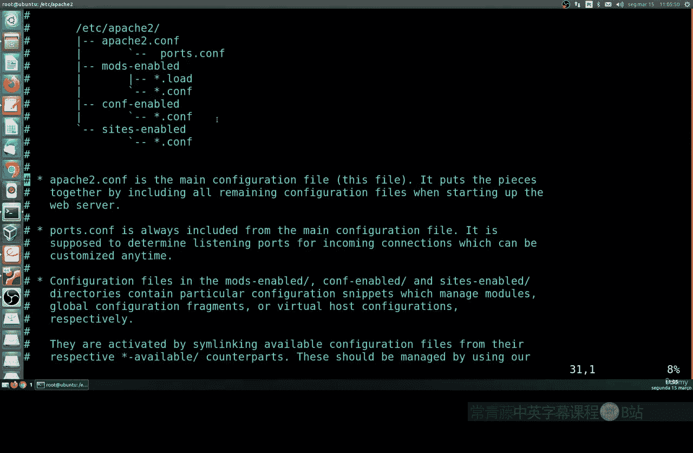

在本节课中，我们将学习如何在Linux系统上为Apache服务器配置虚拟主机。虚拟主机允许我们在同一台服务器上托管多个网站。

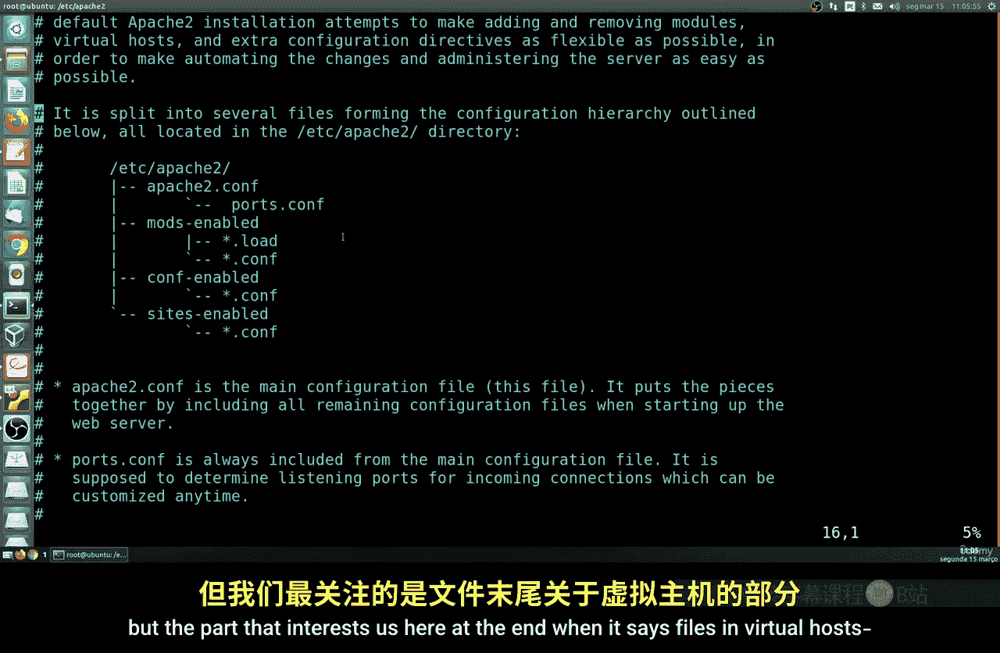

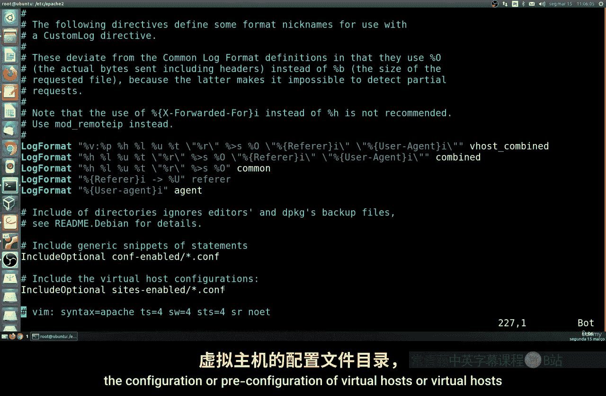

---

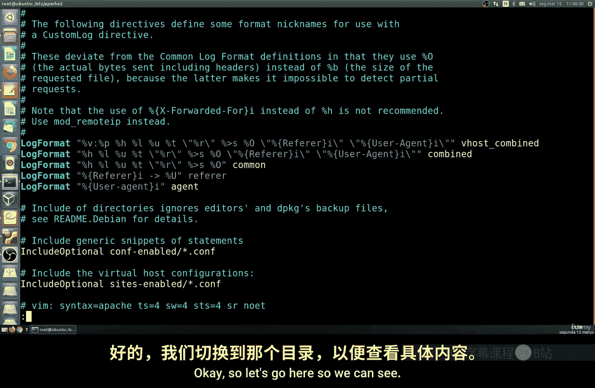

上一节我们介绍了Apache的基本概念，本节中我们来看看其核心配置文件。

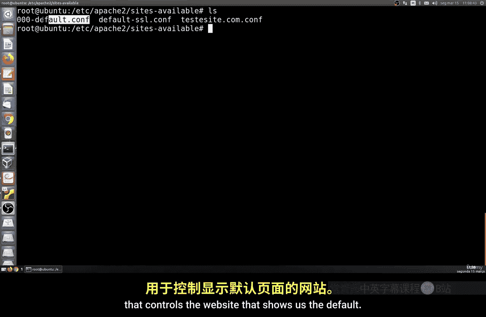

Apache的主要配置文件是 `apache2.conf`。该文件默认已预配置，包含许多设置和通用资源。其中，最值得我们关注的部分在文件末尾，它涉及虚拟主机的配置。

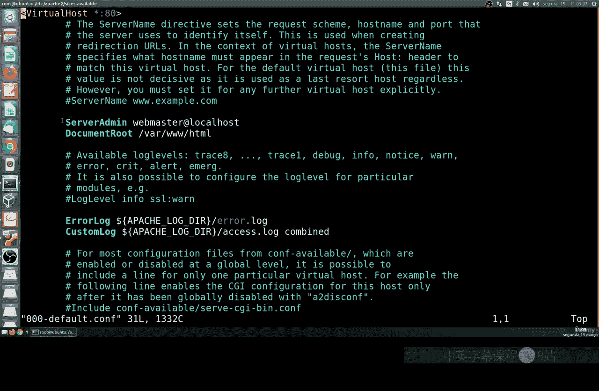

以下是关键配置行：
```apache
# 包含 sites-enabled/ 目录下的所有 .conf 文件
IncludeOptional sites-enabled/*.conf
```
这行配置意味着Apache会读取 `sites-enabled` 目录下所有以 `.conf` 结尾的文件作为虚拟主机配置。

---

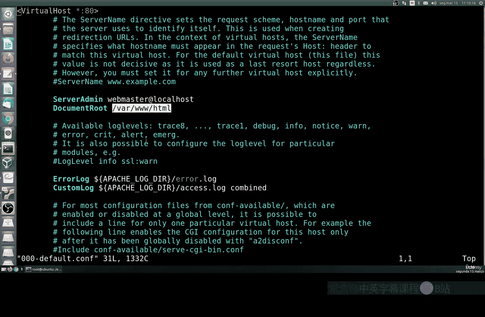

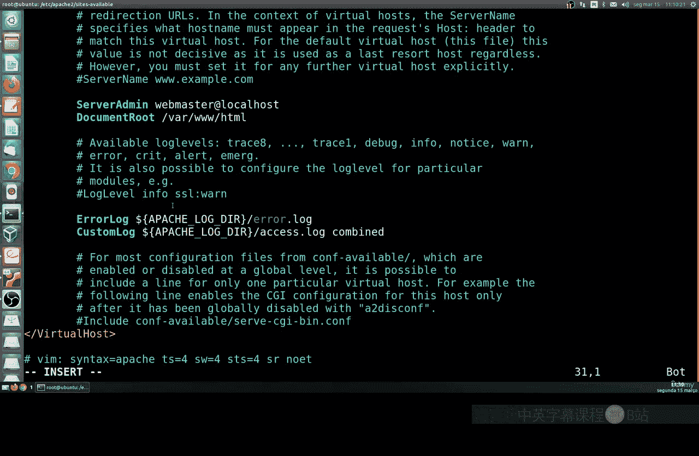

如果你只想托管一个网站，通常无需修改默认配置。但若想托管多个网站，就需要启用并配置虚拟主机。

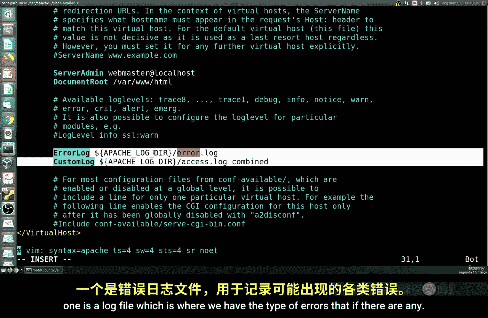

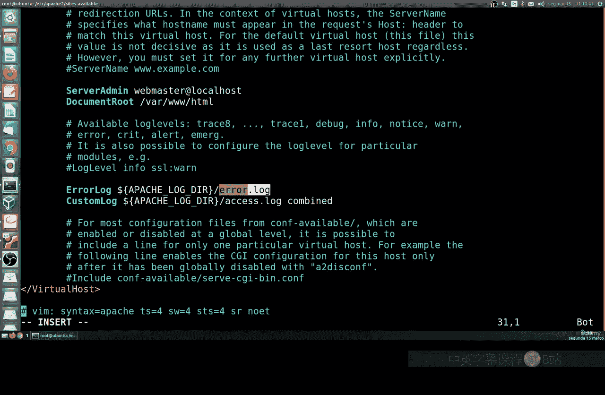

让我们进入网站配置目录 `/etc/apache2/sites-available/`。这里有一个名为 `000-default.conf` 的默认配置文件，它控制着Apache的默认网站。

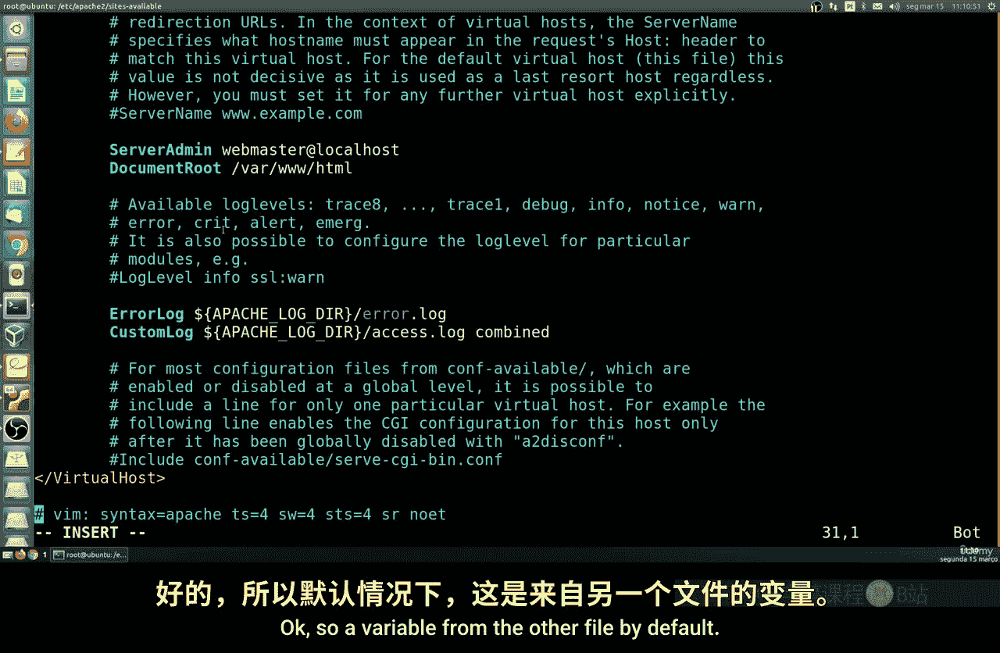

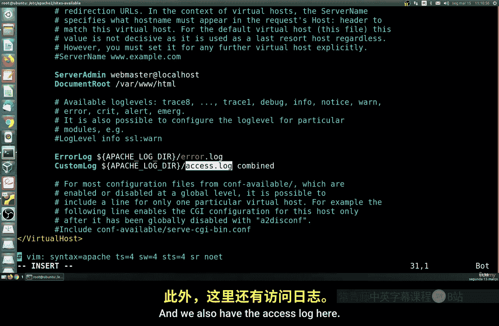

以下是该文件的核心结构解析：
```apache
<VirtualHost *:80>
    # 服务器管理员邮箱，用于错误报告
    ServerAdmin webmaster@localhost
    # 网站文件的根目录
    DocumentRoot /var/www/html

    # 错误日志文件路径
    ErrorLog ${APACHE_LOG_DIR}/error.log
    # 访问日志文件路径
    CustomLog ${APACHE_LOG_DIR}/access.log combined
</VirtualHost>
```
*   **`<VirtualHost *:80>`**： 这表示该虚拟主机监听所有IP地址（`*`）的80端口。
*   **`DocumentRoot`**： 指定了网站内容（如HTML、图片文件）存放的目录。
*   **日志文件**： `ErrorLog` 记录服务器错误，`CustomLog` 记录所有访问请求。

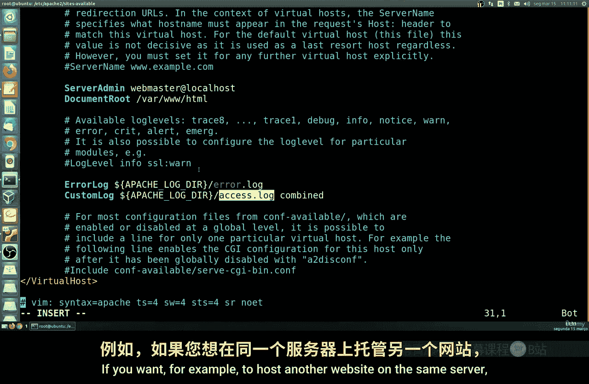


---

如果你想在同一台服务器上托管第二个网站，可以创建一个新的虚拟主机配置文件。

以下是创建新虚拟主机的基本步骤：
1.  在 `/etc/apache2/sites-available/` 目录下创建一个新的 `.conf` 文件，例如 `test-site.conf`。
2.  其内容结构与默认文件类似，但需要指定不同的 `DocumentRoot`（例如 `/var/www/test-site`）和日志文件路径。
3.  关键区别在于，如果你有多个IP地址，可以指定虚拟主机监听特定的IP，如 `<VirtualHost 192.168.1.104:80>`。

---

更常见的情况是，我们使用基于名称的虚拟主机。这样，即使服务器只有一个IP地址，也能通过不同的域名来访问不同的网站。

以下是基于名称的虚拟主机配置示例：
```apache
<VirtualHost *:80>
    # 指定该虚拟主机对应的域名
    ServerName www.example.com
    ServerAdmin admin@example.com
    DocumentRoot /var/www/example

    ErrorLog ${APACHE_LOG_DIR}/example-error.log
    CustomLog ${APACHE_LOG_DIR}/example-access.log combined
</VirtualHost>

<VirtualHost *:80>
    # 第二个虚拟主机，对应另一个域名
    ServerName www.anothersite.com
    DocumentRoot /var/www/anothersite
    # ... 其他配置
</VirtualHost>
```
*   **`ServerName`**： 这是关键指令，用于指定该配置块对应的域名。
*   你可以在一个配置文件或多个文件中列出任意数量的虚拟主机，服务器的硬件资源（CPU、内存）是主要限制。

**重要提示**： 要使基于名称的虚拟主机正常工作，你必须在DNS（域名系统）中将配置中使用的域名（如 `www.example.com`）解析到你的服务器IP地址。DNS配置属于网络管理的范畴，本课程不深入讨论。

---

本节课中我们一起学习了Apache虚拟主机的基础配置。我们了解了：
1.  虚拟主机配置文件的位置和作用。
2.  如何解读和修改默认的虚拟主机配置。
3.  如何为同一服务器上的多个网站创建新的虚拟主机配置。
4.  基于IP和基于名称的两种虚拟主机类型及其基本配置方法。

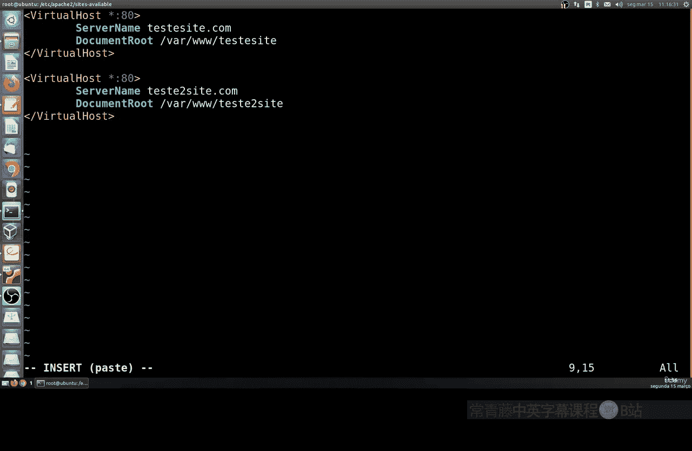

配置完成后，记得使用 `sudo a2ensite 配置文件名` 启用站点，并使用 `sudo systemctl reload apache2` 重新加载Apache使配置生效。