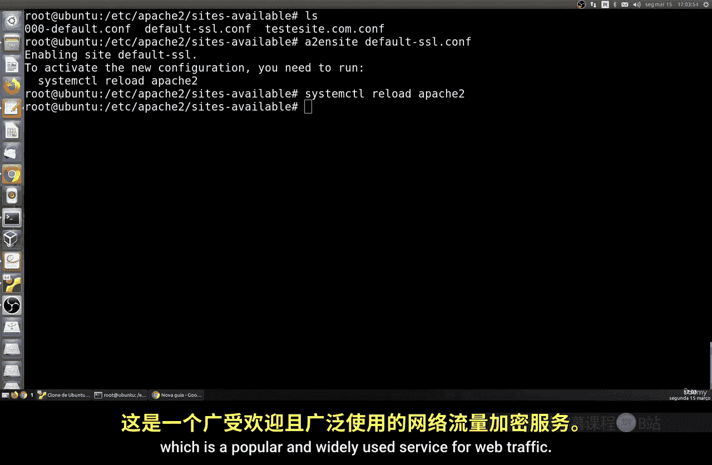
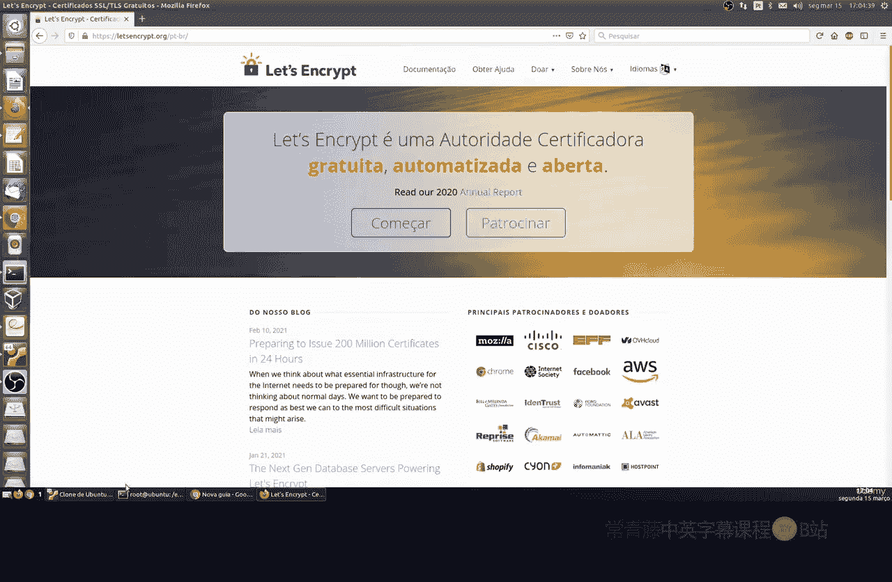
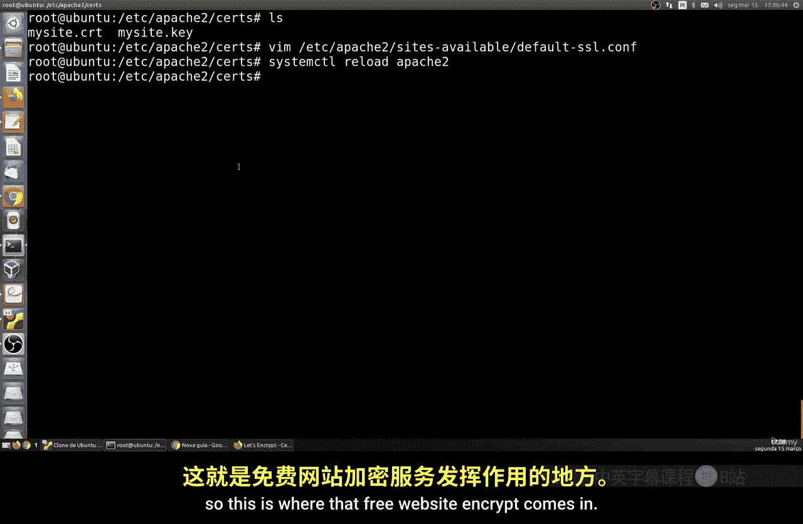
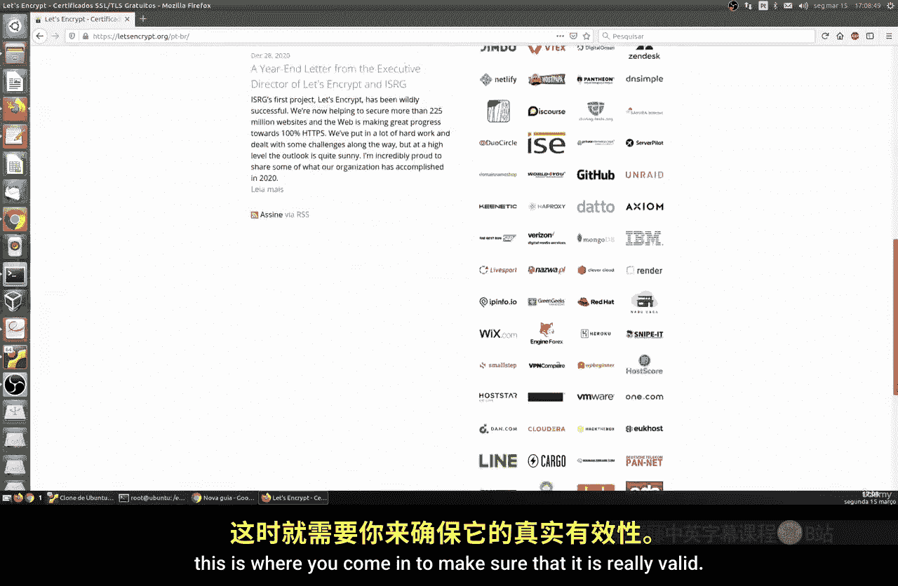
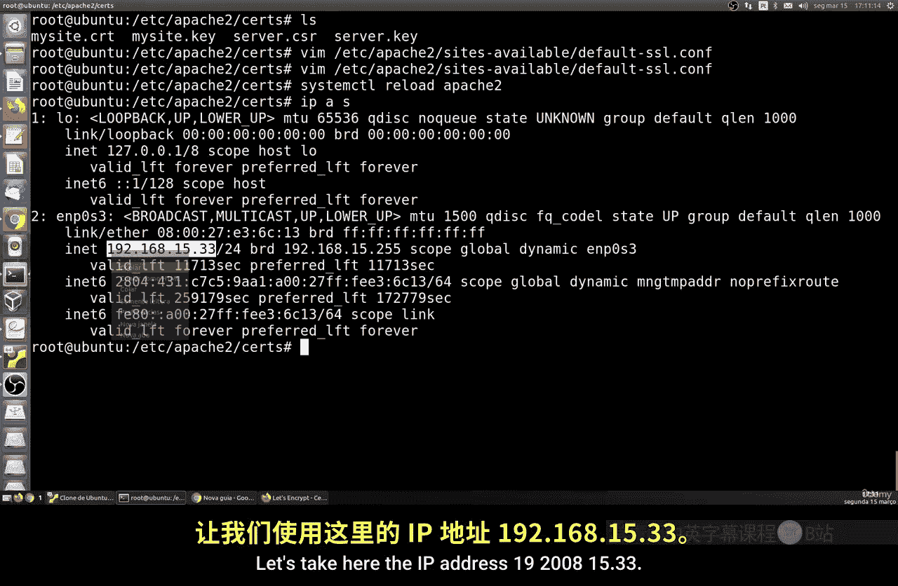
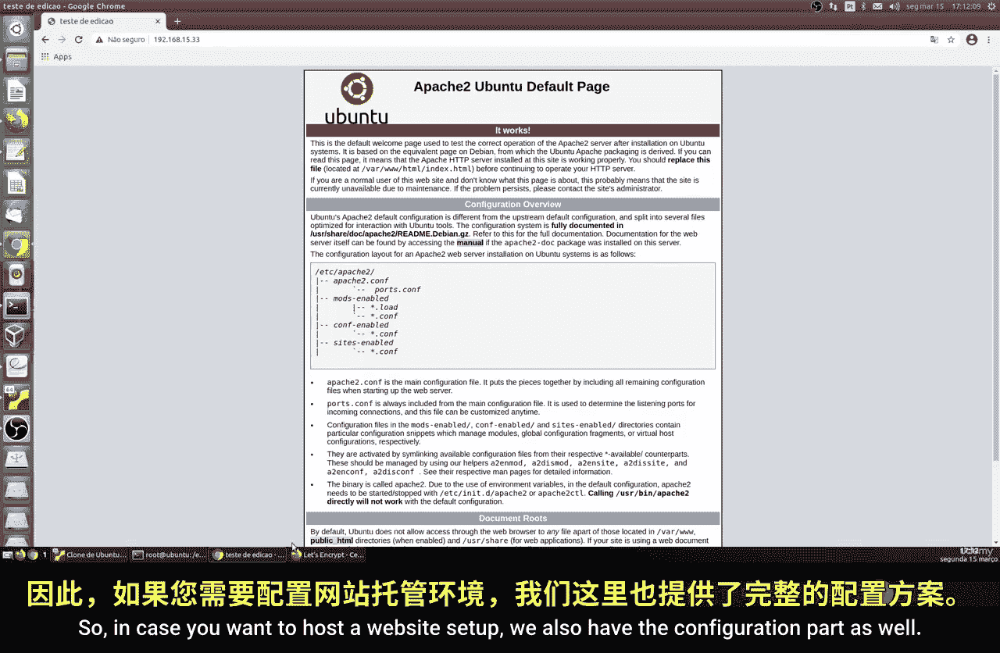
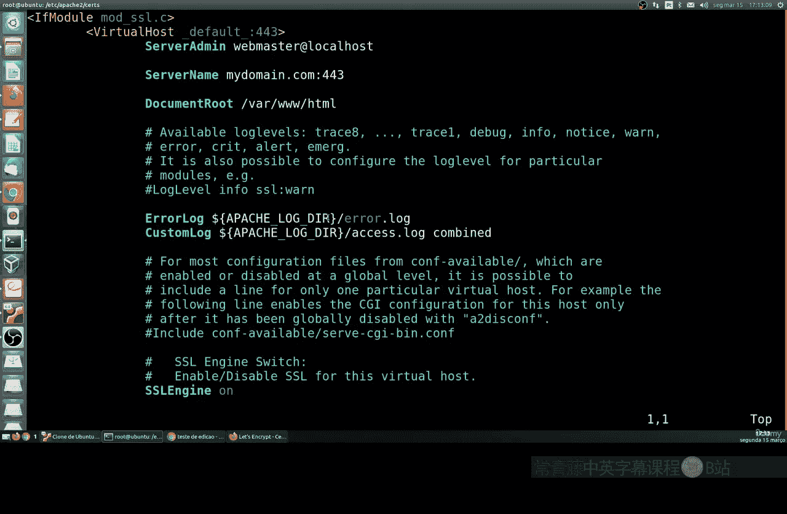
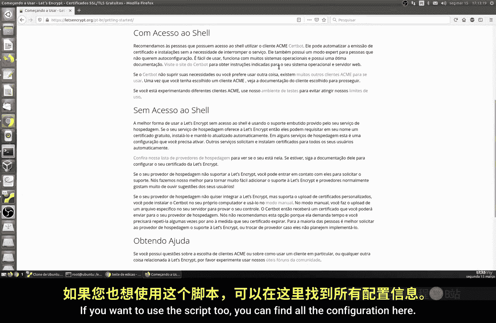
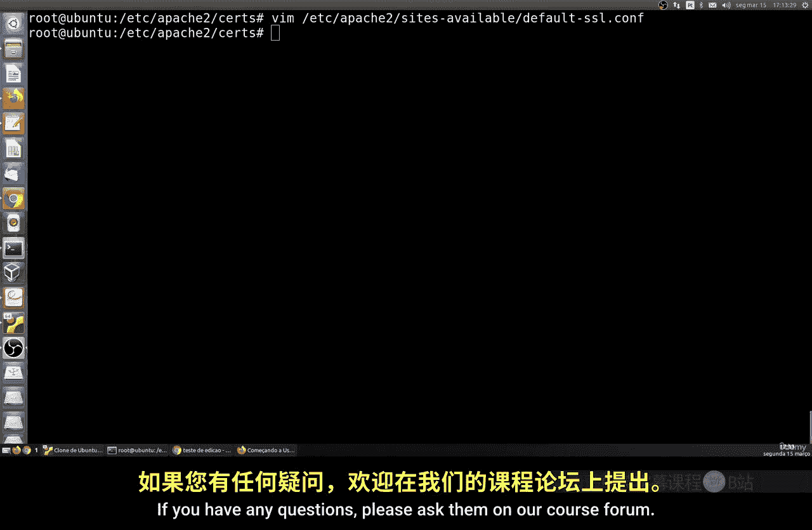

# 042：使用SSL/TLS保护Apache 🔒

在本节课中，我们将学习如何为Apache服务器配置SSL或TLS加密，以保护网站流量。如今，几乎所有网站都应具备此功能，这是保护网络通信安全的最低要求。

## 概述

我们将通过两种方式实现加密：一种是创建自签名证书，适用于本地或内部测试环境；另一种是获取由第三方证书颁发机构（CA）签发的证书，适用于公开的互联网网站。本节课将重点介绍自签名证书的配置过程。

上一节我们介绍了Apache的基本配置，本节中我们来看看如何为其启用加密。

## 启用SSL模块

默认情况下，Apache仅监听80端口（HTTP）。要启用加密，我们需要使用443端口（HTTPS）。首先，需要确保SSL模块已安装并启用。

以下是启用SSL模块的命令：

```bash
sudo a2enmod ssl
sudo systemctl restart apache2
```

执行上述命令后，系统会在 `/etc/apache2/sites-available/` 目录下生成一个名为 `default-ssl.conf` 的默认SSL配置文件。这个文件包含了与TLS加密相关的所有基础设置。

## 分析SSL配置文件

让我们查看并理解这个默认的SSL配置文件。

```bash
sudo nano /etc/apache2/sites-available/default-ssl.conf
```

该文件结构与普通的虚拟主机配置文件相似，但包含了一些特定的SSL选项。核心部分包括：
*   **SSL引擎**：用于启用TLS流量。
*   **证书和密钥路径**：指定服务器证书和私钥文件的位置。
*   **SSL协议和加密套件选项**：定义使用的安全协议和加密算法。
*   **目录权限设置**：控制对网站目录的访问。

文件中有许多注释行，初学者可以暂时忽略，重点关注上述几个部分。

## 创建自签名证书

由于我们还没有有效的证书，需要先创建一个自签名证书和密钥。

首先，创建一个专门存放证书的目录：

```bash
sudo mkdir /etc/apache2/ssl
cd /etc/apache2/ssl
```

接下来，使用OpenSSL工具生成一个2048位的RSA私钥和对应的自签名证书。



以下是生成证书和密钥的命令：



```bash
sudo openssl req -x509 -nodes -days 365 -newkey rsa:2048 -keyout apache-selfsigned.key -out apache-selfsigned.crt
```

执行命令后，会提示输入一些信息，例如国家、省份、城市、组织名称等。对于自签名证书，这些信息可以按需填写，但“Common Name”一项通常应填写服务器的域名或IP地址。

## 配置Apache使用证书

生成证书后，需要修改SSL配置文件，告诉Apache我们的证书和密钥放在哪里。

编辑 `default-ssl.conf` 文件，找到指定 `SSLCertificateFile` 和 `SSLCertificateKeyFile` 的两行，将其路径修改为我们刚创建的文件。

```apache
SSLCertificateFile      /etc/apache2/ssl/apache-selfsigned.crt
SSLCertificateKeyFile   /etc/apache2/ssl/apache-selfsigned.key
```

保存并退出编辑器。

## 启用SSL站点并重载配置

现在，启用这个SSL站点配置，并重新加载Apache使更改生效。

以下是启用站点并重载服务的命令：

```bash
sudo a2ensite default-ssl.conf
sudo systemctl reload apache2
```





## 测试HTTPS连接

配置完成后，可以通过浏览器访问服务器的443端口进行测试。在地址栏输入 `https://你的服务器IP地址`。

由于使用的是自签名证书，浏览器会显示“连接不安全”或“证书无效”的警告。这是正常现象，因为该证书未被公共的证书颁发机构认可。你可以选择“高级”->“继续前往”来查看网站。此时，浏览器地址栏会显示加密标志（通常是一把锁），并且连接已经过TLS加密保护。

## 关于第三方证书

对于面向公众的正式网站，自签名证书会严重影响用户体验和信任度。因此，你需要从受信任的第三方CA获取证书。

*   **付费证书**：由商业CA（如DigiCert, GlobalSign）提供，提供更高的信任度和保障。
*   **免费证书**：最著名的是 **Let‘s Encrypt**。它是一个免费、自动化和开放的证书颁发机构，被广泛使用。你可以访问其官网 [letsencrypt.org](https://letsencrypt.org/) 查看文档，使用Certbot等工具自动化申请和续期证书。



使用第三方CA证书时，你需要生成一个**证书签名请求**文件，提交给CA，然后将CA签发的证书配置到Apache中，过程与配置自签名证书类似。

## 配置虚拟主机



如果你需要为多个域名配置HTTPS，可以为每个域名创建独立的SSL虚拟主机文件。配置逻辑与默认文件相同，主要需要修改 `ServerName` 指令和证书路径。

例如，为 `example.com` 创建配置：

```apache
<VirtualHost *:443>
    ServerName example.com
    DocumentRoot /var/www/example
    SSLEngine on
    SSLCertificateFile /path/to/your/certificate.crt
    SSLCertificateKeyFile /path/to/your/private.key
    # ... 其他配置
</VirtualHost>
```



## 总结





本节课中我们一起学习了如何为Apache Web服务器启用SSL/TLS加密。我们完成了从启用SSL模块、分析配置文件、创建自签名证书，到最终配置并测试HTTPS站点的全过程。关键点在于理解证书的作用，以及如何通过修改配置文件将证书与Apache服务关联起来。对于生产环境，务必使用由Let‘s Encrypt等受信任的第三方机构颁发的证书，以确保网站访问者的安全与信任。