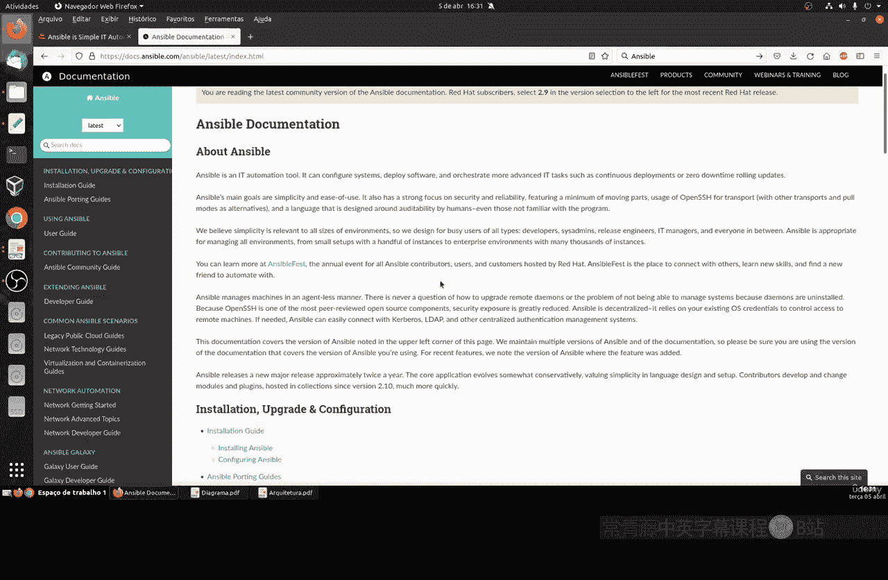

# 043：Ansible介绍 🚀

在本节课中，我们将要学习一个名为Ansible的强大工具。Ansible是一款用于自动化软件部署、配置管理和应用发布的工具，它对于希望成为DevOps工程师或学习自动化运维的人来说至关重要。我们将了解它的核心概念、工作原理以及基本架构。

## 概述

Ansible是一款无需代理的自动化工具，它通过SSH或PowerShell连接来管理成百上千台服务器。其核心使用Python编写，配置文件采用标准化的YAML格式，使得学习和使用变得相对简单。

## Ansible是什么？

Ansible是一款开源的自动化工具，主要用于软件配置、部署和任务编排。它能够同时管理大量服务器，而无需在目标机器上安装任何代理软件。

## 核心工作原理

上一节我们介绍了Ansible是什么，本节中我们来看看它是如何工作的。

Ansible的核心工作原理基于“无代理”架构。它通过SSH（针对Linux/Unix系统）或PowerShell Remoting（针对Windows系统）临时连接到被管理的主机，并在其上执行任务。

其工作流程可以概括为：
1.  控制节点（安装了Ansible的机器）通过SSH连接到被管理主机。
2.  将需要执行的模块代码推送到目标主机。
3.  在目标主机上执行模块代码，完成特定任务（如安装软件、修改配置）。
4.  收集执行结果并断开连接。

整个过程无需在目标主机上长期运行任何Ansible专属服务。

## 核心组件架构

为了更深入地理解Ansible，我们来剖析其核心组件架构。下图展示了一个简化的Ansible工作流程：

以下是Ansible架构中的主要组成部分：

*   **用户/管理员**：执行Ansible命令和剧本的人员。
*   **核心引擎与API**：Ansible的核心框架，使用Python编写，负责协调所有操作。
*   **清单**：一个定义被管理主机和主机组的文件，通常采用INI或YAML格式。
*   **剧本**：Ansible的自动化蓝图，由一系列按顺序执行的任务组成，采用YAML格式编写。
*   **模块**：Ansible执行任务的实际工具。每个模块负责完成一项特定工作，例如管理用户或安装软件包。执行`ansible-doc -l`可以查看所有模块。
*   **插件**：扩展Ansible核心功能的代码片段，例如连接插件、回调插件等。
*   **被管理主机**：由Ansible控制的服务器或网络设备。

## 主要特点与优势

了解了架构之后，我们来看看Ansible具备哪些突出的特点和优势。

*   **简单易学**：剧本采用人类可读的YAML语言编写，降低了学习门槛。
*   **无代理**：无需在目标机器上安装额外软件，简化了环境准备和维护。
*   **幂等性**：剧本可以安全地多次执行，系统最终会达到期望的状态，而不会因重复执行出错。
*   **强大的模块化**：拥有丰富的内置模块，几乎可以完成所有常见的运维任务。

## 学习前提与官方资源

在开始动手实践之前，请确保你具备以下基础知识，并了解官方学习渠道。

为了能顺利学习并使用Ansible，你需要掌握Linux基础命令、文件管理以及SSH远程访问的配置。Ansible官方文档是极其重要的学习资源，其中包含了入门指南、模块详解和最佳实践。

**官方文档链接**：[https://docs.ansible.com](https://docs.ansible.com)

Ansible由Red Hat公司提供支持，但它兼容所有支持SSH的主流操作系统，包括各种Linux发行版和Windows Server。

## 总结

本节课中我们一起学习了自动化工具Ansible。我们了解了它作为一款无代理配置管理工具的基本定义，剖析了其通过SSH连接工作的核心原理，并认识了由清单、剧本、模块等关键部件构成的架构。此外，我们也明确了学习Ansible所需的前置技能和官方文档的重要性。在接下来的课程中，我们将开始动手安装Ansible并编写第一个自动化剧本。

