# 044：设置实验环境 🛠️


在本节课中，我们将学习如何为后续的Ansible学习设置一个基础的实验环境。我们将配置多台虚拟机，确保它们之间能够通过SSH无密码连接，并安装必要的软件。

## 概述

为了有效地学习和实践Ansible自动化配置管理，我们需要一个由多台机器组成的实验环境。本节将指导你完成这个环境的搭建，包括创建虚拟机、配置网络、设置SSH密钥认证以及安装Python。这是后续所有Ansible操作的基础。

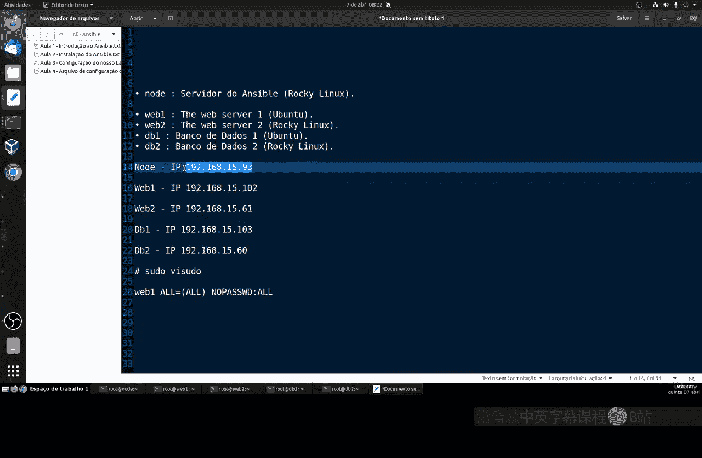

## 环境规划与准备

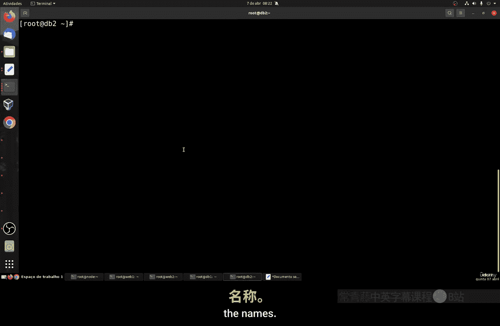

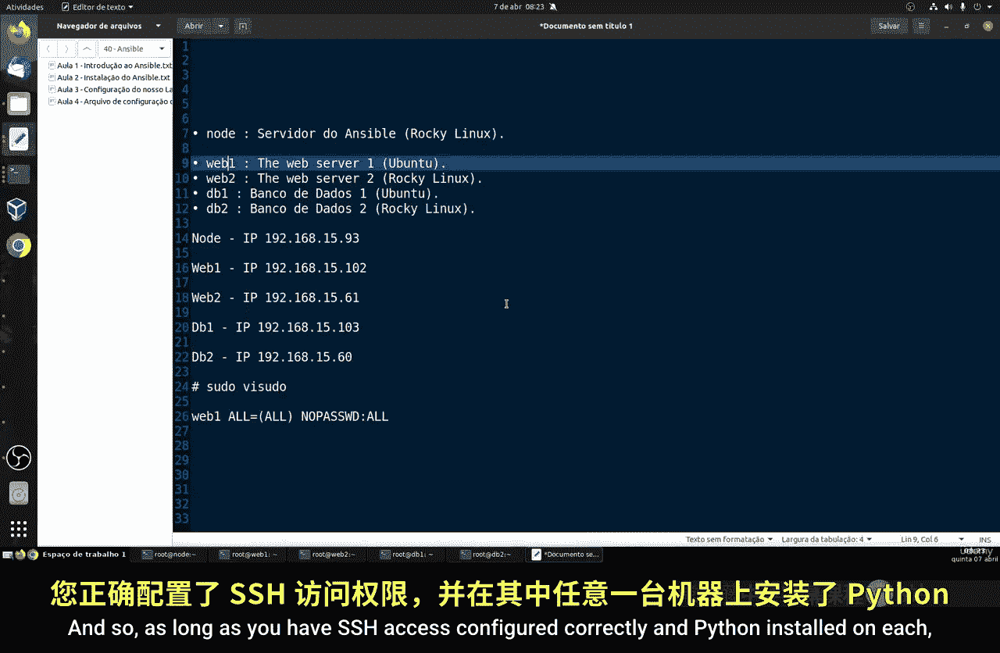

上一节我们介绍了Ansible的基本概念，本节中我们来看看如何搭建一个用于实践的环境。我们需要准备至少五台机器。

以下是我们的实验场景规划：
*   **Ansible控制节点 (node)**: 一台运行Rocky Linux（或任何Red Hat系Linux）的机器，用于管理其他服务器。
*   **被管理节点**:
    *   **Web1**: 一台运行Ubuntu的Web服务器。
    *   **Web2**: 一台运行Rocky Linux的Web服务器。
    *   **DB1**: 一台运行Ubuntu的数据库服务器。
    *   **DB2**: 一台运行Rocky Linux的数据库服务器。

你可以使用VirtualBox、VMware等工具创建本地虚拟机，也可以使用云服务器。关键是确保所有机器之间网络互通，并且IP地址固定。


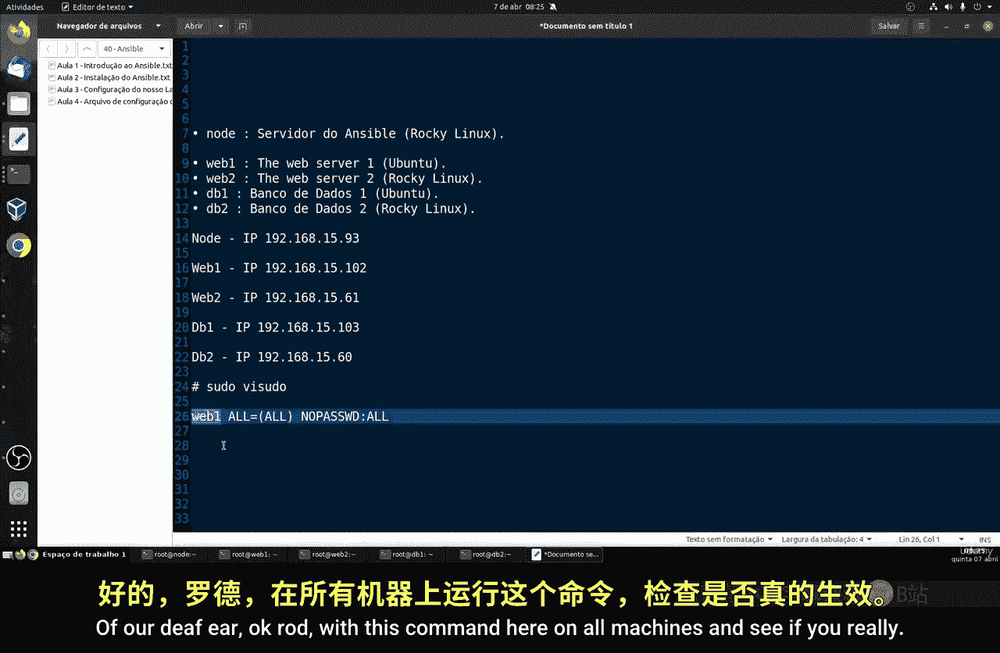

## 基础软件配置

所有被Ansible管理的机器（即被管理节点）都需要满足两个先决条件：安装Python和配置SSH。


以下是需要在每台被管理节点上完成的步骤：
1.  **安装Python 3**: Ansible的核心由Python编写，因此需要Python 3。根据系统不同，使用以下命令安装：
    *   Red Hat系 (如Rocky Linux): `yum install python3 -y`
    *   Debian系 (如Ubuntu): `apt install python3 -y`
2.  **配置SSH服务**: 确保SSH服务已安装并运行，允许远程连接。如果不会配置，请复习课程中关于SSH的专门章节。
3.  **创建专用管理用户**: 为每台被管理节点创建一个与主机名对应的普通用户（例如，在Web1上创建用户`web1`），这可以简化权限管理。
4.  **配置sudo权限**: 为了让Ansible能够执行需要特权的任务，需要为刚创建的用户配置无需密码的sudo权限。在被管理节点上执行：
    ```bash
    echo "web1 ALL=(ALL) NOPASSWD: ALL" | sudo tee /etc/sudoers.d/web1
    ```
    （请将`web1`替换为你创建的实际用户名）。

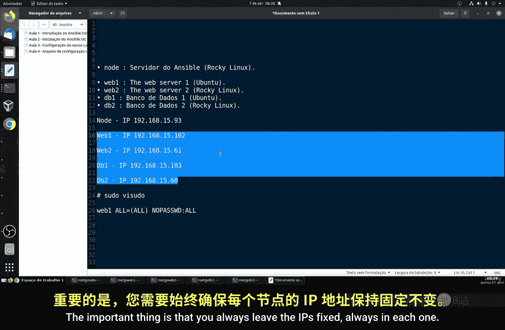

## 配置Ansible控制节点

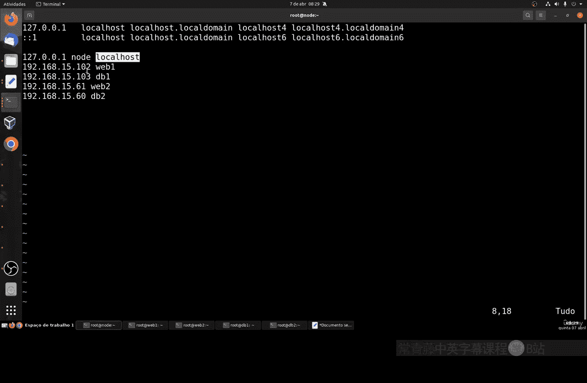

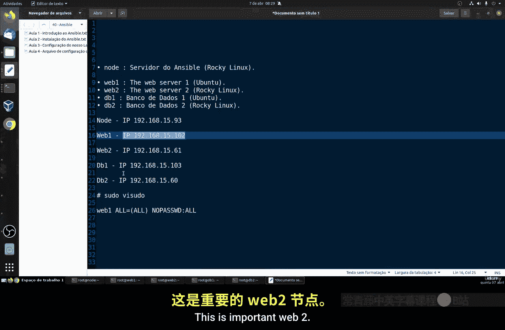

现在，我们回到作为控制节点的`node`机器上进行配置。

首先，我们需要编辑Ansible的**主机清单文件** (`/etc/ansible/hosts`)，将我们要管理的机器信息添加进去。使用`vim`或`nano`编辑此文件。

以下是一个配置示例，请根据你的实际IP地址和主机名进行修改：
```ini
[webservers]
web1 ansible_host=192.168.1.102
web2 ansible_host=192.168.1.103


[databases]
db1 ansible_host=192.168.1.104
db2 ansible_host=192.168.1.105
```
使用主机名而非IP地址进行管理，能让脚本更易读和维护。配置完成后，可以先用`ping`命令测试控制节点到各主机的网络连通性：
```bash
ping -c 4 web1
ping -c 4 db2
```

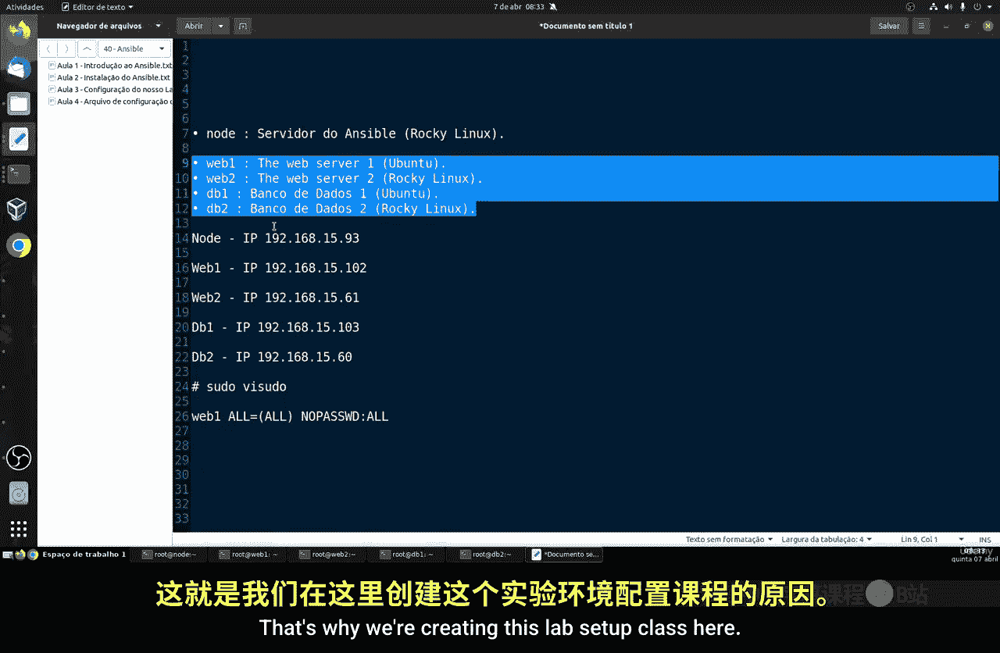

## 设置SSH密钥认证

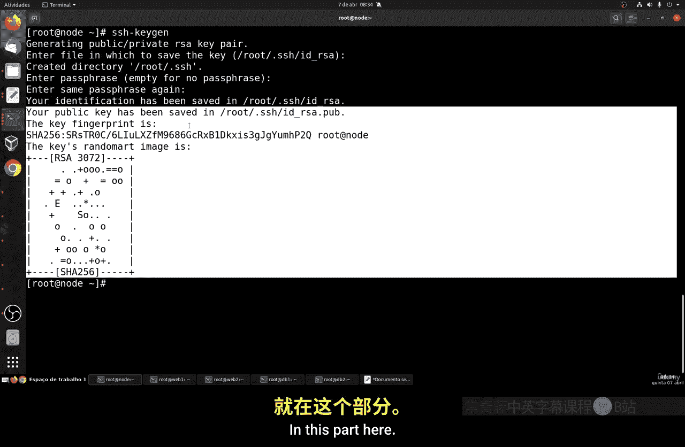

为了实现自动化且安全的连接，我们需要配置SSH密钥认证，让控制节点可以无密码登录所有被管理节点。

这个过程分为两步：在控制节点生成密钥对，然后将公钥分发到各个被管理节点。

**第一步：在控制节点生成SSH密钥对**
在`node`机器上执行以下命令，并连续按回车接受所有默认选项（不设置密码短语）：
```bash
ssh-keygen -t rsa -b 3072
```
命令执行后，会在`~/.ssh/`目录下生成私钥(`id_rsa`)和公钥(`id_rsa.pub`)。

**第二步：分发公钥到被管理节点**
使用`ssh-copy-id`命令将公钥复制到每台被管理节点。这里以`web1`为例：
```bash
ssh-copy-id web1@web1
```
首次连接时会提示你确认主机密钥，并输入`web1`用户在`web1`主机上的密码。输入密码后，公钥即被复制过去。

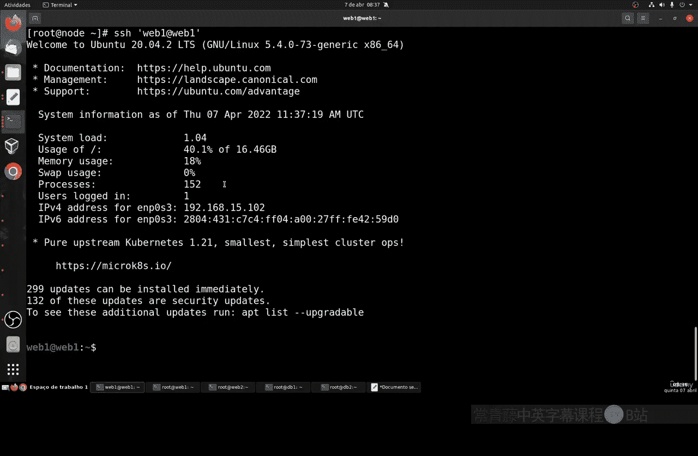

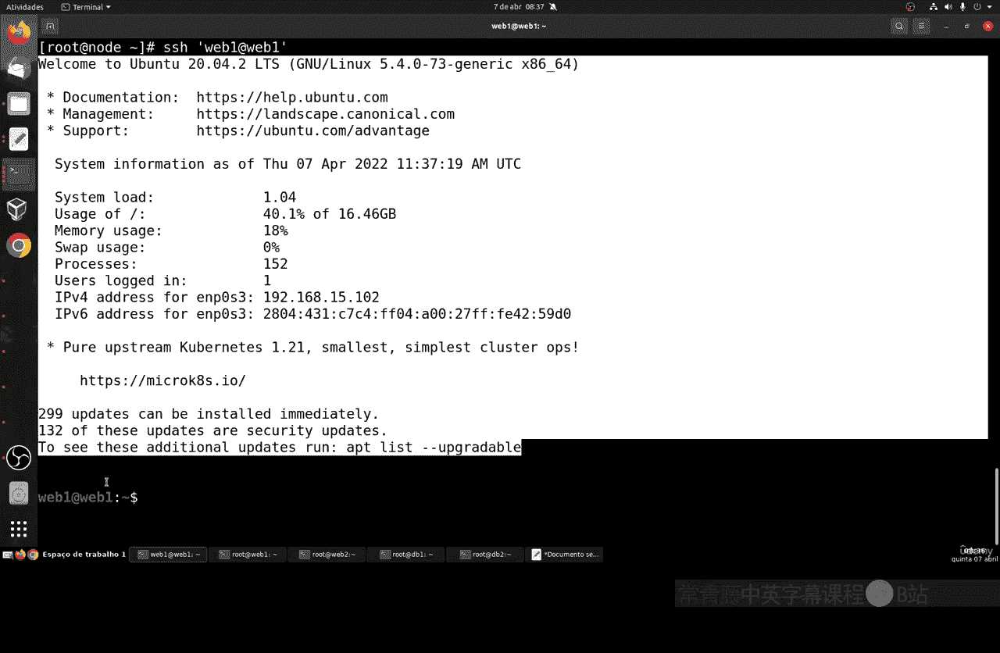

之后，使用以下命令测试是否可以不输入密码直接登录：
```bash
ssh web1@web1
```
请对`web2`、`db1`、`db2`所有主机重复此操作。这是**一次性**的设置，完成后控制节点便能无缝管理所有机器。

## 总结

本节课中我们一起学习了如何搭建一个用于Ansible学习的实验环境。我们规划了机器角色，在所有被管理节点上安装了Python 3并配置了SSH及sudo权限。接着，在Ansible控制节点上配置了主机清单，并建立了到所有被管理节点的SSH密钥认证，这是实现自动化管理的关键一步。


现在，你的实验环境已经准备就绪。在接下来的课程中，我们将在这个环境上安装Ansible，并开始学习编写和运行自动化任务。请务必按步骤完成本节的设置，这是后续所有实践的基础。