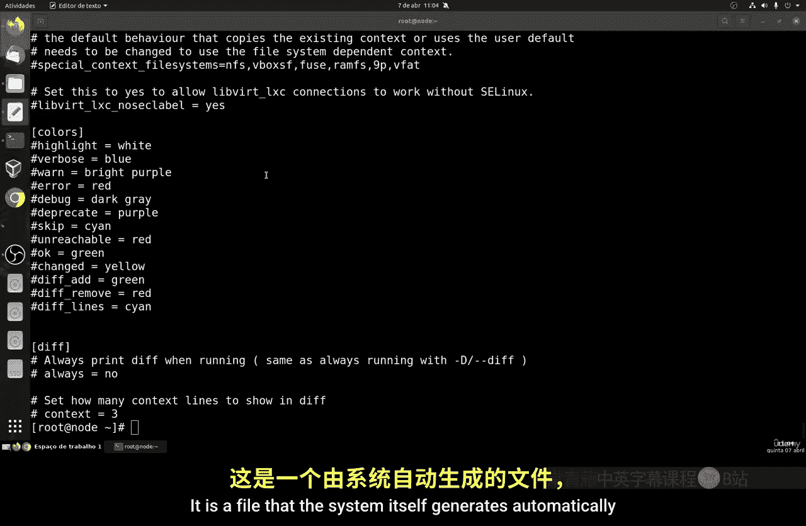
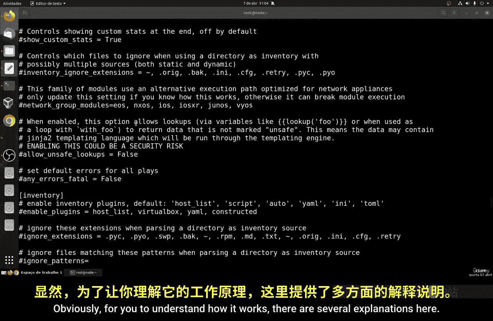
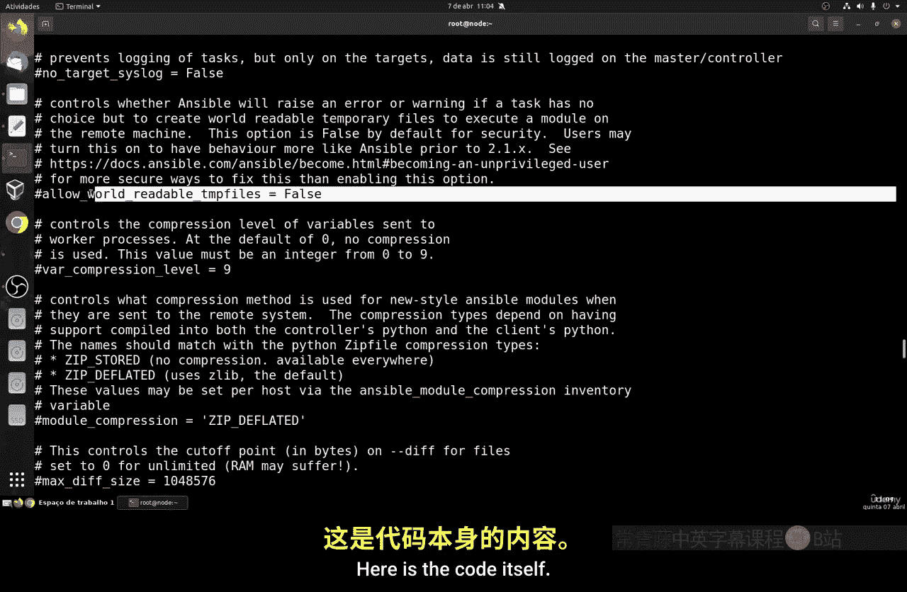
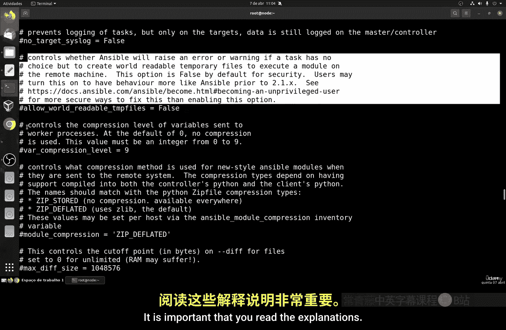
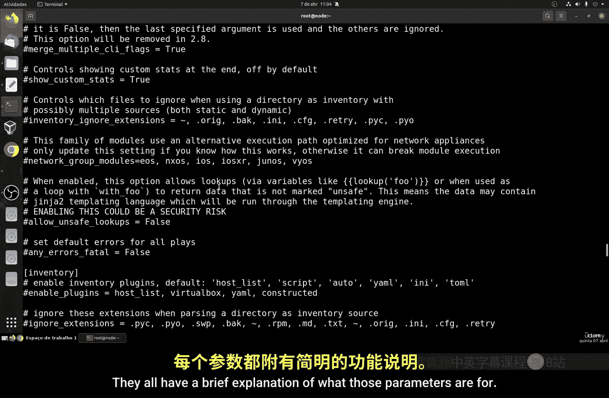
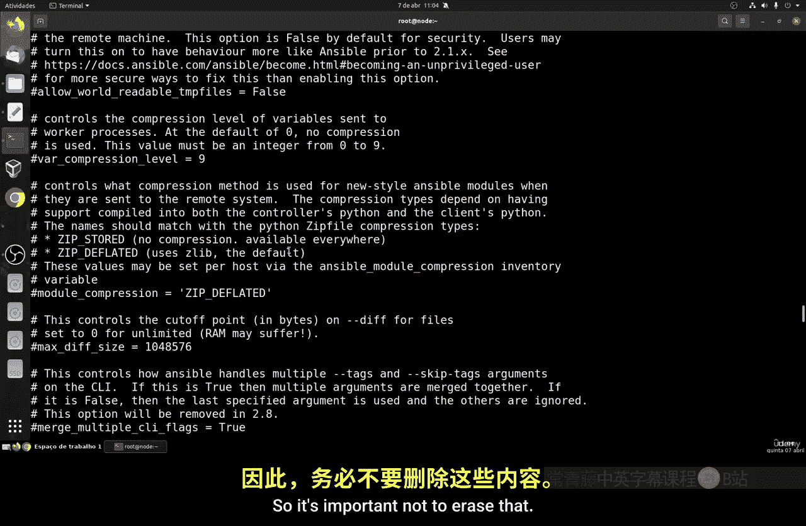
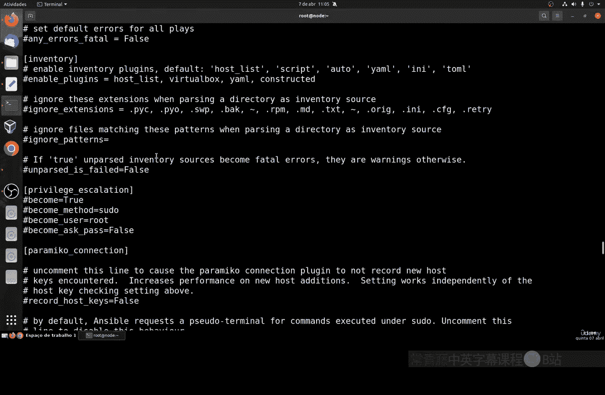
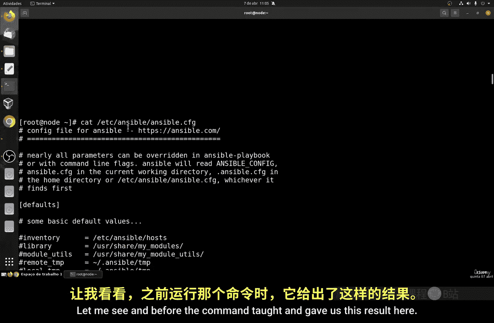
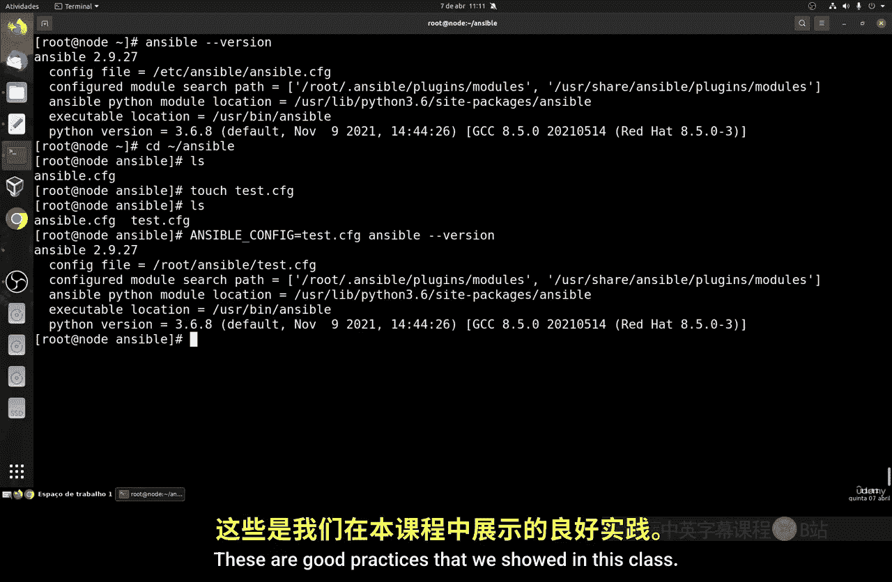

# 046：Ansible配置文件 🛠️

在本节课中，我们将学习Ansible的配置文件。上一节我们完成了Ansible的安装，本节我们将重点研究其配置文件的结构、位置以及如何创建和管理自定义配置。

## 概述

Ansible的配置文件决定了其工作方式。默认情况下，安装后会生成一个全局配置文件。但在实际工作中，为了管理不同的项目或用户，我们需要创建独立的配置文件。本节将指导你理解默认配置，并学习如何创建和使用自定义配置文件。

## 默认配置文件

当你安装Ansible后，系统会自动生成一个默认的配置文件。这个文件的扩展名是`.cfg`，这是标准格式，你可以更改文件名，但不能更改扩展名。







以下是查看默认配置文件内容的命令：
```bash
cat /etc/ansible/ansible.cfg
```





执行此命令后，你会看到一个自动生成的文件。文件中包含了许多配置参数，并且每个参数旁边都有简要的说明，解释其用途。阅读这些说明对于理解Ansible的工作原理非常重要。



**核心概念**：默认配置文件是系统自动生成的，位于`/etc/ansible/ansible.cfg`。它包含所有基础配置和说明。

## 创建自定义配置文件

在实际场景中，如果同一台服务器上有多个用户，或者需要控制多台具有不同用途的机器，最好为每个用户或项目创建独立的配置文件。这样可以避免未来的配置冲突。



首先，你需要确定当前的工作目录。使用`pwd`命令可以查看你所在的目录。



接下来，我们将在用户的家目录下创建一个专门用于Ansible配置的目录，并在其中创建新的配置文件。

以下是创建步骤：
1.  创建Ansible配置目录。
2.  在该目录下创建一个新的配置文件。

以下是创建目录和文件的命令：
```bash
mkdir ~/ansible
touch ~/ansible/ansible.cfg
```

创建完成后，新的空配置文件会优先于全局配置文件被Ansible读取。这是一种配置的层级关系，用户级别的配置优先级更高。

## 验证与测试配置

创建新的配置文件后，我们可以通过运行`ansible --version`命令来验证Ansible是否识别了新的配置路径。

你会发现，命令输出的`config file`一项已经自动指向了新创建的`~/ansible/ansible.cfg`文件，即使这个文件是空的。这证明了本地配置文件的优先级。

如果你想测试一个不同名称的配置文件，可以按照以下步骤操作：
1.  在`~/ansible/`目录下创建一个新文件，例如`test.cfg`。
2.  使用`ANSIBLE_CONFIG`环境变量强制指定Ansible使用这个新文件。

以下是相关命令：
```bash
touch ~/ansible/test.cfg
ANSIBLE_CONFIG=~/ansible/test.cfg ansible --version
```

执行后，`ansible --version`的输出将显示配置文件路径为`~/ansible/test.cfg`。这种方法允许你为不同的任务临时指定不同的配置文件，而不会影响默认的全局或用户配置。

## 清理与还原

作为练习的一部分，你可以删除刚才创建的配置文件，观察Ansible如何自动回退到上一级的配置。

使用以下命令删除文件：
```bash
rm ~/ansible/ansible.cfg
```

再次运行`ansible --version`，你会发现配置文件的路径又恢复到了默认的全局位置（`/etc/ansible/ansible.cfg`）。这个操作清晰地展示了配置的继承和回退机制。

## 总结



本节课我们一起学习了Ansible配置文件的核心知识。我们了解了默认配置文件的位置和作用，学习了如何为用户或项目创建独立的配置目录和文件，并验证了本地配置文件的优先级。我们还掌握了通过环境变量临时指定配置文件的方法。遵循这些为不同用途创建独立配置文件的实践，是保持工作环境清晰、有序的良好习惯。在下一节课中，我们将从零开始，详细讲解如何一步步构建一个完整的配置文件。