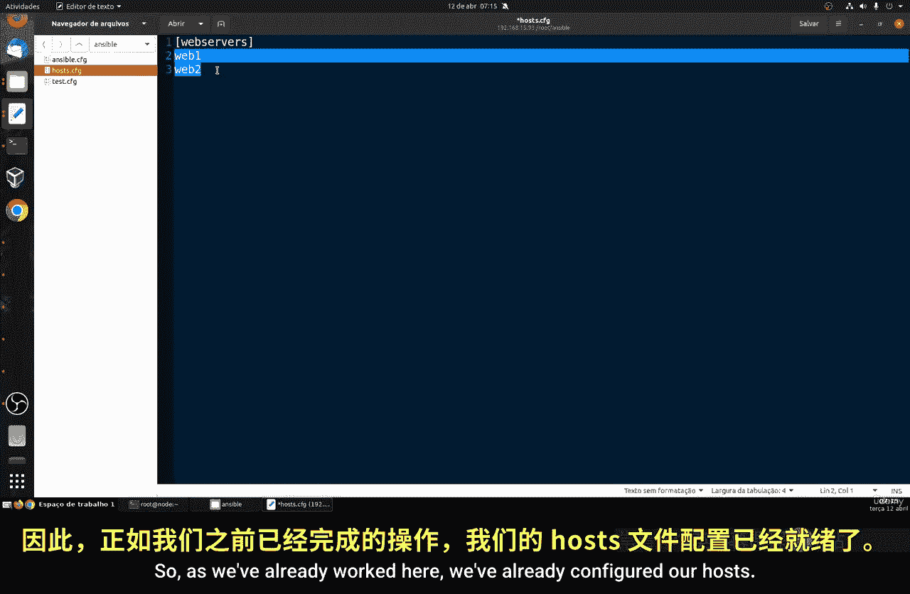
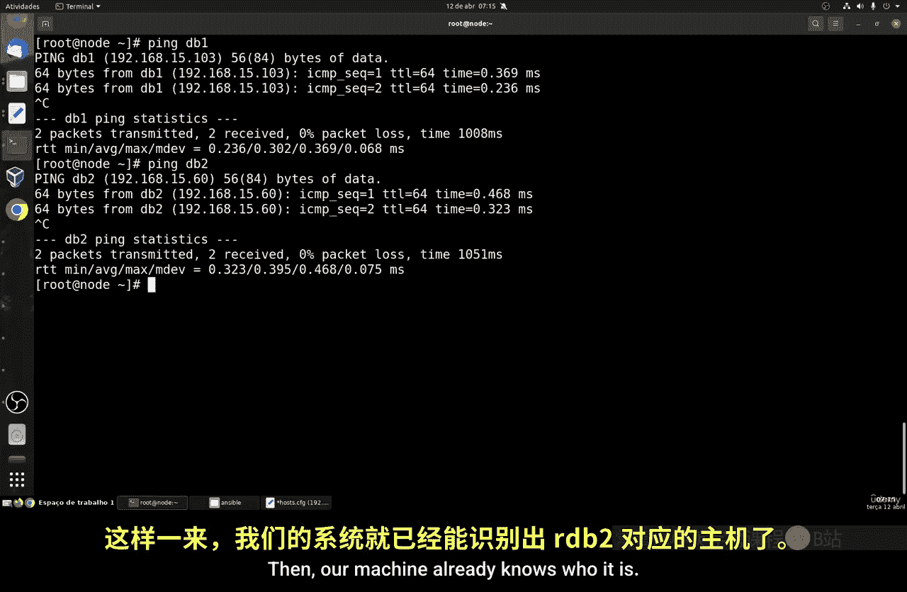
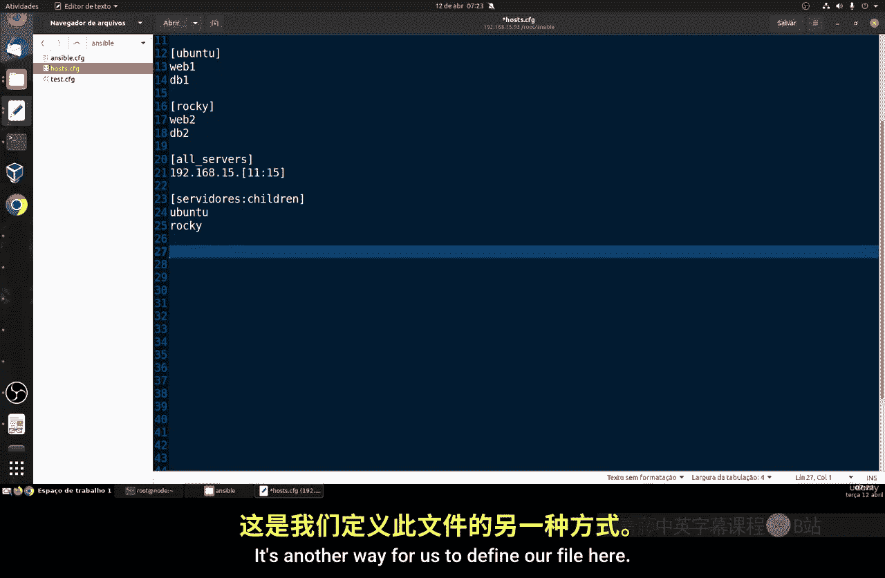
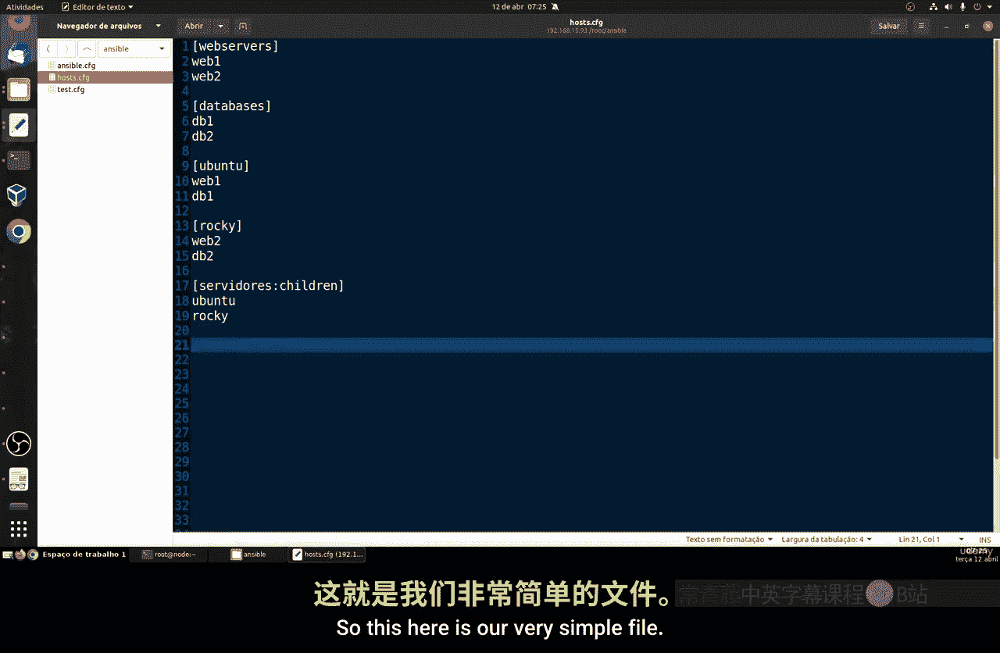
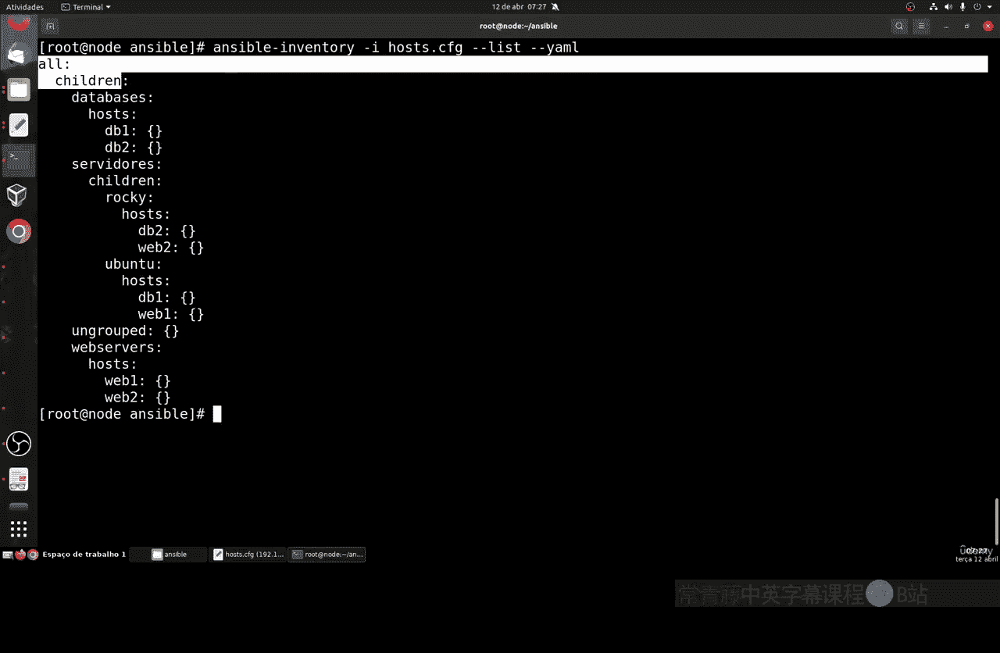
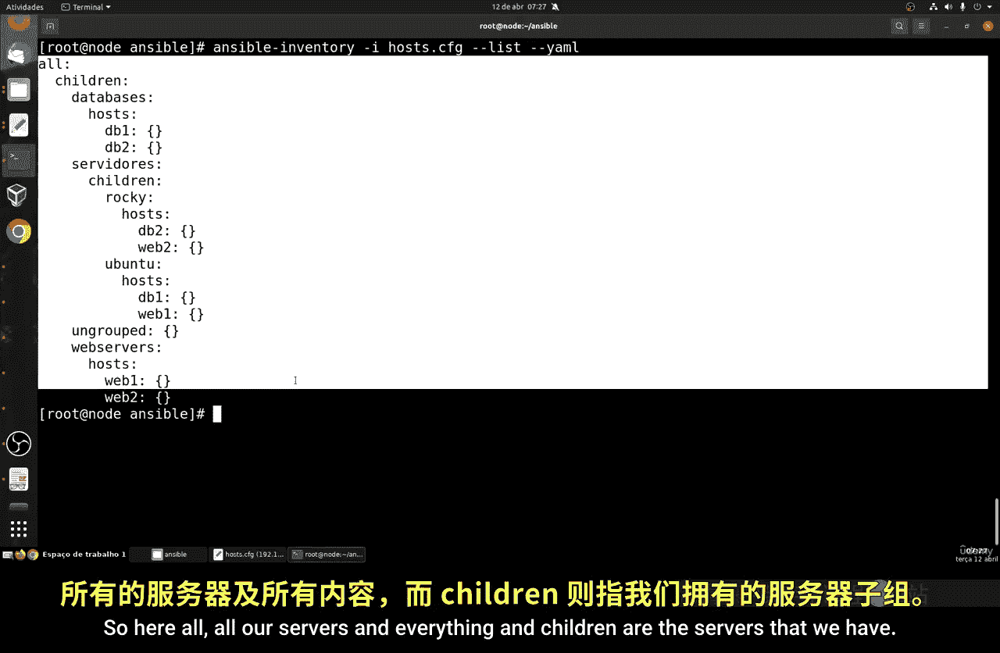
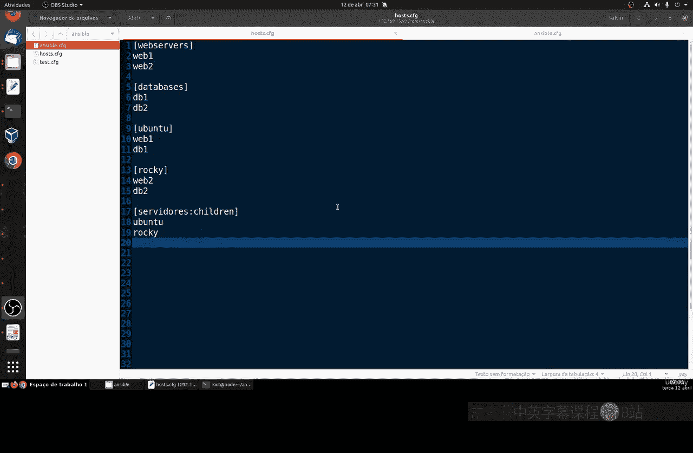

# 047：如何创建 Ansible 清单 📋

在本节课中，我们将要学习如何配置和创建 Ansible 清单。清单是 Ansible 管理主机的基础，它是一个包含所有待管理主机信息的文本文件。


## 准备工作 🛠️


首先，你需要选择一个集成开发环境来创建和编辑清单文件。你可以选择 VS Code、Sublime Text 或任何你偏好的 IDE。在 Linux 终端中，你也可以使用 Vim 或 Nano 等编辑器，但使用 IDE 通常更为直观和方便。

## 理解清单文件 📄

简单来说，Ansible 清单是一个列表，其中包含了我们将要管理的主机的 IP 地址或主机名。这个文件至关重要，因为我们将通过它来执行配置、测试以及定义特定的管理标准。

## 创建清单文件 📝

首先，我们创建一个名为 `ansible` 的目录，并在其中创建两个文件：`ansible.cfg` 和 `hosts`。`hosts` 文件就是我们的清单文件。



以下是创建清单的基本步骤：

1.  在 `hosts` 文件中，我们使用方括号 `[]` 来定义主机组。
2.  在组名下方，列出属于该组的主机名或 IP 地址。



例如，假设我们有四台服务器：`web1`、`web2`、`db1` 和 `db2`。我们可以这样组织：

```ini
[webservers]
web1
web2

[databases]
db1
db2
```

如果你的系统 `/etc/hosts` 文件或 DNS 中已经正确配置了这些主机名到 IP 地址的映射，那么直接使用主机名即可。你可以通过 `ping` 命令来测试连通性，例如 `ping web1`。

## 清单的高级用法 🚀

上一节我们介绍了基础的清单结构，本节中我们来看看更高级的配置方式。

### 使用模式定义主机范围

如果你有成系列的主机，可以使用模式来简化清单。例如，`web1` 和 `web2` 可以表示为：

```ini
[webservers]
web[1:2]
```

这等同于分别列出 `web1` 和 `web2`。对于 IP 地址范围也同样适用：

```ini
[all_servers]
192.168.1.[11:15]
```

这表示 IP 地址从 `192.168.1.11` 到 `192.168.1.15` 的所有主机。遵循良好的命名规范将使未来的管理、脚本编写变得更加容易。

### 创建嵌套组

Ansible 允许创建嵌套组，即一个组包含其他组。这通过 `:children` 后缀来实现。例如，我们可以定义一个 `servers` 组，它包含 `ubuntu` 和 `rocky` 两个子组：

```ini
[ubuntu]
web1
db1

[rocky]
web2
db2

[servers:children]
ubuntu
rocky
```

这样，`servers` 组就包含了所有四台主机。这种结构对于按操作系统类型进行分类管理非常有用。

## 一个完整的清单示例 🌟




现在，让我们从头创建一个更完整的清单文件，整合以上概念：

```ini
[webservers]
web1
web2

[databases]
db1
db2

[ubuntu]
web1
db1

[rocky]
web2
db2



[servers:children]
ubuntu
rocky
```

在这个文件中，我们定义了：
*   `webservers` 组：包含所有 Web 服务器。
*   `databases` 组：包含所有数据库服务器。
*   `ubuntu` 组：包含运行 Ubuntu 系统的主机。
*   `rocky` 组：包含运行 Rocky Linux 系统的主机。
*   `servers` 组：一个父组，包含了 `ubuntu` 和 `rocky` 两个子组中的所有主机。

**注意**：组名区分大小写，应以字母开头，不能包含连字符（`-`）和空格。

## 验证清单文件 ✅

创建好清单文件后，在投入使用前进行验证是一个好习惯。我们可以使用 `ansible-inventory` 命令来检查和验证清单的结构。

进入你存放清单文件的目录，执行以下命令：





```bash
ansible-inventory -i hosts --list
```

这个命令会以 JSON 格式输出清单的解析结果，清晰地展示所有组和主机的层次关系。你可以检查输出是否符合你的预期。

## 配置 Ansible 使用清单 ⚙️

为了让 Ansible 默认使用我们创建的清单文件，需要编辑 `ansible.cfg` 配置文件。

在 `ansible.cfg` 文件中，添加或修改 `[defaults]` 部分，指定 `inventory` 参数的值为你的清单文件路径：

```ini
[defaults]
inventory = ./hosts
```

这样配置后，当你运行 Ansible 命令时，它会自动读取当前目录下的 `hosts` 文件作为清单。


## 总结 📚

本节课中我们一起学习了 Ansible 清单的创建与配置。我们了解到：

1.  清单是一个文本文件，用于定义 Ansible 管理的主机和组。
2.  可以通过简单的列表或使用模式（如 `[1:2]`）来定义主机。
3.  可以创建嵌套组（使用 `:children`）来构建更清晰的主机组织结构。
4.  使用 `ansible-inventory --list` 命令可以验证清单文件的正确性。
5.  在 `ansible.cfg` 中配置 `inventory` 路径，可以设定默认的清单文件。



现在，我们的 Ansible 环境已经准备就绪。在下一节课中，我们将开始学习如何向这些远程主机执行命令和操作。