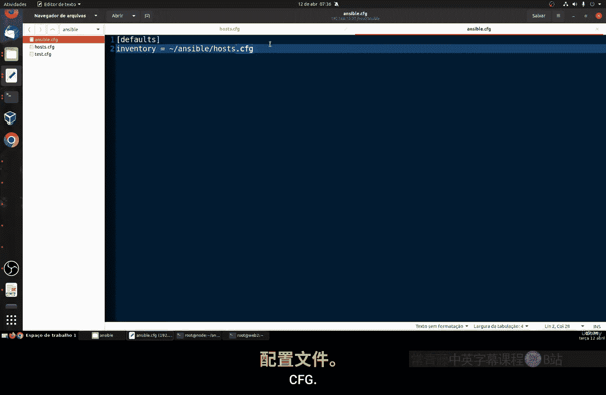
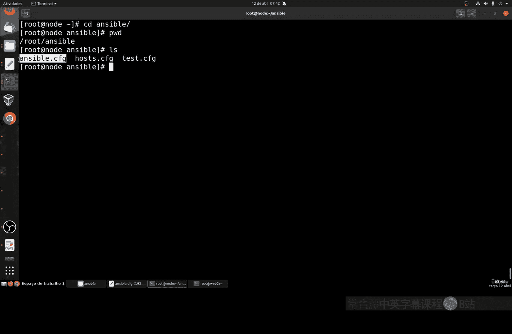
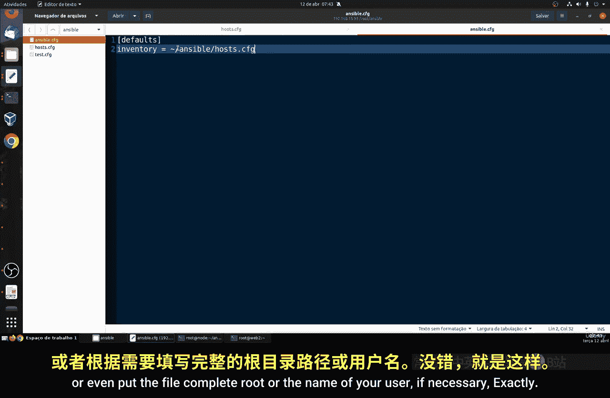
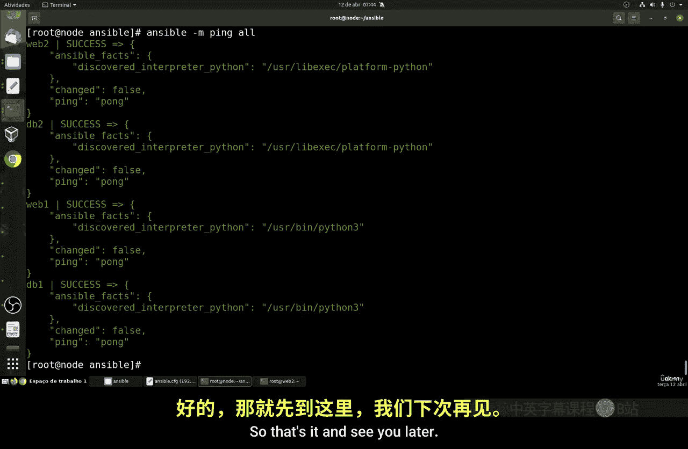

# 048：使用临时命令 🚀

在本节课中，我们将学习如何在 Ansible 中执行临时命令。临时命令是直接在主机上执行的一次性任务，用于快速管理操作，例如创建用户或运行脚本。我们将从测试通信开始，逐步讲解命令的语法和实际应用。

## 概述

临时命令，也称为“ad hoc”命令，是 Ansible 的核心功能之一。它允许你无需编写完整的 Playbook 即可在远程主机上执行单一任务。本节将指导你如何使用这些命令进行基本的通信测试和系统管理。

## 临时命令语法


上一节我们介绍了 Ansible 的基本概念，本节中我们来看看临时命令的具体语法。一个典型的 Ansible 临时命令遵循以下结构：



```bash
ansible [选项] [主机模式] -m [模块名] -a “[模块参数]”
```

以下是各部分的解释：
*   **`ansible`**：调用 Ansible 的命令行工具。
*   **`[选项]`**：例如 `-i` 用于指定清单文件。
*   **`[主机模式]`**：指定目标主机，可以是单个主机名、组名或 `all`（表示所有主机）。
*   **`-m [模块名]`**：指定要使用的 Ansible 模块。
*   **`-a “[模块参数]”`**：传递给模块的参数。

**重要提示**：执行命令前，请确保你位于正确的 Ansible 项目目录中，以便 Ansible 能自动找到你的清单文件（`hosts` 或 `ansible.cfg`）。

## 测试主机通信

最基本的临时命令是使用 `ping` 模块测试与主机的通信。这与操作系统的 `ping` 命令不同，它测试的是 Ansible 能否通过 SSH 在目标主机上成功执行 Python 脚本。

命令格式如下：
```bash
ansible <主机名> -m ping
```

例如，测试名为 `web1` 的主机：
```bash
ansible web1 -m ping
```
如果通信成功，你会看到类似 `pong` 的绿色成功响应，这表明目标主机已准备好接受 Ansible 管理。

如果命令失败（例如返回“不可达”），你需要检查 SSH 连接和主机配置。确保你已正确设置清单文件，并且可以通过 SSH 连接到目标主机。

## 批量测试所有主机

无需为每个主机单独执行命令，你可以使用 `all` 模式一次性测试清单中的所有主机。

命令如下：
```bash
ansible all -m ping
```
此命令将对 `hosts` 文件中定义的所有主机执行 `ping` 模块。

**注意用户权限问题**：默认情况下，Ansible 会使用当前系统用户（如 `root`）进行连接。如果你的目标主机上该用户未启用 SSH 密钥认证，命令会失败。



**解决方法**：确保 Ansible 控制节点上的用户（如 `root`）的公钥已添加到所有受管主机的 `authorized_keys` 文件中。你可以使用 `ssh-copy-id` 命令来完成此操作，例如：
```bash
ssh-copy-id root@web1
```
为所有主机（`web1`， `web2`， `db1`， `db2` 等）重复此步骤。



配置完成后，再次运行 `ansible all -m ping`，你应该能看到所有主机都返回成功的 `pong` 响应。

## 总结



本节课中我们一起学习了 Ansible 临时命令的使用。我们了解了其基本语法，掌握了如何使用 `ping` 模块测试单台主机或所有主机的通信状态，并解决了执行过程中可能遇到的用户权限问题。临时命令是进行快速诊断和一次性任务管理的强大工具，是熟练使用 Ansible 的基础。