# 050：使用包模块 🧩

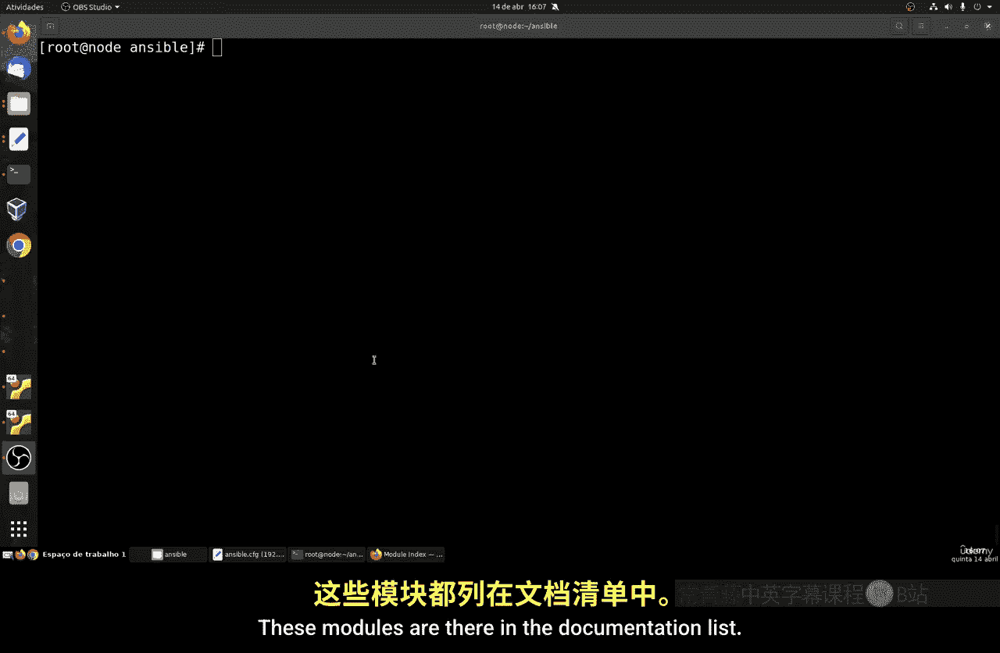

在本节课中，我们将学习如何使用 Ansible 的包管理模块来安装、移除和管理软件包。我们将涵盖通用包模块、特定包管理器模块（如 `apt` 和 `yum`）以及服务管理模块。

Ansible 提供了丰富的模块来管理不同操作系统的软件包。这些模块允许我们自动化安装程序、数据库以及其他服务。不同的 Linux 发行版使用不同的包管理器，例如 Red Hat 系列使用 `yum`，而 Ubuntu/Debian 系列使用 `apt`。Ansible 有针对这些特定管理器的模块，也有通用的 `package` 模块。

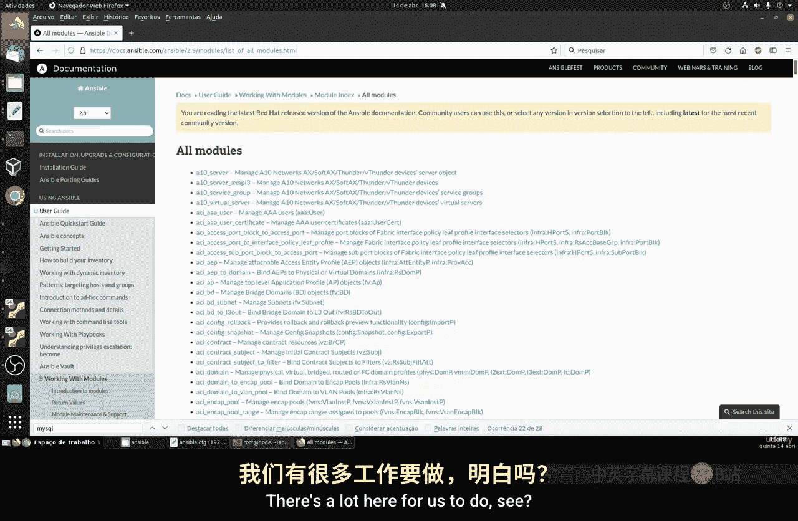

## 模块概览 📚

上一节我们介绍了 Ansible 的基础知识，本节中我们来看看具体的包管理模块。Ansible 官方文档列出了所有可用模块，包括数据库模块、网络模块、防火墙模块和云服务模块等。对于初学者，我们将从最常用的模块开始。

以下是 Ansible 模块文档中的一些类别示例：
*   数据库模块（如 `mysql_db`）
*   网络模块
*   防火墙模块
*   监控服务器模块
*   云服务模块

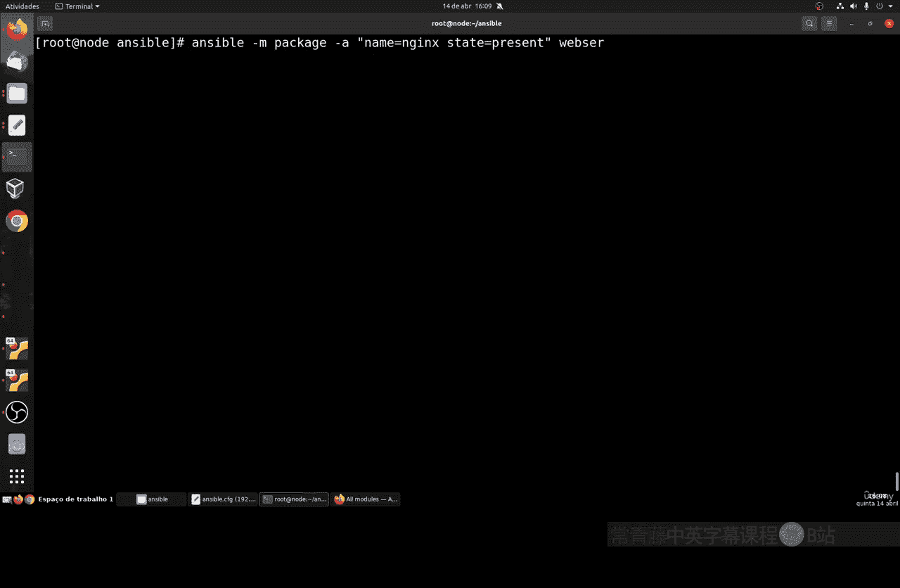

## 使用通用包模块安装软件 🛠️

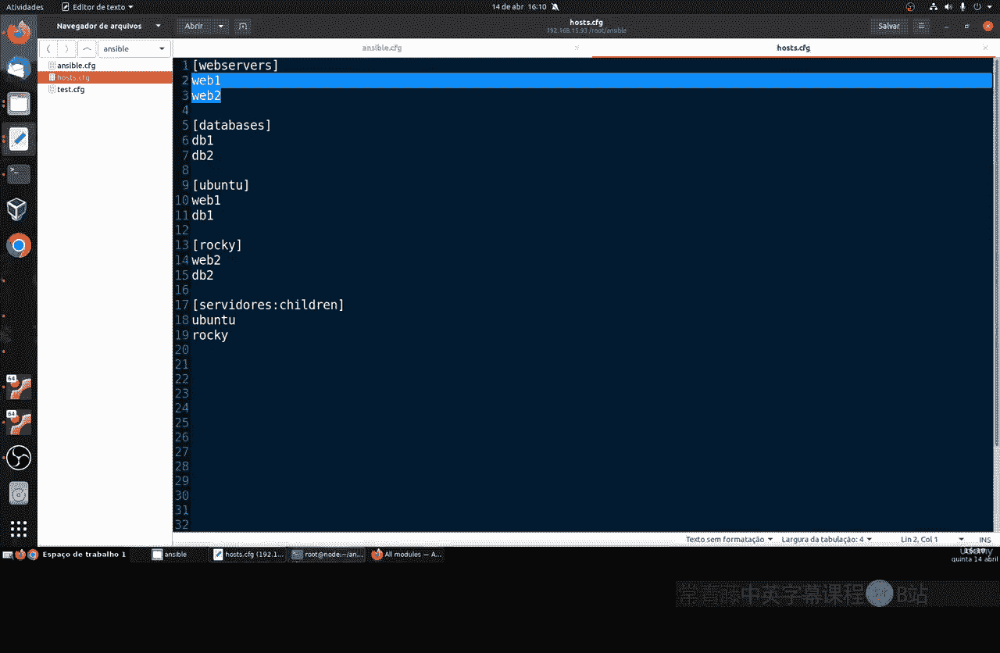

首先，我们学习如何使用通用的 `package` 模块来安装一个软件，例如 Nginx 网页服务器。这个模块的优点在于它是跨平台的，Ansible 会根据目标系统的类型自动选择正确的底层包管理器（如 `yum` 或 `apt`）。

其核心语法是使用 `state` 参数来定义操作意图：
*   `state: present` 表示安装软件包。
*   `state: absent` 表示移除软件包。

以下是一个安装 Nginx 的 Playbook 任务示例代码：

```yaml
- name: 安装 Nginx 网页服务器
  package:
    name: nginx
    state: present
```

执行这个 Playbook 时，Ansible 会在目标主机上安装 Nginx 及其所有依赖。这个过程可能需要一些时间，具体取决于系统和网络速度。安装完成后，Ansible 会显示结果，成功为黄色输出，失败则为红色。

## 管理特定系统的包 🔧

虽然通用模块很方便，但有时我们需要使用特定包管理器的模块来执行更精确的操作，例如对 Ubuntu 系统进行完整的升级。

对于 Debian/Ubuntu 系统，我们使用 `apt` 模块。以下命令用于更新软件包列表并升级所有已安装的软件包：

```yaml
- name: 完全升级 Ubuntu 系统
  apt:
    upgrade: dist
    update_cache: yes
```

对于 Red Hat/CentOS 系统，我们则使用 `yum` 模块来完成类似的操作：

```yaml
- name: 完全升级 Red Hat 系统
  yum:
    name: '*'
    state: latest
```

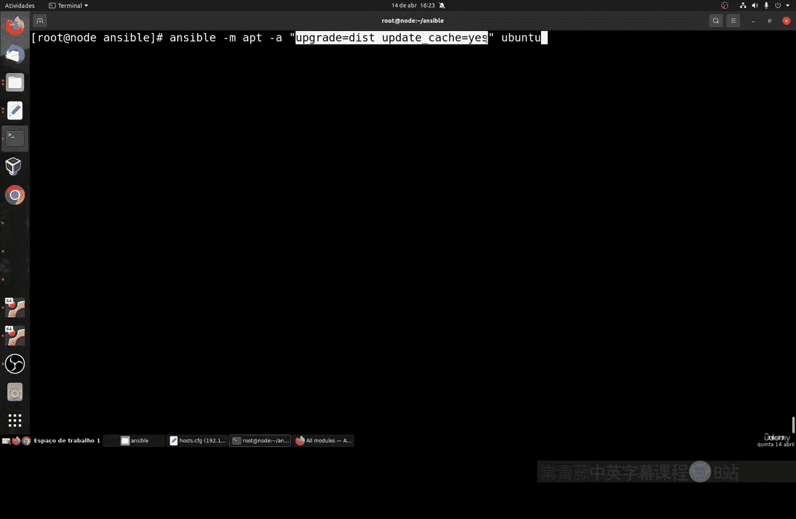

**注意**：在运行这类升级任务时，确保你的主机清单（inventory）按操作系统类型正确分组，以避免在不同系统上执行错误的命令。

## 服务管理与系统重启 ⚙️

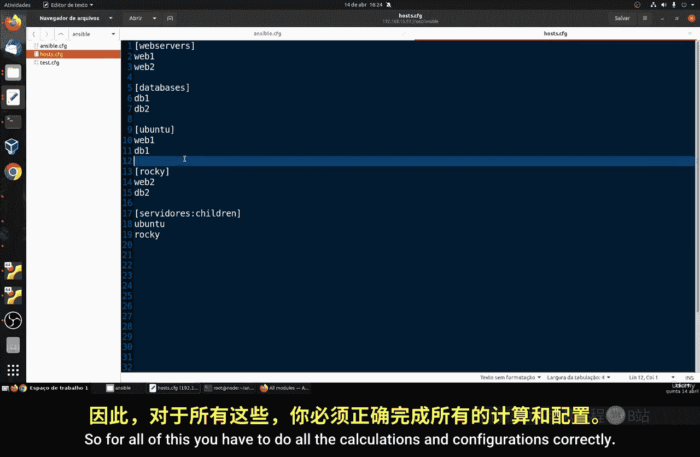

安装软件后，我们通常需要管理其服务状态，例如启动、停止或重启。

我们可以使用 `service` 模块来管理服务。例如，要确保 Nginx 服务在系统启动时运行并立即启动它，可以使用以下代码：

```yaml
- name: 确保 Nginx 服务正在运行
  service:
    name: nginx
    state: started
    enabled: yes
```

**重要提示**：不同发行版的服务名称可能不同。例如，Apache 在 Ubuntu 上叫 `apache2`，在 Red Hat 上叫 `httpd`。MySQL 在 Ubuntu 上叫 `mysql`，在 Red Hat 上可能叫 `mysqld`。使用时需确认正确的服务名。

最后，在完成一系列系统更新后，有时需要重启服务器。Ansible 提供了专门的 `reboot` 模块来完成这个任务。

以下是一个重启主机并等待其恢复的示例：

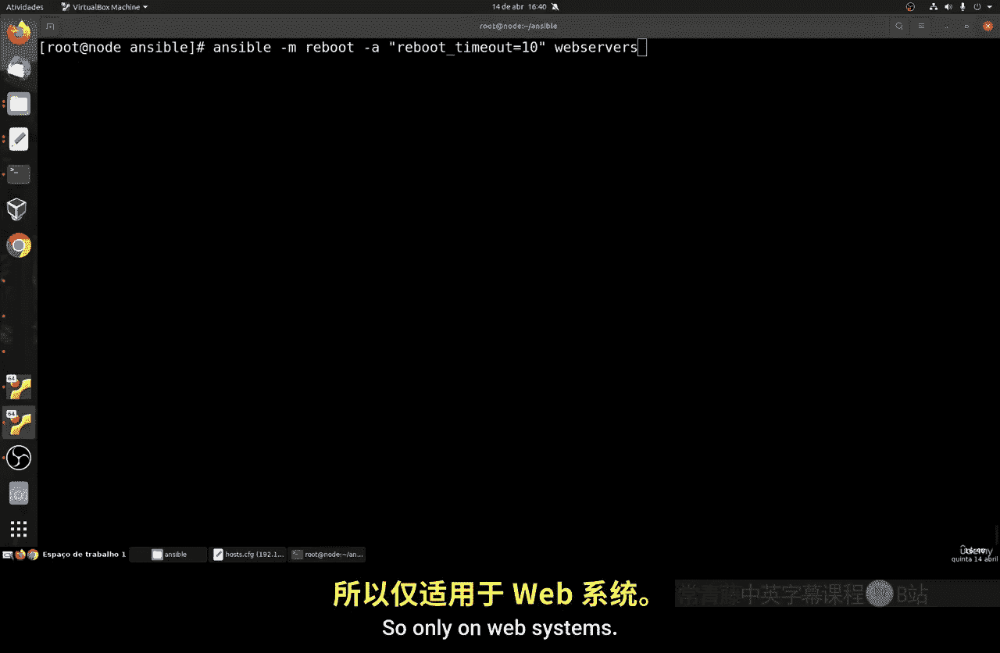

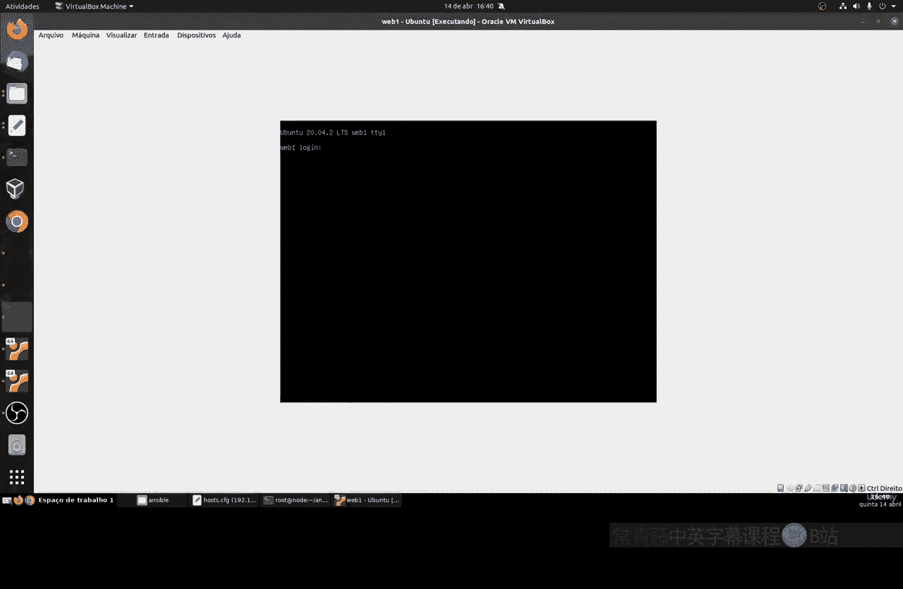

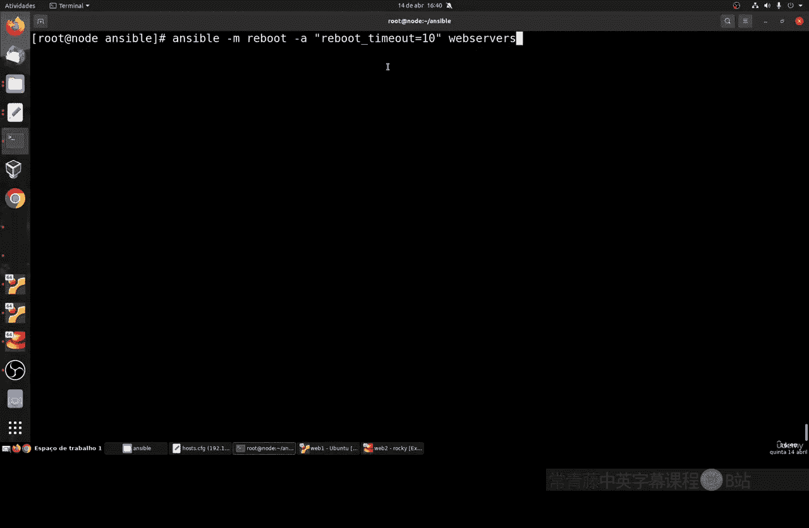

```yaml
- name: 重启服务器
  reboot:
    reboot_timeout: 600 # 等待系统恢复的超时时间（秒）
```

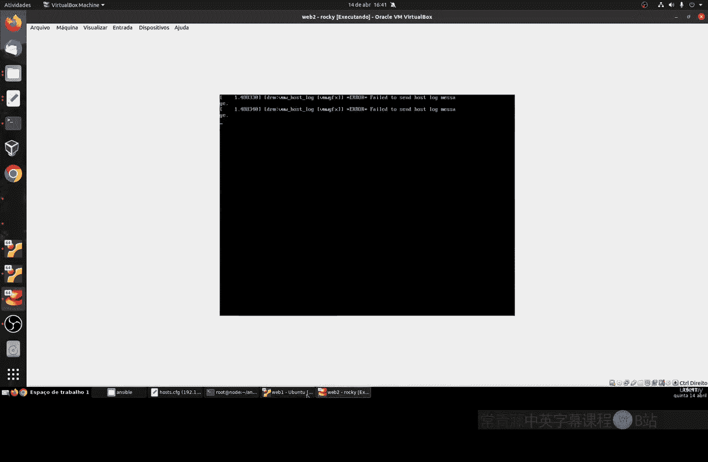

执行重启后，Ansible 会暂时失去与主机的连接，并在主机重新上线后继续。控制台可能会显示连接错误，这是正常现象。

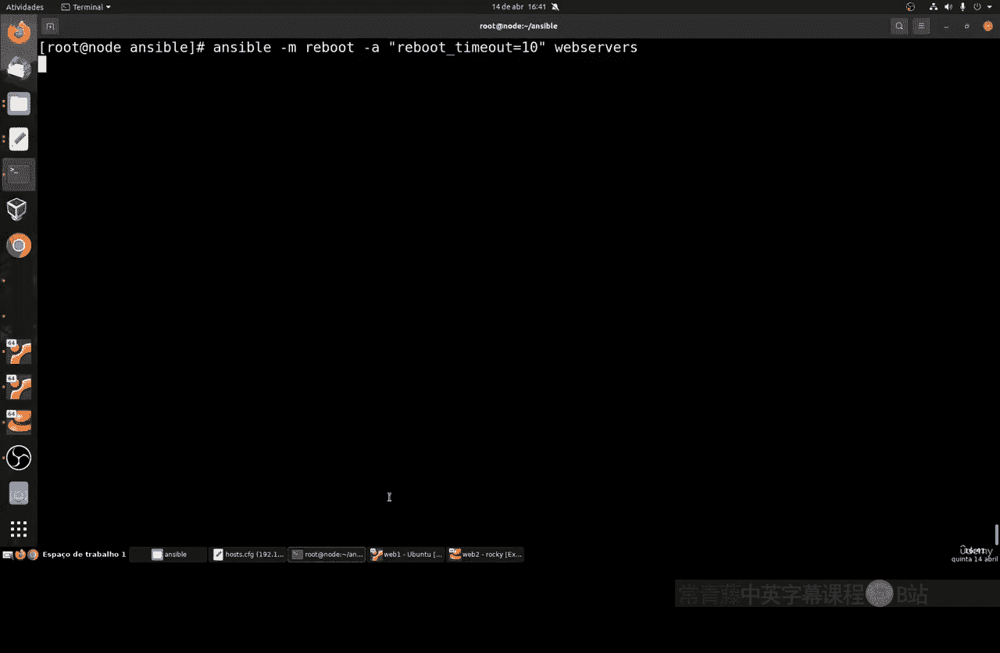

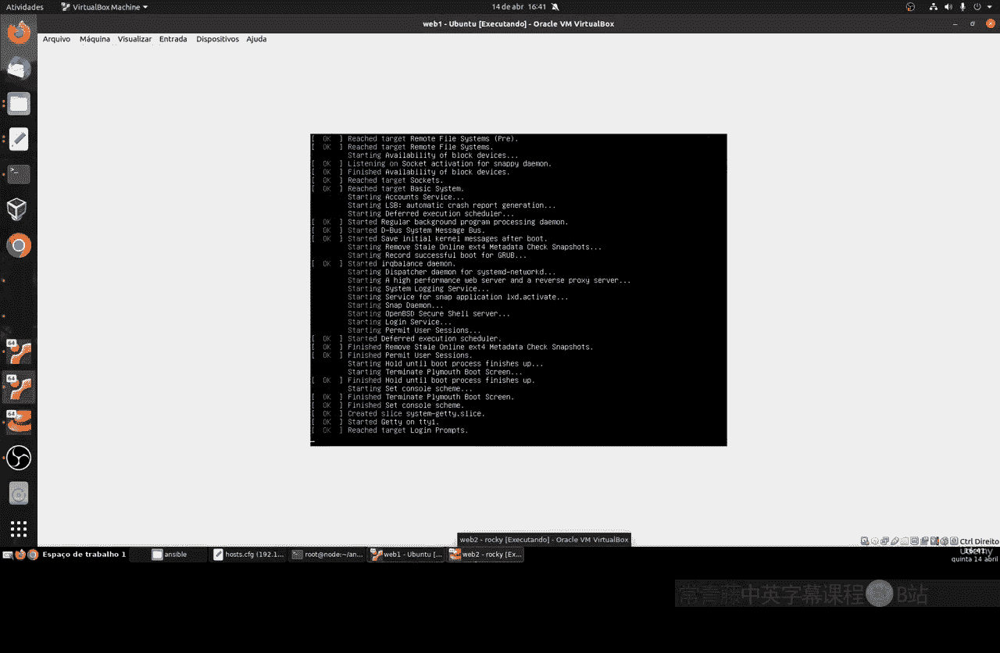

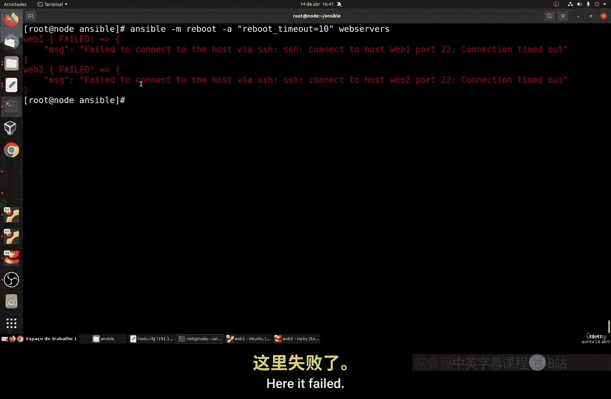

## 总结 📝

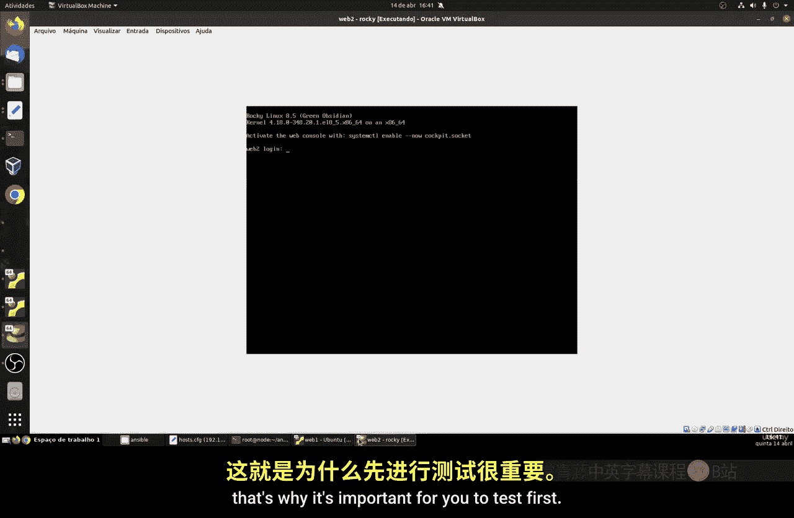

本节课中我们一起学习了 Ansible 包管理模块的核心用法。
*   我们使用通用的 **`package` 模块**和 `state: present` 或 `absent` 参数来跨平台安装和移除软件。
*   我们了解了针对特定系统的 **`apt`** 和 **`yum` 模块**，用于执行如系统升级等高级操作。
*   我们掌握了使用 **`service` 模块**来管理服务的状态（启动、停止、重启）。
*   最后，我们介绍了 **`reboot` 模块**，用于在必要时安全地重启系统。

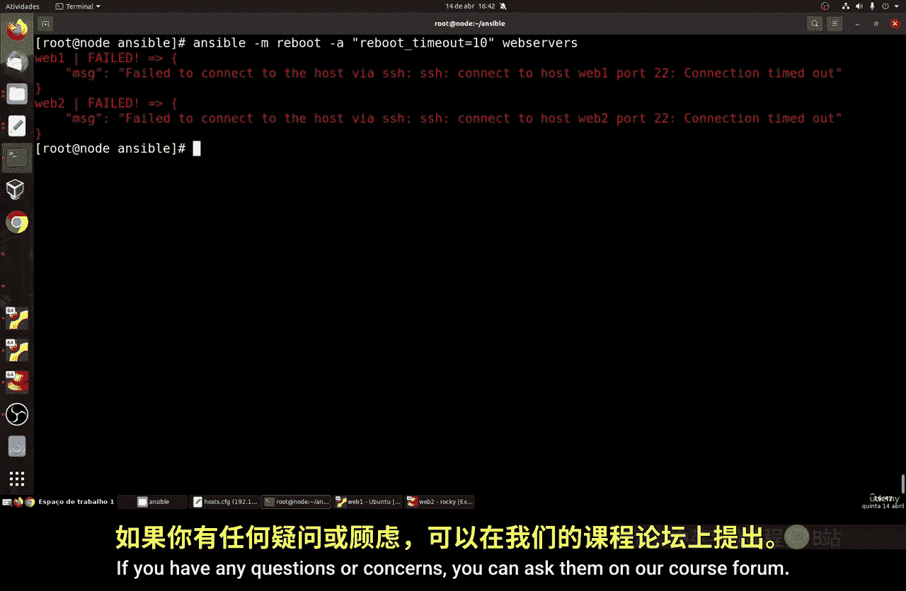

Ansible 的模块生态系统非常庞大且强大，持续在演进。熟练掌握这些模块对于实现自动化运维和 DevOps 实践至关重要。建议你多查阅官方模块文档，并进行实践来巩固理解。