# 051：创建 Playbook 🚀

在本节课中，我们将要学习如何创建 Ansible Playbook。Playbook 是一个 YAML 格式的文件，它包含了一系列我们希望在目标主机上执行的任务。理解 Playbook 是掌握 Ansible 自动化的核心。

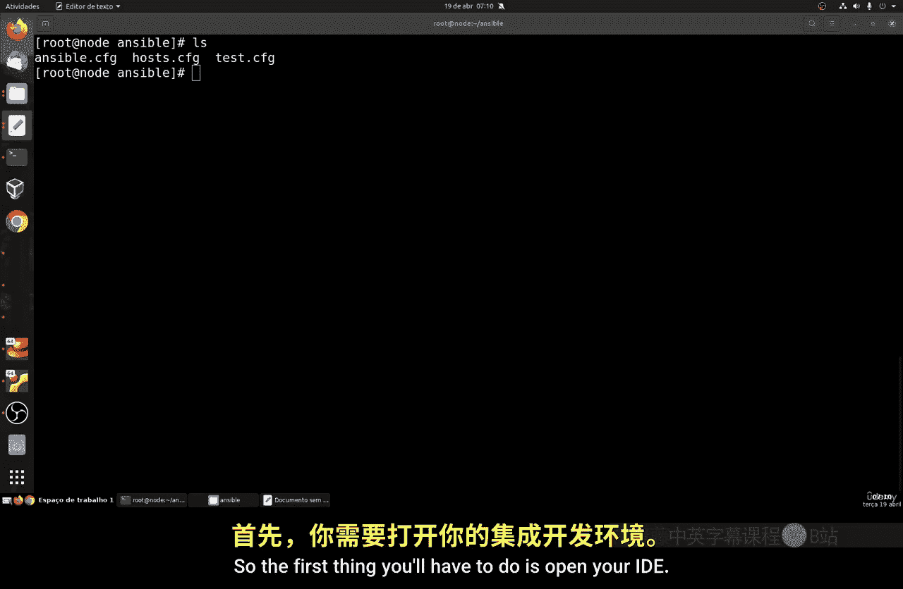

## 概述

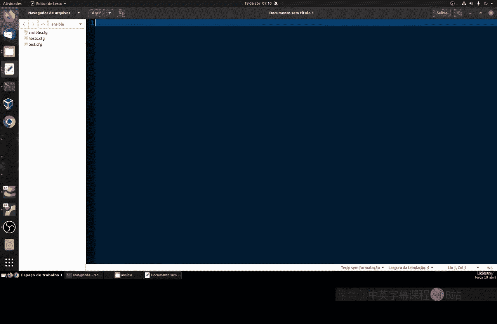

Playbook 是 Ansible 的核心配置文件，它允许我们将一系列复杂的操作定义在一个文件中，然后通过一条命令来执行。这类似于 Kubernetes 中的清单文件概念。简单来说，Playbook 就是一个任务列表，每个任务调用一个 Ansible 模块来完成特定操作，例如创建用户或安装软件。

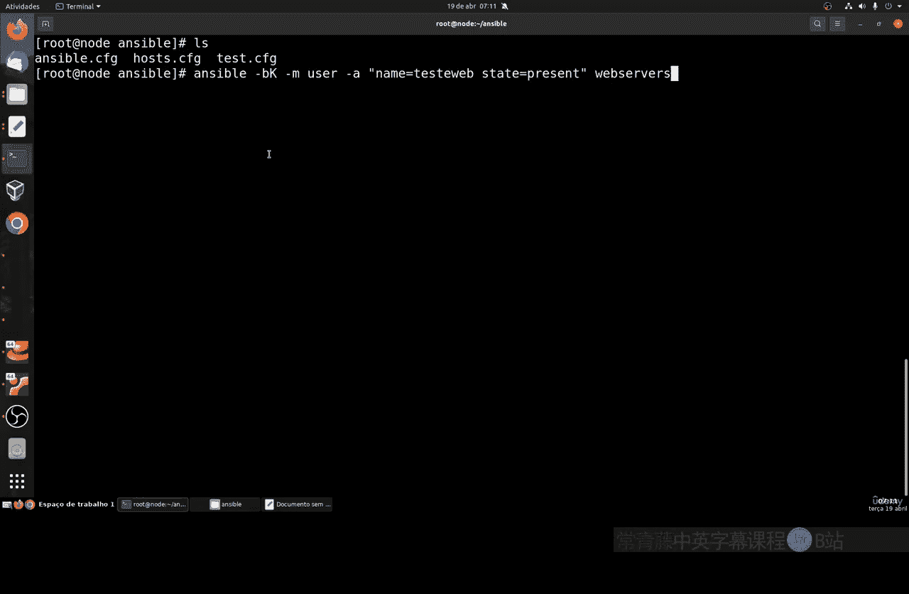


## 创建第一个 Playbook


上一节我们介绍了 Playbook 的基本概念，本节中我们来看看如何动手创建它。

首先，你需要打开一个文本编辑器（IDE），并在正确的目录中创建文件。Ansible Playbook 使用标准化的 YAML 格式，因此使用一个能识别 YAML 语法的 IDE 非常重要，它能帮助你正确地进行缩进和格式化。

### 从 Ad-Hoc 命令到 Playbook

在之前的课程中，我们使用过 `ansible` 命令来创建用户。例如，创建一个名为 `webuser` 用户的命令是：
```bash
ansible webservers -m user -a "name=webuser state=present"
```
我们的目标是将这个一次性命令转化为一个可重复使用的 Playbook 文件。

以下是创建 Playbook 文件的步骤：

1.  **定位目录**：确保你在 Ansible 的主目录下创建文件。可以使用 `pwd` 命令确认当前路径。
2.  **创建文件**：使用 IDE 创建一个新文件，例如命名为 `create_user.yml`。
3.  **编写文件头**：YAML 文件通常以三个短横线 `---` 开始。接着，使用 `name` 关键字为整个 Playbook 添加一个描述性的名称。
4.  **指定目标主机**：使用 `hosts` 关键字指定要在哪些主机或主机组上运行任务。这里我们使用之前定义的主机组 `webservers`。
5.  **启用权限提升**：使用 `become: yes` 来启用特权升级（类似 sudo），以便执行需要 root 权限的任务。
6.  **定义任务列表**：在 `tasks` 关键字下，列出要执行的所有任务。每个任务都是一个字典。

### Playbook 文件详解

让我们结合上面的步骤，看看一个完整的 Playbook 文件 `create_user.yml` 应该是什么样子：

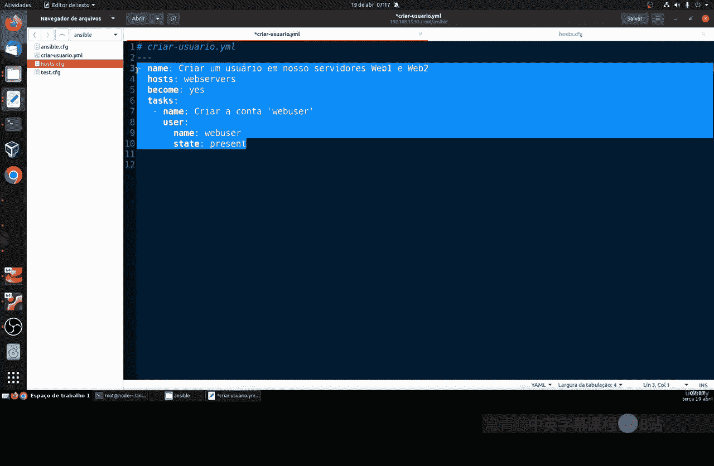

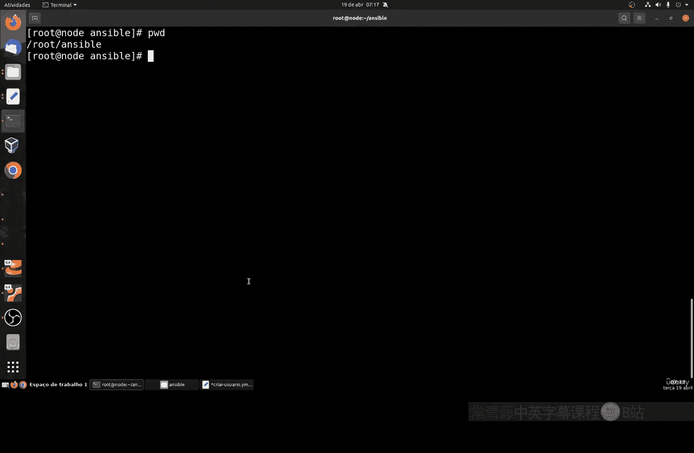

```yaml
---
- name: 在服务器上创建用户
  hosts: webservers
  become: yes

  tasks:
    - name: 创建 Web 用户账户
      user:
        name: webuser
        state: present
```

**代码解释**：
*   `---`：YAML 文件的开始标记。
*   `name`：整个 Playbook 的描述，可以使用中文。
*   `hosts`：指定目标主机组 `webservers`。**必须使用英文**。
*   `become: yes`：启用特权模式。
*   `tasks`：任务列表的开始。
*   `- name: 创建 Web 用户账户`：第一个任务的描述。
*   `user:`：调用 `user` 模块。**模块名必须使用英文**。
*   `name: webuser` 和 `state: present`：传递给 `user` 模块的参数，表示创建名为 `webuser` 的用户。

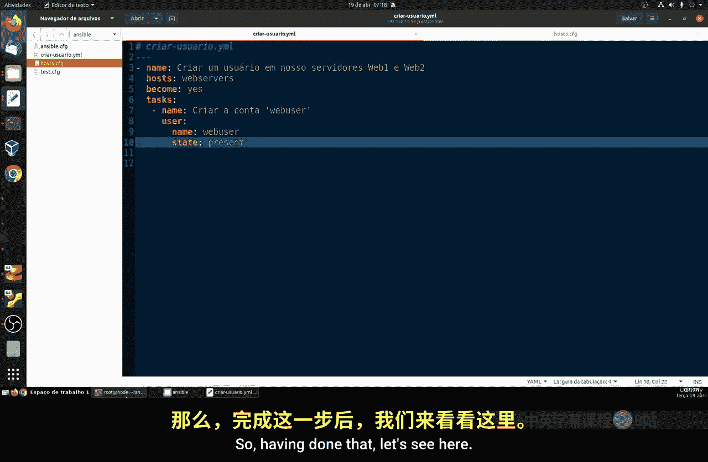

**关键点**：YAML 对缩进（空格）非常敏感。`tasks` 下的每个任务都需要缩进，任务内的模块参数需要进一步缩进。使用 IDE 可以自动帮你管理格式。

## 执行与验证 Playbook

文件创建完成后，就可以运行它了。运行 Playbook 的命令非常简单。

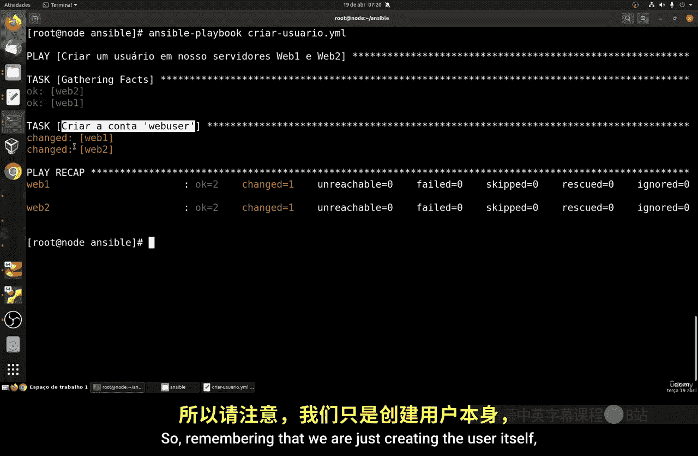

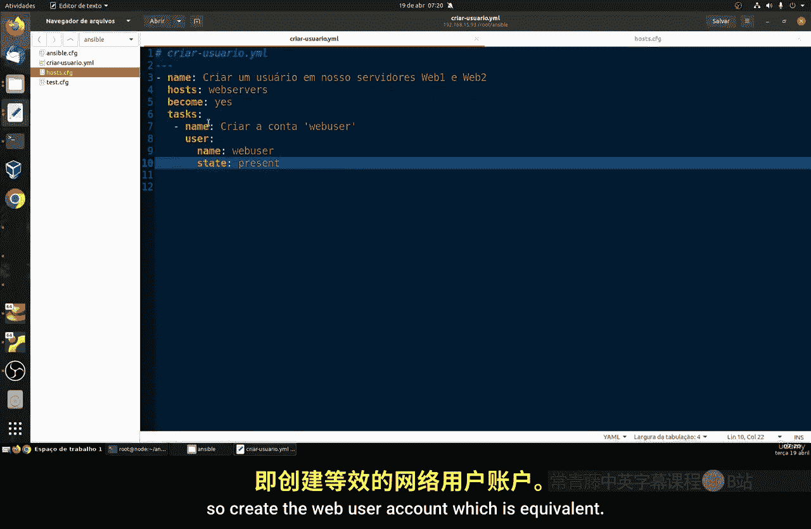

在终端中，使用 `ansible-playbook` 命令后跟文件名：
```bash
ansible-playbook create_user.yml
```
执行后，Ansible 会输出详细的执行过程：
1.  首先会测试与目标主机（`web1` 和 `web2`）的连接。
2.  然后执行定义的任务“创建 Web 用户账户”。
3.  最后会给出一个总结，显示每个主机上任务执行的成功与否、是否发生了变更等信息。

如果一切顺利，你会在总结中看到 `changed=1`，表示用户创建成功。

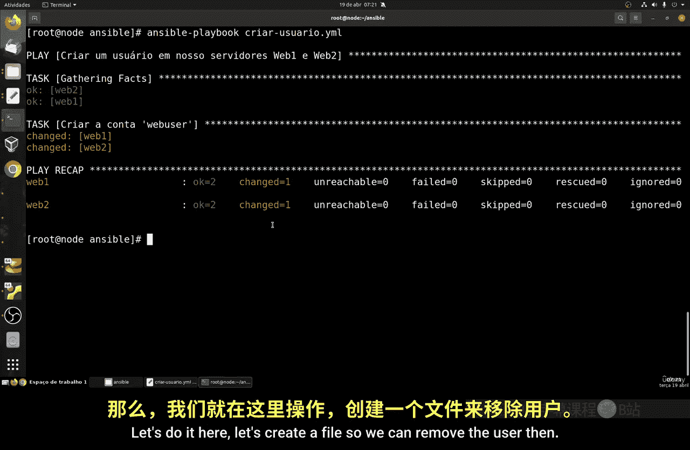

## 扩展：删除用户的 Playbook

上一节我们创建了用户，本节中我们来看看如何创建一个用于删除用户的 Playbook。

创建一个新文件 `remove_user.yml`，其内容与创建用户的 Playbook 高度相似，主要区别在于 `user` 模块的参数。

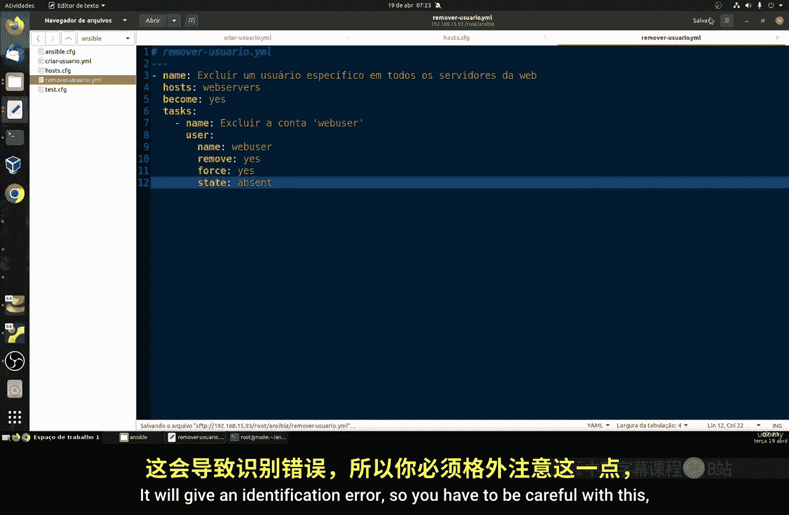

以下是删除用户的 Playbook 示例：
```yaml
---
- name: 在所有 Web 服务器上删除特定用户
  hosts: webservers
  become: yes

  tasks:
    - name: 删除 webuser 账户
      user:
        name: webuser
        state: absent
        remove: yes
        force: yes
```
**代码解释**：
*   `state: absent`：将状态改为“缺席”，即删除用户。
*   `remove: yes` 和 `force: yes`：强制删除用户的家目录及其中的文件。

使用以下命令执行删除操作：
```bash
ansible-playbook remove_user.yml
```

### 限制执行范围

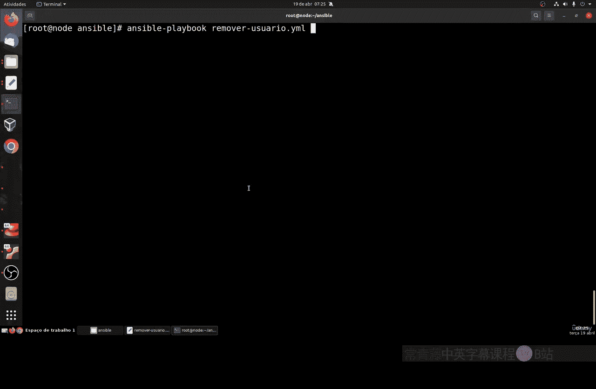

有时，你可能只想在主机组内的部分主机上执行 Playbook。这时可以使用 `--limit` 参数。

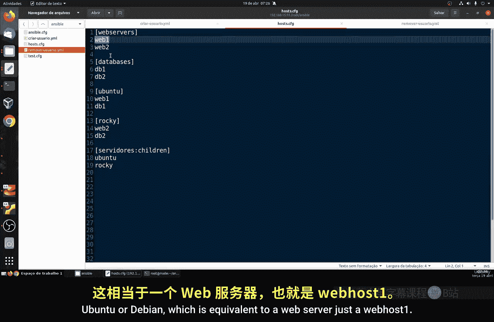

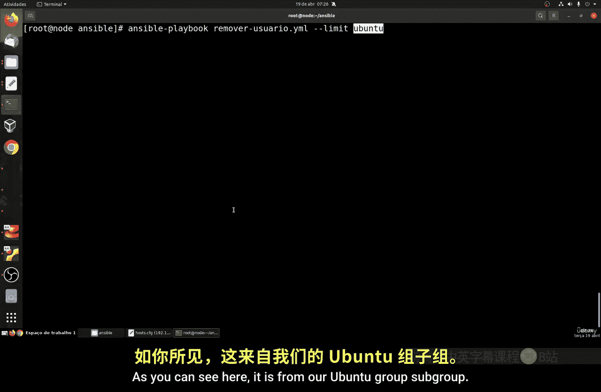

例如，我们的 `webservers` 组下可能有一个按操作系统划分的子组 `ubuntu`（对应 `web1`）。如果只想在 `ubuntu` 子组的主机上删除用户，可以这样执行：
```bash
ansible-playbook remove_user.yml --limit ubuntu
```
这样，任务将只在属于 `ubuntu` 组的主机（即 `web1`）上运行。

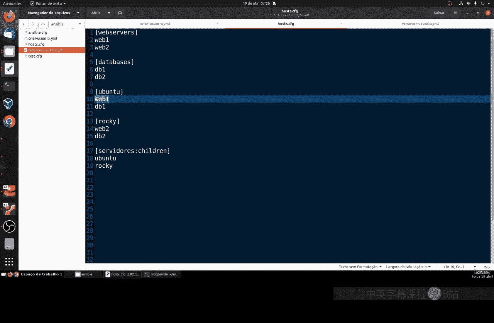

## 总结

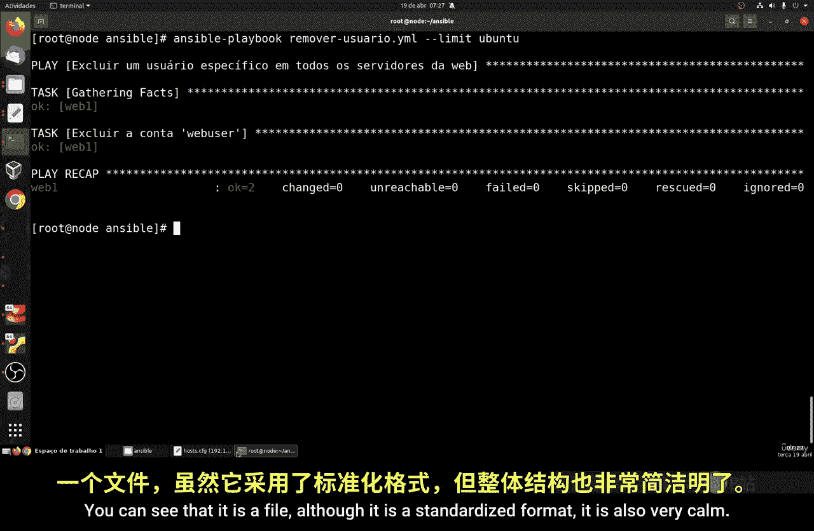

本节课中我们一起学习了 Ansible Playbook 的核心知识：
1.  **Playbook 是什么**：它是用于定义 Ansible 自动化任务的 YAML 文件。
2.  **如何创建**：使用 `---` 开头，定义 `name`、`hosts`、`become` 和 `tasks`。
3.  **如何执行**：使用 `ansible-playbook <文件名>` 命令。
4.  **关键技巧**：注意 YAML 的严格缩进；使用 IDE 辅助编写；`hosts` 和模块名等关键字**必须使用英文**，而 `name` 描述可以使用中文。
5.  **扩展应用**：通过修改模块参数（如 `state: present` 改为 `state: absent`）来改变任务行为；使用 `--limit` 参数限制任务执行的主机范围。

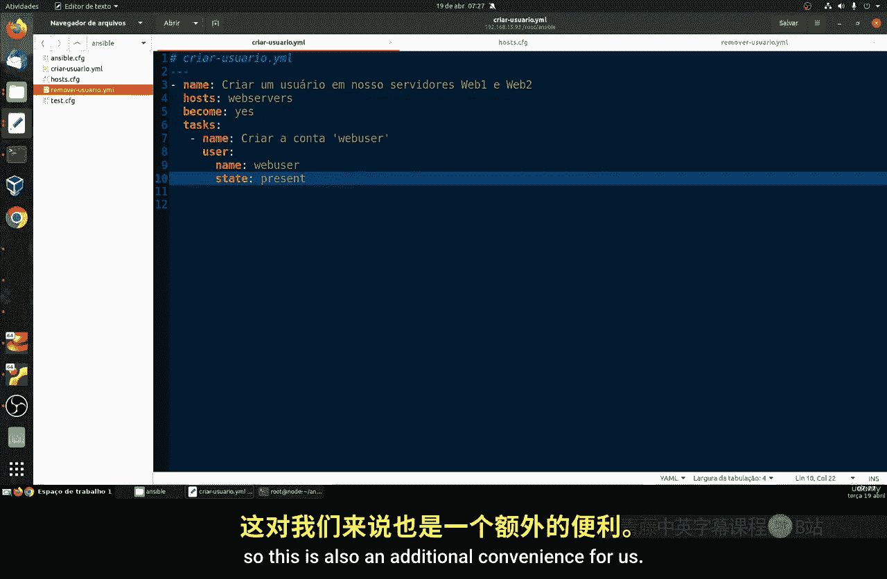

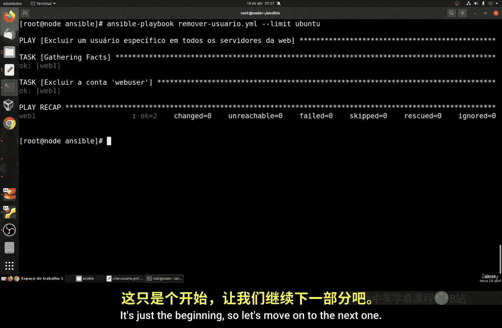

Playbook 是 Ansible 自动化的基石，通过将操作代码化、文件化，使得复杂的基础设施管理变得可重复、可版本控制。接下来，我们将继续深入学习更复杂的 Playbook 编写技巧。