# 052：在Playbook中使用变量 🎯

在本节课中，我们将学习如何在Ansible Playbook文件中使用变量。变量可以使我们的Playbook文件更加灵活和通用，便于代码重用。

## 概述

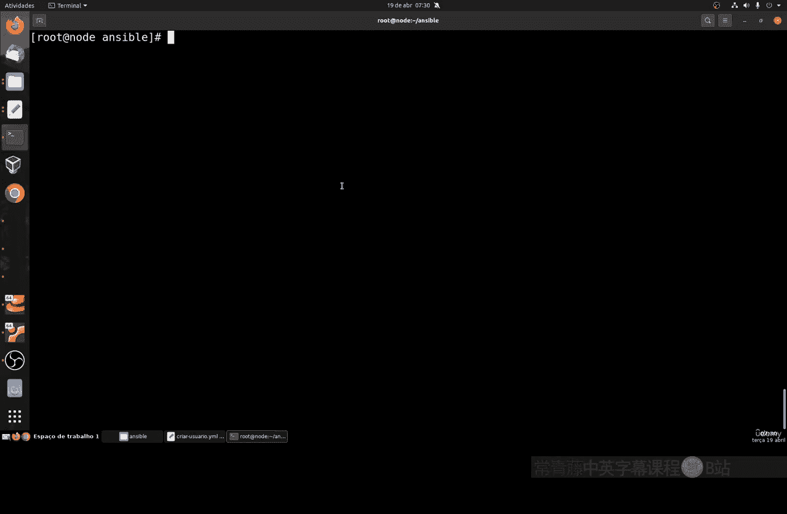

变量是编程中的一个核心概念，在Ansible Playbook中同样适用。通过使用变量，我们可以避免在多个地方重复修改相同的值，只需修改变量的定义，即可自动更新所有引用该变量的地方。这不仅能节省时间，还能减少出错的可能性。

## 变量基础

上一节我们介绍了Playbook的基本结构，本节中我们来看看如何定义和使用变量。

在Playbook中，变量用双花括号 `{{ }}` 表示。例如，如果我们有一个任务需要创建用户，并且用户名可能会变化，我们可以将用户名定义为一个变量。

**代码示例：**
```yaml
- name: 创建用户
  user:
    name: "{{ username }}"
    state: present
```

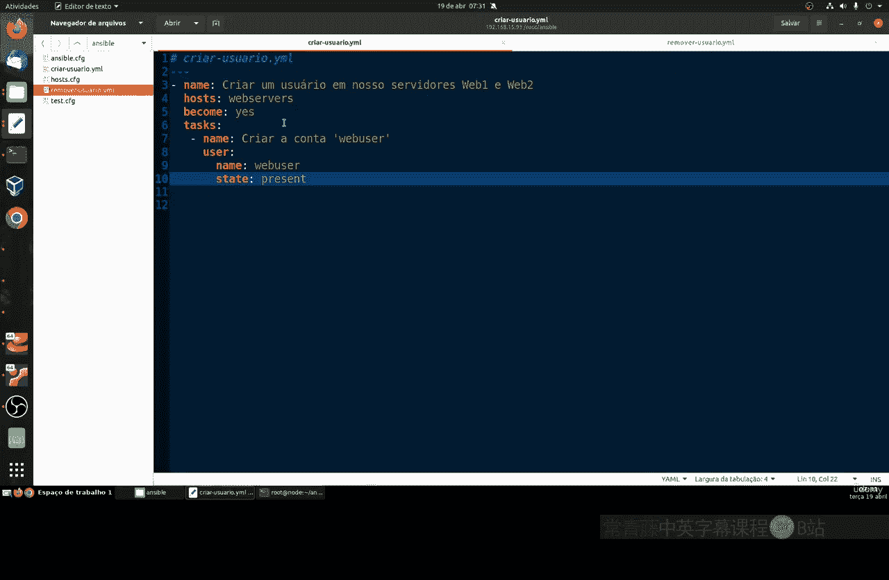

在这个例子中，`{{ username }}` 就是一个变量。我们稍后会给这个变量赋值，Ansible在执行时会自动替换它。

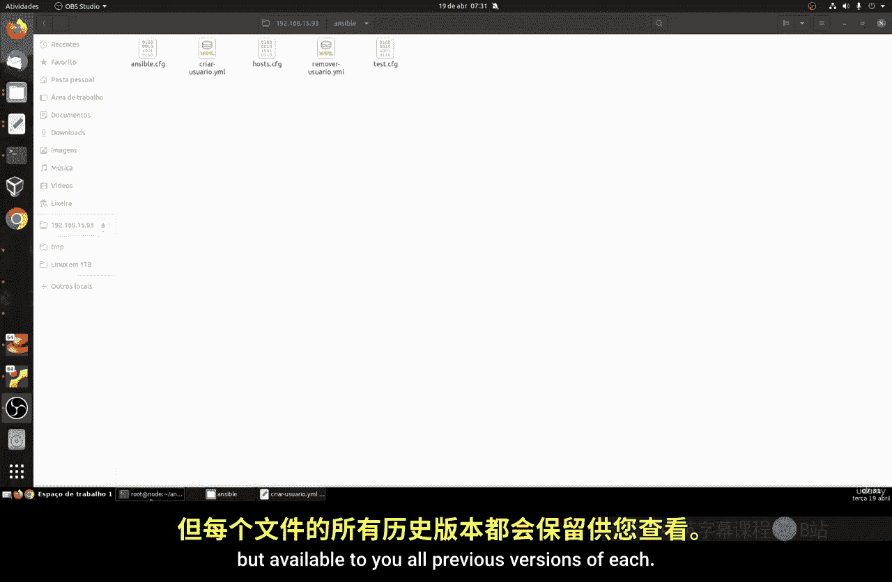

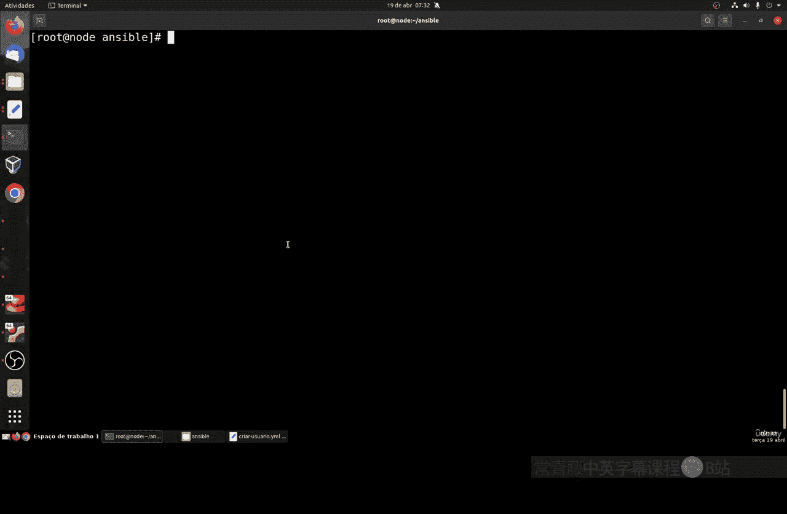

## 定义变量

变量可以在Playbook文件内部定义，这被称为局部变量。局部变量只对当前Playbook文件有效。

定义变量的位置在Playbook的 `vars` 部分。以下是定义变量的步骤：

1.  在Playbook的顶部，使用 `vars:` 关键字。
2.  在 `vars:` 下方，以缩进格式列出变量名和值。

**代码示例：**
```yaml
---
- hosts: all
  vars:
    username: webuser
  tasks:
    - name: 创建用户
      user:
        name: "{{ username }}"
        state: present
```

在这个示例中，我们定义了一个名为 `username` 的变量，并将其值设置为 `webuser`。在任务中，我们通过 `{{ username }}` 来引用这个变量。

## 变量的优势

使用变量的主要优势在于其灵活性和可维护性。以下是使用变量的几个好处：

*   **代码重用**：可以编写通用的Playbook，通过修改变量值来适应不同的场景。
*   **易于维护**：当需要修改某个值时，只需在变量定义处修改一次，所有引用该变量的地方都会自动更新。
*   **减少错误**：避免了在多个地方手动修改相同值可能带来的不一致性。

## 实践示例：创建和删除用户

让我们通过一个完整的示例来实践变量的使用。我们将创建两个Playbook：一个用于创建用户，另一个用于删除用户，并在两个Playbook中都使用同一个变量。

### 创建用户的Playbook

以下是使用变量创建用户的Playbook文件内容：

**代码示例：**
```yaml
---
- name: 使用变量创建用户
  hosts: all
  vars:
    username: webuser
  tasks:
    - name: 创建用户账户
      user:
        name: "{{ username }}"
        state: present
        shell: /bin/bash
```

执行这个Playbook时，Ansible会在目标主机上创建一个名为 `webuser` 的用户。

### 删除用户的Playbook

同样地，我们可以创建一个使用相同变量来删除用户的Playbook：

**代码示例：**
```yaml
---
- name: 使用变量删除用户
  hosts: all
  vars:
    username: webuser
  tasks:
    - name: 删除用户账户
      user:
        name: "{{ username }}"
        state: absent
```

执行这个Playbook时，Ansible会删除目标主机上名为 `webuser` 的用户。

### 修改变量值

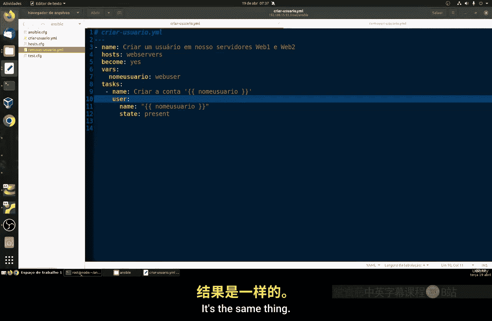

如果我们想创建或删除另一个用户，例如 `webuser1`，我们只需修改变量 `username` 的值，而无需修改任务中的其他部分。

将 `vars` 部分修改为：
```yaml
  vars:
    username: webuser1
```

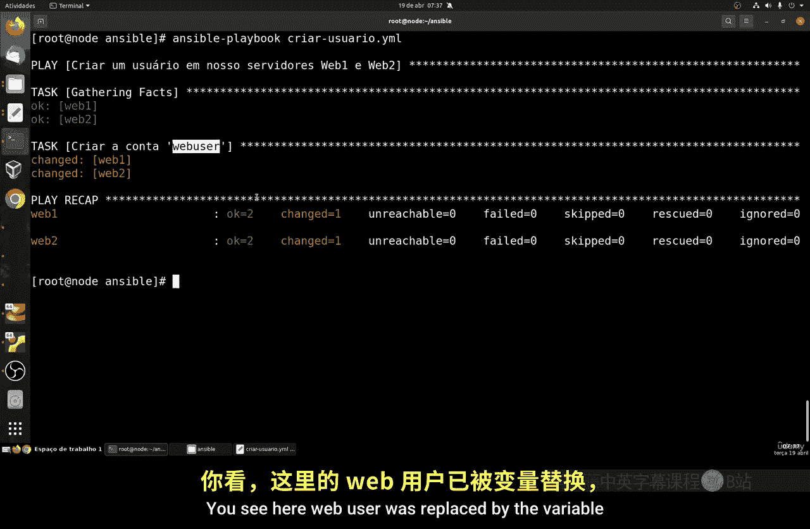

然后重新运行Playbook即可。Ansible会自动将 `{{ username }}` 替换为 `webuser1`，从而创建或删除对应的用户。

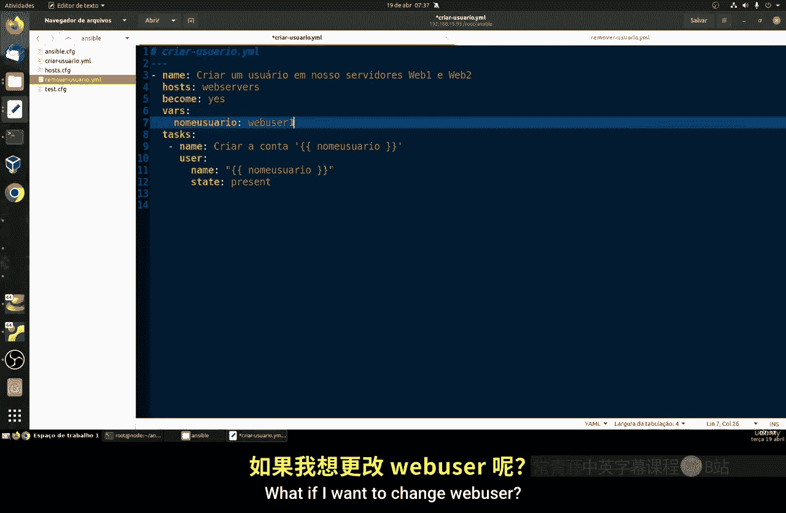

## 变量层次结构

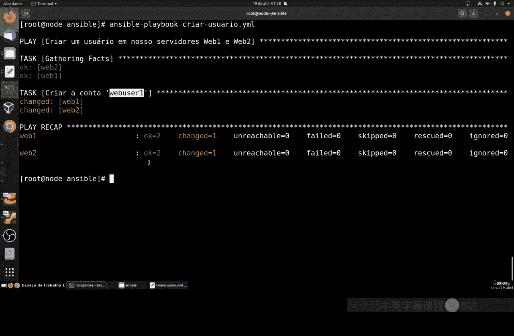

Ansible支持多种变量定义方式，形成了不同的优先级层次。了解这些层次有助于更好地组织和管理变量。

以下是主要的变量层次结构（从高优先级到低优先级）：

1.  **主机变量**：针对特定主机定义的变量，通常存放在 `host_vars` 目录下的文件中。
2.  **组变量**：针对主机组定义的变量，通常存放在 `group_vars` 目录下的文件中。
3.  **Playbook变量**：在Playbook文件内部通过 `vars` 定义的变量（即本节课所讲的内容）。
4.  **全局变量**：在Ansible配置或清单文件中定义的变量。

在后续课程中，我们会详细介绍组变量和主机变量的使用方法。

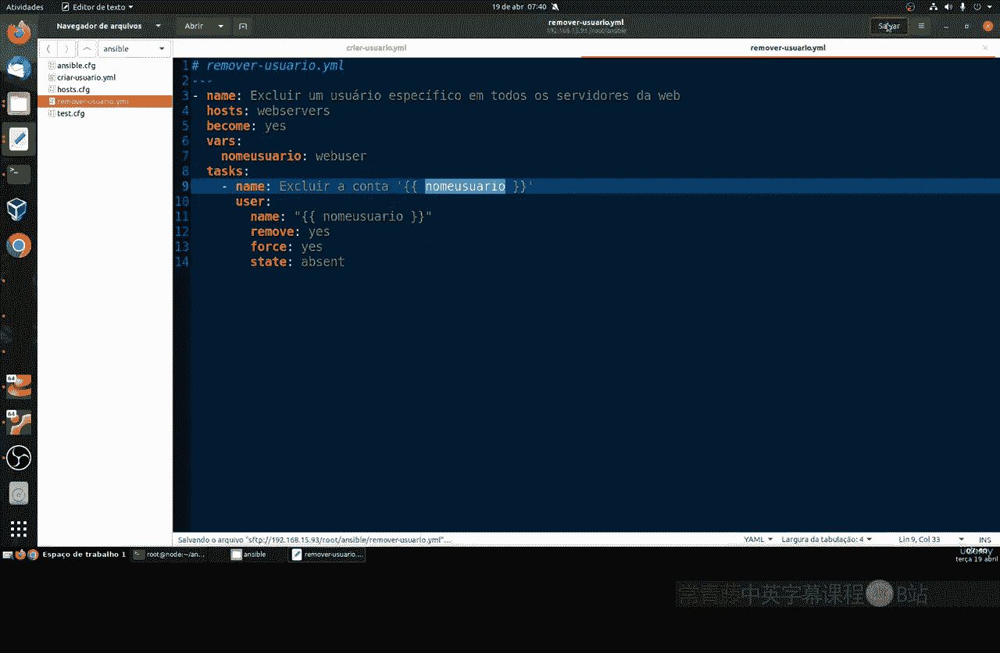

## 注意事项

在使用变量时，需要注意以下几点：

*   **变量名一致性**：确保变量定义时的名称和引用时的名称完全一致。
*   **引号使用**：在任务中引用变量时，通常需要将整个参数值用双引号括起来，例如 `name: "{{ username }}"`。
*   **缩进格式**：YAML对缩进非常敏感，确保 `vars` 和任务列表的缩进正确。
*   **谨慎修改**：由于修改变量值会影响所有引用该变量的地方，因此在修改或删除变量时需要格外小心，以免造成意外的系统更改。

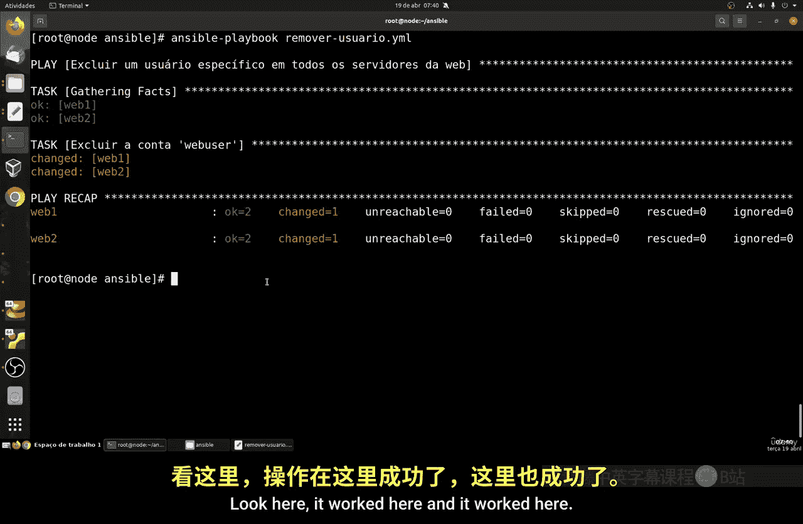

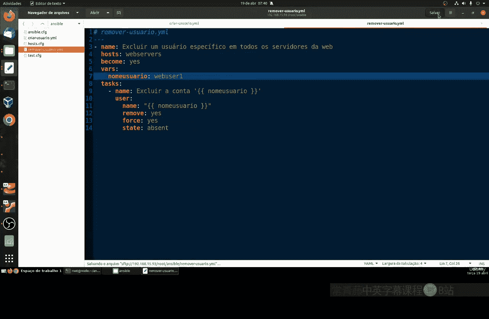

## 总结

本节课中我们一起学习了在Ansible Playbook中使用变量的方法。我们了解了变量的基本语法、如何定义局部变量、以及使用变量带来的代码重用和维护便利性。通过创建和删除用户的实践示例，我们掌握了定义和修改变量的具体操作。最后，我们简要介绍了Ansible的变量层次结构，为后续学习更高级的变量管理打下了基础。

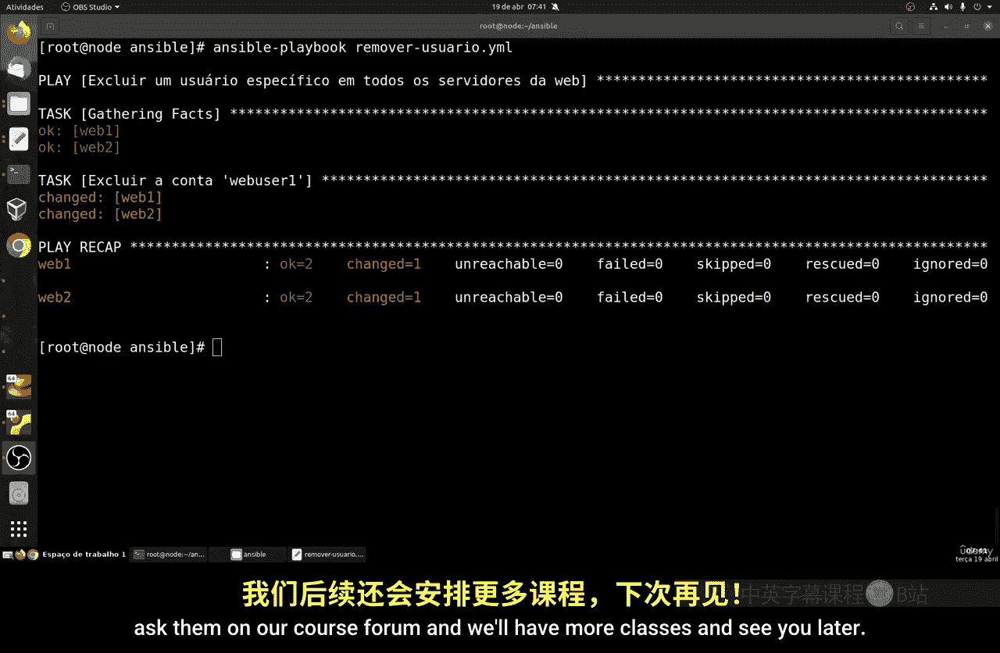

合理使用变量是编写高效、可维护Ansible Playbook的关键技能。