# 053：在Playbook中使用变量（第二部分）🎯

在本节课中，我们将学习如何在Ansible中更高效地管理变量。我们将通过创建一个独立的目录和文件来集中存放变量，使我们的Playbook代码更简洁、更易于维护。

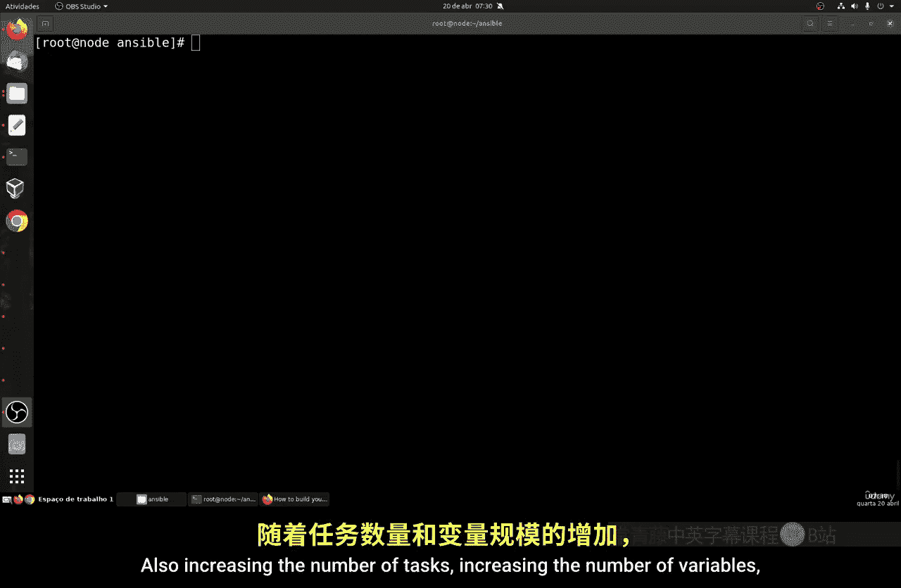

上一节我们介绍了在Playbook中直接定义变量的方法，本节中我们来看看如何将变量分离到外部文件中进行管理。

## 创建变量组目录

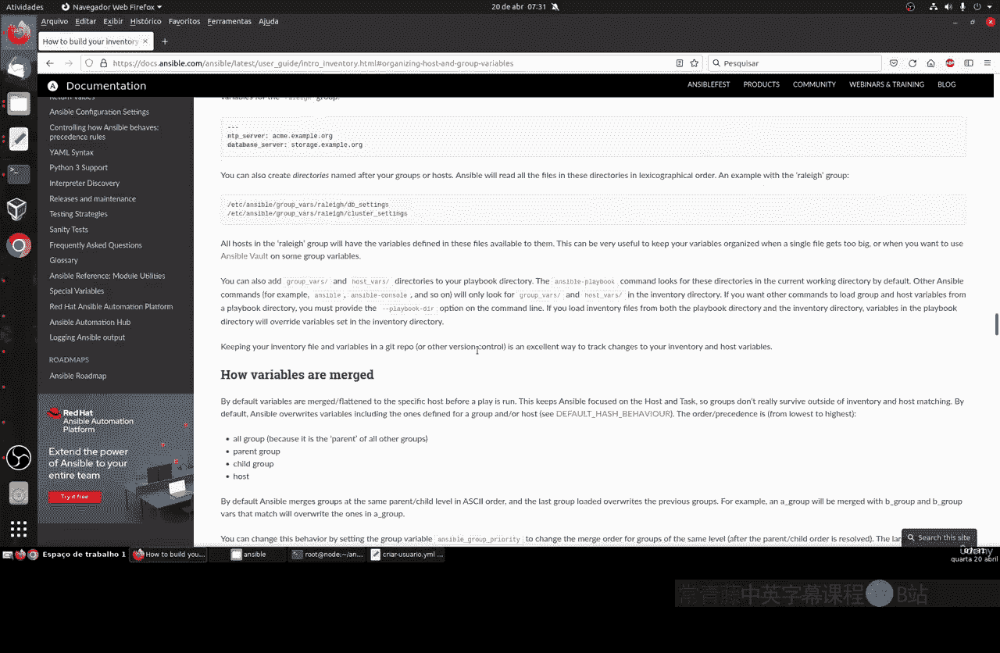

首先，我们需要在Ansible项目目录中创建一个特定的目录来存放变量文件。这个目录的名称是固定的，不能随意更改。

以下是创建步骤：

1.  确保你位于正确的Ansible项目目录中。可以使用 `pwd` 命令确认。
2.  执行命令 `mkdir group_vars` 来创建名为 `group_vars` 的目录。

创建完成后，你的目录结构应类似于：
```
ansible/
├── create_user.yml
├── remove_user.yml
└── group_vars/
```

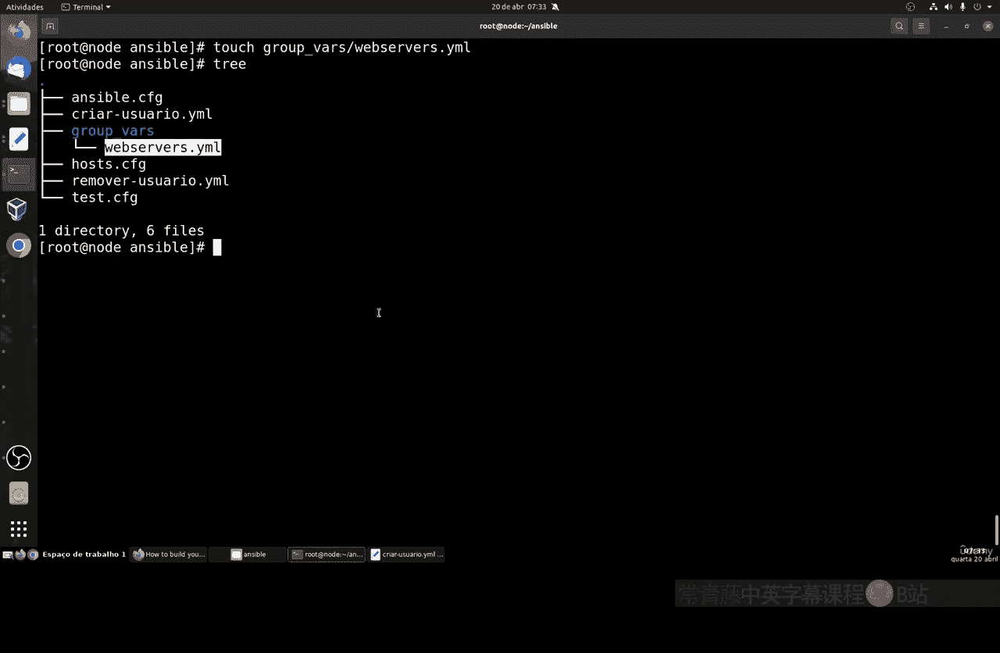

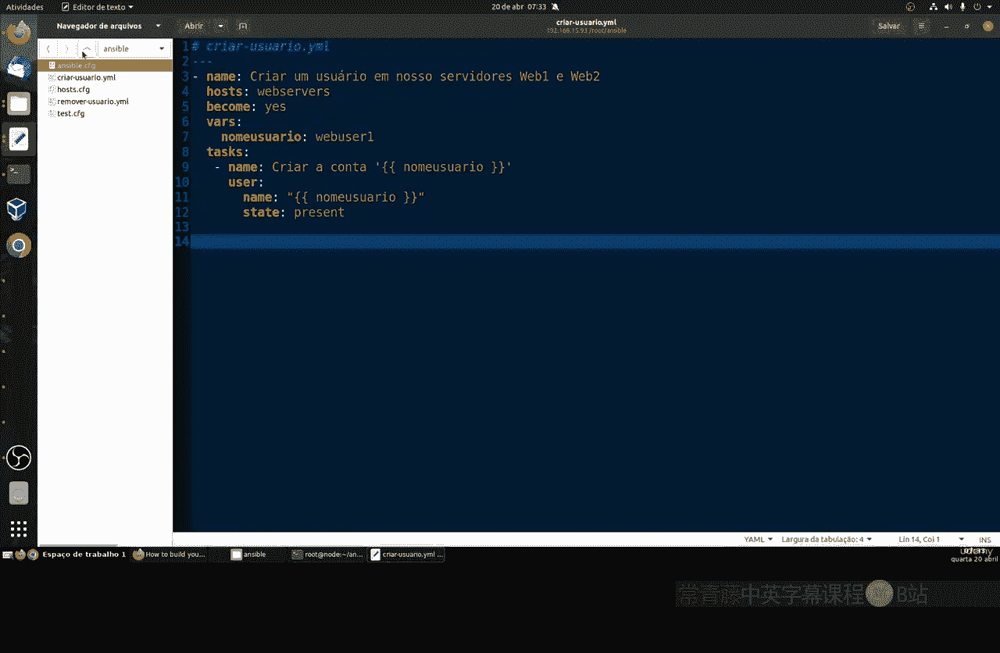

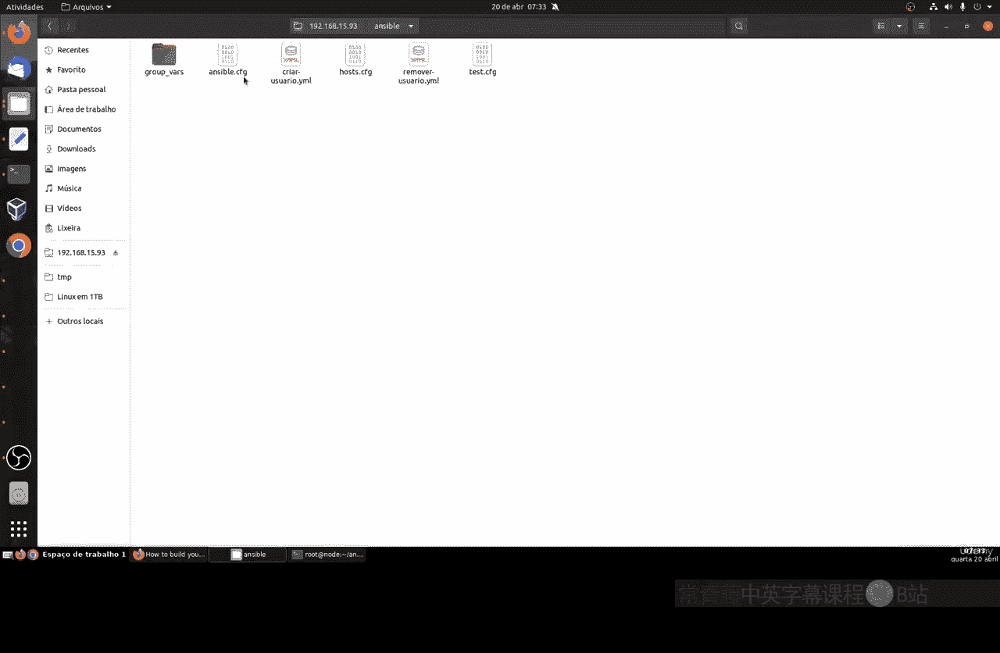

## 创建变量文件

接下来，我们在 `group_vars` 目录内为特定的主机组创建变量文件。文件名通常与你的主机组名称一致。

以下是具体操作：

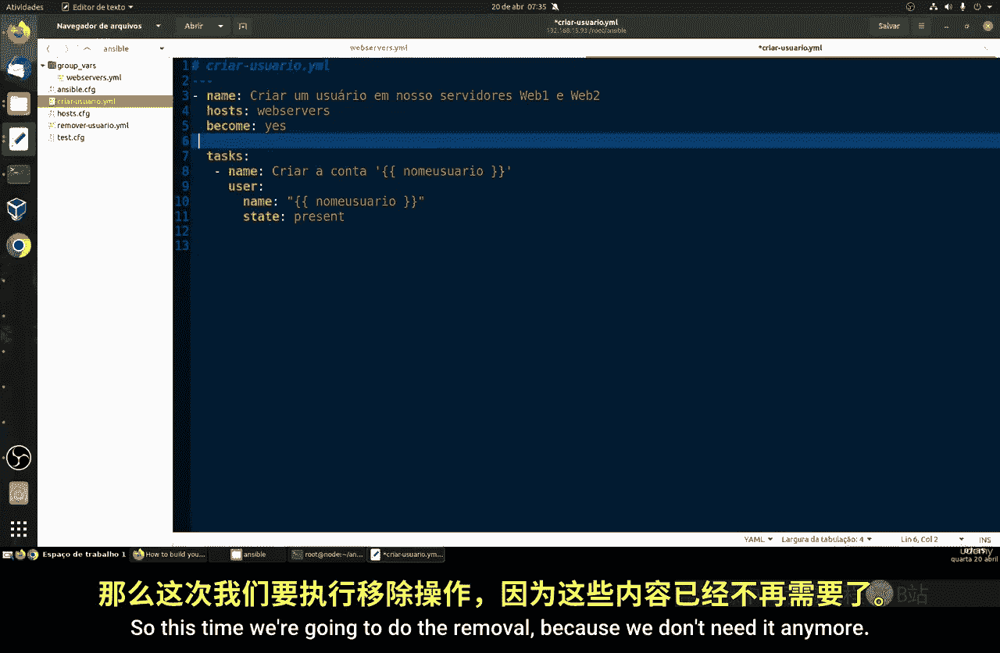

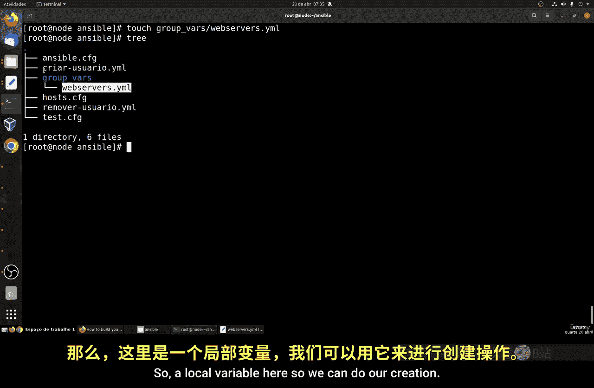

1.  进入 `group_vars` 目录。
2.  使用命令 `touch webservers.yml` 创建一个名为 `webservers.yml` 的YAML文件。

此时，目录结构变为：
```
ansible/
├── create_user.yml
├── remove_user.yml
└── group_vars/
    └── webservers.yml
```

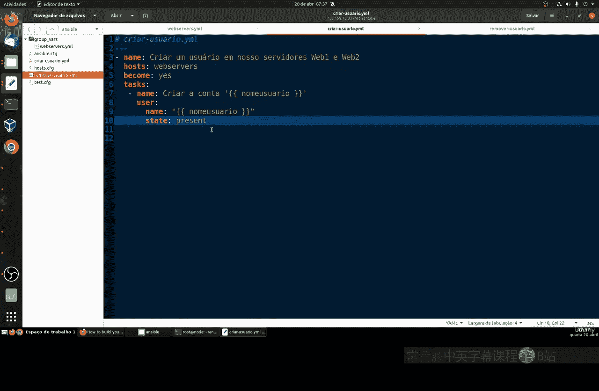

## 定义变量

现在，我们编辑 `webservers.yml` 文件，将变量定义在其中。这种方式使得变量与Playbook逻辑分离，便于管理。

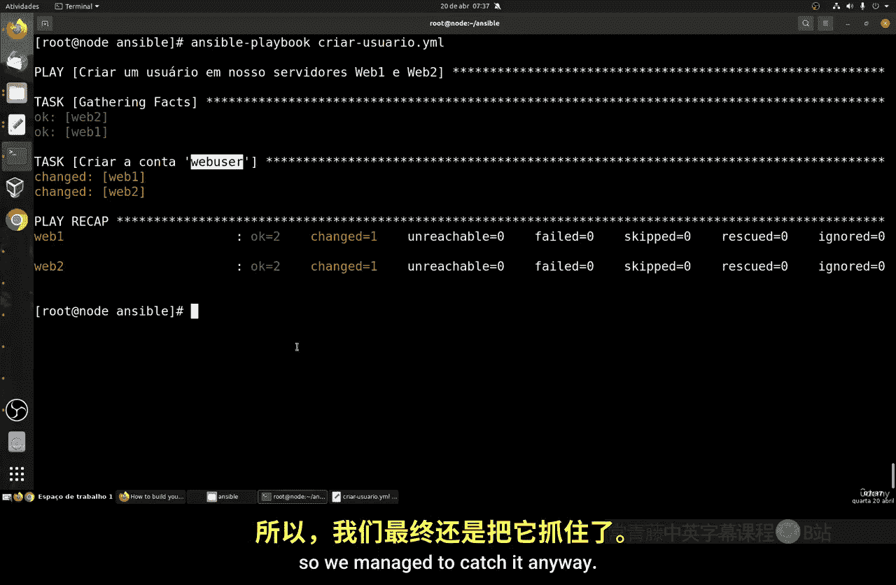

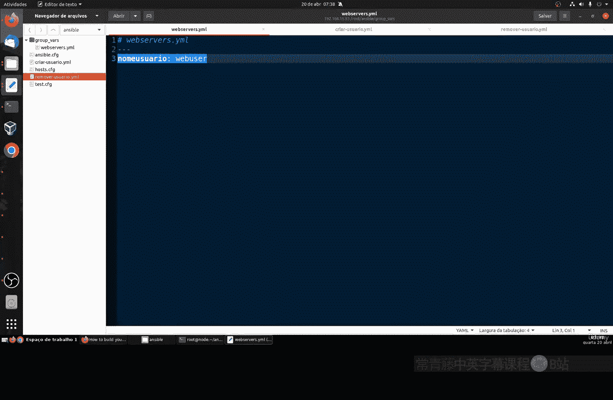

打开 `webservers.yml` 文件，输入以下内容：
```yaml
---
web_user: webadmin
```
**代码解释**：
*   `---` 是YAML文件的起始标记。
*   `web_user: webadmin` 定义了一个名为 `web_user` 的变量，其值为 `webadmin`。

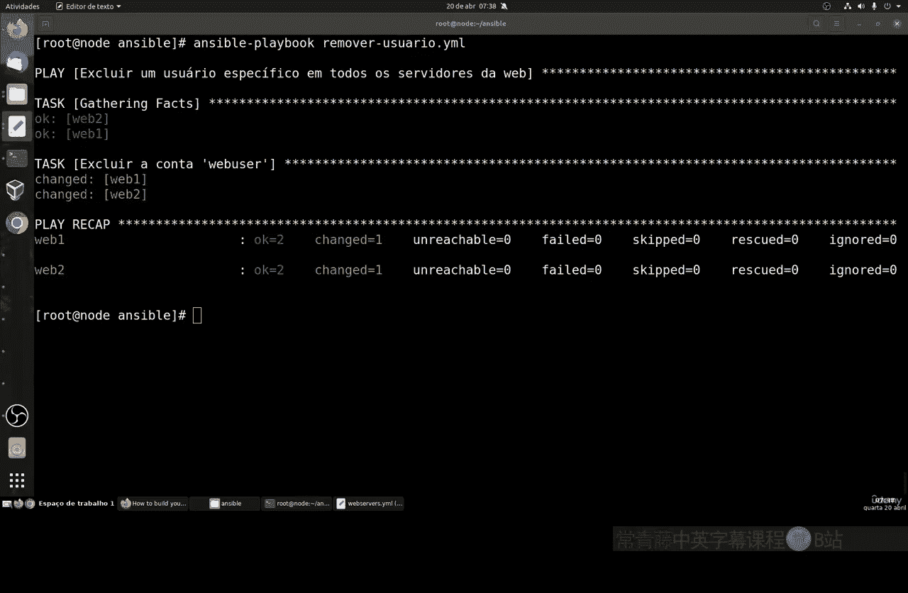

## 修改Playbook引用变量

定义好外部变量后，我们需要修改原有的Playbook文件，使其引用这些外部变量，并删除Playbook内部冗余的变量定义。

以下是修改 `create_user.yml` 文件的示例：
```yaml
---
- name: Create User Playbook
  hosts: webservers
  become: yes
  tasks:
    - name: Ensure user is present
      ansible.builtin.user:
        name: "{{ web_user }}"
        state: present
```
**代码解释**：
*   `name: "{{ web_user }}"` 通过Jinja2模板语法 `{{ ... }}` 引用了在 `group_vars/webservers.yml` 中定义的 `web_user` 变量。

对 `remove_user.yml` 文件进行类似的修改，移除内部的 `vars` 部分，直接引用 `{{ web_user }}`。

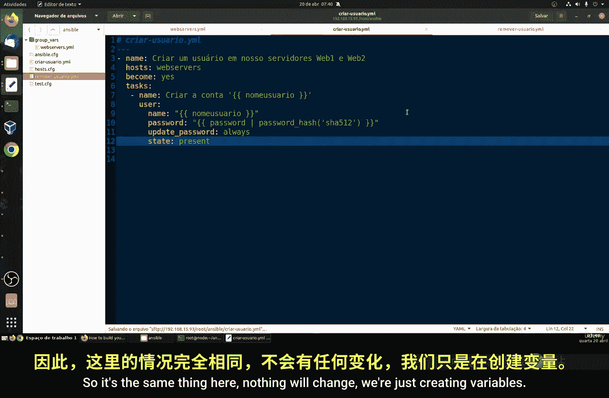

## 为变量添加用户密码

我们可以进一步扩展变量文件，为用户添加加密密码。

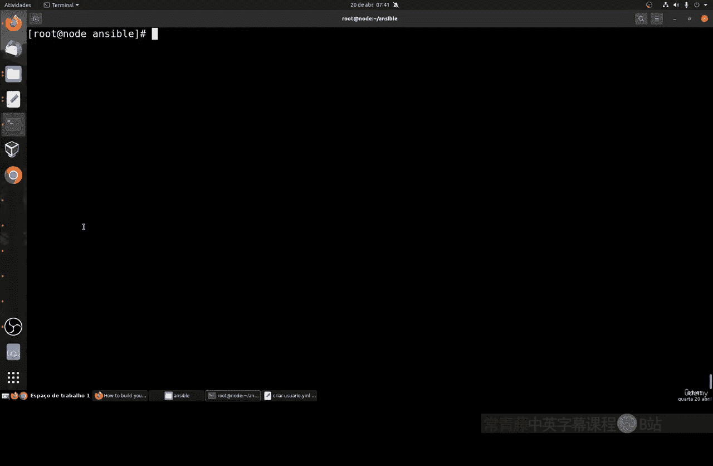

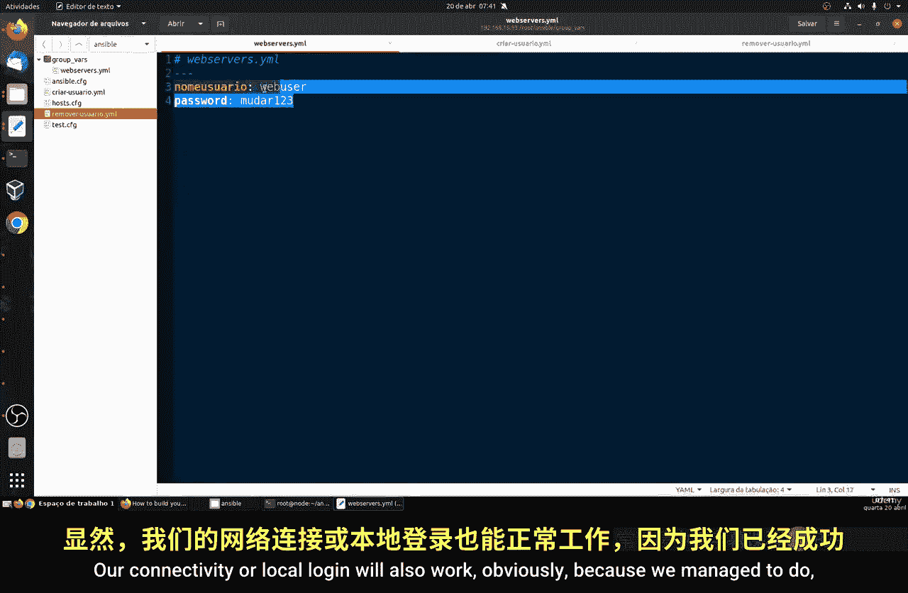

首先，在 `webservers.yml` 变量文件中添加密码变量：
```yaml
---
web_user: webadmin
web_user_password: changeme123
```
然后，在 `create_user.yml` Playbook的user任务中添加 `password` 参数：
```yaml
    - name: Ensure user is present with password
      ansible.builtin.user:
        name: "{{ web_user }}"
        password: "{{ web_user_password | password_hash('sha512') }}"
        state: present
```
**公式/代码解释**：
*   `password: "{{ ... | password_hash('sha512') }}"` 使用 `password_hash` 过滤器将明文密码 `changeme123` 加密为SHA512哈希格式，这是Linux系统存储密码的安全方式。

运行修改后的Playbook，即可创建带有密码的用户。之后可以使用SSH进行登录测试：
```bash
ssh webadmin@web1
# 输入密码：changeme123
```

## 使用命令行覆盖变量（临时测试）

有时，你可能想快速测试不同的变量值，而不想修改文件。Ansible允许你在命令行中直接传递变量，这些变量会覆盖文件中定义的值。

以下是使用 `-e` 参数在命令行中传递变量的示例：
```bash
ansible-playbook create_user.yml -e '{"web_user":"testadmin", "web_user_password":"test123"}'
```
**代码解释**：
*   `-e` 是 `--extra-vars` 的缩写，用于传递额外变量。
*   变量以JSON格式（或`key=value`格式）提供，用单引号括起来。这里临时将用户改为 `testadmin`，密码改为 `test123`。

这种方式非常适合进行快速测试和调试。

---


本节课中我们一起学习了如何通过 `group_vars` 目录集中管理Ansible变量，使项目结构更清晰。我们还学习了如何定义用户密码，以及如何通过命令行参数灵活地覆盖变量进行测试。掌握这些技巧能显著提升Playbook的维护性和可读性。