# 054：使用 Vault 加密敏感数据 🔐


在本节课中，我们将学习如何使用 Ansible Vault 来安全地存储和管理敏感信息，例如密码和信用卡号。我们将探讨三种加密方式，并重点介绍最推荐的方法。

在上一节中，我们创建了一个包含变量的文件，其中以明文形式存储了示例密码。显然，密码、信用卡号等敏感数据必须妥善保管，不能以明文形式暴露，尤其是在生产环境中。

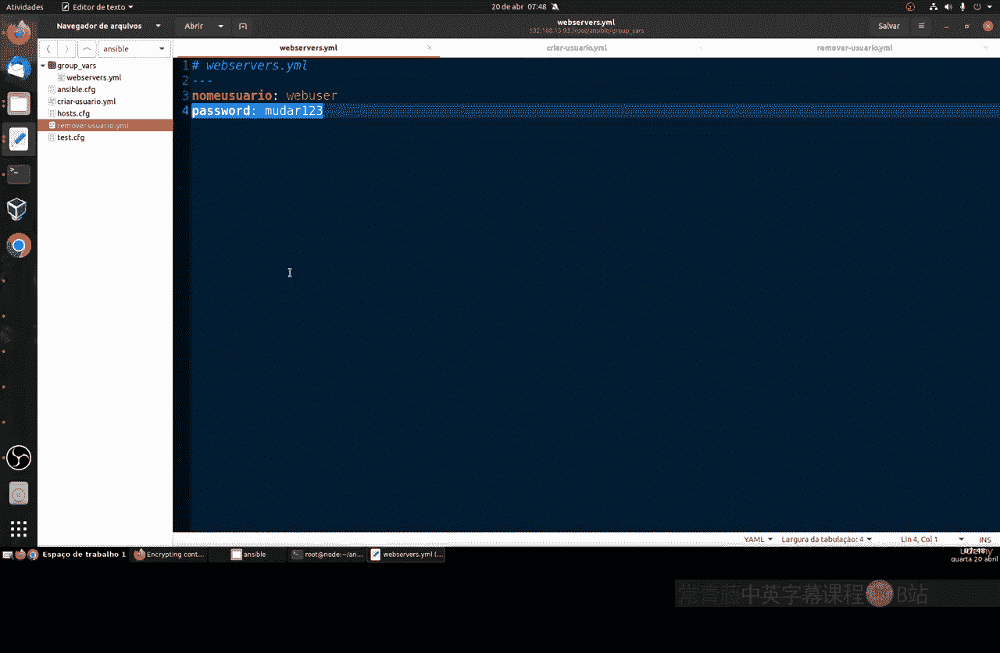

为了更安全地存储所有类型的敏感数据，我们可以使用 Ansible Vault。这是一个在安装 Ansible 时已附带的内置工具，它允许我们将敏感数据作为变量加密存储在文件中，并在 Playbook 中引用这些文件。

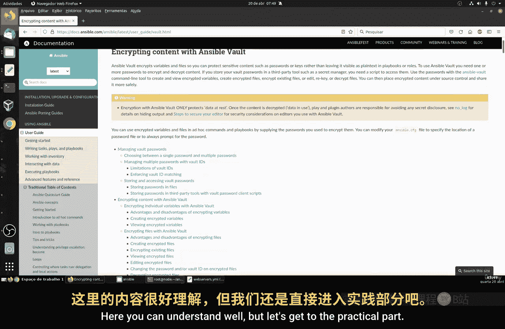

## 了解 Vault 与加密选项


建议您查阅 Ansible Vault 的官方文档。文档内容非常详尽，涵盖了文件加密类型、编辑配置方法以及诸多限制。虽然内容很多，但解释得很清楚。现在，让我们进入实践部分。

为了进行加密，我们有一个名为 `passwords.yml` 的文件，它存储在独立的 `vars` 目录中，这是一个存放变量的文件。我们主要有三种加密方式：

以下是三种主要的加密方式：
1.  **加密整个文件**：例如，加密整个 `webservers.yml` 文件。
2.  **加密单个变量**：仅加密文件中的密码变量（即特定的一行）。
3.  **使用独立的密码文件**：创建一个专门受保护的文件来存储所有密码。

我们需要思考哪种方式最可行。例如，在云服务器上，资源（如CPU、内存）的使用通常与费用挂钩。

如果选择加密整个文件，Ansible 将不得不加密和解密文件中所有不敏感的数据（如用户名），这会不必要地消耗更多 CPU 和内存资源，从而可能增加成本。

如果仅加密密码变量，对于单行数据是有效的。但在实际生产环境中，可能会有成百上千行不同的敏感数据（如多个密码、信用卡信息）。如果为每一行都单独加密，同样会遇到管理复杂和资源消耗的问题。

因此，第三种选项——将密码单独存储在一个受保护的文件中——更为理想。这样，该文件中的所有内容都将被保护，并且只需执行一次加密和解密操作。这既能增强安全性，又能最大限度地节省 CPU 和内存资源。这就是我们的目标。

## 创建并加密独立的密码文件

选择已定，接下来我们将创建一个独立的密码文件。该文件将位于我们的 Ansible 项目目录内。

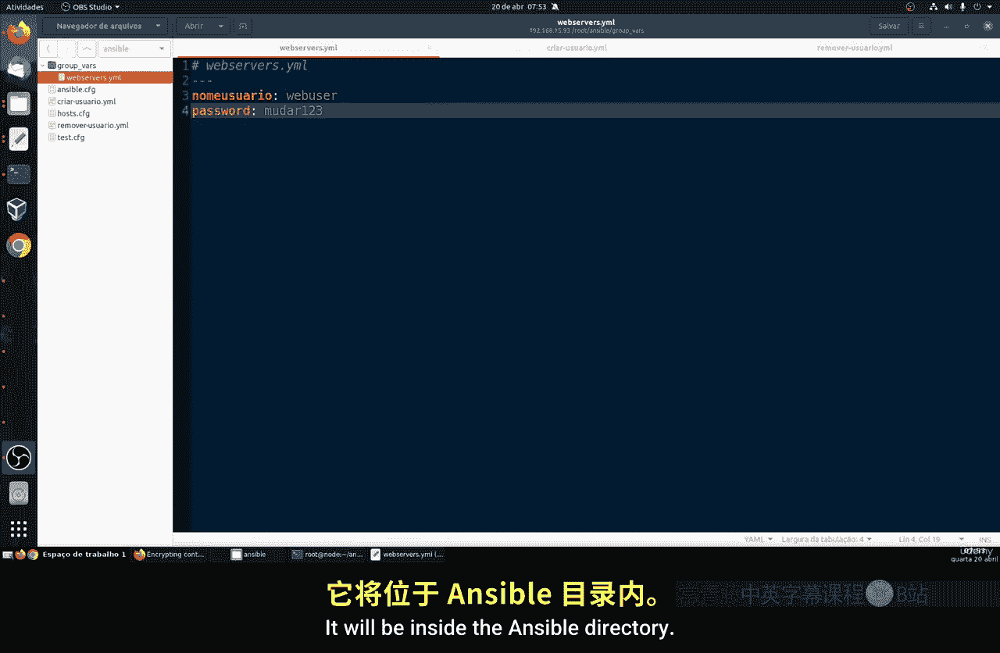


我们将创建一个名为 `passwords.yml` 的新文件。其语法与 `webservers.yml` 类似：

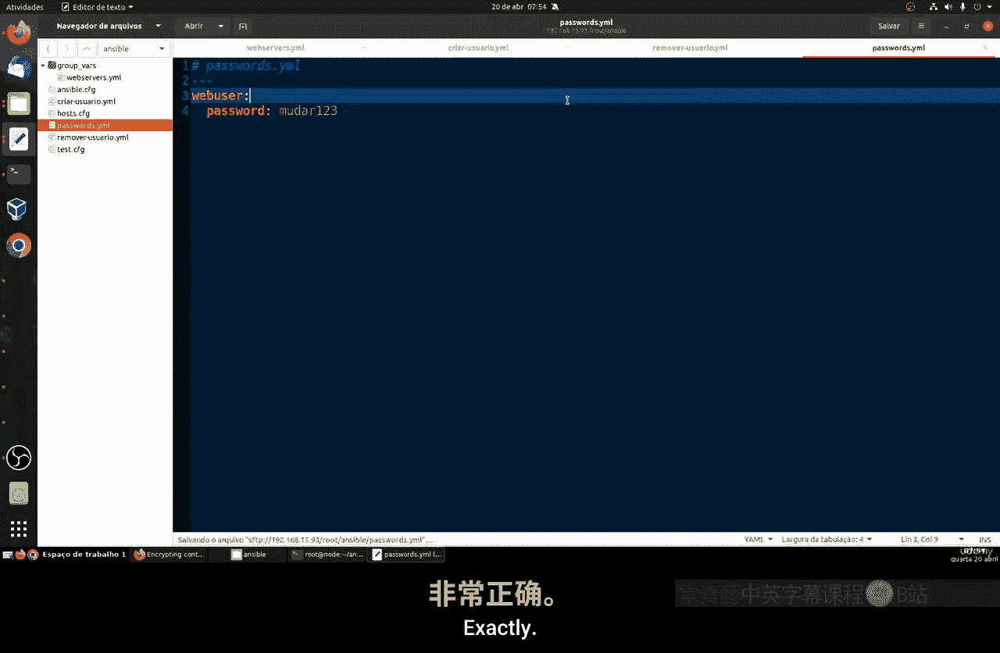

```yaml
---
web_user_password: changeme123
```


现在，我们有了一个专门存放密码的文件。接下来，我们需要从原来的 `webservers.yml` 文件中移除明文密码，并将其替换为对加密文件中变量的引用。这样，`webservers.yml` 中将不再包含敏感信息。

这个逻辑类似于 Linux 系统的 `/etc/shadow` 文件。在 `shadow` 文件中，所有用户的密码都以加密形式存储。我们将相同的概念应用到 Ansible 中。

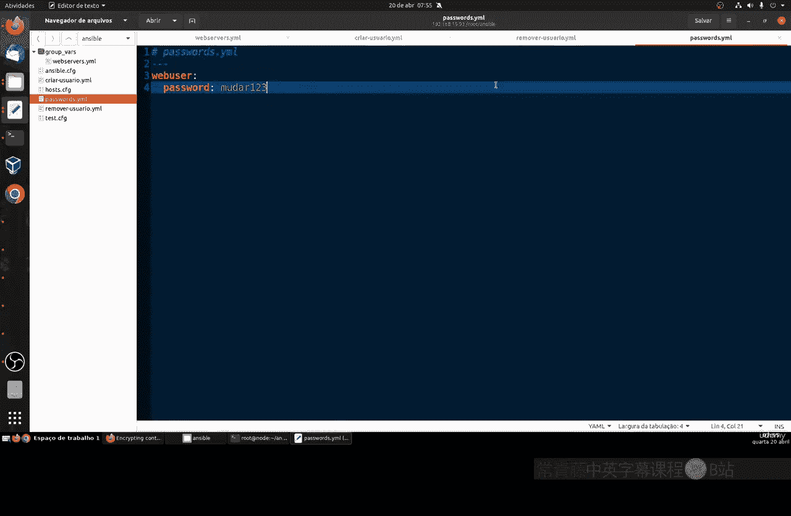

保存修改后，我们就可以对 `passwords.yml` 文件进行加密了，无需改动其他文件。

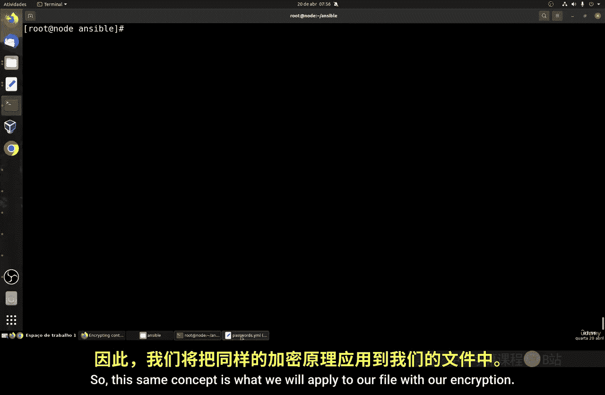

## 使用 Vault 命令进行加密与管理

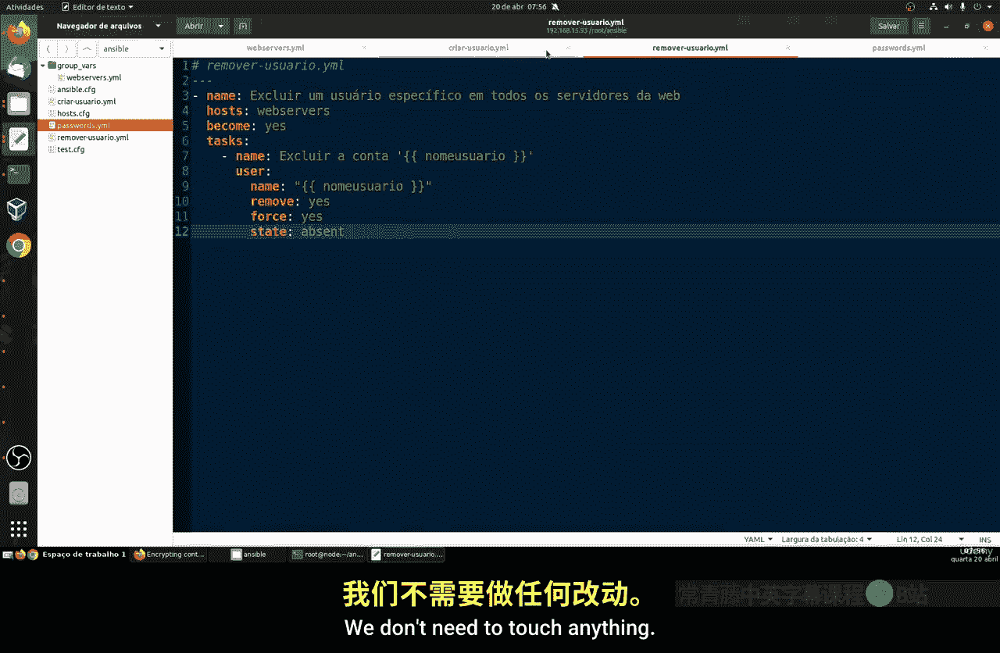

回到终端，我们使用 `ansible-vault` 命令（注意不是 `ansible-playbook`）来加密文件。

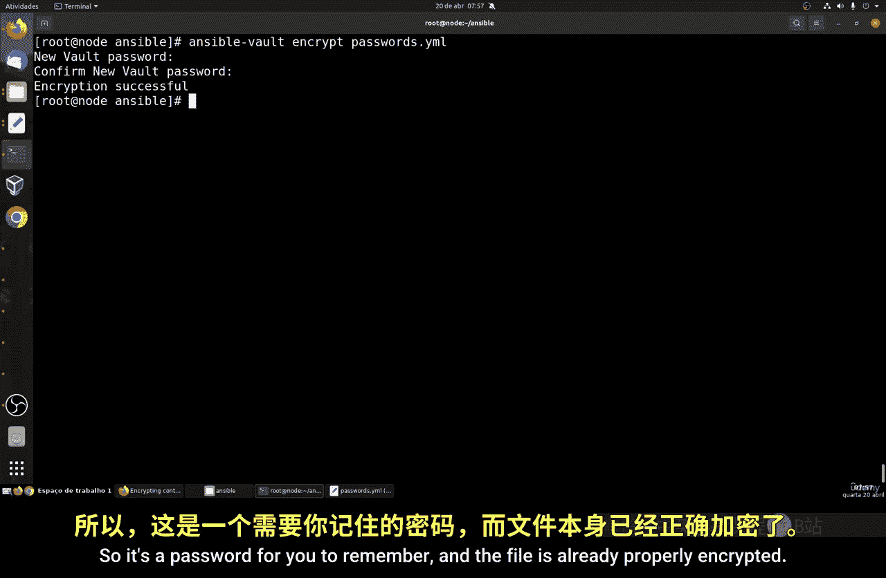

运行以下命令来加密 `passwords.yml` 文件：
```bash
ansible-vault encrypt passwords.yml
```
系统会提示您设置一个用于访问该加密文件的密码（例如 `123456`）。请务必记住这个密码。

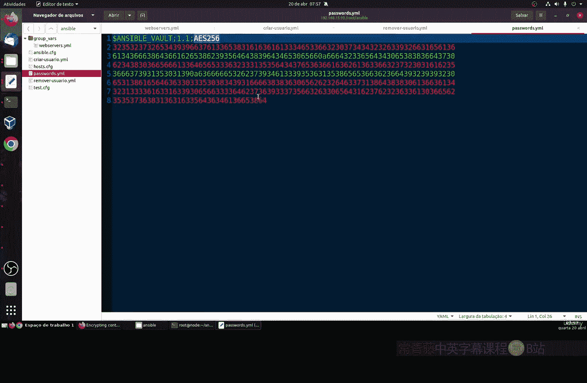


加密完成后，如果使用 `cat` 命令查看文件内容，您将看到一堆乱码，这表明文件已被成功加密。即使有人获取了这个文件，也无法直接查看其内容，从而提供了基本的安全保障。

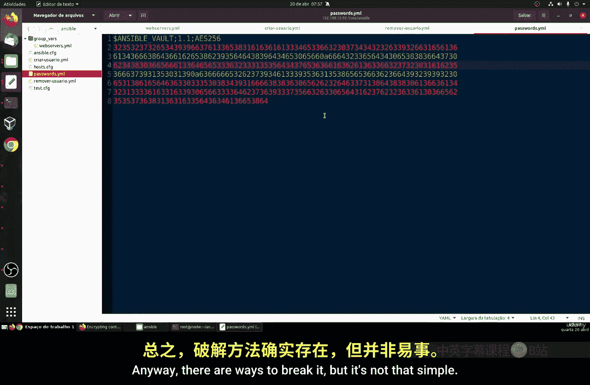

现在，我们来看看如何查看和编辑这个加密文件。


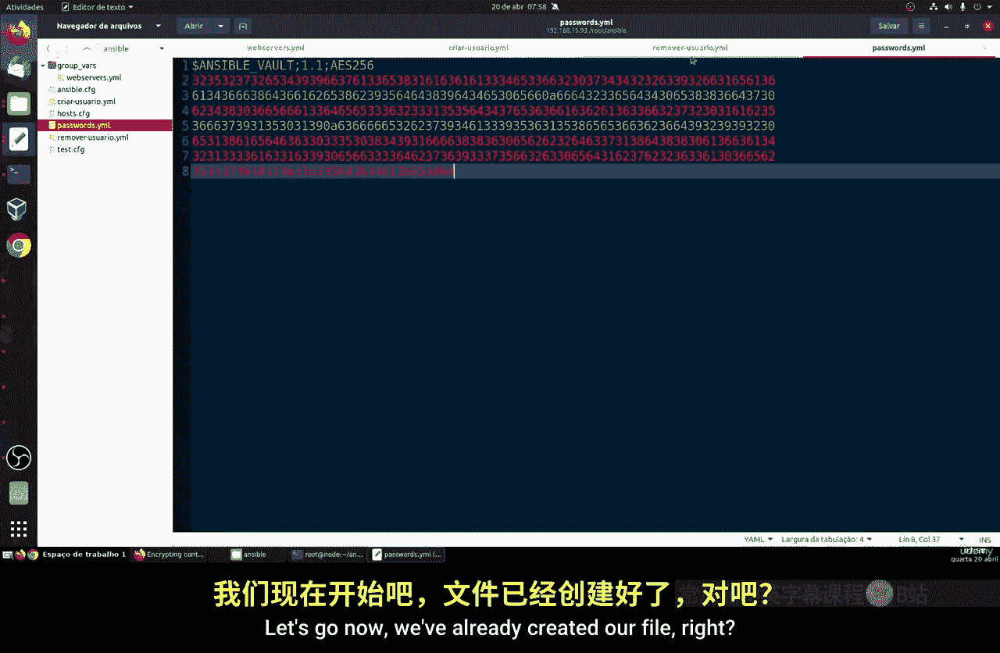

要查看加密文件的内容，请使用：
```bash
ansible-vault view passwords.yml
```
要编辑加密文件，请使用：
```bash
ansible-vault edit passwords.yml
```
执行以上任何命令时，系统都会提示您输入之前设置的密码（`123456`）。命令会使用系统默认的文本编辑器打开文件供您修改。

如果您想更改加密文件本身的访问密码（即 Vault 密码），可以使用 `rekey` 命令：
```bash
ansible-vault rekey passwords.yml
```
此命令会先要求输入旧密码，然后提示设置并确认新密码。成功后，文件的加密密钥就更新了。

## 总结

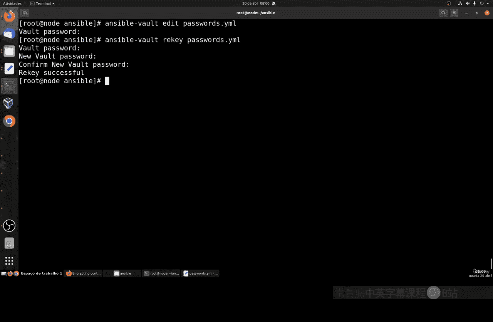

本节课中，我们一起学习了如何使用 Ansible Vault 来保护敏感数据。我们分析了三种加密策略的优劣，并实践了最推荐的方法：将敏感信息集中存储在一个独立的文件中，然后使用 `ansible-vault encrypt` 命令对该文件进行加密。我们还学习了如何使用 `view`、`edit` 和 `rekey` 命令来管理加密后的文件。

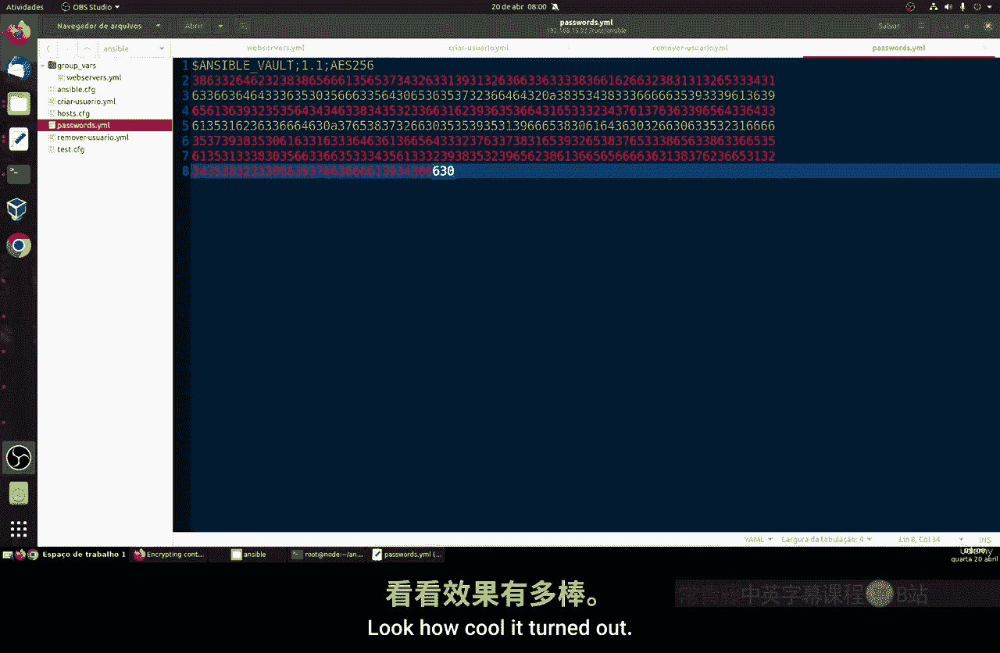


通过这种方式，我们可以在自动化流程中安全地使用密码等机密信息，同时避免不必要的资源消耗。在下一节课中，我们将继续探讨与此相关的其他执行方法和主题。