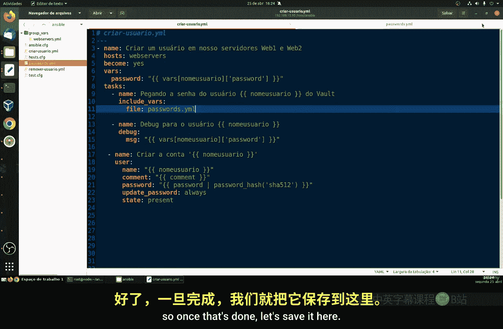
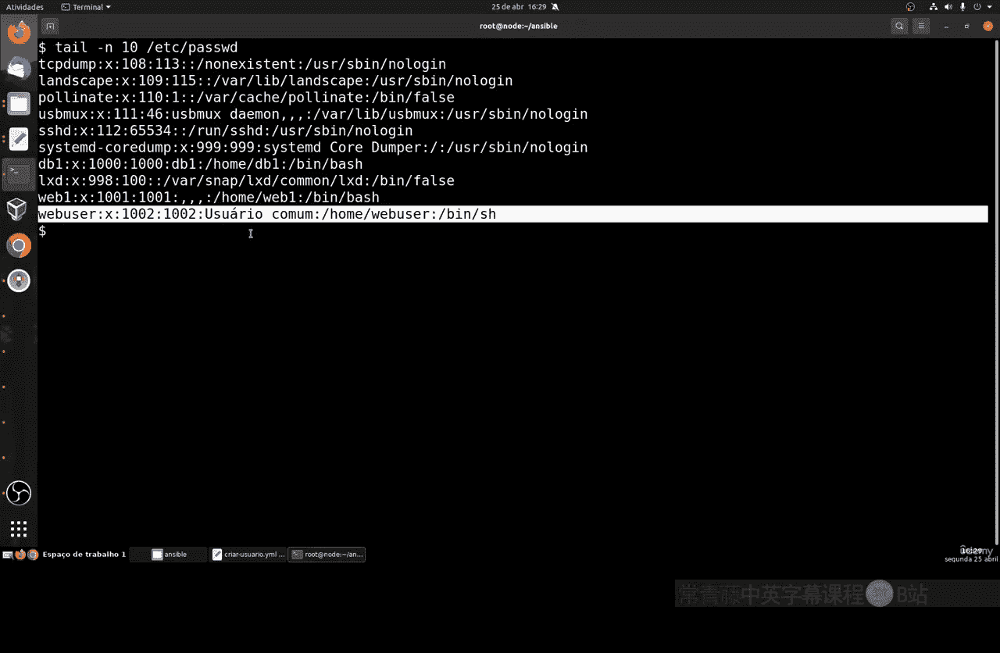
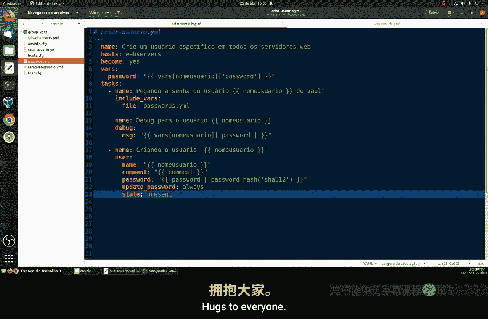

# 055：使用密码（第二部分）🔐


在本节课中，我们将学习如何将加密的密码文件应用到 Ansible Playbook 中，以实现安全的用户账户创建。我们将修改现有的 Playbook，使其能够从加密文件中读取密码，并添加调试任务来验证过程。

---

在上一节中，我们创建了一个加密的密码文件。本节中，我们来看看如何修改 Playbook，使其能够引用这个加密文件中的密码。

首先，我们需要在 Playbook 中定义变量。这些变量不会被移除，我们将把密码信息放在这里。

以下是定义用户名和密码变量的示例：
```yaml
username: webuser
password_file: "vault_password.yml"
```

接下来，我们需要修改任务部分。我们将把创建账户的任务留到最后，并在此之前新增两个任务，以便于未来的维护。

以下是新增的两个任务：
1.  **获取用户密码**：这个任务将从我们的加密文件中获取用户的密码。
2.  **调试任务**：这是一个可选任务，用于可视化执行过程，帮助我们检查是否有任何错误，并显示即将使用的密码。

首先，我们来创建获取密码的任务。这个任务会引用我们之前创建的 `username` 变量和密码文件名。

然后，我们创建另一个名为 `debug` 的任务。这个任务不是强制性的，但非常有用。它可以帮助我们在创建和维护过程中，轻松查看信息的执行结果，对于排查错误至关重要。

现在，让我们看看真正需要改变的部分——用户账户创建任务。目前，它的结构包含 `name`、`username` 和 `password`（即我们的哈希值）。我们将在此处添加几行代码。

在“创建用户账户”任务中，用户名 `name` 保持不变。我们添加了一个 `comment` 行（如果你不记得，可以回顾上一节的内容）。这个注释不仅仅是注释，当我们在 Linux 系统上创建用户后，使用 `tail` 命令查看文件时，该用户的注释信息会显示出来。这非常有用，可以注明创建该用户的目的，例如“为某功能创建的用户”。

密码部分，我们将引用从加密文件中获取的哈希值。`update_password` 参数设置为 `always`。



到目前为止，我们总共有了三个任务。简单来说：
1.  从加密文件中获取用户密码。
2.  （可选）调试显示密码信息。
3.  使用获取的密码创建用户账户。

请记住，执行 Playbook 时，系统会要求输入加密文件的密码（我们上一节设置的 `123456`），以便 Ansible 能够读取、编辑加密文件。输入正确的密码后，整个过程就能正常运行。

现在，让我们保存 Playbook 并返回终端执行命令。

我们使用以下命令运行 Playbook，并指定需要输入加密文件的密码：
```bash
ansible-playbook create_user.yml --ask-vault-pass
```
系统会提示输入 Vault 密码。输入我们上一节创建的密码 `123456`。

执行成功后，我们可以看到：
*   `webuser2` 任务成功执行。
*   它正确地从加密文件中获取了密码。
*   调试任务显示了将为每个用户创建的密码类型。

我们可以进行一个简单的测试，通过 SSH 登录新创建的用户来验证：
```bash
ssh webuser@<你的主机IP>
```
输入从加密文件中获取的密码。登录成功后，可以使用以下命令查看我们设置在用户账户中的注释：
```bash
tail -n10 /etc/passwd
```
在输出中，你可以找到 `webuser` 以及我们设置的注释。这是我们在 Playbook 中创建的 Linux 语法，用于添加帮助性注释，说明用户的用途，这在未来进行维护时非常有用。



---



本节课中，我们一起学习了如何将加密的密码文件集成到 Ansible Playbook 中。我们修改了 Playbook 以安全地读取加密密码，并添加了调试任务来辅助验证。通过这种方式，我们能够在保证安全性的前提下，自动化用户账户的创建和管理。