# 056：使用循环 🔄

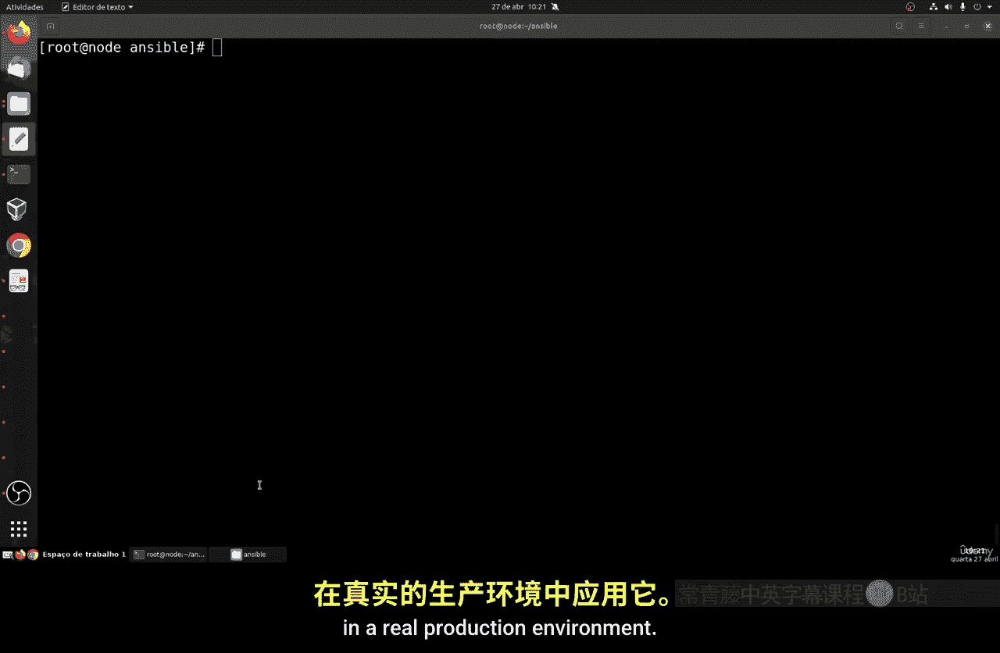

在本节课中，我们将要学习 Ansible 中一个非常强大的功能：循环。循环可以帮助我们自动化重复性任务，例如批量创建或删除用户，从而极大地提高工作效率和资源利用率。

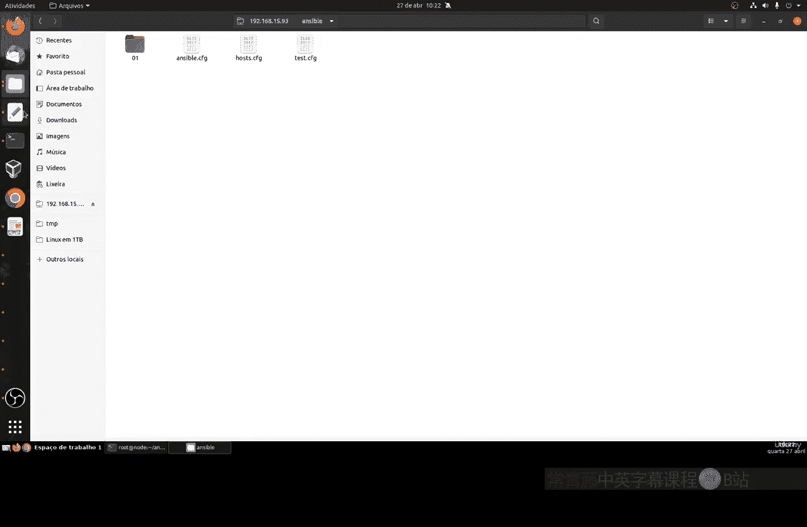

## 概述

上一节我们介绍了 Ansible 的基本任务和变量。本节中我们来看看如何使用循环来优化任务执行。循环允许我们对一个列表中的每个项目重复执行同一个任务，而无需为每个项目单独编写任务模块。这对于管理大量相似资源（如用户、软件包或文件）至关重要。

## 循环的基本概念

循环的核心概念是让一个任务对一组项目进行迭代执行，直到处理完列表中的所有项目或满足某个条件为止。这与大多数编程语言中的循环概念非常相似。

在 Ansible 中，我们使用 `loop` 关键字来实现循环。其基本语法是：
```yaml
- name: 任务名称
  module_name:
    parameter: "{{ item }}"
  loop: "{{ 列表变量 }}"
```
其中，`{{ item }}` 是一个特殊的变量，在每次循环迭代中，它会被替换为列表中的当前项。

## 实践对比：有循环 vs 无循环

为了更好地理解循环的优势，我们将通过创建用户这个常见任务来对比两种实现方式。

### 方法一：不使用循环

以下是创建一个不使用循环的 Playbook 文件 `create_user1.yml` 的步骤。该文件为每个用户编写一个独立的任务。

1.  创建 Playbook 文件头。
2.  为每个用户（例如 `web_user`, `web_admin`, `web_dev`）编写一个独立的 `user` 模块任务。

这种方式在用户数量少时可行，但当需要管理数十上百个用户时，Playbook 会变得冗长且难以维护。

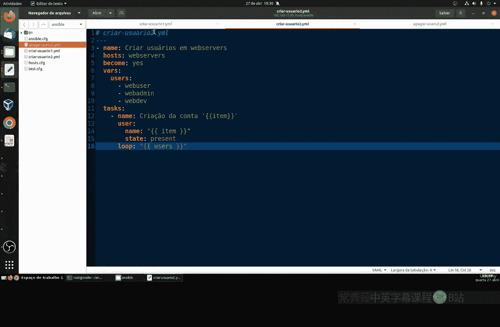

### 方法二：使用循环

以下是创建一个使用循环的 Playbook 文件 `create_user2.yml` 的步骤。该文件将用户列表定义为变量，并通过一个任务循环创建所有用户。

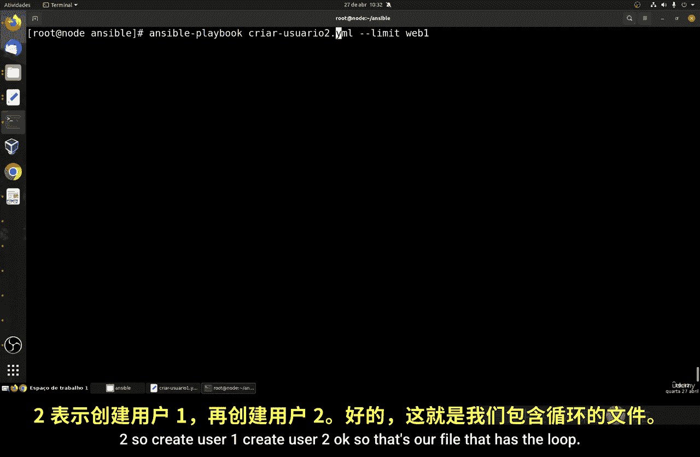

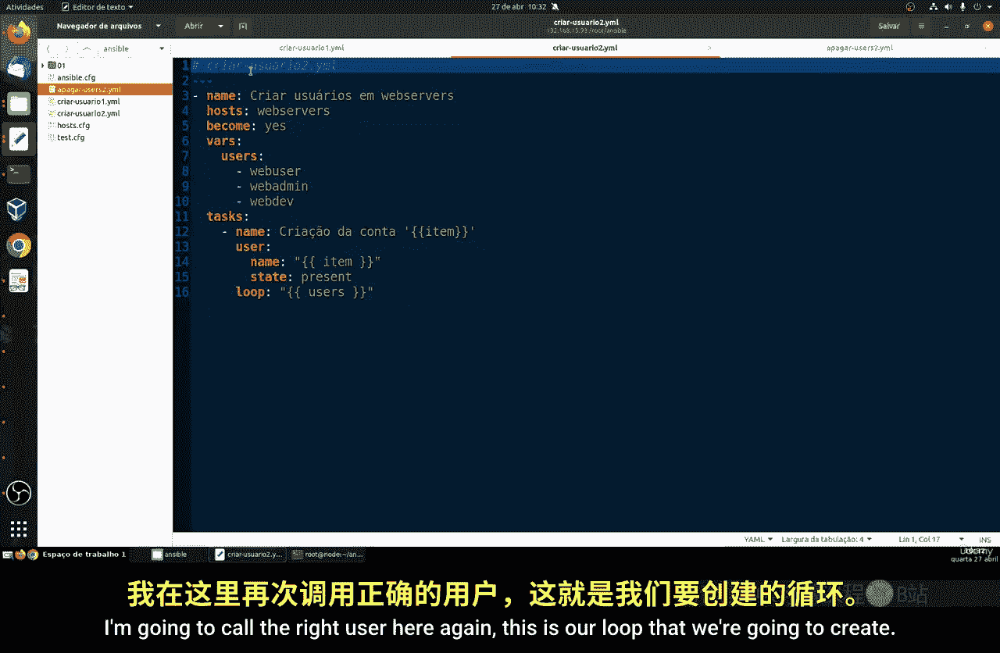

1.  创建 Playbook 文件头。
2.  定义一个包含所有用户名的列表变量（例如 `users`）。
3.  编写一个 `user` 模块任务，并使用 `loop` 关键字引用上一步定义的变量。

这种方式代码更加简洁，无论用户数量多少，创建用户的核心任务都只有一个，易于维护和扩展。

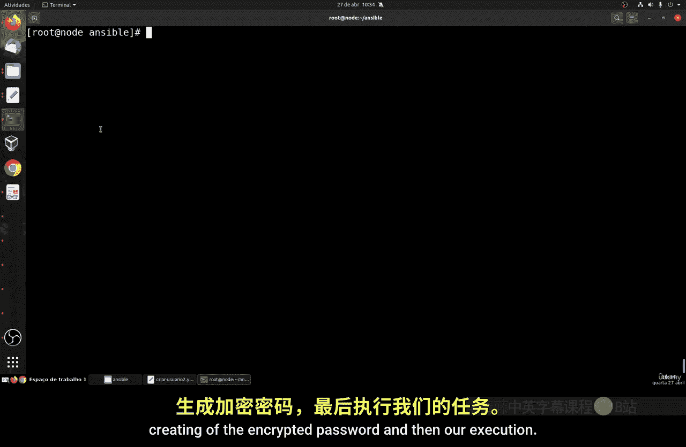

## 执行与验证

我们可以运行这两个 Playbook 来验证它们的结果是相同的，但执行过程不同。使用 `ansible-playbook` 命令运行 `create_user1.yml` 时，输出会显示三个独立的任务。而运行 `create_user2.yml` 时，输出则显示一个任务循环执行了三次。

同样，我们可以创建一个使用循环的 Playbook `delete_user2.yml` 来批量删除用户，其结构类似于 `create_user2.yml`，但使用 `state: absent` 参数。

## 进阶实战：生产环境用户管理

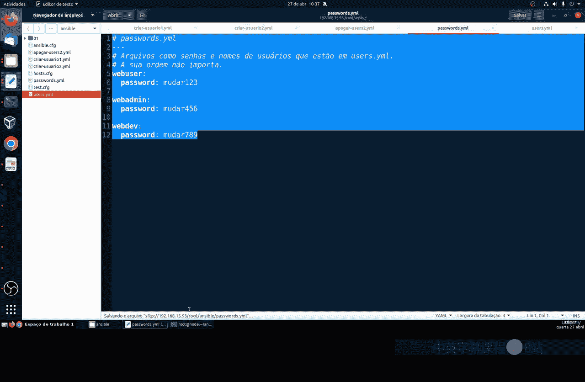

在真实的生产环境中，我们通常会将数据（如用户列表和密码）与执行逻辑（Playbook）分离，以提高安全性和可管理性。以下是如何结合循环和变量文件来实现这一目标。

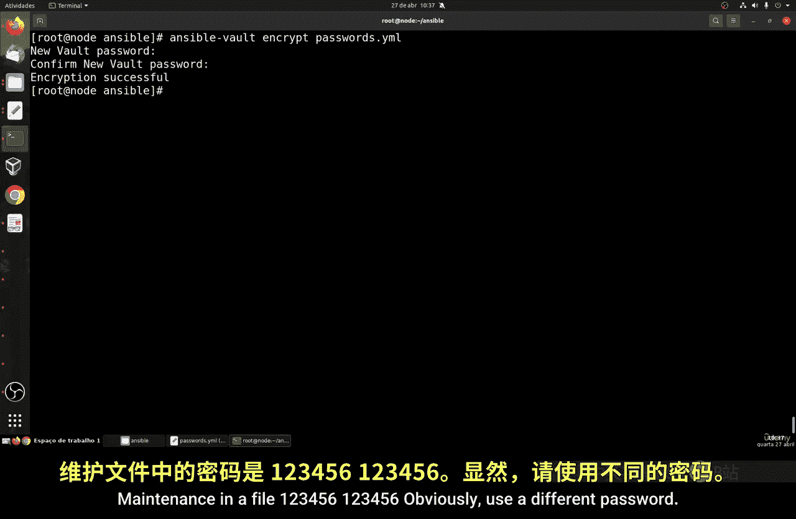

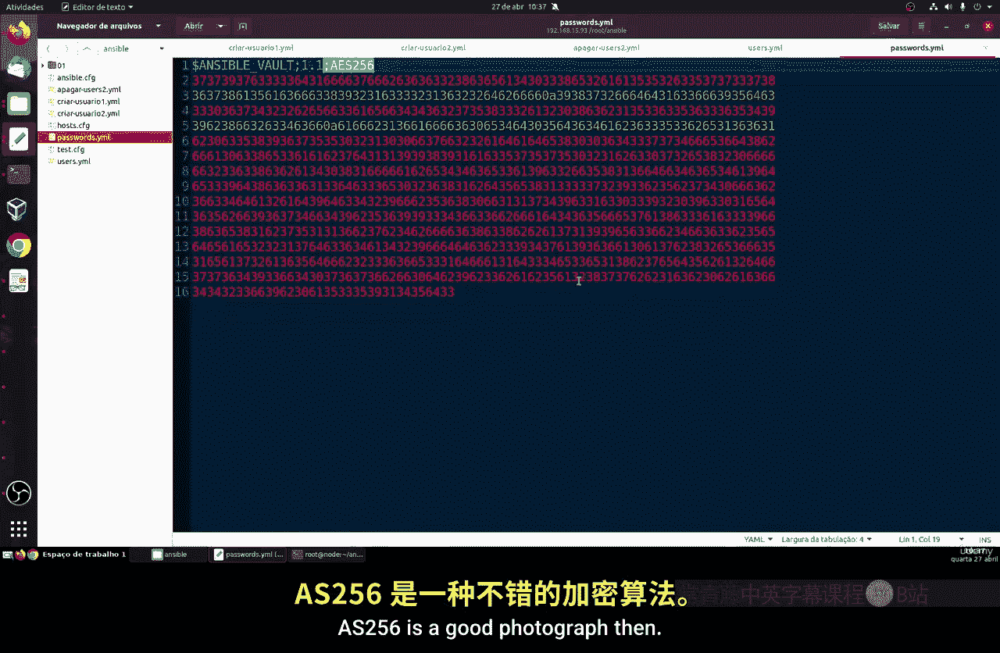

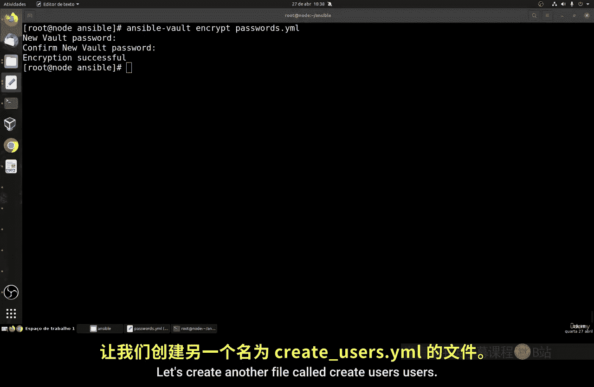

### 步骤一：创建数据文件

首先，我们创建两个独立的变量文件。
*   `users.yml`：存储用户列表及其相关信息。
    ```yaml
    users:
      - username: web_user
        comment: Common User
      - username: web_admin
        comment: Administrator
      - username: web_dev
        comment: Dev User
    ```
*   `passwords.yml`：存储对应用户的加密密码。
    ```yaml
    passwords:
      web_user: "hashed_password_123"
      web_admin: "hashed_password_456"
      web_dev: "hashed_password_789"
    ```
**注意**：密码应使用 `ansible-vault encrypt` 命令加密 `passwords.yml` 文件，以确保安全。

### 步骤二：创建主 Playbook

接下来，我们创建主 Playbook 文件 `create_users_pro.yml`。它将加载上述变量文件，并使用一个循环任务来创建所有用户。

```yaml
---
- name: 使用循环和外部变量文件创建用户
  hosts: web_servers
  vars_files:
    - users.yml
    - passwords.yml
  tasks:
    - name: 创建用户账户
      user:
        name: "{{ item.username }}"
        comment: "{{ item.comment }}"
        password: "{{ passwords[item.username] }}"
        state: present
      loop: "{{ users }}"
```
在这个 Playbook 中：
*   `vars_files` 用于加载外部变量文件。
*   `loop: "{{ users }}"` 对 `users.yml` 中定义的列表进行迭代。
*   在任务中，通过 `{{ item.username }}` 和 `{{ item.comment }}` 访问当前迭代项（一个字典）中的值。
*   密码通过 `{{ passwords[item.username] }}` 从已加载的 `passwords` 字典中动态获取。

### 步骤三：执行 Playbook

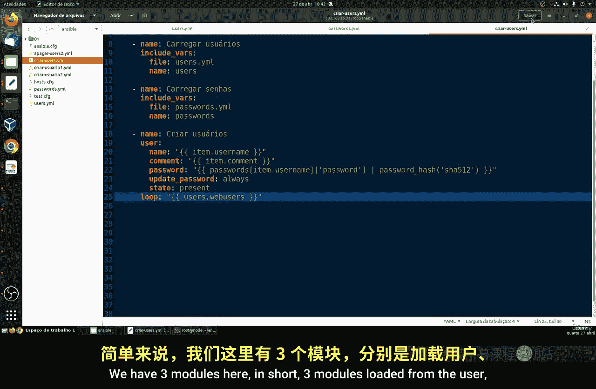

由于密码文件已被加密，执行 Playbook 时需要提供加密密码。
```bash
ansible-playbook create_users_pro.yml --ask-vault-pass
```
输入正确的 vault 密码后，Ansible 将执行任务：加载变量，然后循环为 `users` 列表中的每个字典项创建一个用户账户。

## 总结

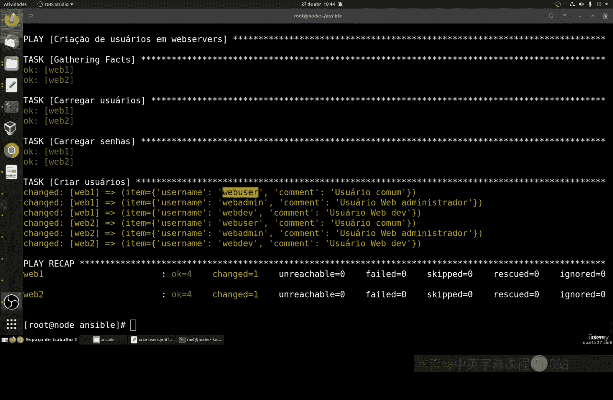

本节课中我们一起学习了 Ansible 循环的核心用法。我们从对比有无循环的两种编码方式开始，明确了循环在简化代码和批量操作上的巨大优势。接着，我们深入实践，学习了如何将循环与外部变量文件结合，模拟生产环境中数据与逻辑分离的最佳实践，并通过 `ansible-vault` 确保了敏感数据的安全。

核心要点包括：
*   **循环语法**：使用 `loop` 关键字对列表进行迭代，`{{ item }}` 代表当前项。
*   **代码简化**：循环能将多个重复任务合并为一个，使 Playbook 更简洁。
*   **数据分离**：将变量（如用户列表、密码）存储在独立的 `yml` 文件中，通过 `vars_files` 加载。
*   **安全实践**：使用 `ansible-vault` 加密包含敏感信息的文件。

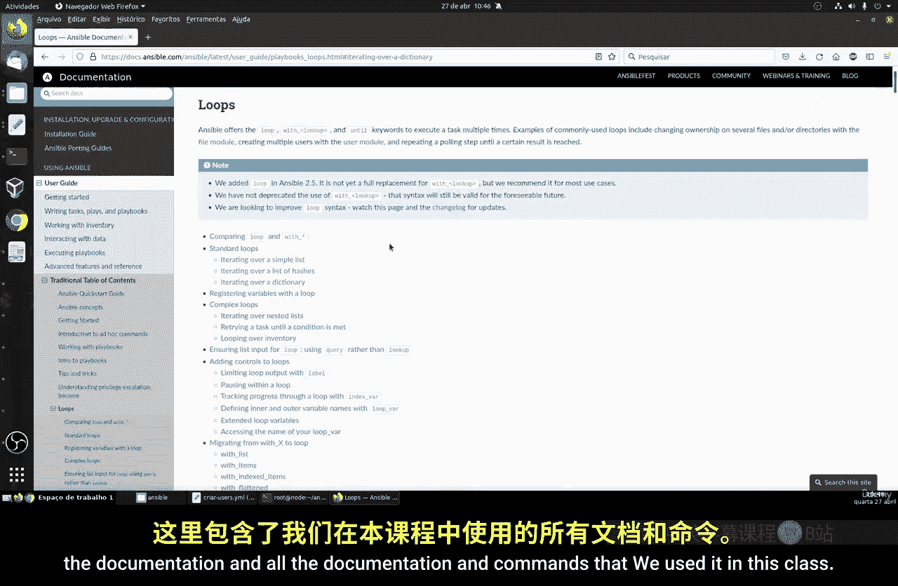

掌握循环是编写高效、可维护 Ansible 自动化脚本的关键一步。建议你尝试修改列表、创建更复杂的字典列表，并查阅 [Ansible 官方文档](https://docs.ansible.com/ansible/latest/playbook_guide/playbooks_loops.html) 来探索循环的更多高级特性。