Ansible 入门：第3章：使用条件语句 🧠

在本节课中，我们将学习如何在 Ansible Playbook 中使用条件语句。条件语句允许我们根据特定条件（如操作系统类型、变量值或之前任务的结果）来决定是否执行某个任务。这极大地增强了 Playbook 的灵活性和自动化能力。


---

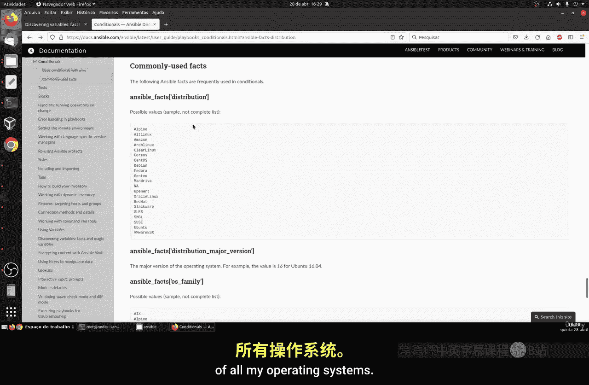

### 条件语句的核心概念

条件语句的核心是 `when` 关键字。它的基本逻辑是：**当**某个条件为真时，才执行对应的任务。条件可以基于 Ansible 收集的“事实”（facts），例如系统的发行版信息。

**公式**：
```
- name: 任务名称
  module_name:
    module_parameter: value
  when: condition_is_true
```


---

### 为何需要条件语句？

上一节我们介绍了 Ansible 的基本模块和任务。本节中我们来看看如何让任务变得更智能。在实际的运维环境中，我们管理的服务器可能运行着不同的操作系统（如 Ubuntu、CentOS）。为不同系统执行更新或安装软件的命令是不同的。手动为每种系统编写单独的 Playbook 效率低下，而条件语句可以让我们在一个 Playbook 中处理多种情况。

例如，更新 Ubuntu 系统使用 `apt` 模块，而更新 Red Hat 系列系统则使用 `yum` 模块。我们需要根据 `ansible_facts['distribution']` 的值来动态选择正确的模块。

---

### 使用 `ansible_facts` 进行条件判断

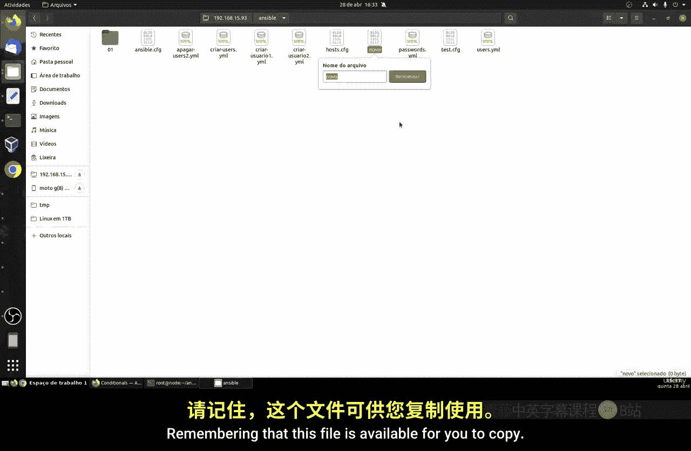

Ansible 在执行 Playbook 前会自动收集目标主机的信息，这些信息称为“事实”（facts）。我们可以通过 `ansible_facts` 变量访问它们，其中最常用于条件判断的是操作系统发行版信息。

以下是判断系统类型时常用的 `ansible_facts` 字段：
*   **`ansible_facts[‘distribution’]`**: 获取具体的发行版名称，如 `“Ubuntu”`、`“CentOS”`、`“Fedora”`。
*   **`ansible_facts[‘os_family’]`**: 获取系统家族，这是一个更通用的分类，如 `“Debian”`（包含 Ubuntu、Debian）、`“RedHat”`（包含 CentOS、Rocky Linux、Fedora）。

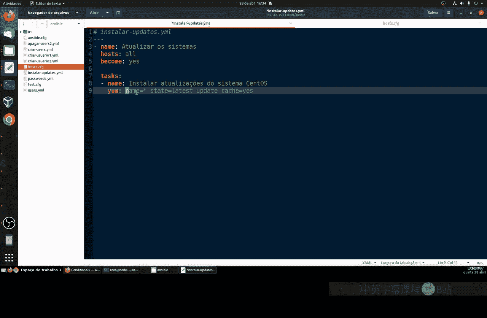

**注意**：并非所有发行版都直接列在 `distribution` 的官方列表中。对于较新或较冷门的发行版，使用 `os_family` 是更可靠的方法。

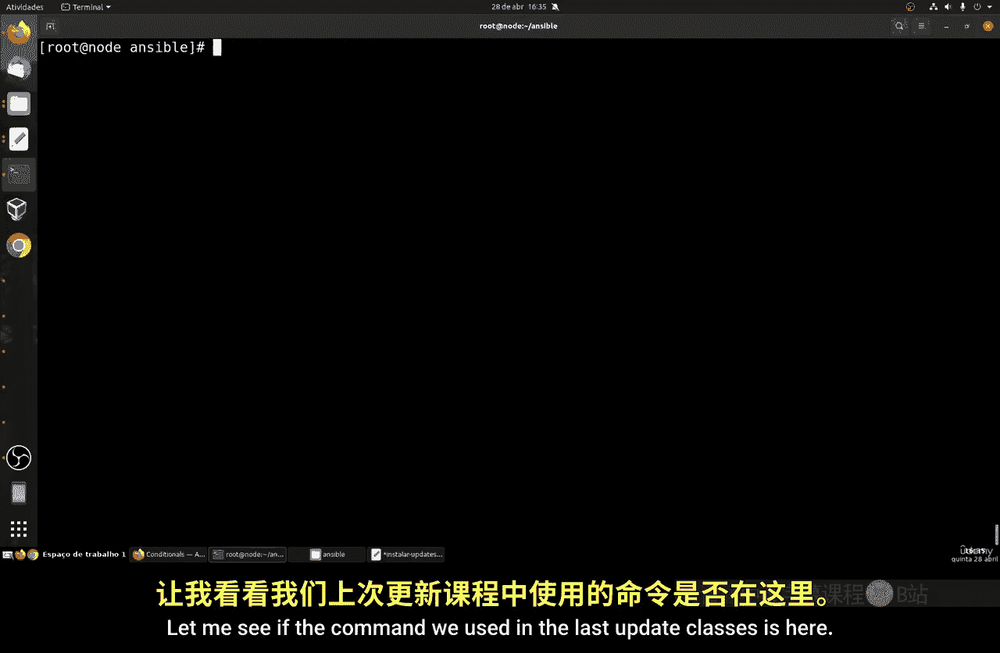


---

### 实践：编写一个跨平台系统更新 Playbook

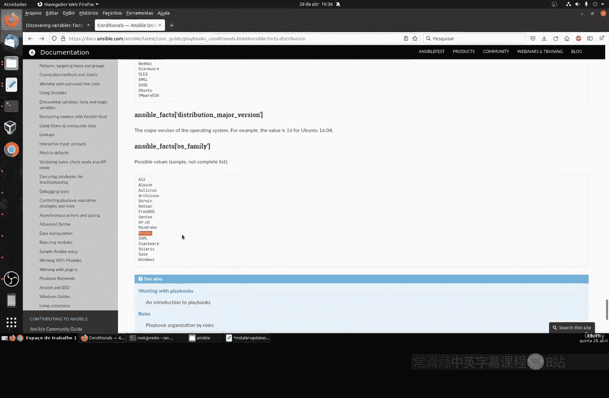

让我们创建一个名为 `install_updates.yml` 的 Playbook，它能够自动为 Red Hat 家族和 Debian/Ubuntu 家族的系统执行更新。

**代码**：
```yaml
---
- name: 自动化系统更新
  hosts: all  # 针对清单中的所有主机
  tasks:
    # 任务 1: 更新 Red Hat 家族系统 (如 Rocky Linux, CentOS, Fedora)
    - name: 更新 Red Hat 家族系统
      yum:
        name: "*"
        state: latest
      when: ansible_facts['os_family'] == "RedHat"

    # 任务 2: 更新 Debian/Ubuntu 系统
    - name: 更新 Ubuntu/Debian 系统
      apt:
        upgrade: dist
        update_cache: yes
      when: ansible_facts['distribution'] == "Ubuntu"
```

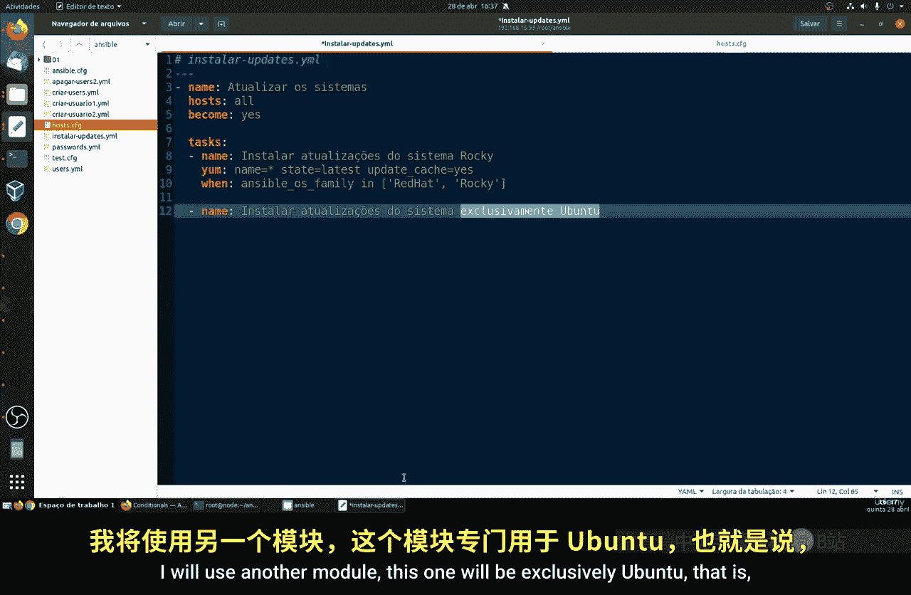

**代码解释**：
1.  `hosts: all`： 此 Playbook 将对清单文件中定义的所有主机生效。
2.  第一个任务使用 `yum` 模块，但**仅当**条件 `ansible_facts[‘os_family’] == “RedHat”` 成立时才会执行。这对于 Rocky Linux 等系统很有效。
3.  第二个任务使用 `apt` 模块，但**仅当**条件 `ansible_facts[‘distribution’] == “Ubuntu”` 成立时才会执行。
4.  如果主机不满足某个任务的 `when` 条件，Ansible 会显示 `skipping` 并跳过该任务，继续执行下一个。

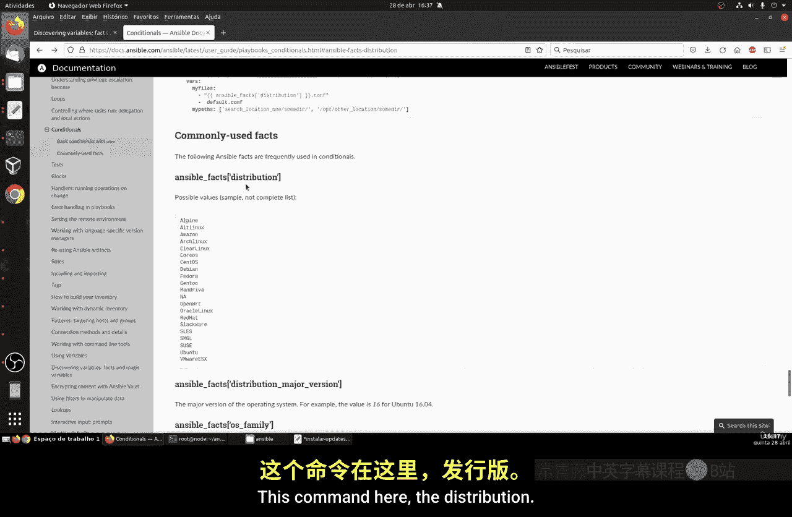

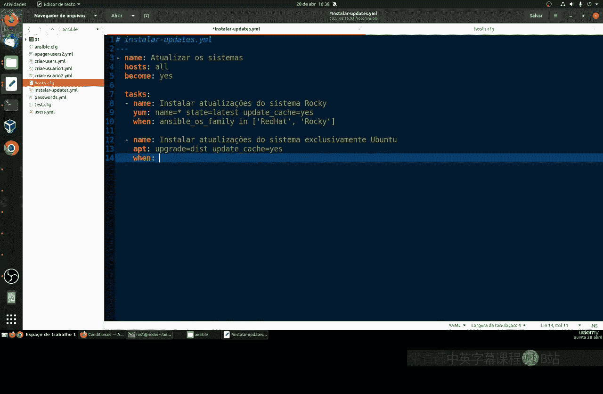

---

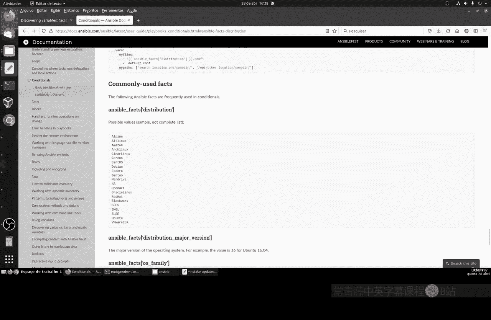

### 运行与结果分析

使用以下命令运行 Playbook：
```bash
ansible-playbook install_updates.yml
```

运行后，你将会看到类似以下的输出过程：
1.  Ansible 首先会为所有主机收集 `facts`。
2.  对于 Red Hat 家族的主机（如 Rocky Linux），第一个任务会执行，第二个任务会被跳过 (`skipping`)。
3.  对于 Ubuntu 主机，第一个任务会因为不满足 `os_family == “RedHat”` 而被跳过，然后第二个任务会执行。
4.  这样，一个 Playbook 就完成了对不同类型主机的适配更新。


---

### 更多条件语句的应用

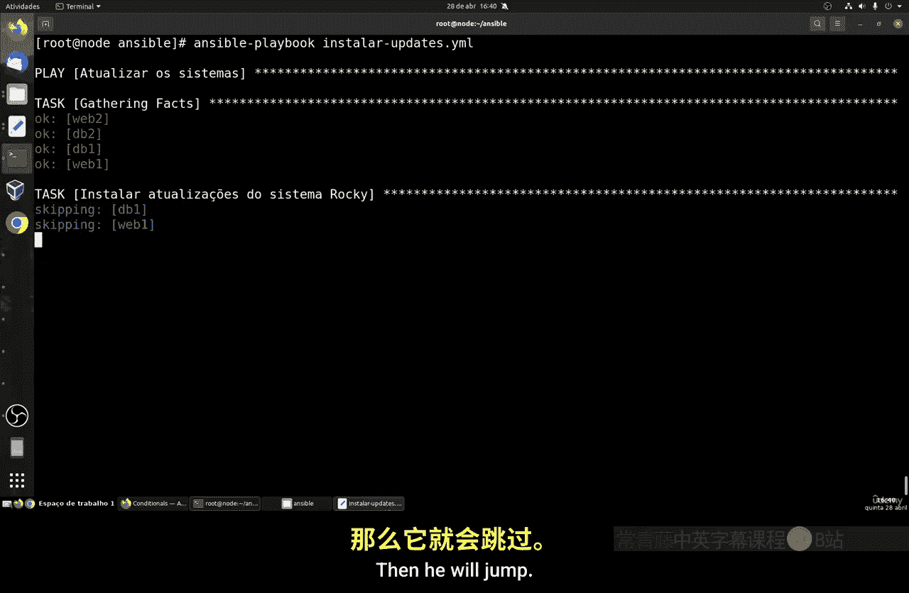

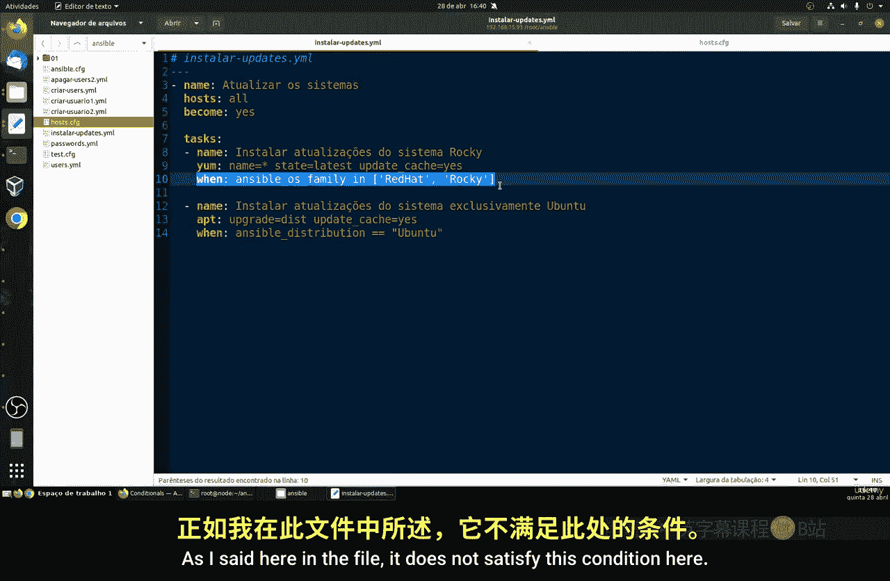

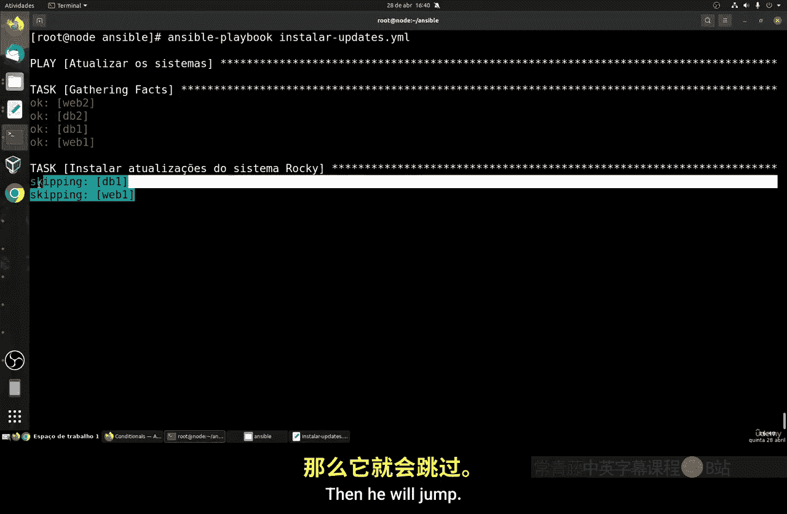

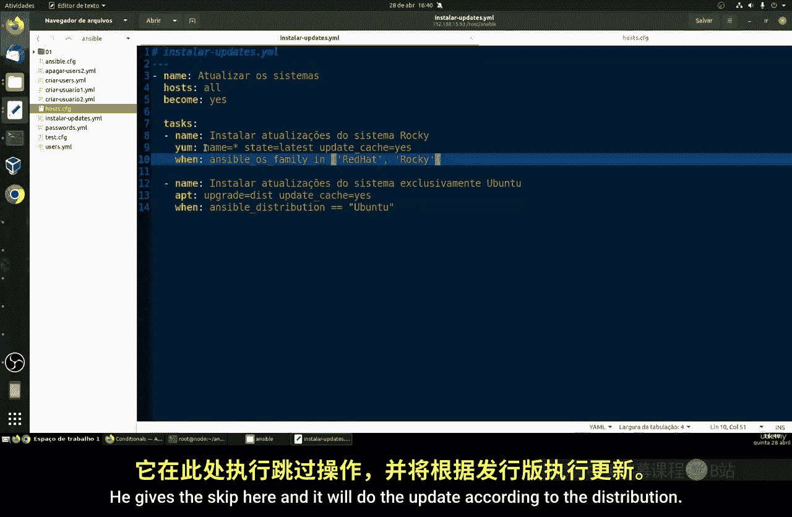

除了操作系统类型，`ansible_facts` 提供了丰富的信息用于条件判断，例如：
*   `ansible_facts[‘processor_cores’]`： CPU 核心数。
*   `ansible_facts[‘memtotal_mb’]`： 总内存大小。
*   `ansible_facts[‘default_ipv4’][‘address’]`： IPv4 地址。

你可以组合这些条件来创建更精细的自动化策略，例如：“仅在内存大于 4GB 的 Ubuntu 服务器上安装某个特定软件”。

---

### 总结

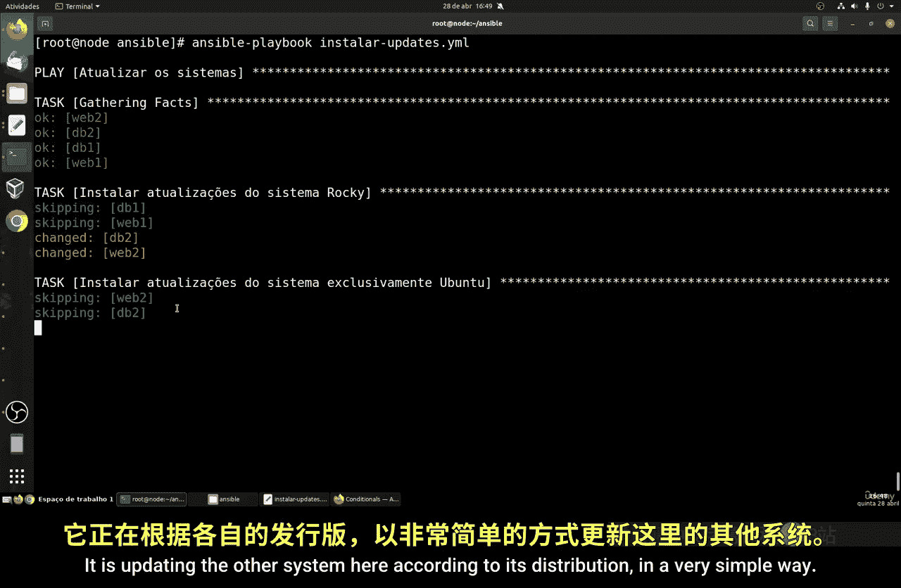

本节课中我们一起学习了 Ansible 条件语句的强大功能。核心要点包括：
1.  使用 `when` 关键字来基于条件执行任务。
2.  利用 `ansible_facts` 变量获取目标主机的系统信息（如 `distribution`, `os_family`）。
3.  通过一个**跨平台系统更新**的实例，掌握了如何编写能智能适应不同环境的 Playbook。
4.  理解了当条件不满足时，任务会被跳过，保证了 Playbook 的健壮性。

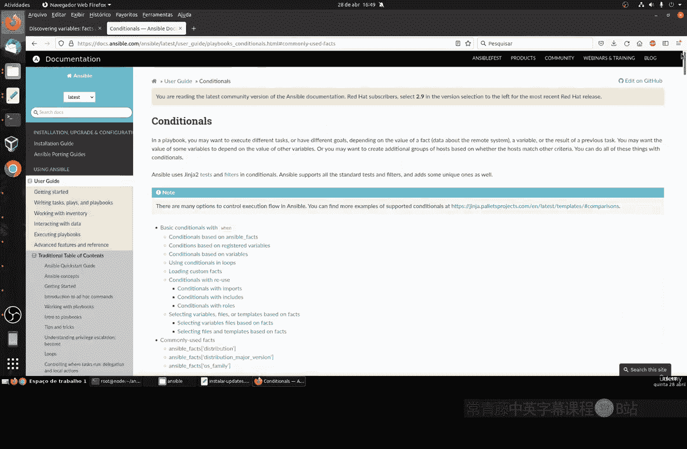

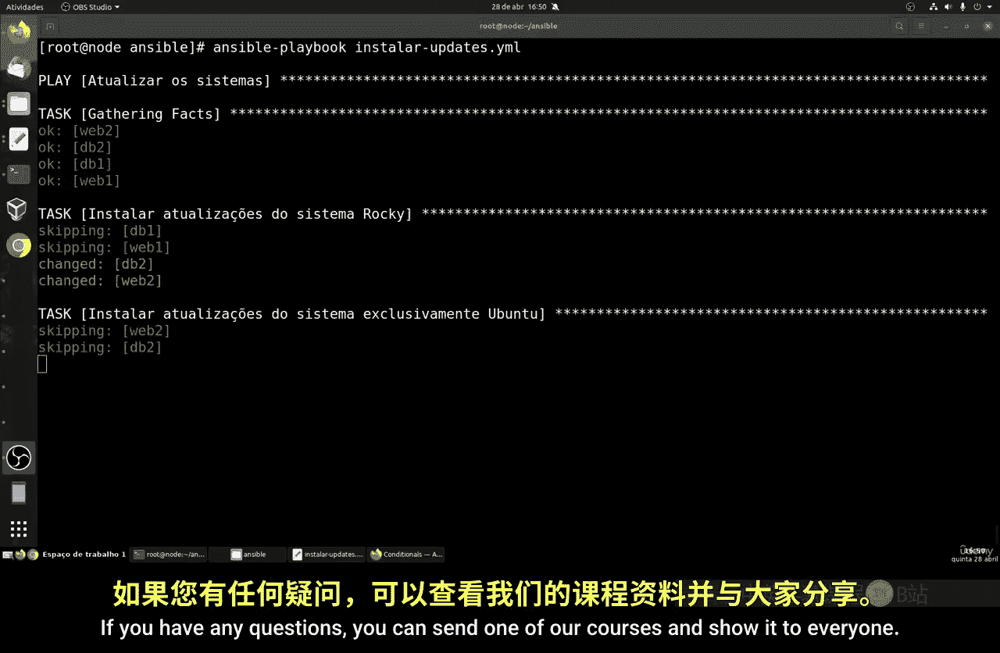

掌握条件语句是编写高级、灵活 Ansible Playbook 的关键一步。建议你查阅 [Ansible 官方文档](https://docs.ansible.com/ansible/latest/playbook_guide/playbooks_conditionals.html) 以探索更多条件判断的用法和技巧。