# 058：使用魔法变量 🪄

在本节课中，我们将要学习如何在 Ansible 中使用魔法变量。魔法变量是 Ansible 预定义的特殊变量，它们能自动描述你的 Ansible 环境和主机数据，让我们的自动化任务更加智能和高效。

## 概述

魔法变量本质上是一些特殊的词，它们能动态地获取关于 Ansible 环境和主机清单的信息。例如，你可以使用它们来获取当前剧本中所有活动主机的列表、某个主机所属的所有组，或者检测 Ansible 的版本。使用这些变量可以让你的剧本更加通用和灵活，减少硬编码。

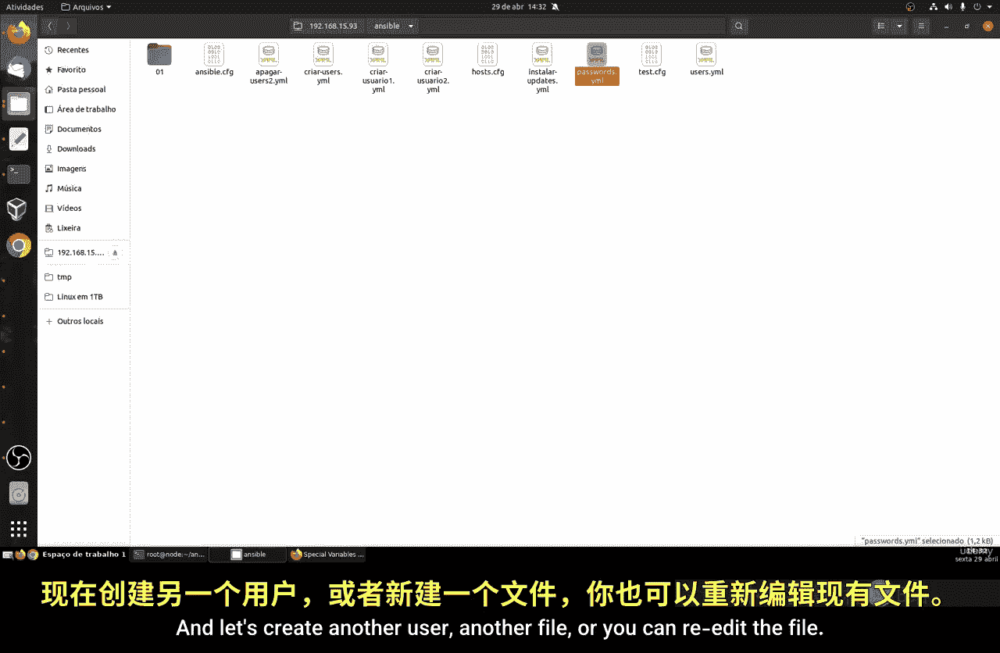

以下是 Ansible 提供的一些常用魔法变量，你可以在官方文档中找到完整的列表：
*   `play_hosts`：列出当前剧本中所有活动的主机。
*   `groups`：一个包含所有组及其主机列表的字典。
*   `ansible_version`：一个包含 Ansible 版本信息的字典。

上一节我们介绍了基本的变量和循环，本节中我们来看看如何利用魔法变量来动态地选择目标主机。

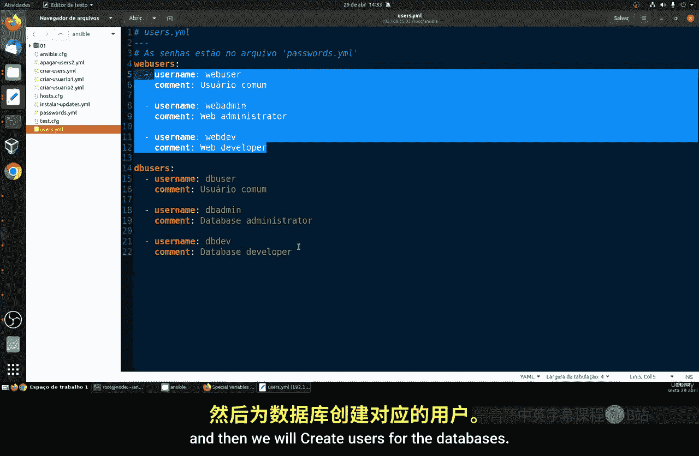

## 实践：按组自动创建用户

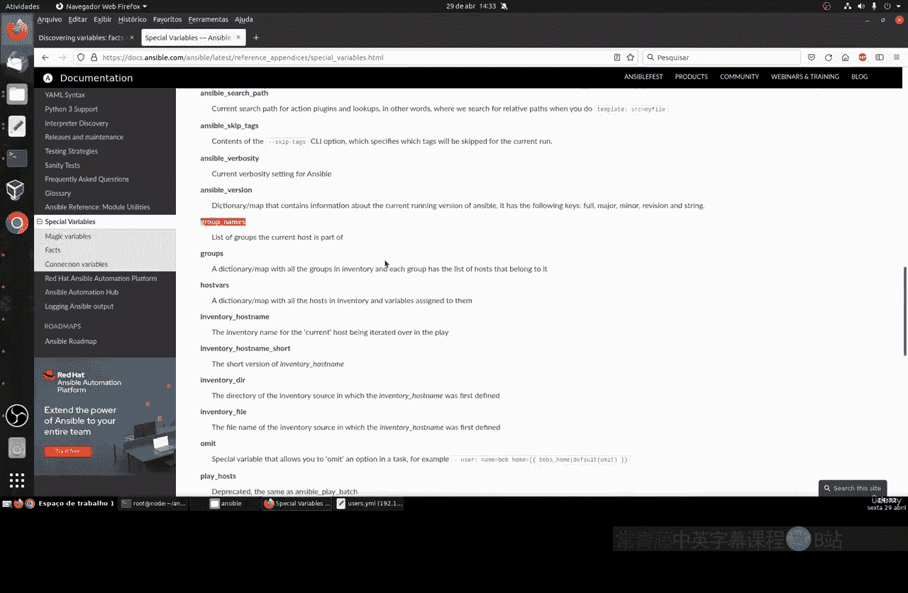

为了演示魔法变量的用法，我们将更新一个创建用户的任务。假设我们有两个主机组：`web_servers`（包含 web1, web2）和 `databases`（包含 db1, db2）。我们想为每个组的成员创建特定的用户。

### 1. 更新主机清单与用户变量

首先，我们需要确保主机清单文件正确分组。然后，我们更新用户变量文件。

以下是 `users.yml` 变量文件的内容，我们定义了 web 组和 database 组的用户列表：

```yaml
web_users:
  - name: web_user
    comment: "Web Server User"
  - name: web_admin
    comment: "Web Server Admin"
  - name: web_dev
    comment: "Web Server Developer"

db_users:
  - name: db_user
    comment: "Database User"
  - name: db_admin
    comment: "Database Admin"
  - name: db_dev
    comment: "Database Developer"
```

接着，在 `passwords.yml` 文件中为这些用户设置密码（本例中为明文，实际生产环境应使用 `ansible-vault` 加密）：

```yaml
web_user_password: 'changeme123'
web_admin_password: 'changeme456'
web_dev_password: 'changeme789'
db_user_password: 'changeme123'
db_admin_password: 'changeme456'
db_dev_password: 'changeme789'
```

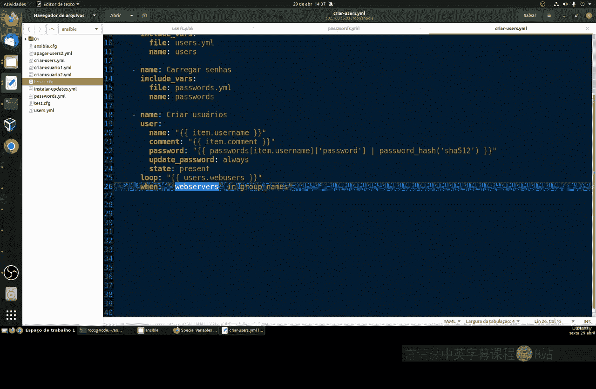

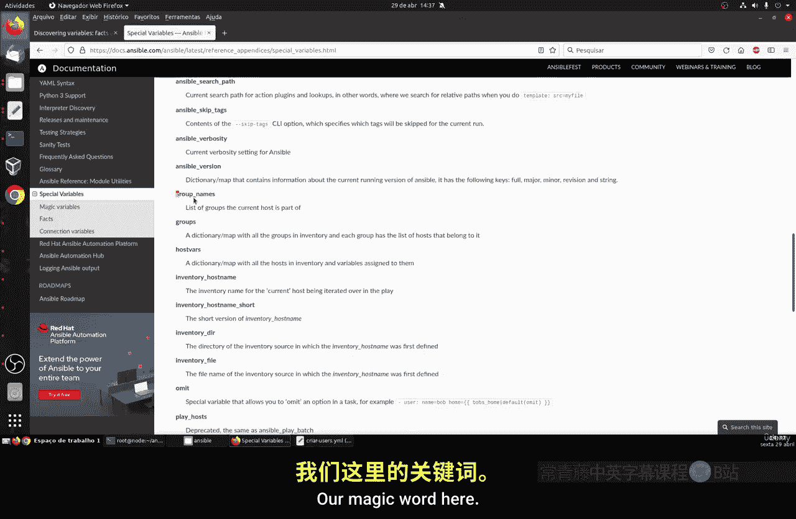

### 2. 编写使用魔法变量的剧本

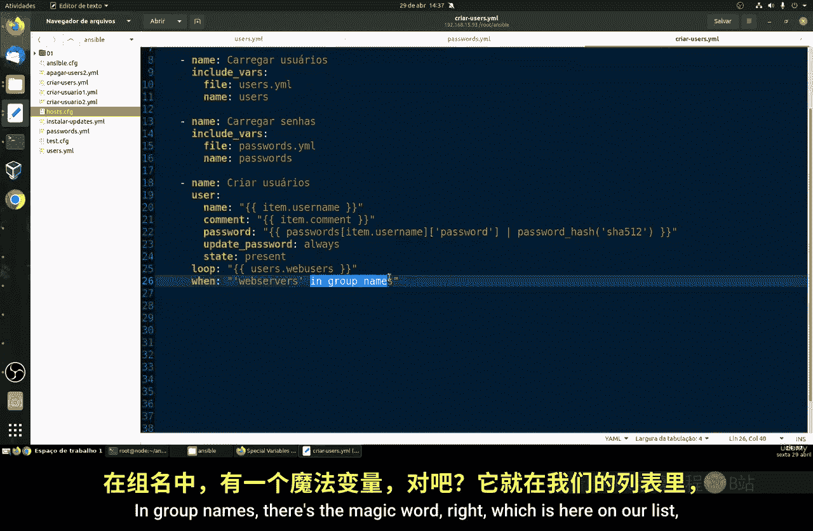

关键步骤在于编写剧本任务。我们将使用 `group_names` 这个魔法变量，它包含了当前受管主机所属的所有组名列表。

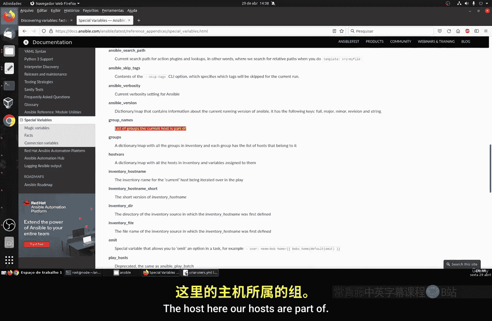

以下是剧本 `create_users.yml` 的核心任务部分：

```yaml
- name: Create users for web servers
  ansible.builtin.user:
    name: "{{ item.name }}"
    comment: "{{ item.comment }}"
    password: "{{ lookup('vars', item.name + '_password') | password_hash('sha512') }}"
    state: present
  loop: "{{ web_users }}"
  when: "'web_servers' in group_names"
  # 仅当目标主机属于 'web_servers' 组时执行此任务

- name: Create users for database servers
  ansible.builtin.user:
    name: "{{ item.name }}"
    comment: "{{ item.comment }}"
    password: "{{ lookup('vars', item.name + '_password') | password_hash('sha512') }}"
    state: present
  loop: "{{ db_users }}"
  when: "'databases' in group_names"
  # 仅当目标主机属于 'databases' 组时执行此任务
```

**代码解释**：
*   `loop`：遍历 `web_users` 或 `db_users` 列表中的每个用户字典。
*   `when: “‘web_servers‘ in group_names“`：这是一个条件判断。`group_names` 是魔法变量，代表当前正在执行任务的主机所属的组列表。这行代码检查字符串 `’web_servers‘` 是否在这个列表里。如果是，则为该主机执行创建 Web 用户的任务；否则，跳过整个任务。
*   `lookup(‘vars‘, …)`：用于动态查找变量名对应的值，这里用于获取对应用户的密码。

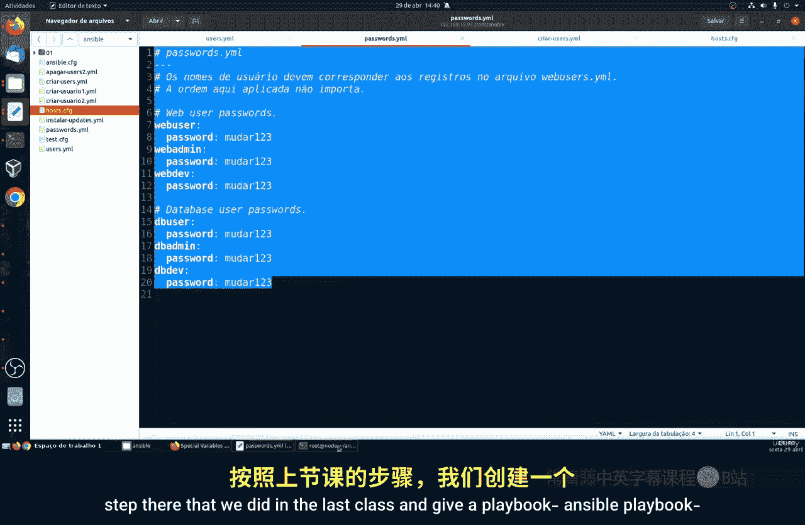

### 3. 运行剧本并观察结果

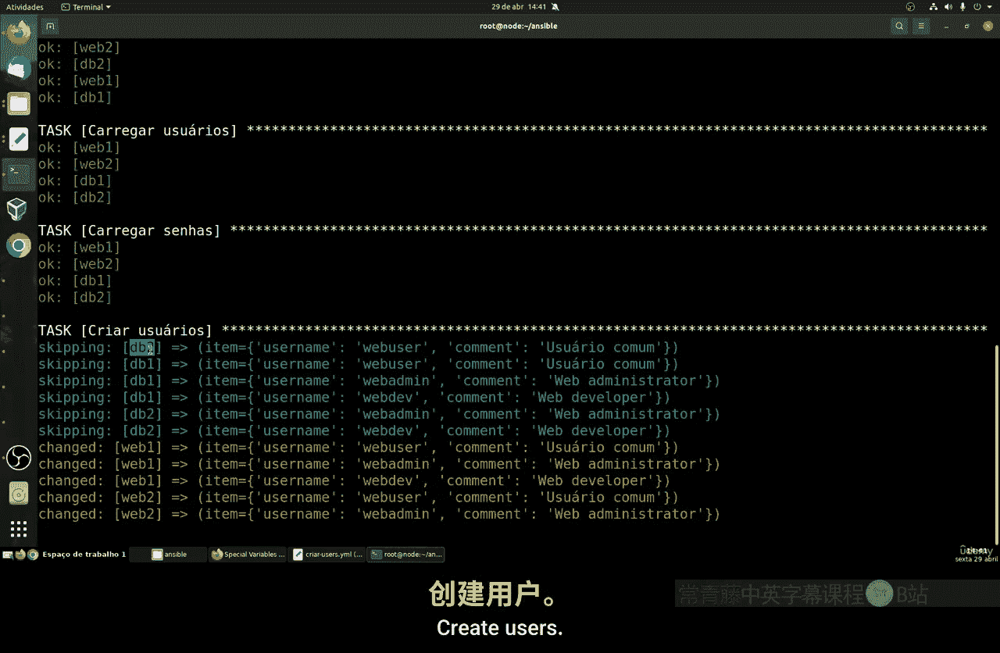

运行剧本：
```bash
ansible-playbook -i hosts.ini create_users.yml
```

执行时，Ansible 会：
1.  在主机 `web1` 和 `web2` 上，`‘web_servers‘ in group_names` 条件为真，因此执行第一个任务，创建 `web_user`， `web_admin`， `web_dev`。第二个任务的条件 `‘databases‘ in group_names` 为假，因此被跳过。
2.  在主机 `db1` 和 `db2` 上，情况正好相反。第一个任务被跳过，第二个任务执行，创建 `db_user`， `db_admin`， `db_dev`。

这样，我们只用一个剧本文件中的两个任务，就实现了针对不同主机组创建不同用户的需求，代码简洁且易于维护。

## 总结

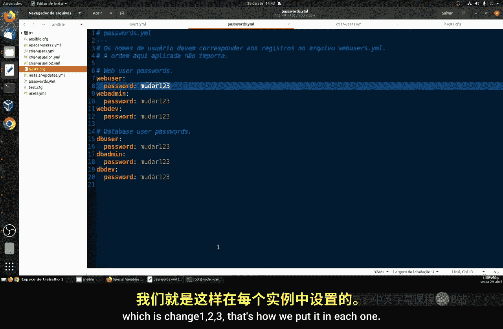

本节课中我们一起学习了 Ansible 魔法变量的核心概念与应用。我们了解到：
*   魔法变量是 Ansible 提供的、用于获取运行时信息的特殊变量。
*   重点掌握了 `group_names` 变量的用法，它能够让我们根据主机所属的组来条件化地执行任务。
*   通过一个“按组创建用户”的实例，我们实践了如何将魔法变量与 `when` 条件语句结合，从而编写出更通用、更智能的 Ansible 剧本。

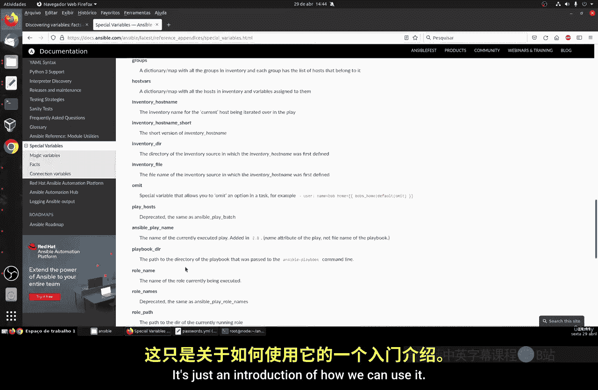

使用魔法变量可以极大地增强剧本的灵活性和可重用性，是编写高效 Ansible 自动化代码的重要技巧。你可以尝试查阅官方文档，探索更多魔法变量来优化你的自动化流程。