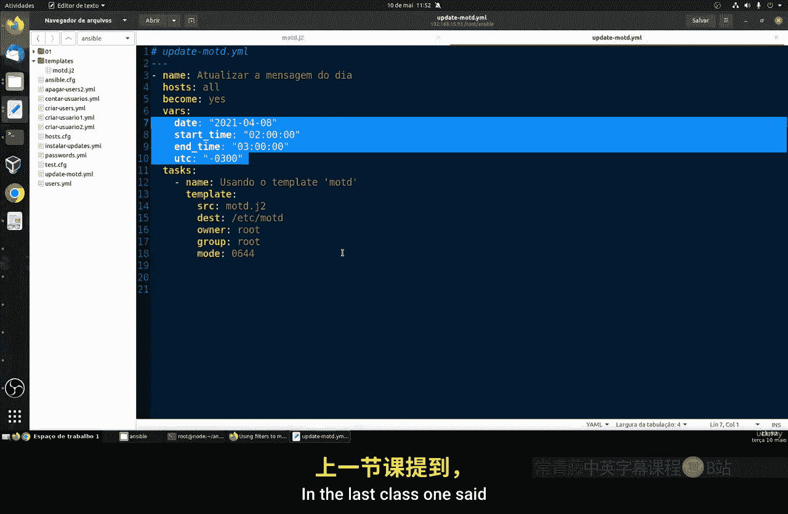
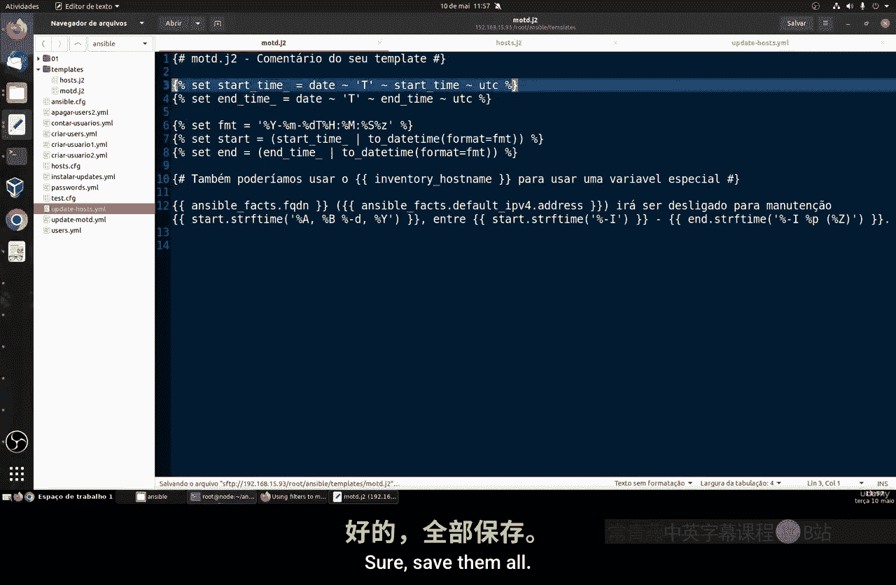
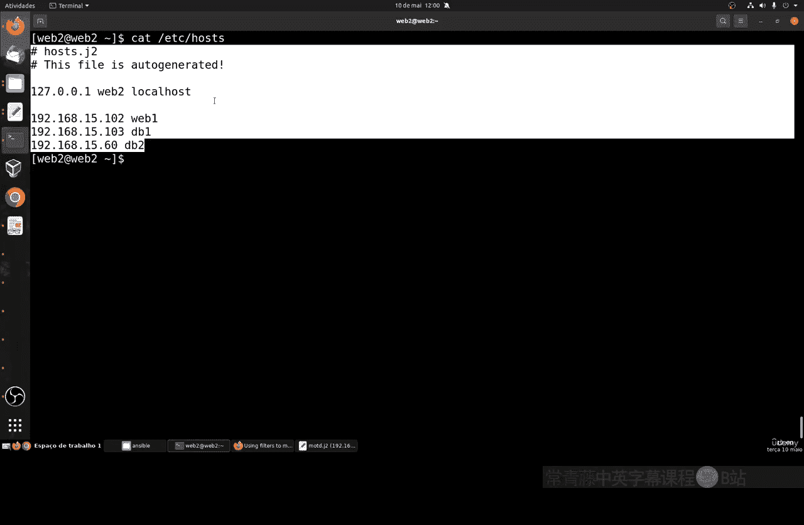
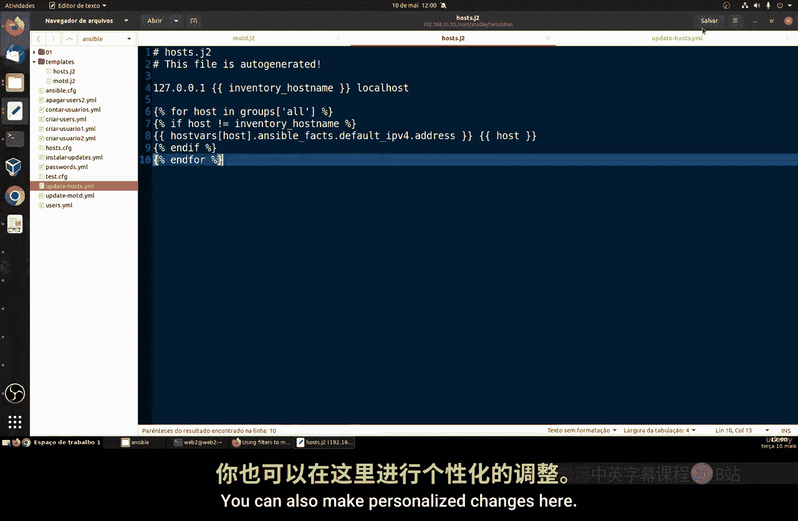
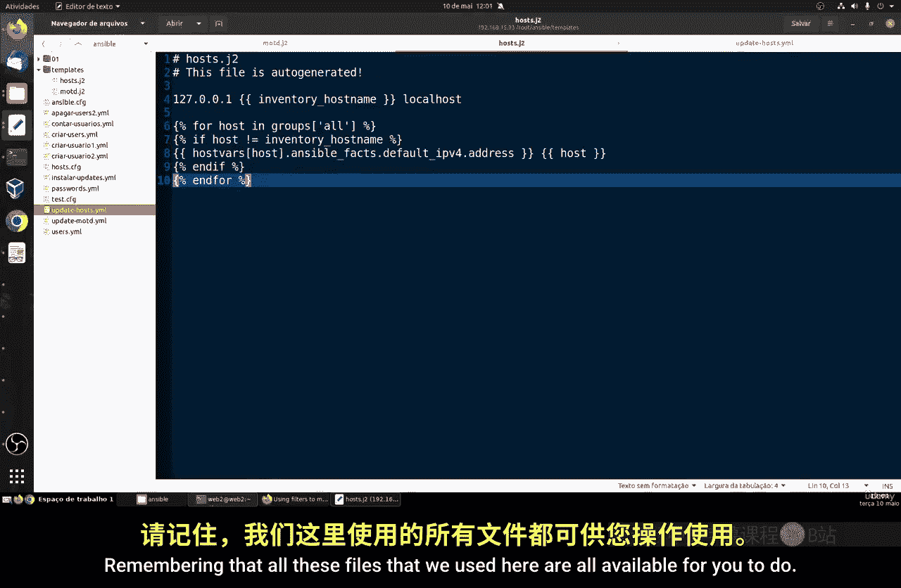
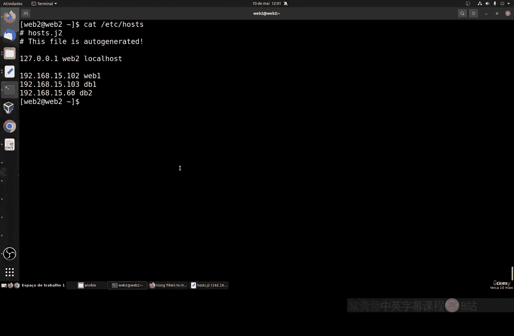

# 061：在Ansible中使用Jinja第二部分

## 概述

在本节课中，我们将继续学习如何在Ansible中使用Jinja2模板。我们将重点学习如何动态生成和更新系统文件，特别是`/etc/hosts`文件，通过模板和变量实现自动化管理，从而避免在多台主机上手动操作的繁琐。

上一节我们介绍了Jinja2模板的基本语法和变量替换，本节中我们来看看如何利用循环和条件语句，批量生成包含多台主机信息的配置文件。

## 更新MOTD文件模板

首先，我们回顾并改进上一节中用于生成每日消息（MOTD）的Jinja2模板。原始模板中包含了诸如`date_start`和`time_end`等局部变量。为了使模板更灵活，我们可以将这些变量替换为从外部传入的变量。



具体做法是修改模板文件，移除硬编码的日期和时间值，改为引用Ansible playbook中定义的变量。例如，将模板中的`{{ date_start }}`和`{{ time_end }}`替换为从`vars`部分获取的变量。同时，可以加入时区参数`UTC`，使其能适应不同地区的服务器。

以下是更新后的模板任务示例代码：
```yaml
- name: 更新MOTD文件
  template:
    src: motd.j2
    dest: /etc/motd
    mode: '0644'
```
通过这种方式，我们只需在playbook的变量部分修改一次值，所有使用该模板的主机都会自动更新，极大地提升了管理效率。


## 自动化生成Hosts文件

手动维护多台服务器的`/etc/hosts`文件是一项繁重的工作。我们将创建一个Jinja2模板来自动化这个过程。

以下是创建模板的步骤：
1.  创建一个名为`hosts.j2`的模板文件。
2.  在文件开头保留`127.0.0.1 localhost`这一行，这是必需项。
3.  使用Jinja2的循环结构，动态添加所有主机记录。

以下是`hosts.j2`模板文件的核心内容：
```jinja2
127.0.0.1   localhost
{# 以下为自动生成的主机记录 #}


{{ hostvars[host].ansible_default_ipv4.address }}   {{ hostvars[host].ansible_hostname }}


```

这段代码的含义是：
*   ``：遍历Ansible清单中`all`组下的每一台主机。
*   ``：检查该主机是否定义了IPv4地址。
*   `{{ hostvars[host].ansible_default_ipv4.address }}`：插入该主机的IP地址。
*   `{{ hostvars[host].ansible_hostname }}`：插入该主机的主机名。

你可以将`groups['all']`替换为特定的组名，例如`groups['database']`，从而只为数据库服务器组生成记录。

## 创建并运行Playbook

接下来，我们需要创建一个Playbook来应用这个模板。

以下是创建Playbook的步骤：
1.  创建一个名为`update_hosts.yml`的playbook文件。
2.  定义一个任务，使用`template`模块将`hosts.j2`模板渲染并推送到各主机的`/etc/hosts`路径。

`update_hosts.yml` playbook内容如下：
```yaml
- name: 更新所有主机的hosts文件
  hosts: all
  tasks:
    - name: 部署动态hosts文件
      template:
        src: hosts.j2
        dest: /etc/hosts
```
**注意**：此操作会覆盖目标主机上原有的`/etc/hosts`文件。执行前，请确认文件中没有需要保留的手动配置。



保存所有文件后，运行此playbook：
```bash
ansible-playbook update_hosts.yml
```
运行成功后，每台主机的`/etc/hosts`文件都会包含清单中所有主机的IP地址和主机名。

## 验证结果

为了验证配置是否生效，我们可以进行连接测试。

以下是验证步骤：
1.  通过SSH登录到其中一台主机，例如`web1`。
2.  使用`cat /etc/hosts`命令查看文件内容，确认是否包含了所有主机的记录。
3.  尝试`ping`另一台主机的主机名（如`ping db2`），测试名称解析是否正常工作。

如果`ping`命令能够成功解析并连接到目标主机，说明动态生成的`/etc/hosts`文件工作正常。这种方法的最大优势在于，当某台主机的IP地址变更时，你只需在Ansible清单中更新一次，重新运行playbook，所有相关主机的`/etc/hosts`文件都会自动更新，无需逐台登录修改。

## 处理不同Linux发行版



不同的Linux发行版（如Red Hat、Ubuntu、Debian）的配置文件格式可能略有差异。Jinja2模板的强大之处在于，你可以在模板中使用条件判断。



例如，可以根据`ansible_os_family`事实变量，为不同的发行版生成略有区别的配置内容。这保证了模板的通用性和灵活性，能够适应复杂的异构环境。


## 总结





本节课中我们一起学习了Jinja2模板在Ansible中的进阶应用。我们掌握了如何将模板中的局部变量替换为全局变量，使配置更加灵活。更重要的是，我们通过一个实际案例，学会了如何使用Jinja2的`for`循环和`hostvars`变量，动态生成包含多台主机信息的`/etc/hosts`文件，实现了配置管理的自动化。这种方法极大地简化了在多服务器环境下的运维工作。