# 062：使用Ansible Galaxy角色 🚀

在本节课中，我们将学习如何使用Ansible Galaxy。Ansible Galaxy是一个公共的角色仓库，它包含了大量预先编写好的、可复用的自动化任务集合，能帮助我们极大地加速应用程序和机器的配置过程。

## 什么是Ansible Galaxy？📚

上一节我们介绍了Ansible的基础，本节中我们来看看Ansible Galaxy。Ansible Galaxy本质上是一个公共库，它汇集了众多针对不同功能（如Web服务、网络、云、数据库、监控等）的自动化角色。这些角色由社区创建和维护，是公开且可免费使用的。

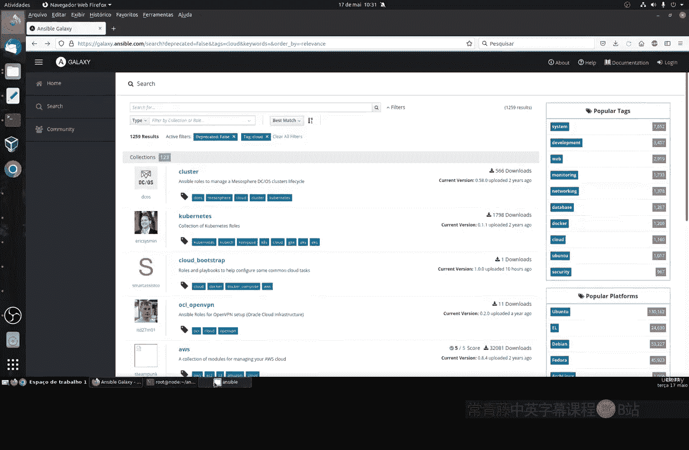

访问Galaxy网站，你可以找到各种官方或社区贡献的角色。例如，你可以找到一个用于在所有机器上快速安装PostgreSQL数据库的角色。每个角色页面都提供了详细信息，包括兼容的操作系统（如Red Hat、Fedora、Ubuntu）、所需模块以及安装说明。

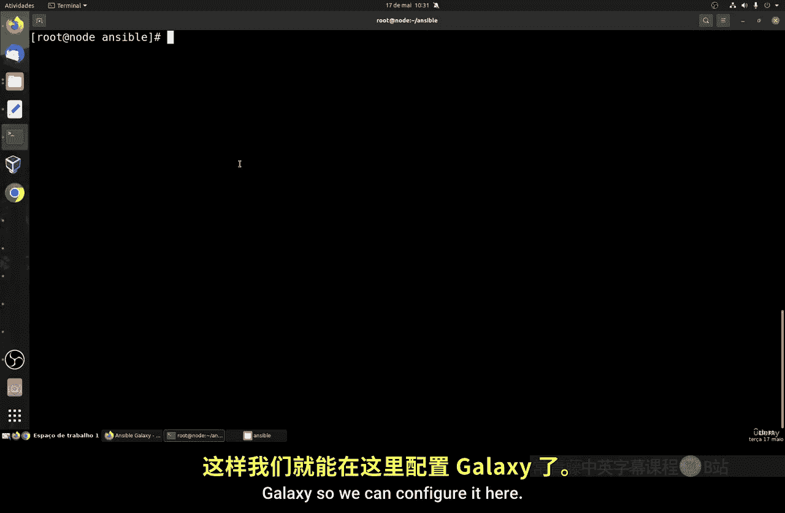

## 准备工作：清理与配置 ⚙️

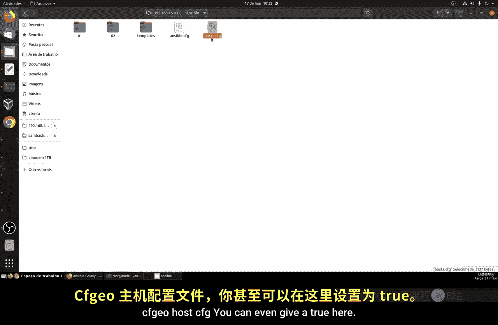

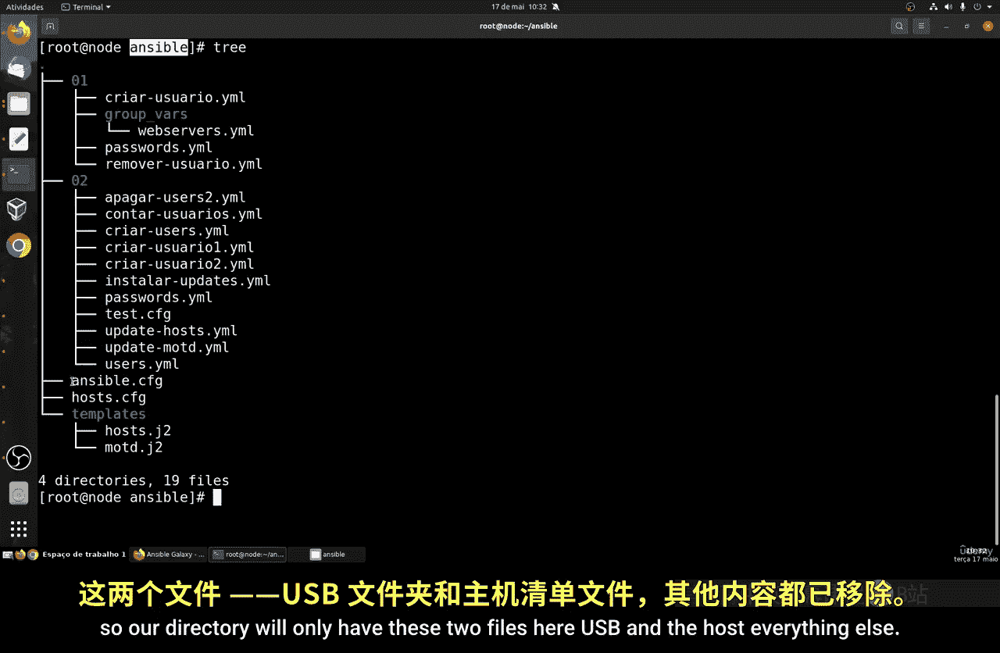

在开始使用Galaxy角色之前，我们需要对项目目录进行一些清理和配置。

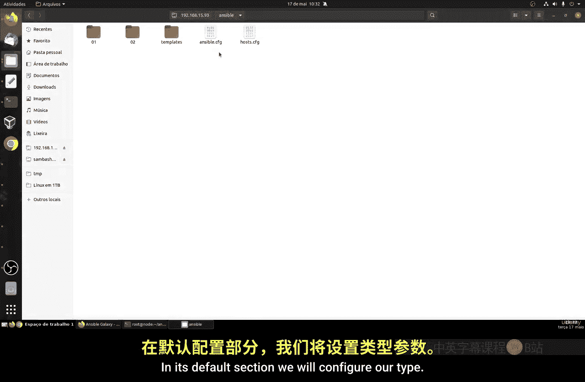

首先，我们清理当前Ansible项目目录，只保留必要的文件。我们将移除非核心的文件和文件夹，仅留下 `ansible.cfg` 和 `hosts` 文件。

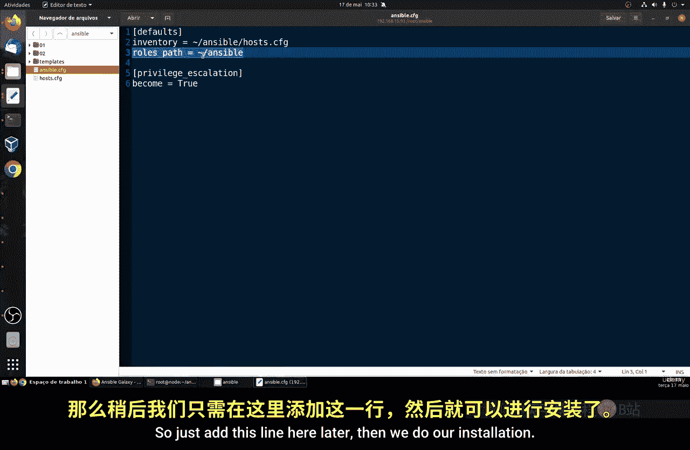

```bash
# 假设当前在Ansible项目根目录
# 移动除 ansible.cfg 和 hosts 之外的所有内容到一个备份文件夹（例如 backup/）
mkdir -p backup
mv !(ansible.cfg|hosts|backup) backup/ 2>/dev/null || true
```

清理后，目录结构应如下所示：
```
.
├── ansible.cfg
└── hosts
```

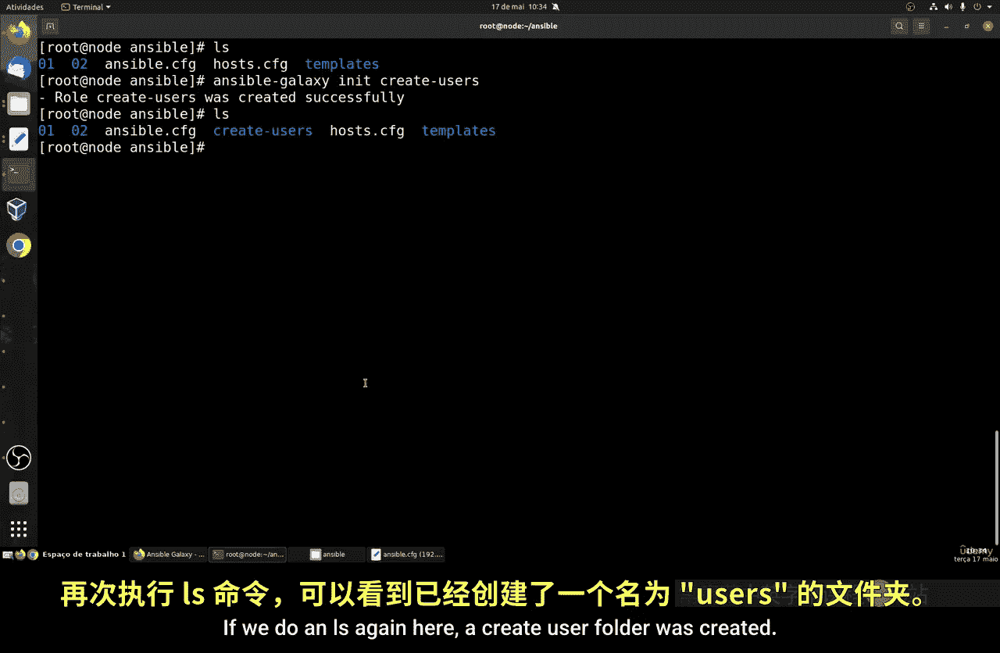

接下来，我们需要编辑 `ansible.cfg` 文件，配置Galaxy角色的安装路径。在 `[defaults]` 部分添加以下行：

```ini
[defaults]
# 其他现有配置...
roles_path = ./roles
```

这行配置告诉Ansible，当我们从Galaxy安装角色时，将其下载到当前项目下的 `./roles` 目录中。

## 安装与使用Galaxy角色 🛠️

配置完成后，我们就可以从Galaxy安装角色了。我们将以一个创建用户的角色为例。

使用 `ansible-galaxy` 命令安装名为 `create-users` 的角色：

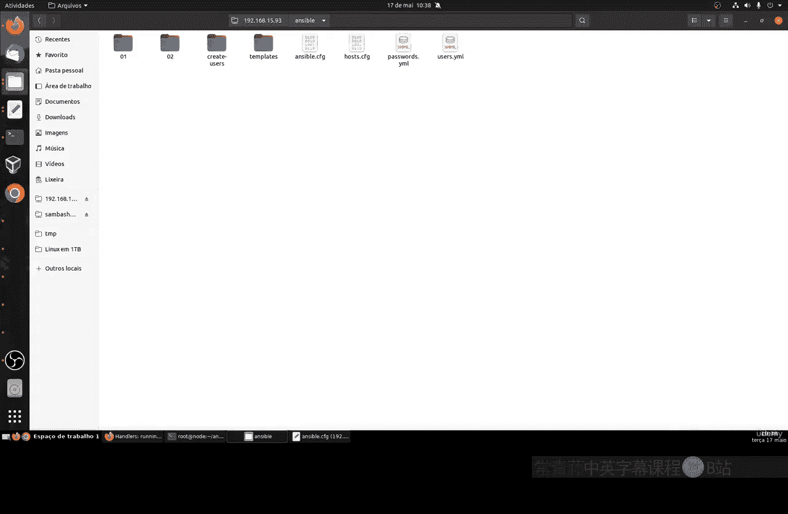

```bash
ansible-galaxy role init create-users
```

执行此命令后，Ansible会自动在 `./roles` 目录下创建一个名为 `create-users` 的文件夹，其中包含了角色所需的标准目录结构，例如：
*   `defaults/`: 存放角色的默认变量。
*   `files/`: 存放角色任务引用的静态文件。
*   `handlers/`: 存放处理器定义。
*   `meta/`: 存放角色的元信息，如作者、描述、依赖。
*   `tasks/`: **核心目录**，存放角色要执行的任务列表。
*   `templates/`: 存放Jinja2模板文件。
*   `tests/`: 存放用于测试角色的playbook和清单。
*   `vars/`: 存放角色的内部变量。

## 创建自定义任务与变量 📝

现在，我们将自己的用户创建逻辑整合到这个Galaxy角色框架中。我们之前在普通playbook中使用的逻辑将被移植到角色的对应目录中。

以下是需要创建或修改的关键文件：

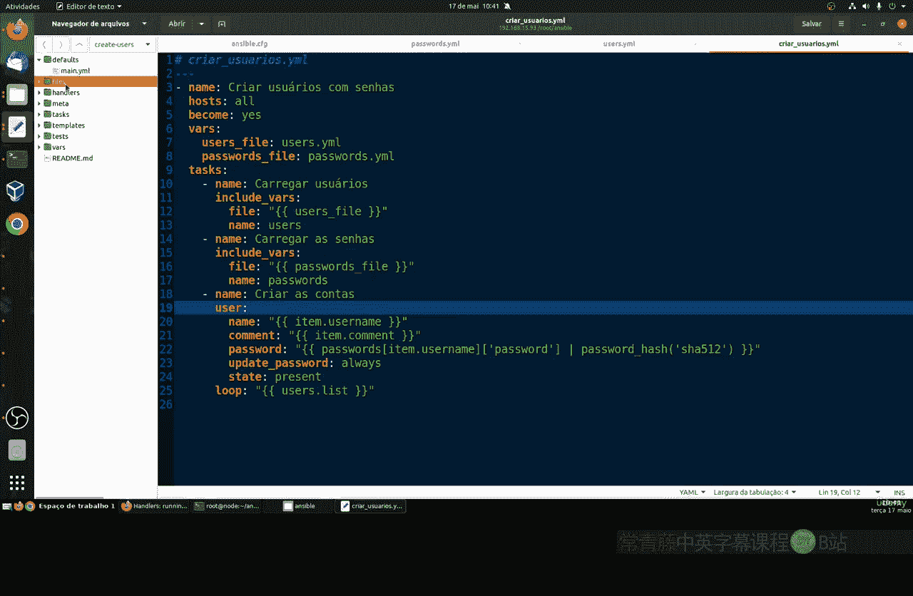

1.  **变量文件**：在 `roles/create-users/vars/` 目录下创建 `users.yml` 和 `passwords.yml`，分别定义用户列表和密码列表。
    ```yaml
    # roles/create-users/vars/users.yml
    user_list:
      - test_user
      - test_admin
      - test_dev

    # roles/create-users/vars/passwords.yml
    user_passwords:
      test_user: "hashed_password_1"
      test_admin: "hashed_password_2"
      test_dev: "hashed_password_3"
    ```
    *注意：密码应为使用 `ansible.builtin.password_hash` 过滤器生成的哈希值。*

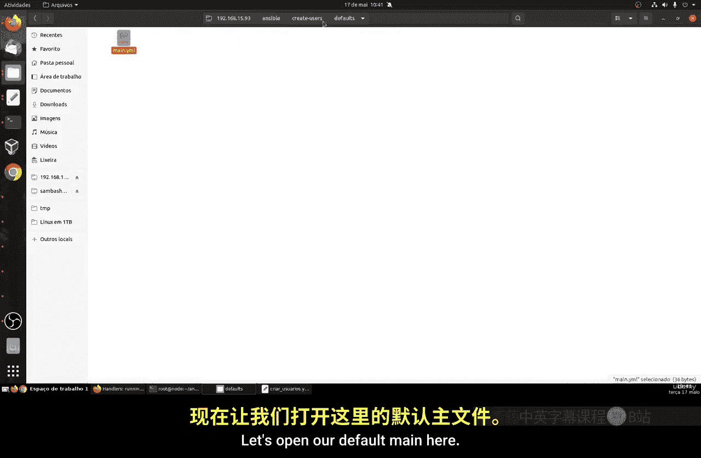

2.  **主任务文件**：编辑 `roles/create-users/tasks/main.yml`，这是角色执行的入口点。我们将加载变量并循环创建用户的逻辑放在这里。
    ```yaml
    # roles/create-users/tasks/main.yml
    - name: 加载用户列表
      ansible.builtin.include_vars:
        file: users.yml

    - name: 加载密码哈希
      ansible.builtin.include_vars:
        file: passwords.yml

    - name: 创建用户账户
      ansible.builtin.user:
        name: "{{ item }}"
        password: "{{ user_passwords[item] }}"
        state: present
        shell: /bin/bash
      loop: "{{ user_list }}"
    ```

3.  **测试Playbook**：在 `roles/create-users/tests/` 目录下，可以创建测试playbook，例如 `test.yml`。
    ```yaml
    # roles/create-users/tests/test.yml
    ---
    - hosts: all  # 或你的具体主机组
      roles:
        - role: create-users
    ```
    **重要**：确保将 `users.yml` 和 `passwords.yml` 这两个变量文件也复制到 `tests/` 目录下，或者确保测试playbook能正确引用它们的位置。

## 执行与测试 ✅

一切就绪后，我们可以从项目根目录运行测试playbook来验证角色功能。

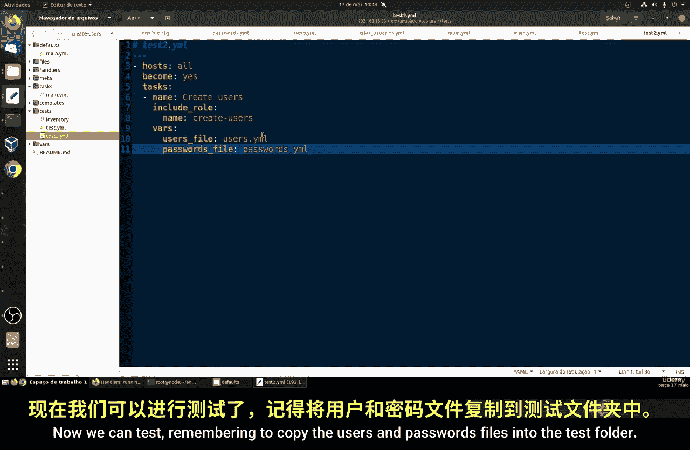

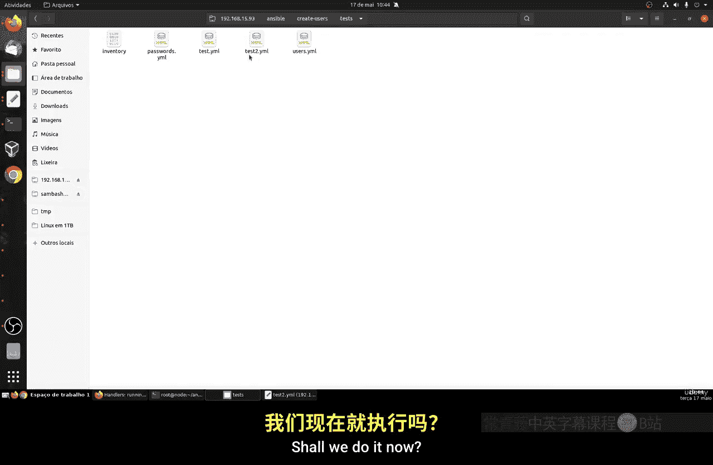

```bash
ansible-playbook -i hosts roles/create-users/tests/test.yml
```

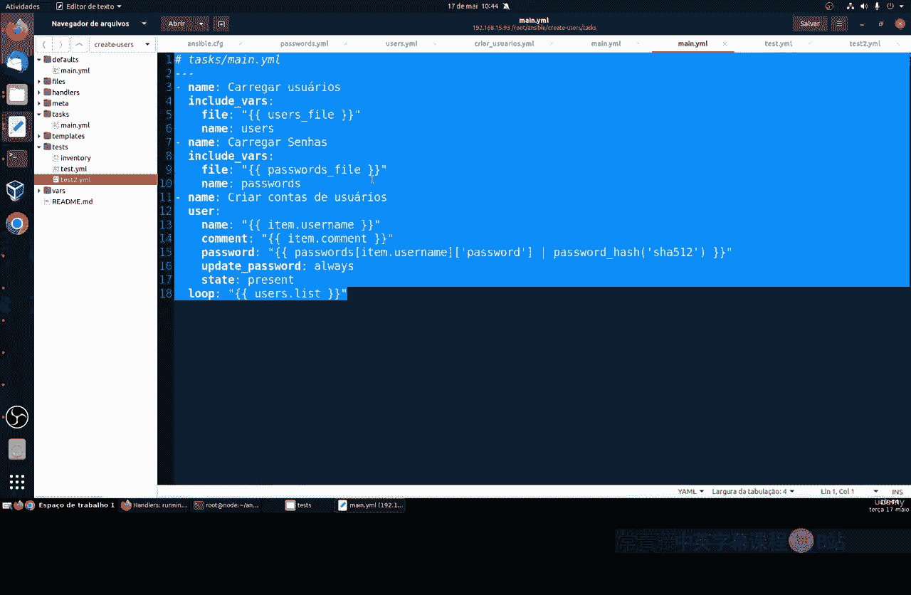

如果配置正确，Ansible将连接到目标主机，加载变量，并循环地为 `user_list` 中的每个用户创建账户并设置对应的密码。

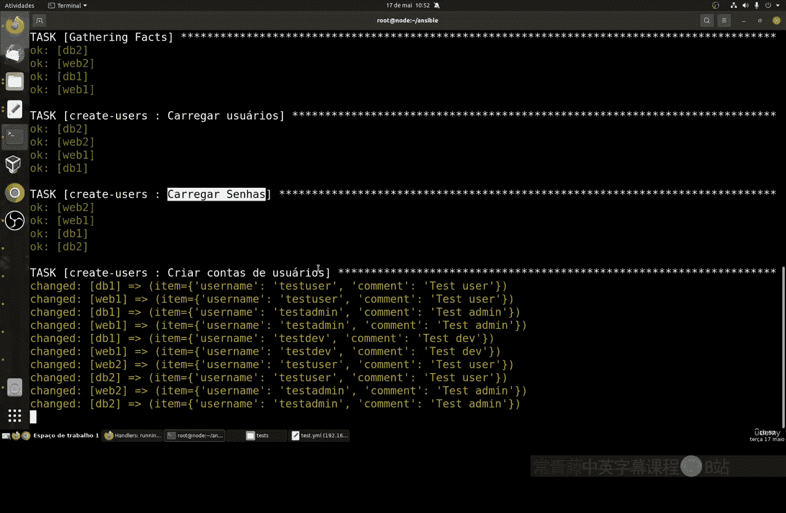

你可以创建多个测试playbook（如 `test2.yml`）来验证不同场景或主机组下的执行情况。

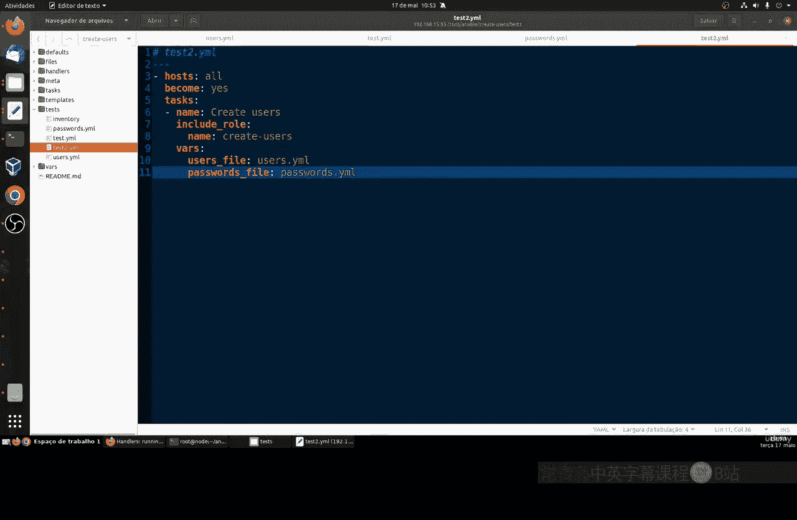

## 总结 🎯

本节课中我们一起学习了Ansible Galaxy的核心用法。我们首先了解了Galaxy作为角色仓库的价值，然后完成了使用前的目录清理与配置。接着，我们通过 `ansible-galaxy role init` 命令初始化了一个角色框架，并将之前编写的用户创建逻辑，结构清晰地整合到了角色的 `tasks` 和 `vars` 目录中。最后，我们通过编写和执行测试playbook验证了角色的功能。

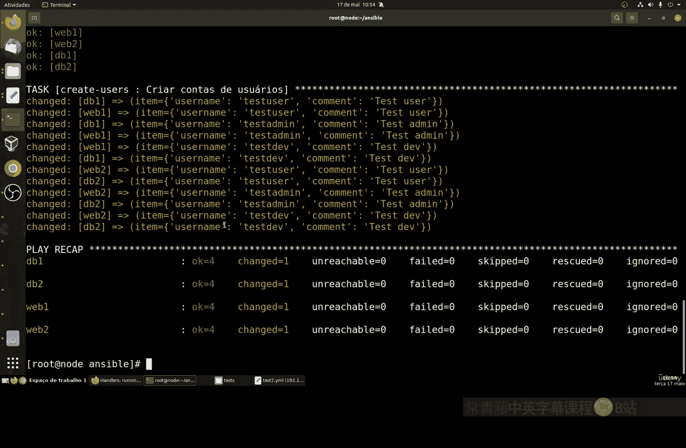

这种模块化的方式使自动化代码更易于复用、维护和分享。在后续课程中，我们将探索更多Galaxy上的实用角色。