# 064：将 Ansible 连接到 Windows 🖥️➡️🐧

在本节课中，我们将学习如何在 Linux 系统上安装和配置 Ansible，以实现对 Windows 服务器的远程管理和互联。这比连接 Linux 系统需要更多的前期准备步骤。

## 概述

我们将分步完成 Ansible 与 Windows 主机的连接配置。首先需要在 Windows 端安装必要的程序并进行配置，然后在 Linux 端的 Ansible 控制节点上进行相应设置，最后进行连接测试。

## 第一步：Windows 端准备

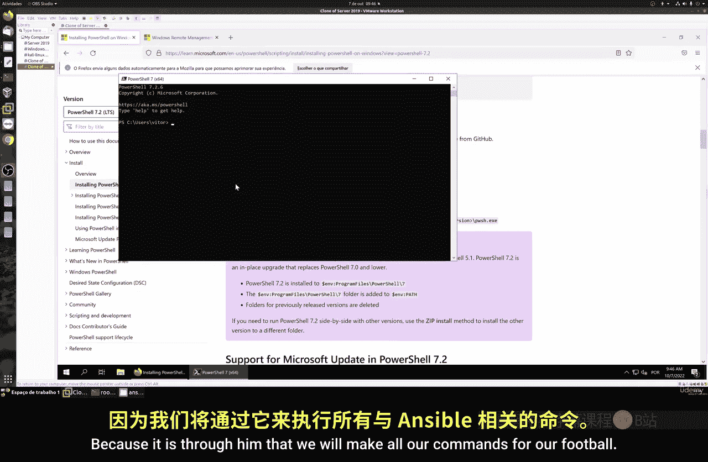

上一节我们介绍了课程目标，本节中我们来看看 Windows 端需要做的准备工作。主要步骤是安装 PowerShell 7 并配置防火墙。

以下是需要在 Windows 服务器上完成的步骤：

1.  **安装 PowerShell 7**：从 Microsoft 官方网站下载并安装 PowerShell 7 或更高版本（例如 7.2）。从版本 7 开始，PowerShell 已在 GitHub 上开源。
2.  **配置防火墙**：正确配置 Windows 防火墙，开放必要的端口（默认为 5986）。如果 Windows 主机位于云端或不同网络，建议使用 VPN 建立直接连接，以避免防火墙或杀毒软件带来的问题。

完成安装后，请确认 PowerShell 7 已成功安装，因为后续所有 Ansible 命令都将通过它来执行。

## 第二步：Linux 端 Ansible 配置

现在，让我们回到 Linux 控制节点进行 Ansible 的配置。首先需要安装一些必要的库。

在开始之前，我们为 Windows 连接创建一个专用目录和测试文件。后续课程会进行更复杂的配置。

进入该目录后，更新包管理器并安装必要的包。我们需要安装 `pywinrm` 和 `kerberos` 包。

```bash
pip install pywinrm
pip install kerberos
```


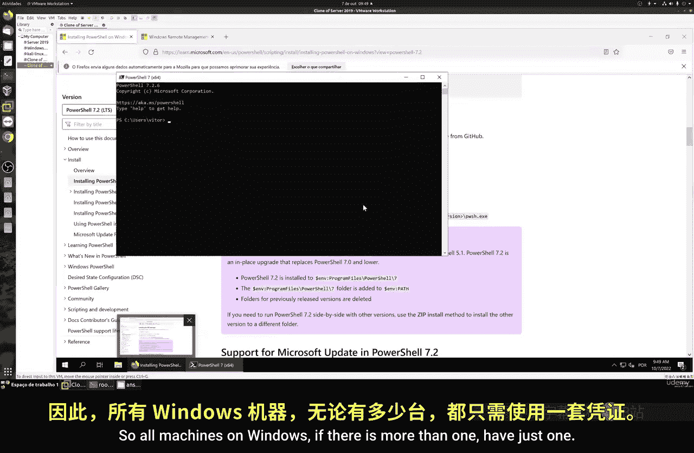

`pywinrm` 包用于实现 Windows 远程管理（WinRM），这是 Ansible 连接 Windows 所使用的基于 SOAP over HTTPS 的微软协议。`kerberos` 包用于在某些域环境下的附加配置。

## 第三步：配置 Ansible 清单与认证

接下来，我们需要创建 Ansible 清单文件来定义要管理的 Windows 主机，并设置连接认证信息。

首先，在之前创建的目录中，创建一个清单文件，例如 `windows_inventory.ini`。在该文件中，添加 Windows 主机的 IP 地址或主机名。

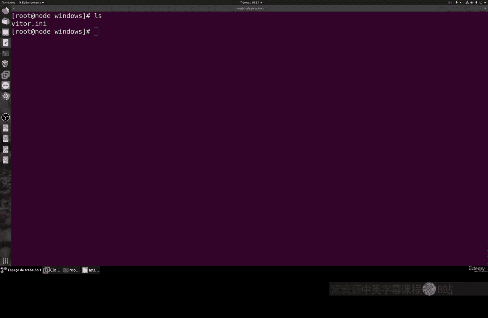

```ini
[windows_servers]
192.168.1.100
# 或使用主机名
# win-server-01
```

然后，创建一个变量文件（如 `group_vars/windows_servers.yml`）来存储统一的连接认证信息。确保所有 Windows 主机使用相同的管理员用户名和密码以简化配置。

```yaml
ansible_user: Administrator
ansible_password: "YourWindowsPassword"
ansible_connection: winrm
ansible_winrm_server_cert_validation: ignore
ansible_port: 5986
```

**关键参数说明**：
*   `ansible_connection: winrm`：指定使用 WinRM 协议连接。
*   `ansible_winrm_server_cert_validation: ignore`：忽略证书验证（用于测试环境）。
*   `ansible_port: 5986`：WinRM 的默认加密端口。

请确保防火墙已开放 5986 端口。为安全起见，在生产环境中使用 VPN 连接。

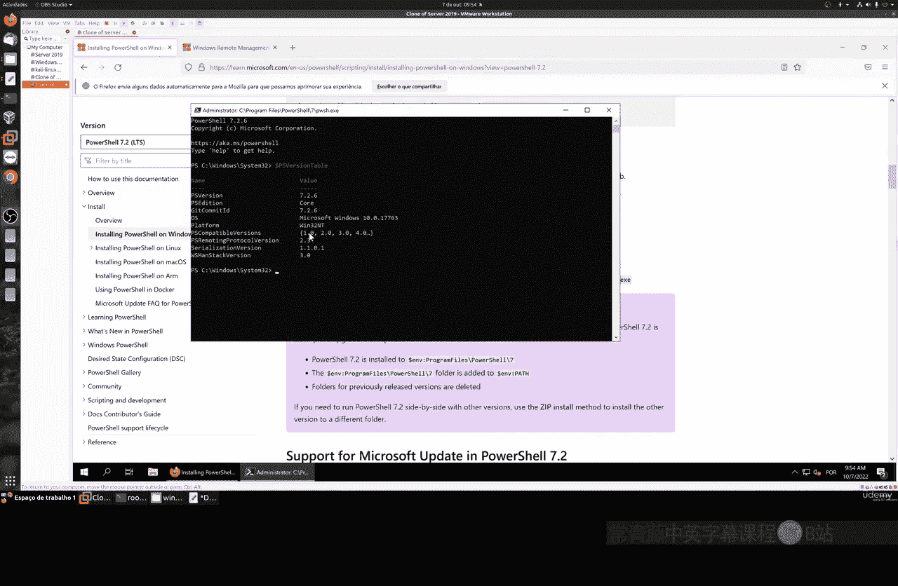

## 第四步：在 Windows 上启用 WinRM 并配置 Ansible

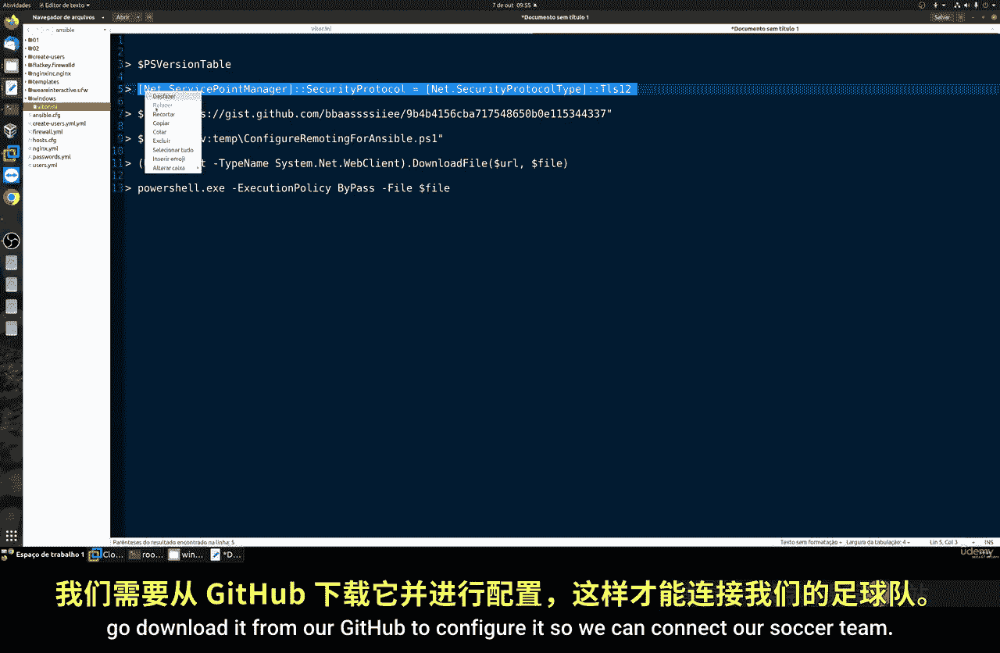

现在，回到 Windows 服务器，以**管理员身份**运行 PowerShell 7。这是确保拥有所有配置权限的关键。

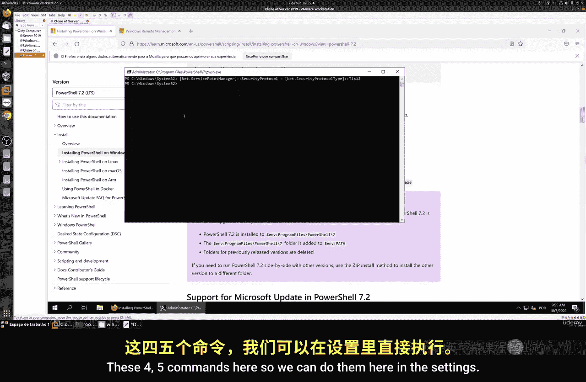

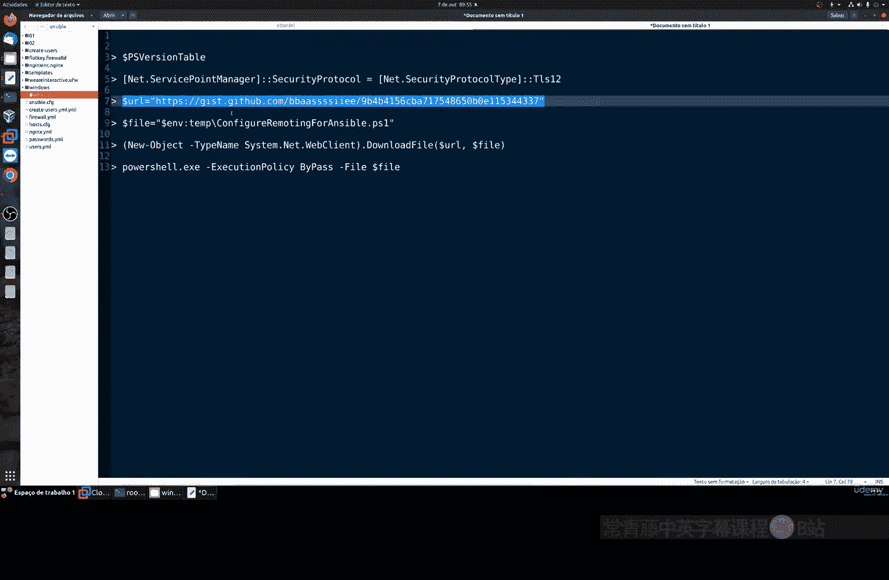


首先，导航到 `System32` 目录，然后执行一系列命令来下载并运行 Ansible 官方提供的配置脚本。这些命令会从 GitHub 获取脚本并自动配置 WinRM 以接受 Ansible 连接。

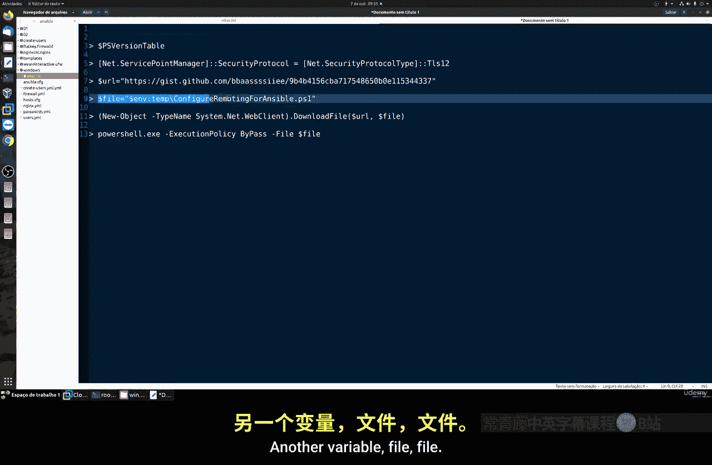

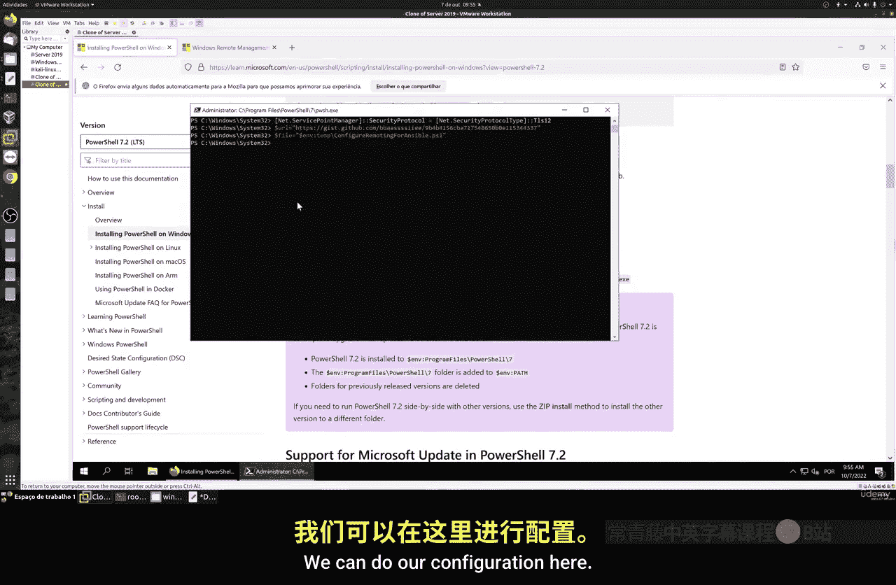

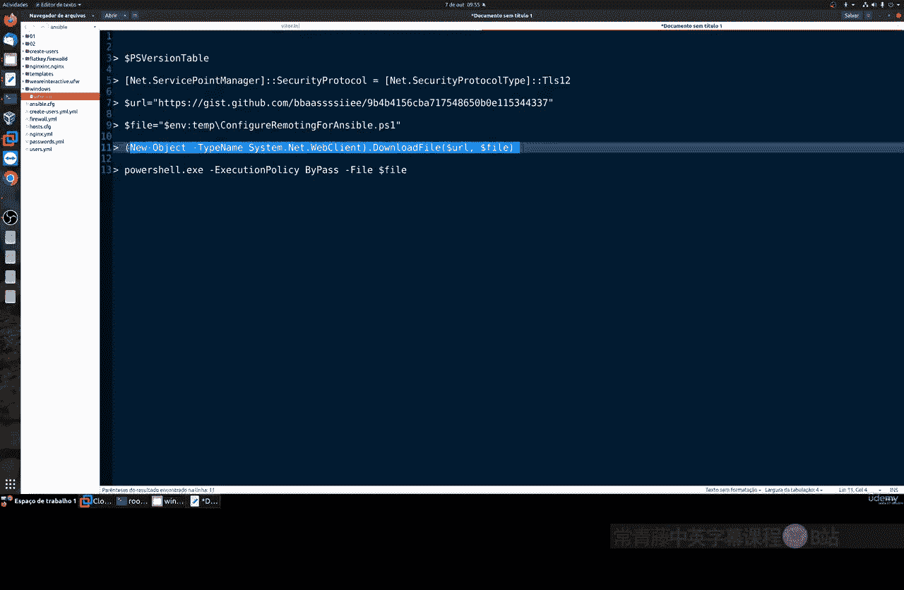

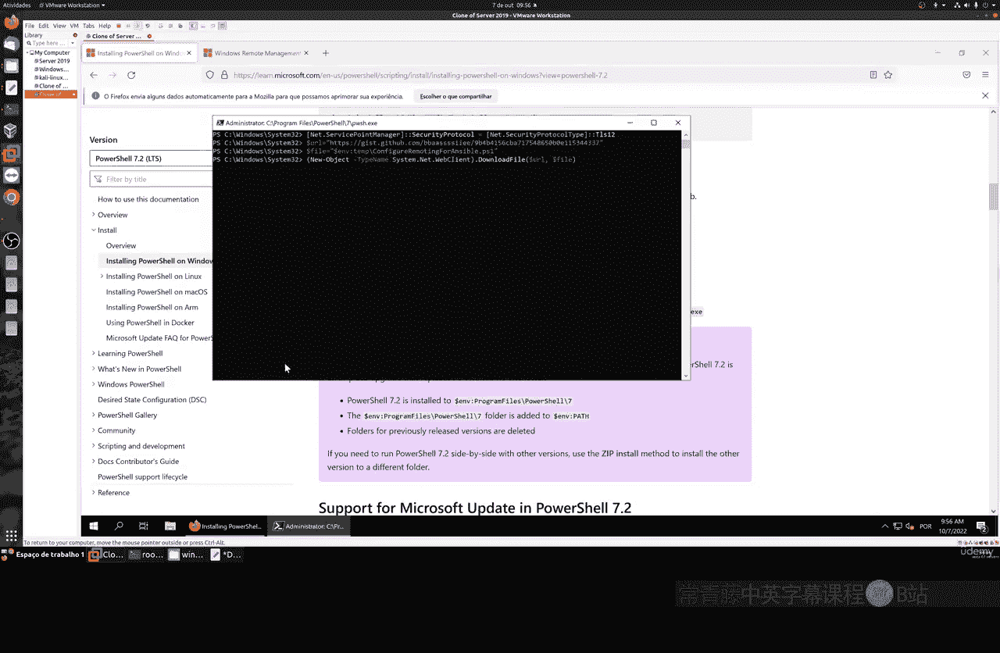

以下是需要依次执行的命令：

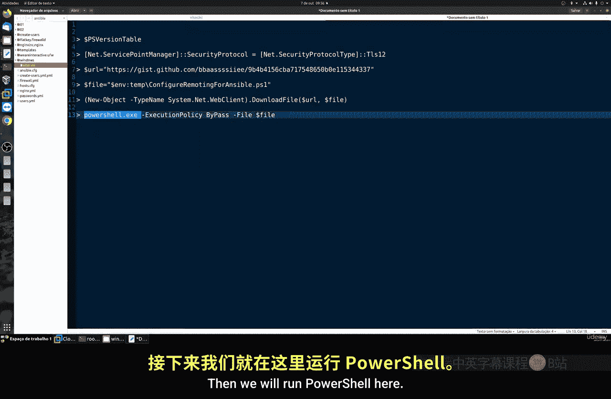

```powershell
cd $env:windir\system32
$url = "https://raw.githubusercontent.com/ansible/ansible/devel/examples/scripts/ConfigureRemotingForAnsible.ps1"
$file = "$env:temp\ConfigureRemotingForAnsible.ps1"
(New-Object -TypeName System.Net.WebClient).DownloadFile($url, $file)
powershell.exe -ExecutionPolicy ByPass -File $file
```

这些命令会下载配置脚本并执行，完成后你的 Windows 主机就准备好接受 Ansible 的 WinRM 连接了。

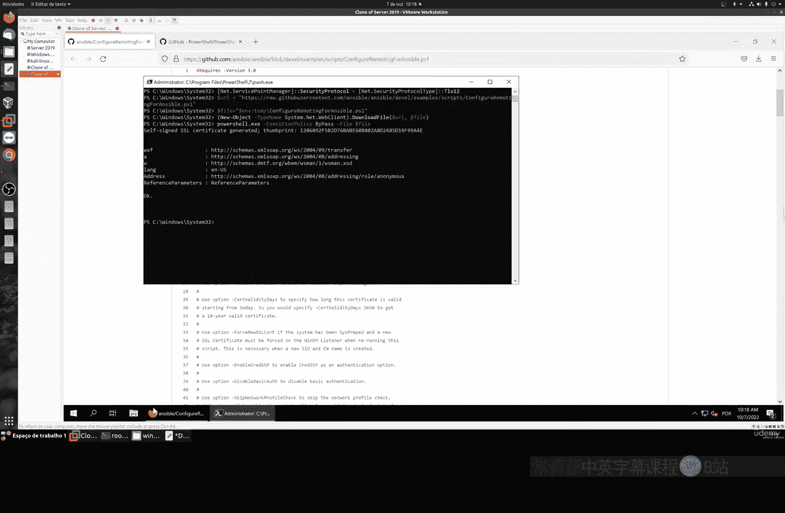

## 第五步：测试连接

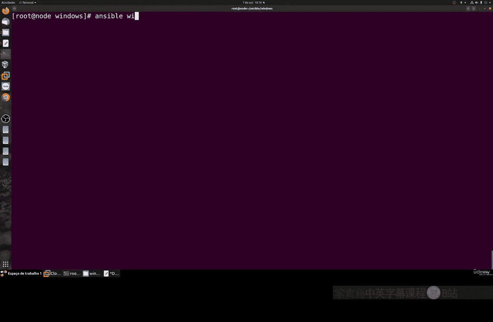

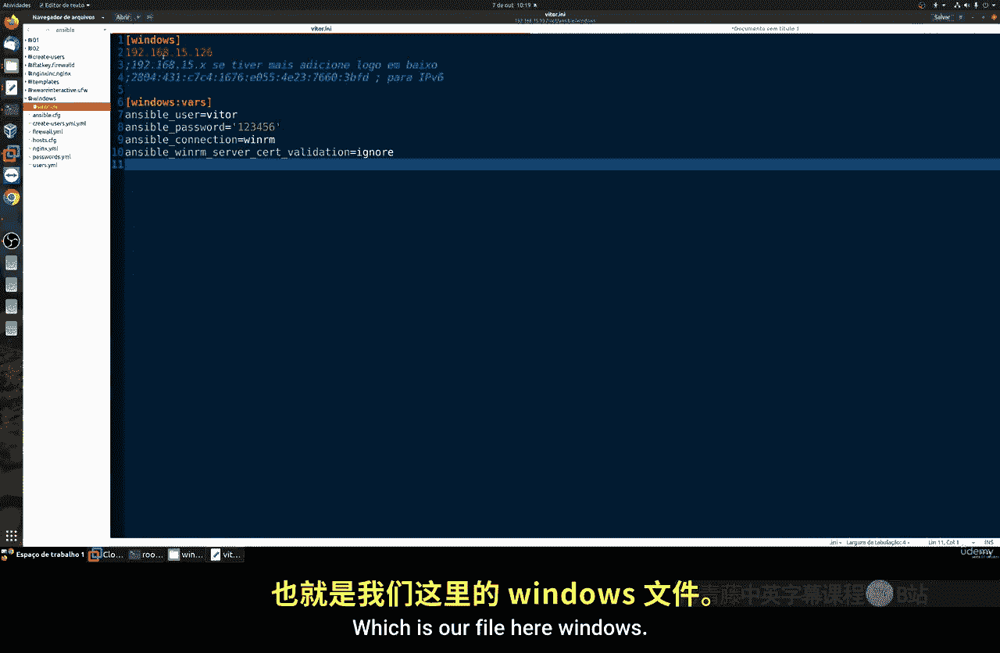

所有配置完成后，让我们回到 Linux 控制节点进行最终的连接测试。

使用 `ansible` 命令配合 `win_ping` 模块来测试与 Windows 主机的通信是否正常。命令结构如下：

```bash
ansible windows_servers -i windows_inventory.ini -m win_ping
```

如果配置正确，你将看到成功的响应，表明 Ansible 现在可以远程管理你的 Windows 主机了。这种方式无需在 Windows 上安装任何 Ansible 代理软件。

## 安全注意事项与总结

本节课中我们一起学习了如何搭建 Ansible 到 Windows 的连接。最后，请务必注意安全：

*   妥善处理防火墙和杀毒软件设置。
*   在生产环境中，强烈建议使用 VPN 连接不同网络的机器。
*   `ignore` 证书验证仅适用于测试，生产环境应配置正确的证书。
*   所有配置命令和脚本的最新版本请以 Ansible 官方文档和 GitHub 仓库为准。

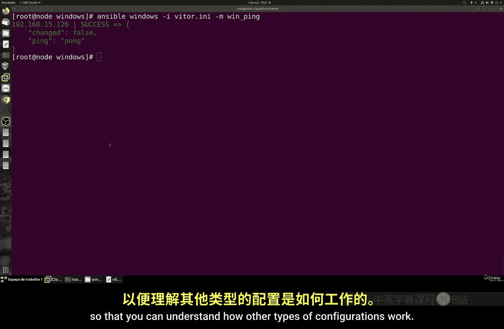

通过以上步骤，你已经成功配置了 Ansible 对 Windows 主机的远程管理能力，为后续的自动化任务打下了基础。