# 065：创建首个Playbook 🚀

在本节课中，我们将学习如何创建并运行一个Ansible Playbook，以实现对Windows系统的远程更新和重启操作。我们将从配置主机清单开始，逐步编写Playbook脚本，并最终执行自动化任务。

上一节我们成功完成了连通性测试，本节中我们来看看如何利用Ansible的强大模块来远程配置Windows系统。

## 概述：Ansible for Windows的能力

Ansible提供了丰富的Windows模块，使我们能够远程执行多种管理任务。以下是其主要功能类别：

*   **软件包管理**：安装或卸载可执行软件包。
*   **功能管理**：启用或禁用Windows的特定功能。
*   **服务管理**：启动、停止或管理系统服务。
*   **用户与组管理**：创建或管理本地用户和组。
*   **系统更新**：管理并安装Windows更新。
*   **文件操作**：在远程站点搜索文件。
*   **脚本执行**：发送并执行任何类型的PowerShell脚本。

此外，还有一个名为**Chocolatey**的程序，它类似于Linux中的`apt`或`yum`，是一个Windows软件包管理器。我们将在后续课程中详细介绍它。

## 配置主机清单

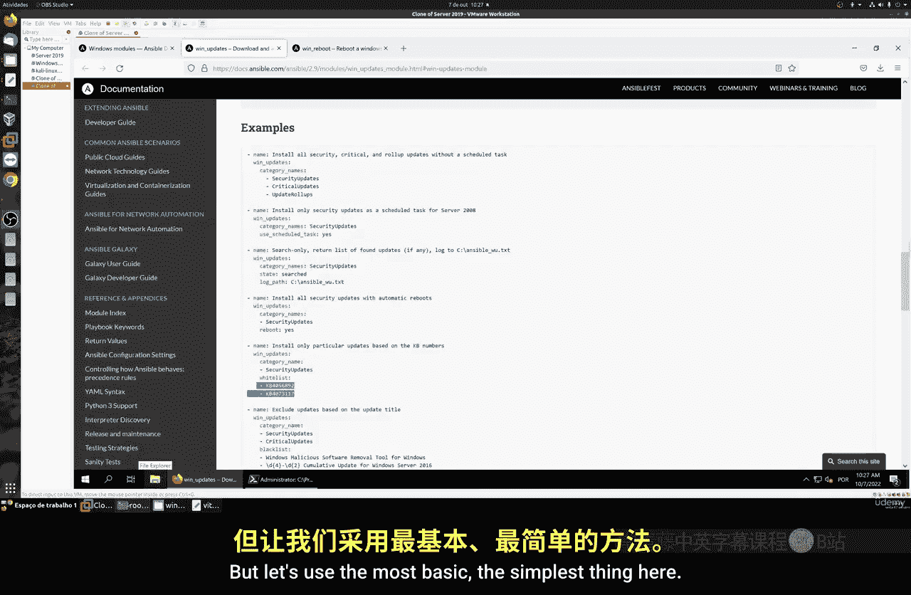

首先，我们需要在Ansible的主机清单文件中添加我们的Windows目标主机。

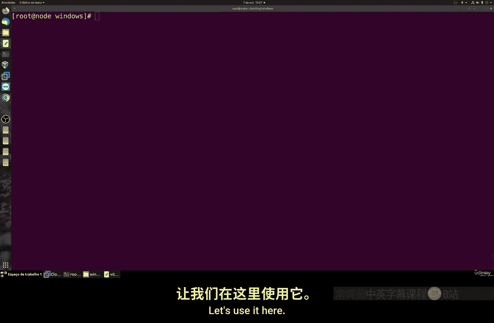

以下是配置步骤：
1.  打开Ansible的主机清单文件（通常是 `/etc/ansible/hosts`）。
2.  在文件中添加一个组，例如 `[windows]`，并在其下方填写Windows主机的IP地址或主机名。
3.  保存并退出文件。

配置示例：
```ini
[windows]
192.168.1.100
```

## 创建Windows更新Playbook

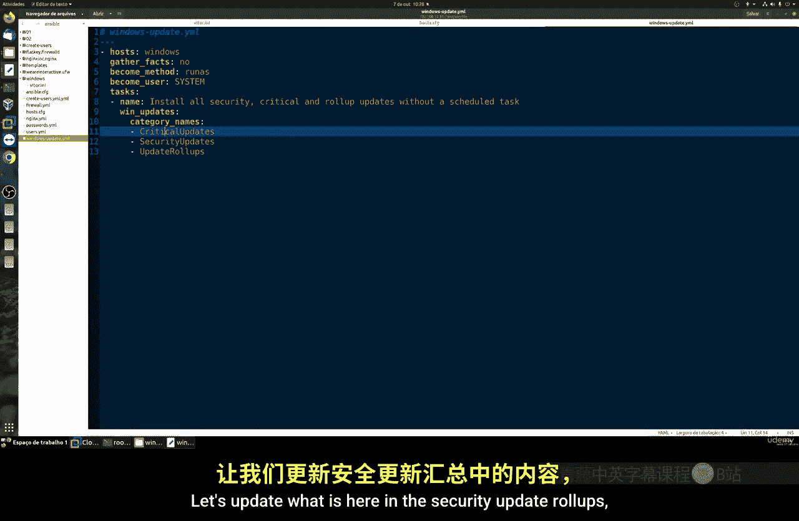

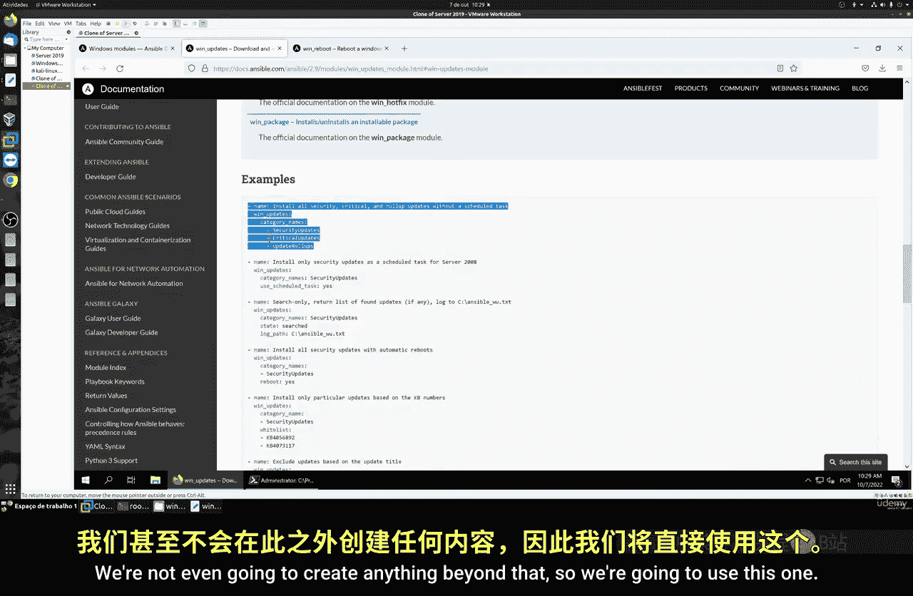

现在，我们来创建第一个Playbook，用于自动化安装Windows更新。

Playbook的核心结构包括：
*   **目标主机**：指定在哪个主机组上运行任务（例如：`hosts: windows`）。
*   **权限提升**：使用 `become: yes` 和 `become_user: SYSTEM` 以管理员权限执行任务。
*   **任务模块**：使用 `win_updates` 模块来安装更新。

以下是Windows更新Playbook的完整示例代码：
```yaml
---
- name: 安装Windows更新
  hosts: windows
  become: yes
  become_user: SYSTEM

  tasks:
    - name: 安装所有安全、关键和普通更新
      win_updates:
        category_names:
          - SecurityUpdates
          - CriticalUpdates
          - Updates
```

## 执行Playbook

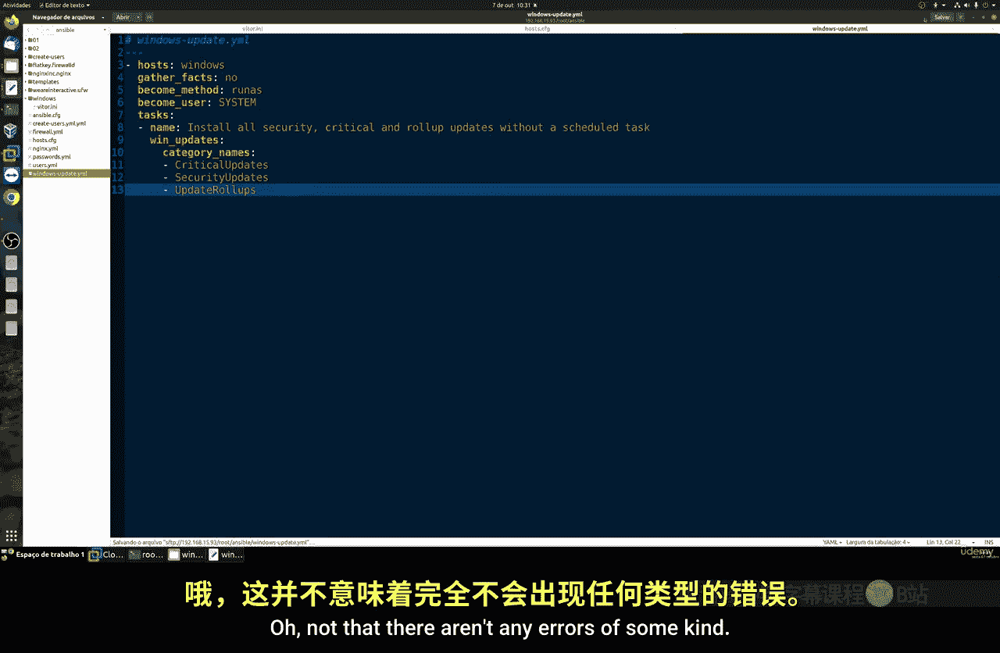

编写好Playbook文件（例如 `windows_update.yml`）后，即可在Ansible控制节点上运行它。

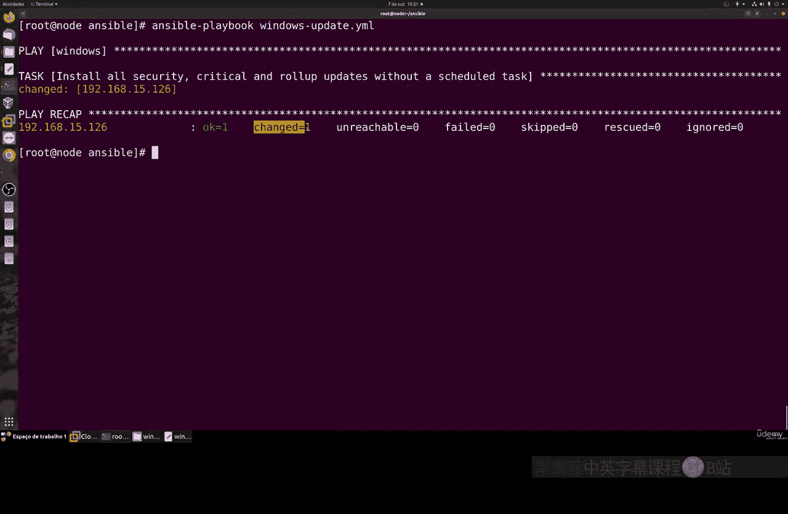

执行命令如下：
```bash
ansible-playbook windows_update.yml
```
运行后，Ansible会连接到目标Windows主机并开始安装更新。这个过程可能需要一些时间，具体取决于更新的大小和数量。

## 创建Windows重启Playbook

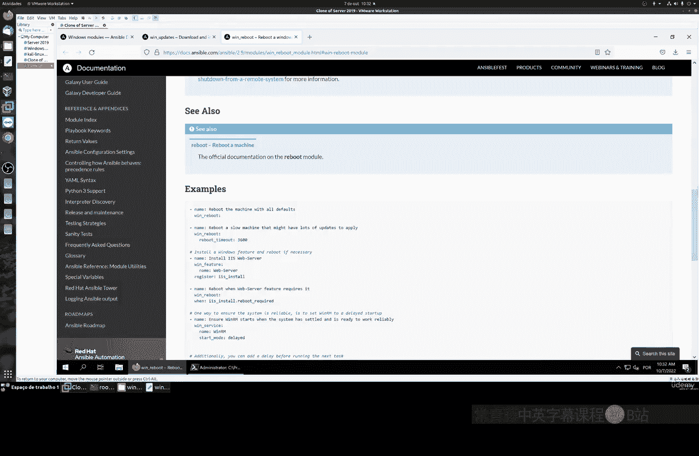

安装更新后，有时需要重启系统。我们可以创建另一个Playbook来实现远程重启。

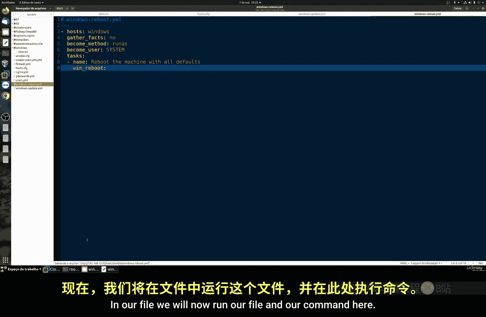

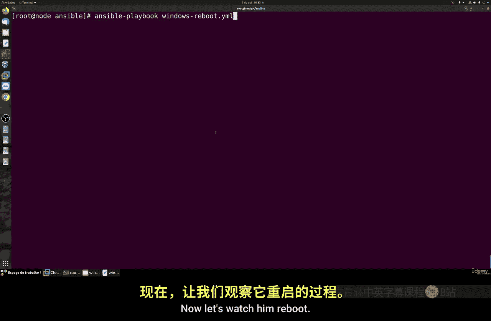

这个Playbook同样简单，我们使用 `win_reboot` 模块。

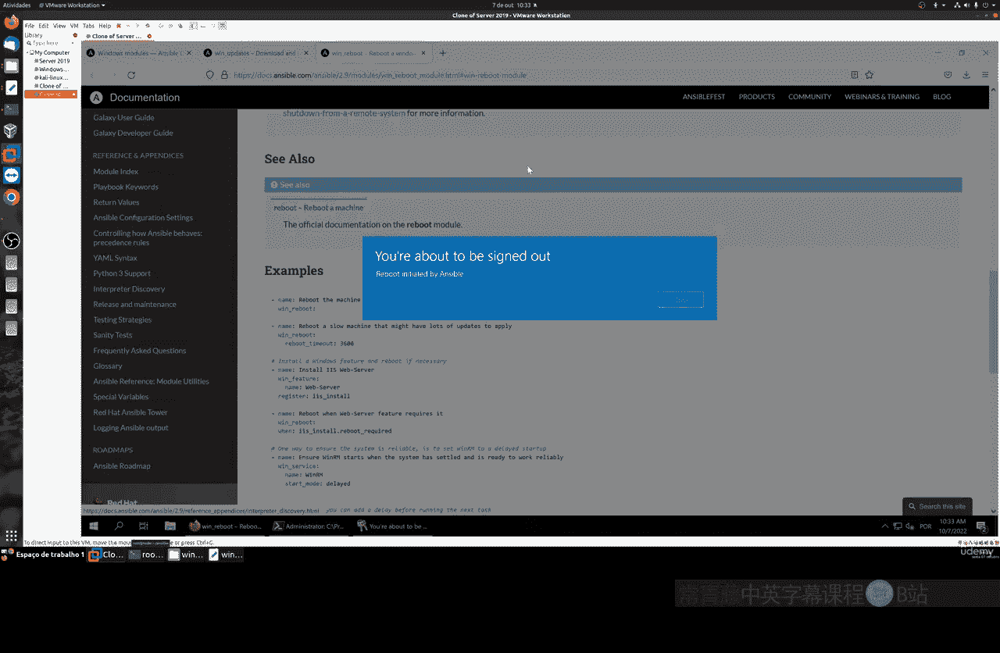

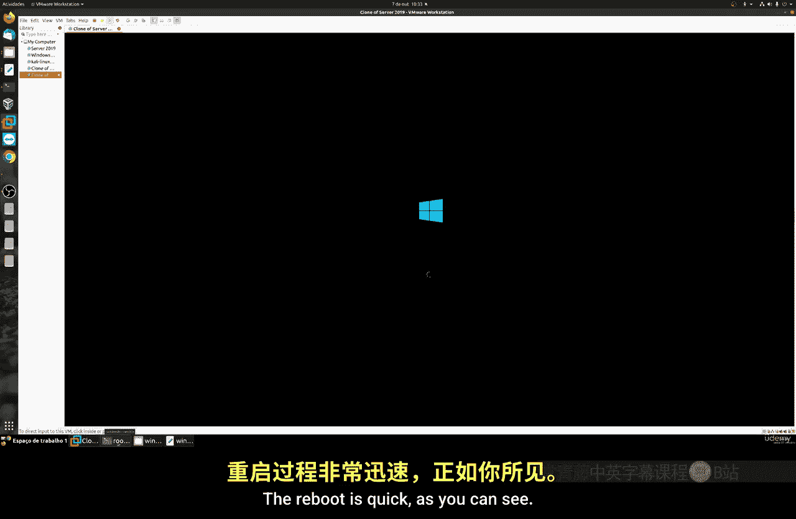

以下是Windows重启Playbook的示例代码：
```yaml
---
- name: 重启Windows主机
  hosts: windows
  become: yes
  become_user: SYSTEM

  tasks:
    - name: 重启系统
      win_reboot:
```
执行此Playbook的命令是：
```bash
ansible-playbook windows_reboot.yml
```
执行后，目标Windows主机将自动开始重启。你可以在Ansible输出中看到任务执行成功的状态。

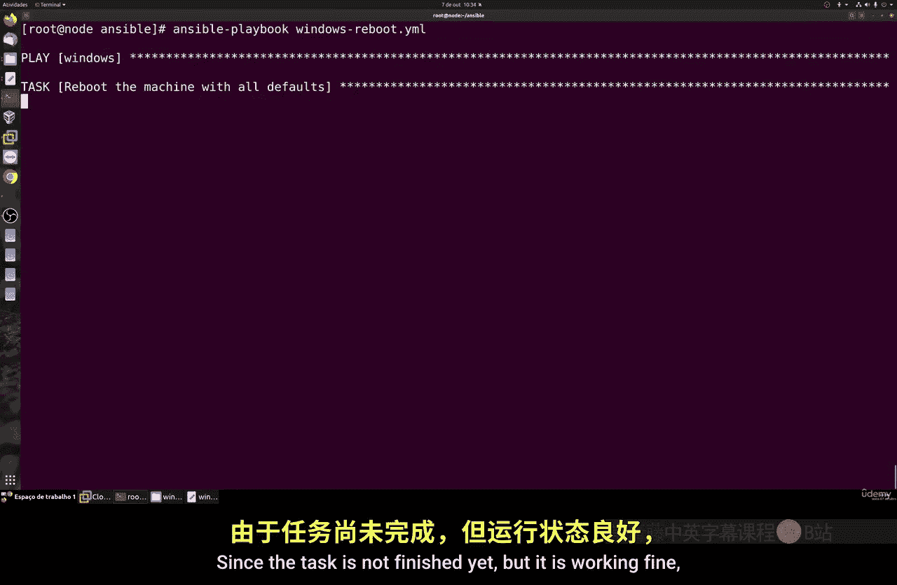

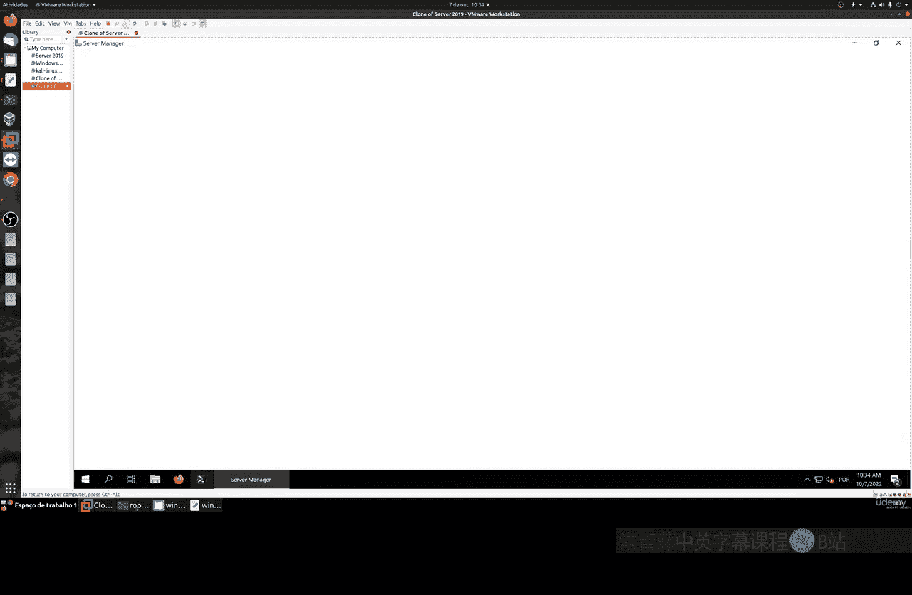

## 总结

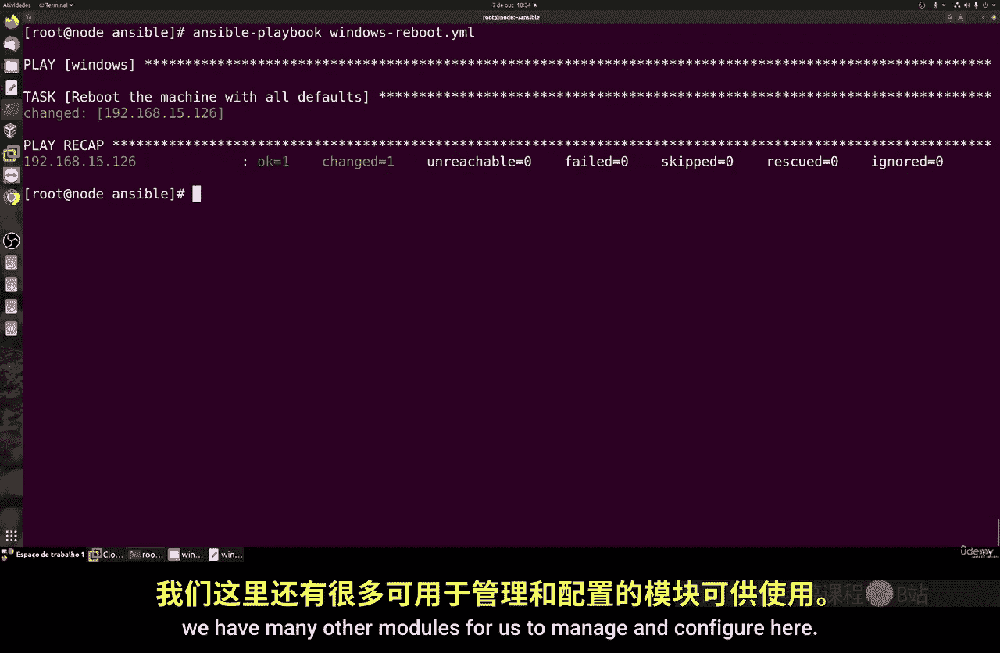

本节课中我们一起学习了Ansible自动化运维的基础操作。我们首先了解了Ansible管理Windows的多种可能性，然后完成了两个核心实践：配置主机清单、编写并执行用于**系统更新**和**远程重启**的Playbook。关键在于正确使用 `become` 进行权限提升，并准确调用 `win_updates` 和 `win_reboot` 等专用模块。通过这两步，我们成功实现了对Windows系统的远程、批量化管理。在接下来的课程中，我们将探索使用Chocolatey进行软件包管理，以进一步扩展自动化能力。