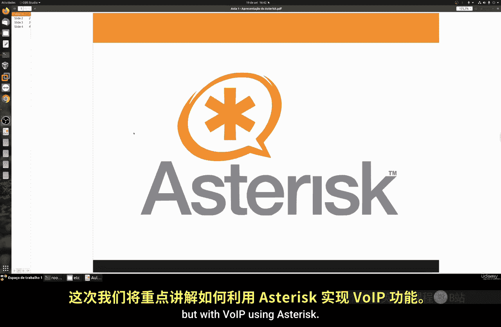
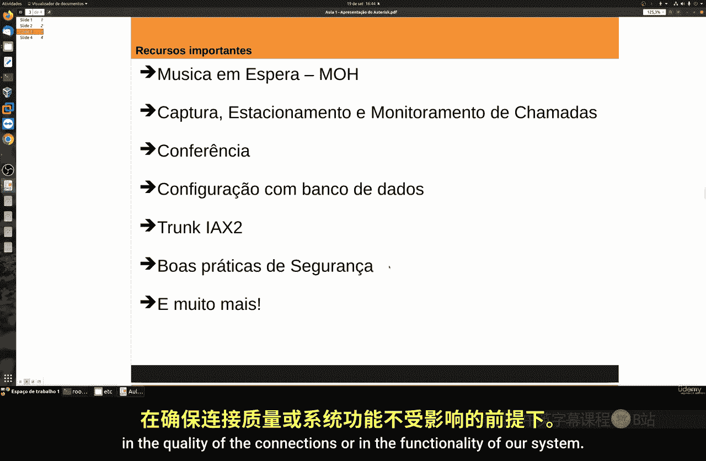
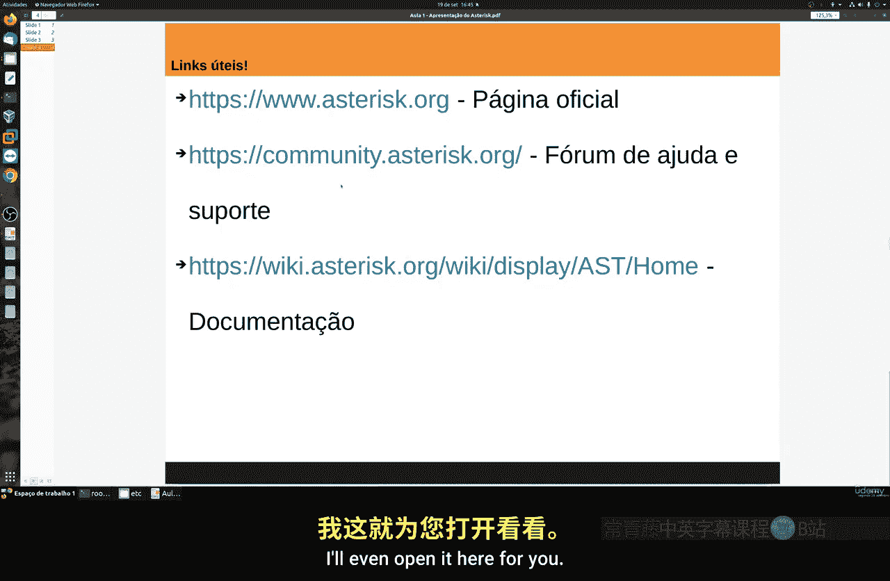
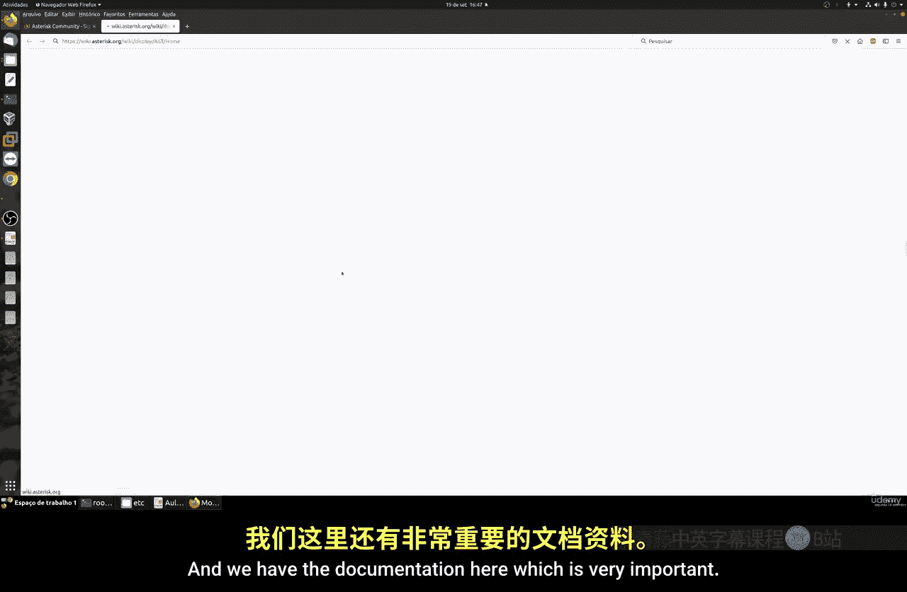
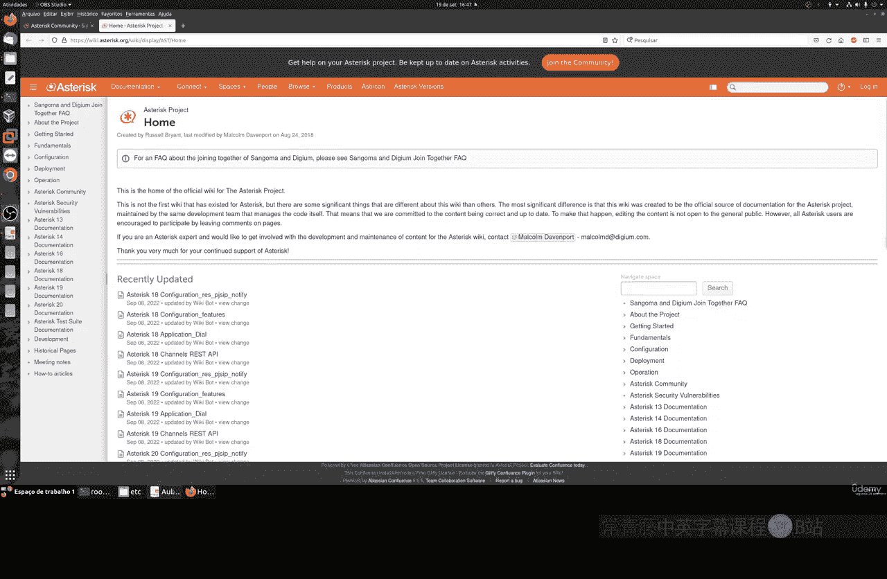
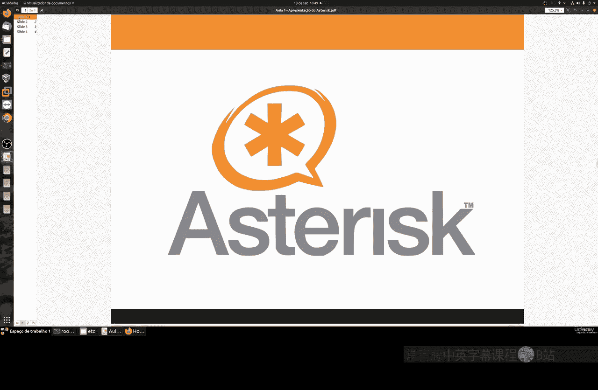

# 067：Asterisk与VoIP入门教程 🚀

在本节课中，我们将学习Asterisk的基础知识及其在VoIP（网络电话）中的应用。课程内容包括Asterisk的简介、安装配置、通信通道设置、拨号计划创建以及安全实践等。我们将通过理论讲解和实际操作，帮助你建立一个功能完整的VoIP系统。

---

## Asterisk简介与VoIP应用 📞

上一节我们介绍了Linux命令行的一些高级操作，本节中我们来看看Asterisk及其在VoIP中的应用。

Asterisk是一款开源的VoIP软件，诞生于20世纪90年代末。它是目前全球使用最广泛的免费VoIP服务器软件，适用于构建企业电话交换机（PBX）、呼叫中心、虚拟接待系统等通信解决方案。

Asterisk的官方网站提供了完整的系统信息和文档。其社区论坛非常活跃，用户可以在其中获取帮助和支持。虽然Asterisk提供付费版本，但其社区版本功能强大且完全免费。

以下是Asterisk的一些核心应用场景：
*   企业PBX系统
*   呼叫中心与电话营销系统
*   客户支持服务平台
*   虚拟语音接待（IVR）系统

---

## 课程内容与学习准备 🛠️

在开始实践之前，我们需要了解本课程将涵盖的主要内容，并做好相应的学习准备。

本课程将详细讲解以下主题：
1.  Asterisk与VoIP的理论基础。
2.  在Linux系统上安装Asterisk。
3.  配置通信通道、SIP分机和SIP中继。
4.  创建完整的拨号计划，包括交互式语音应答（IVR）系统。
5.  实现呼叫转移、音乐保持、呼叫驻留与监听。
6.  设置电话会议和数据库集成。
7.  了解IAX2协议以实现Asterisk服务器互联。
8.  实施基本的安全配置实践。

为了顺利完成本课程，你需要具备良好的Linux命令行操作知识。请确保使用与课程演示相同的软件版本（包括操作系统和Asterisk），以避免因版本差异导致的问题。如果在学习过程中遇到任何错误，建议先查阅官方文档和社区论坛，大部分常见问题都能找到解决方案。

---

## 官方资源与社区支持 🌐

熟练掌握官方资源是高效学习和解决问题的关键。

Asterisk拥有完善的官方文档和活跃的社区支持。官方文档包含了所有配置文件和命令的详细理论说明，是深入理解系统原理的重要资料。社区论坛则是一个宝贵的互助平台，你可以在其中搜索错误信息、提问或帮助他人解决问题。

有效利用这些资源的方法如下：
*   **查阅官方文档**：深入学习配置理论与细节。
*   **使用社区论坛**：遇到问题时，先搜索是否已有解决方案；若未解决，可详细描述问题并提问。
*   **参与社区互动**：注册免费账户，积极参与讨论，社区成员通常乐于提供帮助。

---

## 总结 📝

本节课中我们一起学习了Asterisk的基本概念及其在VoIP领域的广泛应用。我们了解了本课程的核心内容大纲，并强调了使用稳定版本和利用官方文档、社区论坛进行学习与排错的重要性。

接下来，我们将进入实践环节，开始在你的Linux系统上安装和配置Asterisk。请准备好你的系统，我们马上开始。